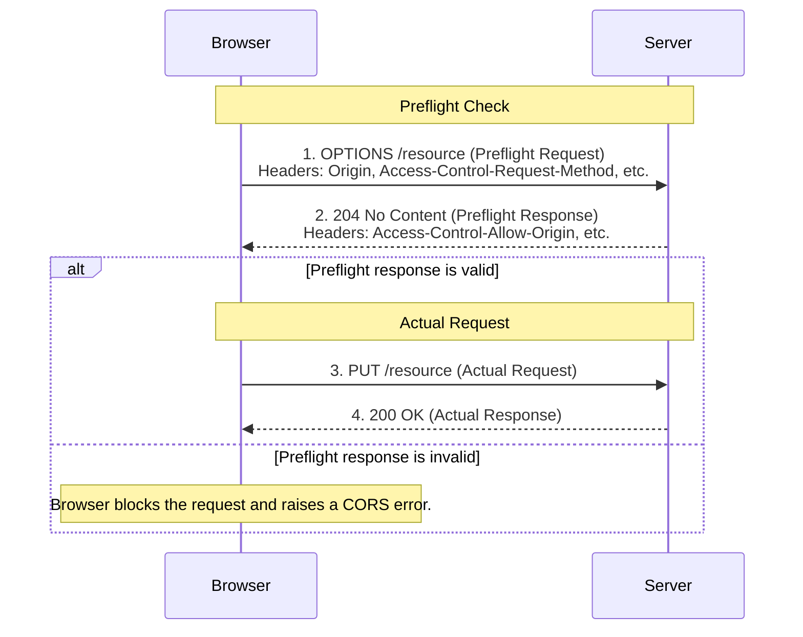

# Cross-Origin Resource Sharing (CORS)

Cross-Origin Resource Sharing (CORS) is a browser security feature that allows a web application running at one origin (domain, protocol, or port) to request resources from a server at a different origin. It is a mechanism that uses additional HTTP headers to relax the **Same-Origin Policy (SOP)**, a critical security measure that otherwise prevents such cross-origin requests.

## The Same-Origin Policy (SOP)

To understand CORS, one must first understand the Same-Origin Policy. The SOP is a strict security rule enforced by web browsers that dictates that a script from one origin can only access data from the same origin. An origin is defined by the combination of protocol (e.g., `http`), host (e.g., `example.com`), and port (e.g., `80`).

-   **Example**: A JavaScript script running on `https://my-app.com` cannot make a `fetch` request to `https://api.my-app.com` because the host is different. The browser will block this request unless the server at `api.my-app.com` explicitly allows it via CORS.

## How CORS Works

CORS works by having the server send specific HTTP headers in its response that tell the browser it is permissible for the client's origin to access the requested resource.

There are two main types of CORS requests:

### 1. Simple Requests

A request is considered "simple" if it meets all the following conditions:
-   The method is `GET`, `HEAD`, or `POST`.
-   It does not have custom headers (apart from standard ones like `Accept`, `Content-Language`, etc.).
-   If it is a `POST` request, the `Content-Type` must be `application/x-www-form-urlencoded`, `multipart/form-data`, or `text/plain`.

For a simple request, the browser sends the request directly, and if the server's response includes the header `Access-Control-Allow-Origin` with a value that matches the client's origin (or `*`), the browser allows the client to access the response.

### 2. Preflighted Requests

Any request that does not meet the criteria for a "simple request" is considered "preflighted." This is very common for modern web APIs that use methods like `PUT` or `DELETE`, or have a `Content-Type` of `application/json`.

For these requests, the browser first sends a lightweight **preflight `OPTIONS` request** to the server to check if the actual request is safe to send. The server then responds with a set of CORS headers indicating what is allowed.

*Description: The browser first sends an `OPTIONS` request to see if the actual request is allowed. Based on the server's response headers, the browser decides whether to proceed with the actual `PUT` request or to block it.*

## Common CORS Headers

These headers are sent by the **server** in its response:

-   `Access-Control-Allow-Origin`: Specifies which origins are allowed to access the resource. It can be a specific origin (e.g., `https://my-app.com`) or `*` (any origin).
-   `Access-Control-Allow-Methods`: Specifies the HTTP methods (`GET`, `POST`, `PUT`, etc.) that are allowed for the resource.
-   `Access-Control-Allow-Headers`: Indicates which HTTP headers can be used in the actual request.
-   `Access-Control-Allow-Credentials`: A boolean that tells browsers whether to expose the response to the frontend JavaScript code when the request's credentials mode is `include`.

## Security Considerations

-   **Avoid `Access-Control-Allow-Origin: *`**: Using a wildcard (`*`) is convenient but can be dangerous, as it allows any website to make requests to your API. It is always better to maintain an explicit whitelist of trusted origins.
-   **CORS vs. CSRF**: CORS is not a protection against Cross-Site Request Forgery (CSRF). CORS protects a server by controlling which origins can read its responses. CSRF protection, on the other hand, protects a user by preventing a malicious site from making unauthorized state-changing requests on the user's behalf.

## Related Concepts

-   [[owasp|OWASP]]: Misconfiguration of CORS is a common security risk.
-   [[rest|REST]] & [[graphql|GraphQL]]: Any web-based API paradigm is subject to the Same-Origin Policy and will likely need a proper CORS configuration to be consumed by browser-based clients.

---

## Resources & Links

### Articles

1.  **[Cross-Origin Resource Sharing (CORS) - MDN Web Docs](https://developer.mozilla.org/en-US/docs/Web/HTTP/Guides/CORS)**
    The definitive technical guide from Mozilla Developer Network. It provides a comprehensive explanation of how CORS works, including detailed breakdowns of the various HTTP headers, and covers different scenarios like simple requests, preflighted requests, and requests with credentials.

2.  **[Cross-Origin Resource Sharing (CORS) - web.dev](https://web.dev/articles/cross-origin-resource-sharing)**
    A practical guide from Google's web.dev team that explains why CORS is necessary by first detailing the Same-Origin Policy. It clearly illustrates the preflight request/response flow and provides actionable insights for developers on how to handle cross-origin requests in their web applications.

3.  **[What is Cross-Origin Resource Sharing (CORS)? - AWS](https://aws.amazon.com/what-is/cross-origin-resource-sharing/)**
    A high-level overview from Amazon Web Services that defines CORS and its importance in modern web applications. It explains the interaction between client-side code, web browsers, and servers, and describes how CORS headers enable secure cross-domain data transfers.
