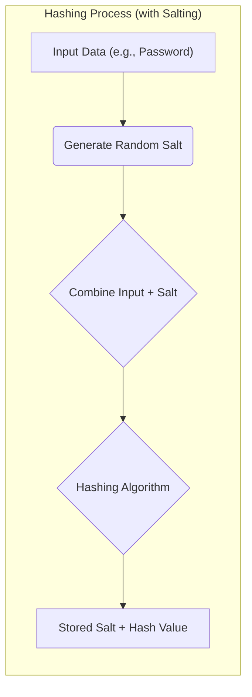
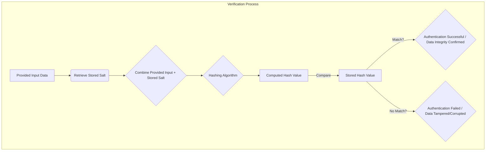

# Hashing Algorithms: Ensuring [[data-integrity|Data Integrity]] and Security

A hashing algorithm is a deterministic mathematical function that transforms an arbitrary block of digital data (the input or 'message') into a fixed-size string of bytes, known as a 'hash value', 'message digest', 'digital fingerprint', or 'checksum'. A fundamental characteristic of cryptographic hashing is its one-way nature: while it's easy to compute the hash from the input, it is computationally infeasible to reverse the process and reconstruct the original input from its hash value. This property makes hashing an indispensable tool in various security applications.

## The Hashing Process

The core idea of hashing is to take an input of any size and produce a fixed-size output.

*Description: This diagram illustrates the one-way process of a hashing algorithm transforming input data into a fixed-size hash value. It also shows how hashing is used in a verification process to confirm [[data-integrity|data integrity]] by comparing a newly computed hash with a stored or received hash.*

## Key Characteristics of Cryptographic Hash Functions

For a hash function to be considered cryptographically secure and suitable for security-sensitive applications, it must exhibit several critical properties:

*   **Deterministic:** Given the same input, the algorithm must always produce the exact same hash output. This consistency is vital for verification processes.
*   **Efficient Computation:** The process of computing the hash value for any given data should be fast and require minimal computational resources.
*   **Pre-image Resistance (One-Way Property):** It must be computationally infeasible to determine the original input data given only its hash value. This protects sensitive information like passwords.
*   **Second Pre-image Resistance (Weak Collision Resistance):** It should be computationally infeasible to find a *different* input that produces the same hash output as a *given* input. This prevents an attacker from forging a message that has the same hash as a legitimate one.
*   **Collision Resistance (Strong Collision Resistance):** It must be computationally infeasible to find *any two different inputs* that produce the same hash output. While collisions are theoretically possible (due to the fixed-size output from variable-size input), a strong hash function makes finding them practically impossible.

## Types of Hashing

Hashing algorithms can broadly be categorized into:

*   **Cryptographic Hashes:** Designed with the security properties mentioned above, making them suitable for digital signatures, password storage, and [[data-integrity|data integrity]] checks. Examples include SHA-256 and SHA-3.
*   **Non-Cryptographic Hashes:** Optimized for speed and used in data structures like hash tables, checksums for error detection, or unique identifiers where security is not the primary concern. Examples include CRC32 or MurmurHash.

## Common Use Cases in Software Architecture

Hashing algorithms are integral to numerous security mechanisms:

*   **Secure Password Storage:** Instead of storing plain-text passwords, which would be a severe security vulnerability, systems store the hash of a user's password. When a user attempts to log in, their provided password is hashed and compared against the stored hash. This process, often combined with salting (adding random data to the input before hashing), protects against rainbow table attacks and ensures that even if a database is breached, passwords remain protected.
*   **[[data-integrity|Data Integrity]] Verification:** Hashing provides a reliable method to detect unauthorized modifications to data. By comparing the hash of a file or message before and after transmission or storage, any alteration, even a single bit change, will result in a different hash, indicating tampering. This is crucial for secure file transfers and software distribution.
*   **Digital Signatures:** In conjunction with [[pki|Public Key Infrastructure]] and asymmetric cryptography, hashing is used to create digital signatures. A document's hash is encrypted with a sender's private key, proving the sender's identity and ensuring the document's [[data-integrity|integrity]].
*   **Token & [[jwt|JWT]] Signatures**: Hashing is fundamental to [[authentication#Token-Based Authentication|token-based authentication]]. For a [[jwt|JSON Web Token (JWT)]], a hash of the header and payload is combined with a secret to create a signature. This signature guarantees that the token has not been tampered with, ensuring its [[data-integrity|integrity]].
*   **Blockchain Technology:** Hashing is a core component of blockchain, where each block's header contains the hash of the previous block, creating an immutable and tamper-evident chain of transactions.
*   **Unique Identifiers:** Hashing can generate unique, fixed-length identifiers for data, useful in caching, database indexing, and content-addressable storage systems.

## Examples of Hashing Algorithms

The landscape of hashing algorithms has evolved significantly with advancements in cryptanalysis:

*   **MD5 (Message-Digest Algorithm 5):** Once widely used, MD5 is now considered cryptographically broken due to known collision vulnerabilities. It should not be used for security-critical applications like password storage or digital signatures.
*   **SHA-1 (Secure Hash Algorithm 1):** Similar to MD5, SHA-1 has also been found to be vulnerable to collision attacks and is deprecated for most security purposes.
*   **SHA-2 (Secure Hash Algorithm 2):** This family includes popular algorithms like SHA-256 and SHA-512. They are currently considered secure and are widely used in TLS/SSL, digital signatures, and blockchain.
*   **SHA-3 (Secure Hash Algorithm 3):** A newer standard, SHA-3 offers a different internal construction (Keccak algorithm) compared to SHA-2, providing an alternative and robust cryptographic hash function.
*   **Password Hashing Functions (Bcrypt, Scrypt, Argon2):** These are specialized algorithms designed to be computationally intensive and slow, specifically to deter brute-force attacks on hashed passwords. They incorporate a 'work factor' that can be adjusted to increase the time required to compute a hash, making them far more suitable for password storage than general-purpose hash functions like SHA-256.

---

## Resources & Links

### Articles

1.  **[Hashing Fundamentals and Cybersecurity Applications - SentinelOne](https://www.sentinelone.com/cybersecurity-101/cybersecurity/hashing/)**
    This article from SentinelOne explains the core concept of hashing, detailing how algorithms create unique, fixed-length "message digests" for data. It covers the use of hashes for [[data-integrity|data integrity]], file identification, and in cybersecurity applications like digital signatures and threat hunting, while also discussing the limitations of hash-based malware detection due to collision risks and attacker evasion techniques.

2.  **[Evolution and Security of Hashing Algorithms - Jscrambler](https://jscrambler.com/blog/hashing-algorithms)**
    Jscrambler's article provides an overview of hashing algorithms, defining them as one-way functions crucial for [[data-integrity|data integrity]] and security. It traces the history and vulnerabilities of algorithms like MD5 and SHA-1, contrasting them with the more robust SHA-2 and SHA-3, and stresses the importance of using current, secure hashing algorithms for applications suchs as password storage and verifying file [[data-integrity|integrity]].