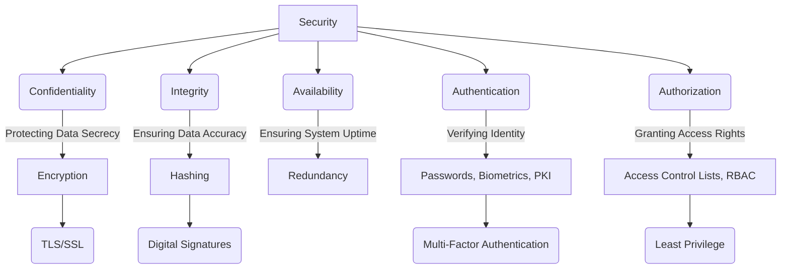

# Security Concepts in Software Architecture

In the realm of software architecture and system design, security is not merely an add-on but a foundational pillar. It encompasses a comprehensive set of measures and practices meticulously designed to safeguard information, systems, and networks from unauthorized access, misuse, disclosure, disruption, modification, or destruction. A robust security posture is paramount for maintaining the confidentiality, integrity, and availability (CIA triad) of data and services, thereby fostering trust and ensuring business continuity.

This section delves into fundamental security concepts and practices, providing architects and developers with the essential knowledge to build resilient and secure systems from the ground up.

## Conceptual Overview of Security Domains

Security is a multi-faceted discipline, often visualized through its core principles and areas of focus.

*Description: This diagram illustrates the core principles of security (Confidentiality, Integrity, Availability) and fundamental mechanisms like Authentication and Authorization. It also shows examples of technologies and concepts that support these principles, such as Encryption for confidentiality, Hashing for integrity, and PKI for authentication.*

## Core Security Topics

*   [[hashing-algorithms|Hashing Algorithms]]: Understand how these mathematical functions create unique, fixed-size representations of data, crucial for data integrity verification and secure password storage.
*   [[pki|Public Key Infrastructure (PKI)]]: Explore the framework that enables secure electronic communication and identity verification through digital certificates and public-key cryptography.
*   [[owasp|OWASP (Open Web Application Security Project)]]: Discover this vital community-driven resource for web application security, including its renowned Top 10 list of critical risks.
*   [[authentication|Authentication]]: Learn about the processes and strategies used to verify the identity of users and systems, a critical first step in controlling access to resources.

## Related Security Patterns

For specific, proven solutions to recurring security design problems within software architecture, refer to the dedicated [[software-architecture/security-patterns/|Security Patterns]] section. These patterns offer reusable approaches to address common security challenges effectively.
