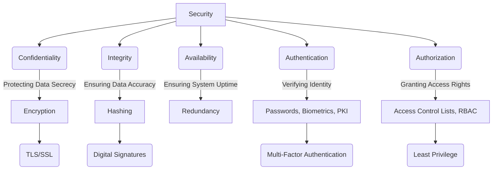

--- 
title: Security
tags:
  - security
  - software-architecture
  - cybersecurity
  - information-security
date: 2025-11-01
---

# Security Concepts in Software Architecture

In the realm of software architecture and system design, security is not merely an add-on but a foundational pillar. It encompasses a comprehensive set of measures and practices meticulously designed to safeguard information, systems, and networks from unauthorized access, misuse, disclosure, disruption, modification, or destruction. A robust security posture is paramount for maintaining the confidentiality, integrity, and availability (CIA triad) of data and services, thereby fostering trust and ensuring business continuity.

This section delves into fundamental security concepts and practices, providing architects and developers with the essential knowledge to build resilient and secure systems from the ground up.

## Conceptual Overview of Security Domains

Security is a multi-faceted discipline, often visualized through its core principles and areas of focus.

*Description: This diagram illustrates the core principles of security (Confidentiality, Integrity, Availability) and fundamental mechanisms like Authentication and Authorization. It also shows examples of technologies and concepts that support these principles, such as Encryption for confidentiality, Hashing for integrity, and PKI for authentication.*

## Identity and Access Management (IAM)

This area focuses on verifying the identity of users and systems and controlling what they are allowed to do.

*   [[authentication|Authentication]]: Learn about the processes and strategies used to verify identity.
*   [[jwt|JSON Web Token (JWT)]]: A compact, URL-safe means of representing claims to be transferred between two parties.

## Cryptography and Data Integrity

These topics cover the techniques used to protect data both in transit and at rest.

*   [[hashing-algorithms|Hashing Algorithms]]: Understand how these mathematical functions create unique, fixed-size representations of data.
*   [[pki|Public Key Infrastructure (PKI)]]: Explore the framework that enables secure electronic communication through digital certificates.
*   [[ssl-tls|SSL/TLS]]: Learn how this protocol uses PKI to secure network communications (e.g., HTTPS).

## Application and Web Security

This section covers security from the perspective of a web application or service.

*   [[owasp|OWASP (Open Web Application Security Project)]]: Discover the most critical security risks to web applications.
*   [[cors|Cross-Origin Resource Sharing (CORS)]]: A browser security feature that restricts cross-origin HTTP requests.

*   [[csp|Content Security Policy (CSP)]]: A browser feature to prevent XSS and other injection attacks.

## Server and Network Security

Server security involves a wide range of practices to protect server infrastructure from threats. This includes managing access, hardening systems, and filtering traffic to ensure the confidentiality, integrity, and availability of data and services.

*   [[firewalls|Firewalls]]: Network security devices that monitor and control network traffic.
*   [[gatekeeper|Gatekeeper Pattern]]: A pattern for protecting services by using a single, hardened entry point.

## Related Security Patterns

For specific, proven solutions to recurring security design problems, refer to the dedicated [[software-architecture/security-patterns/|Security Patterns]] section. These patterns offer reusable approaches to address common security challenges effectively.

