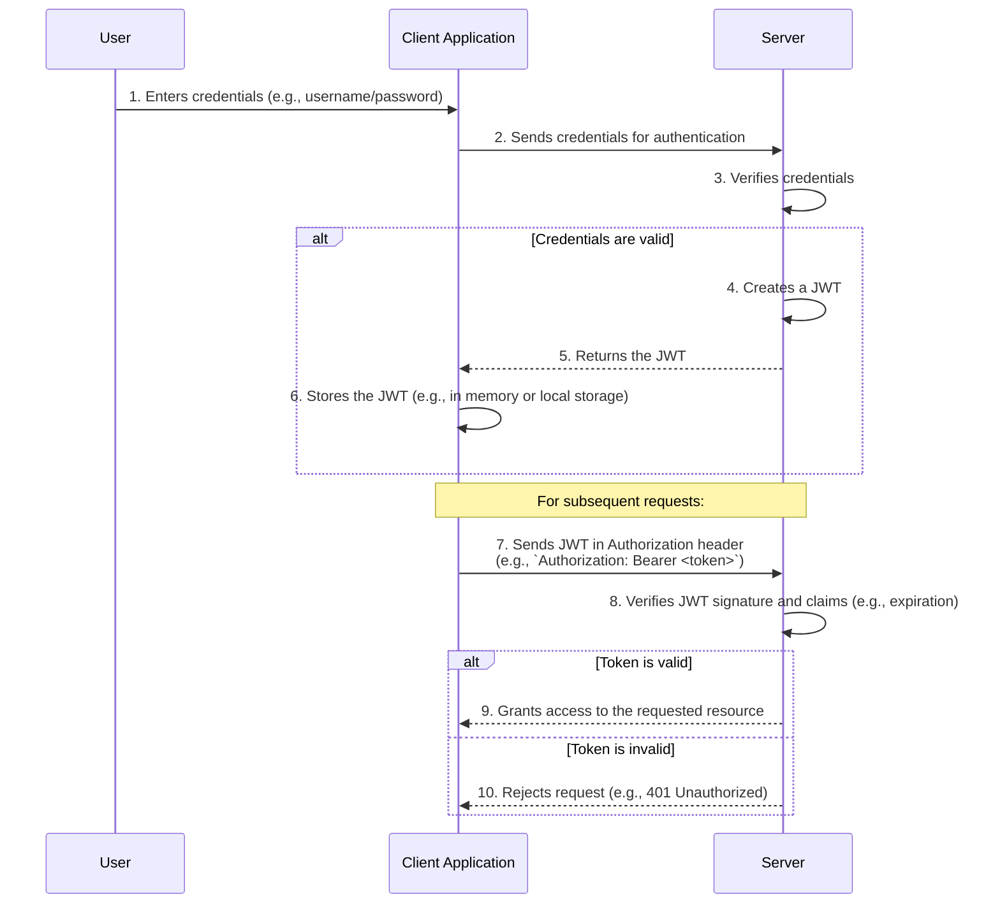

# JSON Web Token (JWT)

A JSON Web Token (JWT) is a compact, URL-safe standard (RFC 7519) for creating access tokens that assert a number of claims. It is a self-contained token, meaning all the necessary information about the user is contained within the token itself, allowing for stateless, scalable authentication systems.

JWTs are widely used in modern web applications and APIs, especially in [[authentication#Token-Based Authentication|token-based authentication schemes]], to securely transmit identity and authorization information between parties.

## Structure of a JWT

A JWT consists of three parts separated by dots (`.`):

1.  **Header**: Metadata about the token, including the token type (`typ`) and the signing algorithm (`alg`).
2.  **Payload**: Contains the claims, which are statements about an entity (typically, the user) and additional data.
3.  **Signature**: Used to verify that the sender of the JWT is who it says it is and to ensure that the message wasn't changed along the way.

`xxxxx.yyyyy.zzzzz` (Header.Payload.Signature)

### 1. Header
The header typically consists of two parts: the type of the token, which is JWT, and the signing algorithm being used, such as HMAC SHA256 or RSA.

**Example Header (JSON):**
```json
{
  "alg": "HS256",
  "typ": "JWT"
}
```
This JSON is then Base64Url encoded to form the first part of the JWT.

### 2. Payload
The payload contains the claims. There are three types of claims:

-   **Registered Claims**: A set of predefined claims which are not mandatory but recommended, such as `iss` (issuer), `exp` (expiration time), `sub` (subject), and `aud` (audience).
-   **Public Claims**: These can be defined at will by those using JWTs. To avoid collisions, they should be defined in the IANA JSON Web Token Registry or be defined as a URI that contains a collision-resistant namespace.
-   **Private Claims**: These are the custom claims created to share information between parties that agree on using them.

**Example Payload (JSON):**
```json
{
  "sub": "1234567890",
  "name": "John Doe",
  "admin": true,
  "exp": 1516239022
}
```
Like the header, the payload is also Base64Url encoded to form the second part of the JWT.

### 3. Signature
To create the signature part, you have to take the encoded header, the encoded payload, a secret, the algorithm specified in the header, and sign that.

For example, if you are using the HMAC SHA256 algorithm, the signature will be created in the following way:

```
HMACSHA256(
  base64UrlEncode(header) + "." +
  base64UrlEncode(payload),
  secret)
```
The signature is used to verify the message wasn't changed along the way, and, in the case of tokens signed with a private key, it can also verify that the sender of the JWT is who it says it is.

## How JWT Authentication Works



## Security Considerations

-   **Stateless but Irrevocable**: The main advantage of JWTs is their stateless nature. However, this is also a drawback. Once a JWT is issued, it is valid until it expires. It cannot be easily revoked. This means if a token is compromised, it can be used until its expiration. Common mitigation strategies include using very short expiration times and maintaining a token blocklist.
-   **Payload is Visible**: The payload of a JWT is only Base64Url encoded, **not encrypted**. Anyone who intercepts the token can read its contents. Therefore, you should never store sensitive information in the payload of a JWT.
-   **Signature is Critical**: The security of a JWT relies entirely on its signature. The server must always verify the signature to ensure the token is authentic and has not been tampered with. Some older libraries had a vulnerability where a token could specify `"alg": "none"`, which would cause the library to skip signature verification. Modern libraries protect against this, but it highlights the importance of correct implementation.

## Related Concepts

-   [[authentication|Authentication]]
-   [[authentication#OAuth (Open Authorization) and OpenID Connect (OIDC)|OAuth]] (JWTs are often used as bearer tokens in OAuth 2.0 flows)
-   [[hashing-algorithms|Hashing Algorithms]] (used to create the signature)

---

## Resources & Links

### Articles

1.  **[How JSON Web Tokens Work - JWT.io Official Docs](https://www.jwt.io/introduction#how-json-web-tokens-work)**
    The official introduction from JWT.io. It explains the fundamental workflow of JWTs, from user login to the server creating a signed token, and how the client sends it back for subsequent requests. It's the canonical source for understanding the basic mechanism.

2.  **[What Is a JWT? - Postman Blog](https://blog.postman.com/what-is-jwt/)**
    A practical guide from the Postman blog that breaks down what a JWT is and why it's used. It covers the three parts of a JWT (Header, Payload, Signature) and provides a clear explanation of how stateless authentication with tokens works in modern APIs.

### Videos

1.  **[JWT Explained - YouTube](https://www.youtube.com/watch?v=7Q17ubqLfaM)**
    A clear and concise video that visually explains the structure of a JSON Web Token and its role in authentication. It walks through the process of signing and verifying a token, making the abstract concepts easy to grasp.

2.  **[What is JWT and How does it work? - YouTube](https://www.youtube.com/watch?v=P2CPd9ynFLg)**
    This video provides a detailed walkthrough of JWTs, covering the token structure, the difference between encoding and signing, and the complete authentication flow. It's a great resource for understanding both the "what" and the "how" of using JWTs.
