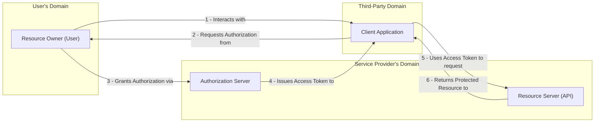
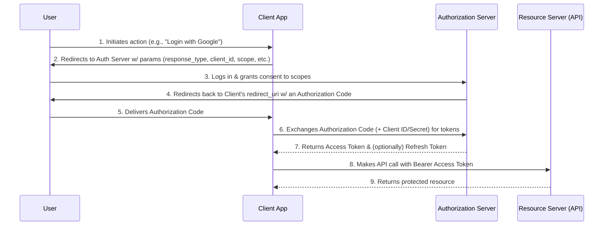
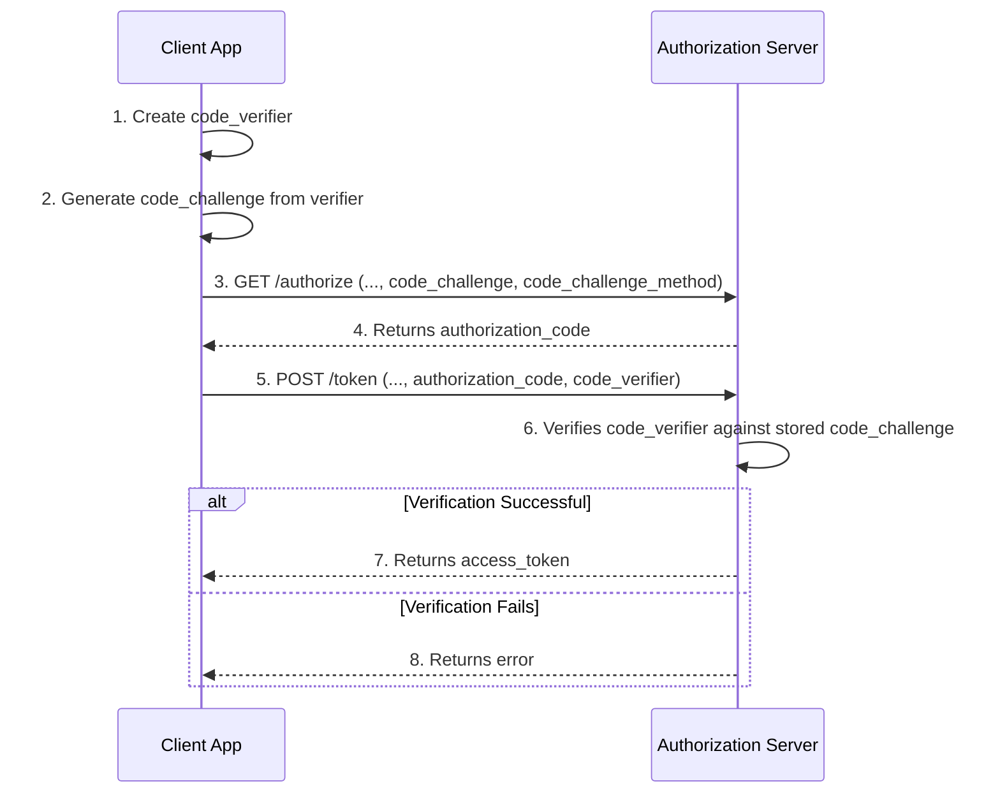

# OAuth 2.0: The Framework for Delegated Authorization

OAuth 2.0 is an open standard and authorization framework that enables applications to obtain limited access to user accounts on an HTTP service. It provides a method for users to grant a third-party application access to their resources without sharing their credentials. Common examples include "Log in with Google" or allowing a third-party application to access your GitHub repositories.

The core problem OAuth 2.0 solves is **delegated authorization**. It allows an application (the "Client") to act on behalf of a user (the "Resource Owner") to access their data from a service (the "Resource Server"), with the user's explicit consent.

### A Note on Versions
*   **OAuth 1.0**: The original version, now considered deprecated. It used complex cryptography that was difficult to implement.
*   **OAuth 2.0**: The current, active standard. It simplified the flows and is not backward-compatible with 1.0.
*   **OAuth 2.1**: An in-progress draft that aims to consolidate best practices from 2.0 by formally deprecating insecure flows and requiring technologies like [[#PKCE: Proof Key for Code Exchange|PKCE]].

## Core Roles & Terminology

OAuth 2.0 defines four key roles and several important terms:

*   **Resource Owner**: The user who authorizes an application to access their account.
*   **Client**: The application that wants to access the user's account.
*   **Authorization Server**: The server that authenticates the Resource Owner and issues Access Tokens. It can be the same server as the Resource Server.
*   **Resource Server**: The server hosting the user's protected data (e.g., an API).

*Description: This diagram shows the interaction between the four roles in the OAuth 2.0 framework.*

Key terms include:
*   **Client ID**: A public identifier for the application, like a username.
*   **Client Secret**: A confidential key used to authenticate the application, like a password. It must be kept secure on the client's backend.

## Grant Types (Authorization Flows)

OAuth 2.0 provides several "grant types" for different use cases. The most common is the Authorization Code Grant.

### Authorization Code Grant

This is the most secure and commonly used flow, ideal for traditional web applications and, with the [[#PKCE: Proof Key for Code Exchange|PKCE]] extension, for mobile and single-page apps (SPAs).

#### The Authorization Request

The flow begins when the client directs the user to the Authorization Server with several key query parameters:
*   `response_type=code`: Specifies that we are using the Authorization Code flow.
*   `client_id`: The public ID of the client application.
*   `redirect_uri`: The URL where the Authorization Server will redirect the user back to after they grant or deny permission. This must be pre-registered with the provider for security.
*   `scope`: A space-delimited list of permissions the application is requesting (e.g., `profile email`).
*   `state`: An opaque, random string created by the client to maintain state between the request and callback and to prevent CSRF attacks.

*Description: The Authorization Code flow involves exchanging a temporary code for an access token, keeping the token secure on the back-channel.*

### Other Common Grant Types

*   **Client Credentials Grant**: Used for machine-to-machine (M2M) communication where there is no user. The client authenticates itself directly with the authorization server to get an access token.
*   **Implicit Grant (Legacy)**: A simplified flow once used for SPAs where `response_type=token` was used to return the access token directly. It is **no longer recommended** due to security risks.
*   **Resource Owner Password Credentials Grant (Legacy)**: Allows the client to collect the user's password and exchange it for an access token. This is **strongly discouraged** as it breaks the principle of not sharing credentials.

### PKCE: Proof Key for Code Exchange

PKCE (pronounced "pixy") is a critical security extension (RFC 7636) that enhances the Authorization Code flow. While originally designed for public clients like mobile and single-page apps (SPAs), it is now recommended for all OAuth clients.

#### The Problem: Authorization Code Interception

The standard Authorization Code flow relies on a `client_secret` to securely exchange the authorization code for an access token. However, **public clients** (like SPAs running in a browser or native mobile apps) cannot securely store a `client_secret`.

This creates a vulnerability: if a malicious application on a user's device manages to intercept the one-time authorization code as it is sent back to the legitimate app, the malicious app could send it to the token endpoint. Without a client secret to validate the request, the authorization server would have no way to know the request was not from the legitimate client, and it would hand over an access token.

#### The Solution: The PKCE Flow

PKCE mitigates this by adding a dynamic, request-specific secret that the client proves possession of.

1.  **Create Verifier and Challenge**: The client application creates a cryptographically random string called the `code_verifier`. It then hashes this string (e.g., using SHA256) to create a `code_challenge`.
2.  **Request Authorization**: The client sends the `code_challenge` and the hashing method (`code_challenge_method`) to the authorization server in the initial authorization request.
3.  **Receive Code**: The authorization server stores the `code_challenge` and sends back the `authorization_code` as usual.
4.  **Exchange Code for Token**: The client sends the `authorization_code` to the token endpoint, but this time it **also includes the original, un-hashed `code_verifier`**.
5.  **Server-Side Verification**: The authorization server hashes the `code_verifier` it just received and compares it to the `code_challenge` it stored earlier. If they match, it proves the client is the same one that initiated the request, and only then does it issue the access token.

A malicious app that intercepts the authorization code (Step 3) will not have the original `code_verifier` (from Step 1) and therefore cannot complete the exchange.

PKCE protects you because the `code_verifier` is never transmitted on the less secure front-channel (the browser). It is only used once, on the secure back-channel, proving that the application exchanging the `authorization_code` is the exact same one that created the `code_challenge` at the very beginning.

*Description: The PKCE flow adds a dynamic proof of possession, where the client sends a hashed `code_challenge` and later provides the original `code_verifier` to prove it was the legitimate initiator of the flow.*

## Tokens and Scopes

*   **Access Token**: A string representing the authorization granted to the client. It is sent with each request to the Resource Server, typically in the `Authorization` header as a `Bearer` token.
*   **Refresh Token**: An optional, long-lived token used to obtain a new access token without re-prompting the user when the current access token expires.
*   **Scopes**: These define the specific permissions the client is requesting (e.g., `read_profile`, `write_calendar_events`). The user consents to these specific scopes, limiting the client's access.

## The Relationship with OpenID Connect (OIDC)

It is crucial not to confuse OAuth 2.0 with **[[openid-connect]]**. While they are often used together, they solve different problems.

*   **OAuth 2.0 is for Authorization**: Its primary purpose is to grant an application access to resources on behalf of a user. The tokens it issues, called Access Tokens, are meant for a Resource Server. They represent **permission**, not identity. An Access Token is like a keycard for a hotel room: it proves you have permission to enter, but it doesn't say who you are.

*   **[[openid-connect]] is for Authentication**: It is a thin identity layer built on top of OAuth 2.0. It introduces the concept of an **ID Token** (a [[jwt|JWT]]) which allows a client application to verify the **identity** of the user. It answers the question, "Who is this user?".

In short, a modern application uses **[[openid-connect]]** to log a user in and confirm their identity, and then uses the **Access Token from the OAuth 2.0 flow** to access APIs on that user's behalf. Most "social login" systems (like "Sign in with Google") are OIDC implementations.

## Security Best Practices & Vulnerabilities

While a powerful framework, OAuth 2.0 must be implemented correctly to be secure.

*   **Use the Correct Flow**: Always use the Authorization Code grant with [[#PKCE: Proof Key for Code Exchange|PKCE]] for public clients (SPAs, mobile apps). Avoid legacy flows like Implicit and Password Credentials.
*   **Validate Redirect URIs**: The Authorization Server must strictly validate redirect URIs to prevent authorization codes or tokens from being sent to malicious actors.
*   **Protect Secrets**: Client secrets and refresh tokens must be stored securely on the client's backend. They should never be exposed in a frontend application.
*   **Use the `state` Parameter**: The `state` parameter should be used in authorization requests to mitigate Cross-Site Request Forgery (CSRF) attacks by correlating requests and responses.
*   **Use Short-Lived Access Tokens**: Access tokens should have a short expiration time (e.g., minutes or hours) to limit the window of opportunity if they are compromised. Long-lived access is achieved using refresh tokens.

## Related Concepts

*   [[authentication]]: The process of verifying the Resource Owner's identity, which is handled by the Authorization Server at the start of the OAuth flow.
*   [[authorization]]: OAuth 2.0 is a framework specifically designed for delegating authorization, which is the core concept it manages.
*   [[jwt|JWT (JSON Web Tokens)]]: A common, but not mandatory, format for OAuth 2.0 Access Tokens and OIDC ID Tokens due to their ability to carry verifiable data.
*   [[api-security-best-practices]]: Correctly implementing OAuth 2.0 is a cornerstone of modern API security, protecting endpoints from unauthorized access.

---

## Resources & Links

### Articles

1.  **[What Is OAuth 2.0? - Auth0](https://auth0.com/intro-to-iam/what-is-oauth-2)**
    As a leading identity management provider, Auth0 offers a clear, authoritative introduction to OAuth 2.0. This article explains the core concept of delegated authorization, the problems it solves, and the different roles and grant types involved in the framework. It is an excellent resource for a foundational understanding from an industry expert.

2.  **[OAuth 2.0 Guide - roadmap.sh](https://roadmap.sh/guides/oauth)**
    This guide provides a structured, visual roadmap to understanding OAuth 2.0. It covers the fundamental concepts, the different roles involved in the authorization process, and a clear, step-by-step breakdown of the various grant types. It is an excellent starting point for grasping the overall landscape of the framework.

3.  **[OAuth 2.0 Explained: A Journey from Zero to Hero - Leapcell](https://leapcell.io/blog/oauth2-explained-zero-to-hero)**
    This article offers a comprehensive deep dive into OAuth 2.0, aiming to take the reader from a beginner to an advanced level of understanding. It thoroughly explains the problems OAuth solves, the core terminology, and provides detailed walkthroughs of the main authorization flows, including the modern PKCE extension.

4.  **[What is OAuth 2.0 and where and why it is used? - Medium](https://medium.com/@martin.hodges/what-is-oauth-2-0-and-where-and-why-it-is-used-2f65b29cf5b1)**
    This article focuses on the practical application and relevance of OAuth 2.0. It clarifies the distinction between authentication and authorization and uses real-world scenarios to explain why a framework for delegated access is essential for modern applications. It provides a clear rationale for the existence of OAuth and its common use cases.