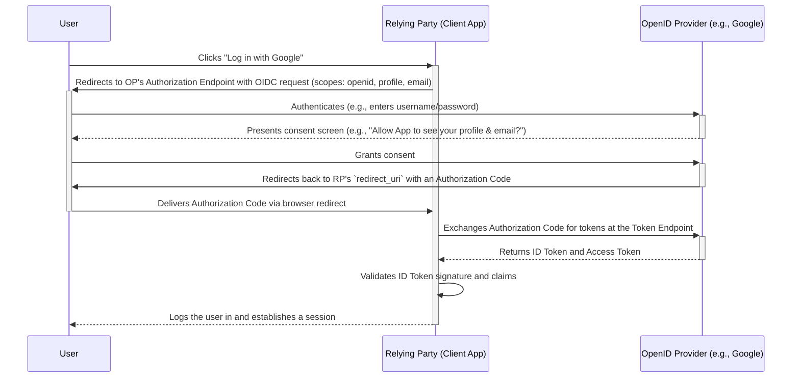

# OpenID Connect (OIDC)

**OpenID Connect (OIDC)** is a simple identity layer built on top of the [[oauth|OAuth 2.0]] protocol. It allows clients to verify the identity of an end-user based on the authentication performed by an Authorization Server, as well as to obtain basic profile information about the end-user in an interoperable and REST-like manner.

While [[oauth|OAuth 2.0]] is a protocol for **[[authorization]]** (granting access to resources), OIDC is for **[[authentication]]** (confirming a user's identity). It adds the missing piece to OAuth 2.0, enabling use cases like Single Sign-On (SSO) using a standardized approach.

---

## Core Concepts

OIDC introduces several key components on top of OAuth 2.0:

-   **ID Token**: A [[jwt|JSON Web Token (JWT)]] that contains claims about the authentication event and the user. It is the primary proof of authentication. The client (Relying Party) can decode and validate this token to confirm the user's identity without needing to call a separate endpoint.
-   **Claims**: Pieces of information asserted about a user, such as their ID, name, email, and profile picture. Claims are packaged inside the ID Token.
-   **UserInfo Endpoint**: An OAuth 2.0 protected resource that, when presented with an Access Token, returns claims about the authenticated user. It provides user profile information that may be too sensitive or extensive to include in the ID Token.
-   **Relying Party (RP)**: The OAuth 2.0 Client application that requires end-user authentication and claims from an OpenID Provider. This is the application the user is trying to log into.
-   **OpenID Provider (OP)**: An OAuth 2.0 Authorization Server that offers OpenID Connect authentication. It is responsible for authenticating the user and providing claims to the Relying Party. Examples include Google, Microsoft Azure AD, and Okta.
-   **Scope**: OIDC introduces specific scope values to request claims. The `openid` scope is mandatory and signals an OIDC request. Other standard scopes include `profile`, `email`, `address`, and `phone`.

## How It Works: Authentication Flow

OIDC authentication is built directly on top of [[oauth|OAuth 2.0]] flows. The most common and secure method is by extending the **[[oauth|Authorization Code Grant]]**. The core flow is the same, but OIDC introduces key additions to handle authentication.

The diagram below illustrates the standard OIDC Authorization Code Flow.

**Key OIDC Additions to the Flow:**
1.  **Authentication Request**: The authorization request must include `openid` in the `scope` parameter to signal an OIDC transaction.
2.  **Token Exchange**: The response from the Token Endpoint includes both an `Access Token` (as in standard OAuth) and a crucial **`ID Token`**.
3.  **Identity Verification**: The Relying Party must decode and validate the `ID Token`. This final step is what completes the authentication process, confirming the user's identity and establishing a trusted session.
4.  **(Optional) Accessing UserInfo**: The `Access Token` received alongside the `ID Token` can be used to retrieve additional user information from the UserInfo Endpoint.

## OIDC vs. OAuth 2.0

This is a critical distinction:
-   **[[oauth|OAuth 2.0]] is for Authorization**: It's designed to grant Application A permission to access User Z's data in Application B. The result is an **Access Token**, which is opaque to the client and meant for a Resource Server.
-   **OIDC is for Authentication**: It's designed to prove that User Z is who they say they are. The result is an **ID Token**, which is a [[jwt|JWT]] meant to be read and validated by the client application.

OIDC accomplishes authentication by adding the ID Token and UserInfo Endpoint to the standard OAuth 2.0 flows.

## Use Cases & Patterns

OIDC is the foundation for modern identity management and is used in various architectural patterns:
-   **Single Sign-On (SSO)**: Users log in once with an Identity Provider and can then access multiple applications without re-authenticating. This is a common pattern in enterprise environments using solutions like Azure AD or Okta.
-   **Federated Identity**: OIDC enables a [[federated-identity]] pattern, where trust is established between different security domains.
-   **Social Logins**: The ubiquitous "Sign in with Google/Facebook/GitHub" features are implementations of OIDC (or similar protocols built on OAuth 2.0).
-   **Securing [[microservices]]**: In a microservices architecture, a central authentication service acting as an OP can issue tokens for users, which are then validated by downstream services.
-   **Mobile & Single-Page Applications (SPAs)**: OIDC provides standardized and secure flows (like the Authorization Code Flow with PKCE) for authenticating users on native and browser-based applications.
