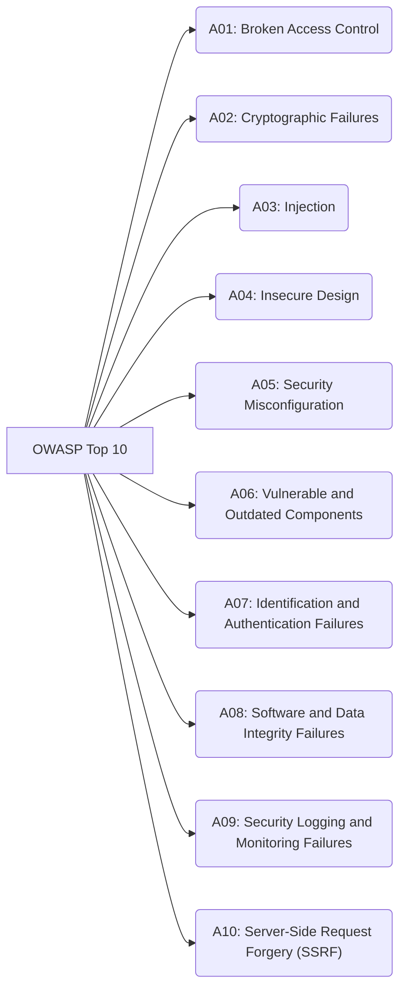

# OWASP (Open Web Application Security Project)

The Open Web Application Security Project (OWASP) is a non-profit foundation dedicated to improving the security of software worldwide. As a vibrant, community-driven organization, OWASP provides freely-available articles, methodologies, documentation, tools, and technologies specifically focused on web application and API security. It serves as an invaluable resource for developers, architects, security professionals, and organizations striving to build, deploy, and maintain secure applications.

Through its hundreds of local chapters, thousands of members, and leading educational conferences, OWASP fosters a collaborative environment for sharing knowledge and best practices in the ever-evolving landscape of application security.

## Key Initiatives and Projects

OWASP champions several pivotal initiatives that have become industry standards for application security:

*   **[OWASP Top 10](https://owasp.org/Top10/):** Perhaps its most recognized project, the OWASP Top 10 is a standard awareness document for developers and security professionals alike. It identifies and prioritizes the ten most critical security risks to web applications, offering a broad consensus on the most prevalent and impactful vulnerabilities. Regularly updated, the Top 10 serves as a crucial guide for prioritizing security efforts. The categories often include, but are not limited to:
    *   **Broken Access Control:** Ineffectively enforced restrictions on what authenticated users are allowed to do.
    *   **Cryptographic Failures:** Sensitive data exposed due to inadequate protection.
    *   **Injection:** Untrusted data sent to an interpreter as part of a command or query.
    *   **Insecure Design:** Lack of or ineffective control designs, often due to missing or ineffective control design.
    *   **Security Misconfiguration:** Improperly implemented security controls or insecure default configurations.
    *   **Vulnerable and Outdated Components:** Using libraries, frameworks, or other software components with known security vulnerabilities.
    *   **Identification and Authentication Failures:** Ineffective implementation of identity-related functions (e.g., [[authentication|authentication]], session management).
    *   **Software and Data Integrity Failures:** Integrations that do not verify the integrity of critical data, CI/CD pipelines, or software updates.
    *   **Security Logging and Monitoring Failures:** Insufficient logging and monitoring, leading to delayed detection of breaches.
    *   **Server-Side Request Forgery (SSRF):** Web application fetches a remote resource without validating the user-supplied URL.

The OWASP Top 10 encapsulates the most common and critical security risks to modern web applications.

*Description: This diagram visually lists the ten most critical web application security risks as identified by the OWASP Top 10 (2021), providing a quick reference for common vulnerabilities to address.*

*   **[OWASP API Security Top 10](https://owasp.org/API-Security/):** Recognizing that APIs present a unique attack surface, OWASP maintains a separate Top 10 list specifically for API security. It highlights risks that are often more prevalent or severe in APIs compared to traditional web applications.
    *   **Key Risks Include**: Broken Object Level Authorization (BOLA), Broken Authentication, Broken Property Level Authorization, and Lack of Resources & Rate Limiting.
    *   For a detailed breakdown of these vulnerabilities and their mitigation strategies, see the **[[api-security|API Security]]** page.

*   **OWASP Web Security Testing Guide (WSTG):** A comprehensive guide that provides a framework for testing the security of web applications and web services. It covers a wide range of tests, from information gathering to vulnerability analysis.
*   **OWASP Application Security Verification Standard (ASVS):** A list of application security requirements that can be used to establish a level of confidence in web applications. It helps organizations define and implement measurable security controls.
*   **OWASP ZAP (Zed Attack Proxy):** A popular open-source web application security scanner. ZAP helps developers find security vulnerabilities in web applications during the development and testing phases.
*   **OWASP Cheat Sheet Series:** Provides concise, high-value guidance on specific security topics, offering practical and actionable advice for common security challenges.

## Importance for Developers and Architects

OWASP resources are indispensable throughout the **Secure Development Lifecycle**:

*   **Risk Identification and Mitigation:** The OWASP Top 10 serves as a powerful checklist for identifying and prioritizing the most significant risks in web applications, guiding developers and architects in where to focus mitigation efforts.
*   **Secure Design Principles:** OWASP's guidelines and methodologies encourage the adoption of secure design principles from the outset, integrating security into the architecture rather than attempting to bolt it on later.
*   **Implementing Secure Coding Practices:** The Cheat Sheet Series and WSTG offer practical advice and examples for implementing secure coding practices, helping developers avoid common pitfalls.
*   **Security Testing:** Tools like OWASP ZAP facilitate automated and manual security testing, enabling the discovery and remediation of vulnerabilities before deployment.
*   **Compliance and Standards:** ASVS assists organizations in meeting compliance requirements and establishing a baseline for application security standards.

By actively engaging with OWASP's vast knowledge base and tools, development teams can significantly enhance the security posture of their applications, reducing the attack surface and protecting sensitive data more effectively.

## Related Concepts

*   **Application Security**: OWASP is a leading authority in this domain.
*   **Web Security**: Many OWASP projects are specifically tailored for web applications.
*   **Risk Management**: The OWASP Top 10 is a prime example of risk identification and prioritization.
*   **[[authentication|Authentication]]**: Directly addressed by categories like "Identification and Authentication Failures."
*   [[csp|Content Security Policy (CSP)]]: A key browser-level technology for mitigating XSS and other injection attacks identified by OWASP.

---

## Resources & Links

### Articles

1.  **[What is OWASP? What is the OWASP Top 10? - Cloudflare](https://www.cloudflare.com/learning/security/threats/owasp-top-10/)**
    This article introduces the Open Web Application Security Project (OWASP) as a non-profit organization dedicated to improving web application security. It explains the OWASP Top 10 as a crucial awareness document that outlines the most critical security risks to web applications, providing detailed descriptions and mitigation strategies for each of the 2021 entries.

2.  **[What is OWASP? OWASP Top 10 Vulnerabilities & Risks - F5](https://www.f5.com/glossary/owasp)**
    This F5 article defines OWASP as an open community committed to enabling secure software development and operation, highlighting its importance in raising awareness about web application security risks. It provides an overview of the OWASP Top 10, detailing each of the 2021 risks and discussing how F5's security solutions, such as Web Application Firewalls (WAFs), can help mitigate these vulnerabilities.