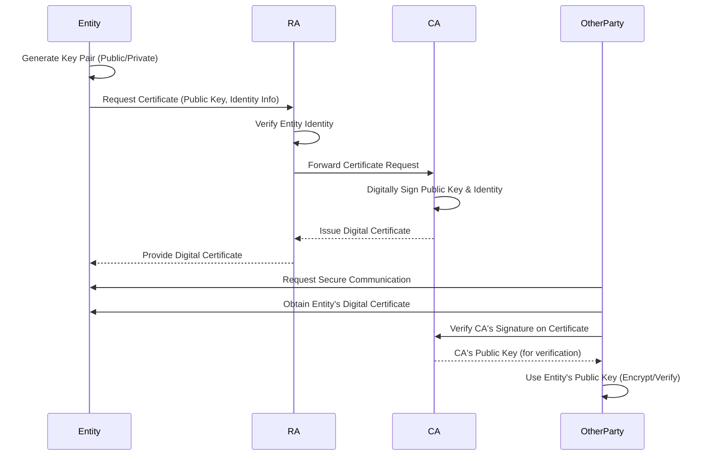

# Public Key Infrastructure (PKI): The Foundation of Digital Trust

Public Key Infrastructure (PKI) represents a comprehensive framework of policies, roles, hardware, software, and procedures essential for creating, managing, distributing, using, storing, and revoking digital certificates and public-key encryption. Its primary purpose is to establish and maintain a trustworthy environment for secure electronic information exchange, enabling critical activities such as e-commerce, secure web browsing (HTTPS), and confidential email. PKI addresses the need for robust authentication and validation mechanisms beyond simple passwords, providing rigorous proof of identity for communicating parties and ensuring the [[data-integrity|integrity]] of transferred information.

## Core Components of a PKI

A functional PKI relies on several interconnected components working in concert:

*   **Certificate Authority (CA):** The cornerstone of PKI, a CA is a trusted third-party entity responsible for issuing, renewing, and revoking digital certificates. CAs cryptographically bind public keys to specific identities (individuals, organizations, servers, or devices) after verifying their authenticity.
*   **Registration Authority (RA):** An RA acts as an intermediary between the end-entity and the CA. Its role is to verify the identity of certificate applicants and approve or reject certificate requests before forwarding them to the CA for issuance.
*   **Certificate Database:** A secure repository that stores all issued and revoked digital certificates.
*   **Certificate Store:** A location where certificates and Certificate Revocation Lists (CRLs) are stored on a user's or system's local machine, allowing applications to access and validate them.
*   **Certificate Revocation List (CRL):** A publicly available list maintained by the CA, detailing digital certificates that have been revoked before their scheduled expiration date. Reasons for revocation can include compromised private keys or changes in an entity's status.
*   **Online Certificate Status Protocol (OCSP):** An alternative, more real-time method for checking the revocation status of digital certificates compared to CRLs. Clients can query an OCSP responder to get an immediate "good," "revoked," or "unknown" status for a certificate.

## How PKI Works (Simplified Workflow)

The process of obtaining and utilizing a digital certificate through PKI typically follows these steps:

1.  **Key Pair Generation:** An entity (e.g., a user, a web server) generates a unique pair of cryptographic keys: a public key and a corresponding private key. The private key is kept secret, while the public key is intended for distribution.
2.  **Certificate Request:** The entity sends its public key along with identifying information (e.g., domain name, organization details) to a Registration Authority (RA).
3.  **Identity Verification:** The RA rigorously verifies the entity's identity and the accuracy of the provided information according to established policies.
4.  **Certificate Issuance:** Upon successful verification, the RA forwards the request to a Certificate Authority (CA). The CA then digitally signs the entity's public key and identity information, creating a digital certificate. This signature attests to the CA's verification of the entity's identity.
5.  **Certificate Distribution:** The newly issued digital certificate is then made available, often stored in a public repository or directly provided to the entity.
6.  **Verification:** When another party wishes to communicate securely with the entity, they obtain the entity's digital certificate. They then verify the CA's digital signature on the certificate (using the CA's publicly known certificate) to ensure its authenticity and [[data-integrity|integrity]]. Once verified, the other party can confidently use the entity's public key for encryption or to verify digital signatures.

*Description: This sequence diagram illustrates the typical flow of how an entity obtains a digital certificate from a Certificate Authority (CA) via a Registration Authority (RA), and how another party subsequently uses this certificate to establish secure communication or verify identity.* 

## Key Use Cases for PKI

PKI underpins many essential security services in modern computing:

*   **Secure Communication (TLS/SSL):** PKI is fundamental to Transport Layer Security (TLS) and its predecessor Secure Sockets Layer (SSL), which secure web traffic (HTTPS). Digital certificates issued by CAs verify the identity of web servers, enabling encrypted communication between clients and servers.
*   **Digital Signatures:** PKI enables the creation and verification of digital signatures, providing assurance of a document's authenticity, [[data-integrity|integrity]], and non-repudiation (proof of origin).
*   **Email Security (S/MIME):** Secure/Multipurpose Internet Mail Extensions (S/MIME) uses PKI to provide cryptographic security services for electronic messaging, including authentication, message [[data-integrity|integrity]], and confidentiality.
*   **Code Signing:** Software developers use PKI to digitally sign their code, allowing users to verify the software's origin and ensure it hasn't been tampered with since it was signed.
*   **Virtual Private Networks (VPNs):** PKI is often used to authenticate users and devices connecting to VPNs, ensuring that only authorized entities can access private networks.
*   **Device Authentication:** In IoT and enterprise environments, PKI can authenticate devices, ensuring that only trusted hardware can connect to and interact with network resources.

## Related Concepts

*   [[authentication|Authentication]]: PKI provides a strong mechanism for authenticating entities in digital interactions.
*   Cryptography: The underlying science and practice of secure communication, of which PKI is a key application.
*   [[hashing-algorithms|Hashing Algorithms]]: Used within digital certificates and signatures to ensure [[data-integrity|data integrity]].
*   Digital Signatures: A direct application of PKI for verifying authenticity and integrity.

---

## Resources & Links

### Articles

1.  **[What is PKI? A Public Key Infrastructure Definitive Guide - Keyfactor](https://www.keyfactor.com/education-center/what-is-pki/)**
    This article provides a comprehensive guide to Public Key Infrastructure (PKI), explaining its fundamental components like asymmetric encryption, digital certificates, and Certificate Authorities (CAs). It details how PKI secures digital communications by verifying identities and ensuring [[data-integrity|data integrity]], tracing its evolution through different waves of adoption and highlighting its importance in modern digital security, especially with the rise of IoT.

2.  **[What Is Public Key Infrastructure (PKI) & How Does It Work? - Okta](https://www.okta.com/identity-101/public-key-infrastructure/)**
    This article defines PKI as a framework of encryption technologies and processes used to establish and manage public key encryption, including software, hardware, policies, and digital certificates. It explains how PKI uses asymmetric encryption and digital certificates, issued by Certificate Authorities, to authenticate users and devices, secure communications, and ensure message privacy and sender verification.