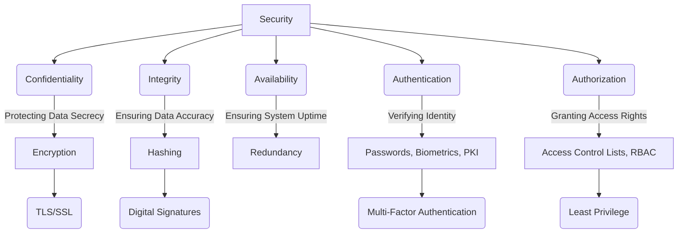

# Security Fundamentals

In the realm of software architecture and system design, security is not merely an add-on but a foundational pillar. It encompasses a comprehensive set of measures and practices meticulously designed to safeguard information, systems, and networks from unauthorized access, misuse, disclosure, disruption, modification, or destruction.

## The Importance of Security by Design

Integrating security into the system design process from the outset (Security by Design) is crucial for several reasons:

*   **Risk Mitigation**: Proactively identifying and addressing security vulnerabilities reduces the likelihood and impact of security breaches.
*   **Trust and Reputation**: Protecting user data and maintaining system availability builds trust with users and stakeholders.
*   **Compliance**: Adhering to regulatory requirements (e.g., GDPR, HIPAA, PCI DSS) is often a legal and business necessity.
*   **Cost-Effectiveness**: Addressing security concerns early in the design phase is significantly less expensive than fixing vulnerabilities after deployment.

## The Core Principles of Security (CIA Triad)

The fundamental goals of information security are often summarized by the CIA Triad.

```mermaid
graph TD
    A[Security] --> B(Confidentiality)
    A --> C(Integrity)
    A --> D(Availability)

    B -- "Examples: Encryption, Access Control"
    C -- "Examples: Hashing, Digital Signatures"
    D -- "Examples: Redundancy, Backups"
```

*   **Confidentiality**: Ensures that information is accessible only to those authorized to have access. This prevents sensitive data from being disclosed to unauthorized individuals or systems.
    *   *Examples*: Encryption, access controls, data masking.
*   **[[data-integrity|Integrity]]**: Ensures that information is accurate, complete, and has not been tampered with. It protects data from unauthorized modification or destruction.
    *   *Examples*: Hashing, digital signatures, version control, access controls.
*   **[[reliability-engineering#1. Availability|Availability]]**: Ensures that authorized users can access information and systems when needed. This protects against disruptions to service.
    *   *Examples*: Redundancy, backup and recovery, load balancing, disaster recovery plans.

## Conceptual Overview of Security Domains

Beyond the CIA Triad, security is a multi-faceted discipline that includes core mechanisms for managing access and verifying identity.


*Description: This diagram illustrates the core principles of security (Confidentiality, Integrity, Availability) and fundamental mechanisms like Authentication and Authorization. It also shows examples of technologies and concepts that support these principles, such as Encryption for confidentiality, Hashing for [[data-integrity|integrity]], and PKI for authentication.*

---

## Related Security Patterns

For specific techniques and solutions to common security challenges, refer to the dedicated section on [[software-architecture/security-patterns/|Security Patterns]]. Key patterns include:

*   **[[gatekeeper|Gatekeeper Pattern]]**: Describes the use of a dedicated, hardened component that acts as a single entry point to protect backend services.
*   **[[federated-identity|Federated Identity Pattern]]**: Delegates authentication to a trusted, external Identity Provider, simplifying user management and enabling Single Sign-On (SSO).
*   **[[valet-key|Valet Key Pattern]]**: Provides clients with temporary, restricted-access tokens for direct access to specific resources, enhancing performance and security for data transfers.
*   **[[rate-limiting|Rate Limiting Pattern]]**: Controls the number of requests a client can make to a service within a specific time window to prevent overuse and abuse.
*   **[[throttling|Throttling Pattern]]**: Limits the rate at which requests are processed to protect backend services from being overwhelmed.
