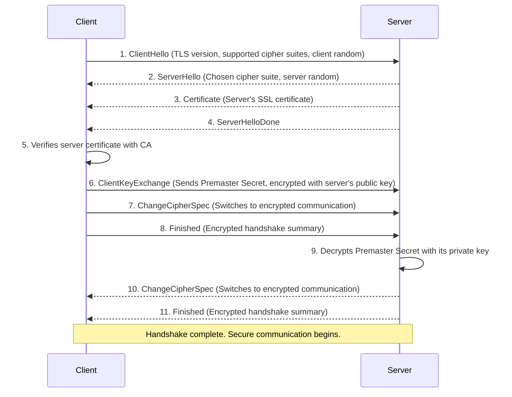

# SSL/TLS (Secure Sockets Layer / Transport Layer Security)

Transport Layer Security (TLS), and its now-deprecated predecessor Secure Sockets Layer (SSL), are cryptographic protocols designed to provide secure communication across a computer network. TLS ensures that data exchanged between two applications (e.g., a web browser and a server) is encrypted and that the identity of the communicating parties can be authenticated.

Its most common application is securing HTTP traffic, which is then referred to as HTTPS (HTTP Secure). The presence of HTTPS, indicated by a padlock icon in the browser, signifies that the connection to the website is secure.

## The TLS Handshake: Establishing a Secure Session

*Note: The TLS handshake should not be confused with the underlying [[communication-protocols#Three-Way Handshake|TCP three-way handshake]]. The TCP handshake establishes a **reliable connection**, while the TLS handshake, which occurs **after** the TCP connection is established, focuses on creating a **secure session** over that connection.*

The core of TLS is the **handshake**, a negotiation process between the client and the server to establish a secure session. During the handshake, they agree on the cryptographic algorithms to use, authenticate each other (primarily the server), and generate shared secret keys for encrypting their communication.

Here is a simplified overview of the TLS 1.2 handshake process:

*Description: The TLS handshake involves the client and server agreeing on security parameters, the server proving its identity via a certificate, and both parties securely generating a shared secret key for symmetric encryption.*

**Key Steps Explained:**
1.  **Negotiation**: The client and server agree on the TLS version and a specific **cipher suite** to use.
2.  **Authentication**: The server proves its identity by sending its digital certificate. The client verifies this certificate using its trusted list of Certificate Authorities (CAs). This step is fundamental and relies on the principles of [[pki|Public Key Infrastructure (PKI)]].
3.  **Key Exchange**: The client and server use the mechanisms of asymmetric cryptography (public/private keys) to securely generate a shared secret key. This key is known only to the client and server for this specific session.
4.  **Secure Communication**: Once the handshake is complete, all further communication is encrypted using the shared secret key (symmetric encryption), which is much faster than asymmetric encryption.

## What is a Cipher Suite?

A cipher suite is a named combination of cryptographic algorithms used during the TLS handshake. It defines:
1.  **Key Exchange Algorithm**: How the shared secret key will be established (e.g., ECDHE).
2.  **Authentication Algorithm**: How the server's identity is verified (e.g., RSA, ECDSA).
3.  **Bulk Encryption Algorithm**: The symmetric algorithm used to encrypt the data (e.g., AES-256-GCM).
4.  **Message Authentication Code (MAC) Algorithm**: The hashing algorithm used to ensure data integrity (e.g., SHA256).

Example: `TLS_ECDHE_RSA_WITH_AES_256_GCM_SHA384`

## SSL vs. TLS

-   **SSL (Secure Sockets Layer)** was the original protocol developed by Netscape. All versions of SSL (2.0, 3.0) are now considered insecure and have been deprecated due to known vulnerabilities (e.g., POODLE).
-   **TLS (Transport Layer Security)** is the successor to SSL. It began with TLS 1.0 and has been improved through versions 1.1, 1.2, and 1.3. As of today, **TLS 1.2 and 1.3** are the secure standards that should be used.

Although the term "SSL" is still widely used colloquially, modern secure connections are almost always established using the TLS protocol.

## Related Concepts

-   [[pki|Public Key Infrastructure (PKI)]]: The entire framework of trust that allows TLS to authenticate the identity of servers.
-   [[communication-protocols|Communication Protocols]]: TLS is a security layer that operates on top of transport protocols like TCP.
-   [[hashing-algorithms|Hashing Algorithms]]: Used within TLS for data integrity checks and message authentication codes.

---

## Resources & Links

### Articles

1.  **[What is SSL/TLS? An In-Depth Guide - SSL.com](https://www.ssl.com/article/what-is-ssl-tls-an-in-depth-guide/)**
    A comprehensive guide from SSL.com that covers the history and evolution from SSL to TLS. It explains the core functions of the protocol, including encryption, authentication, and integrity, and details the components of an SSL/TLS certificate.

2.  **[What happens in a TLS handshake? - Cloudflare](https://www.cloudflare.com/learning/ssl/what-happens-in-a-tls-handshake/)**
    A detailed, step-by-step explanation of the TLS handshake process from Cloudflare's learning center. It clearly breaks down the "Client Hello," "Server Hello," and key exchange steps, making it an excellent resource for understanding how a secure session is established.

3.  **[What is SSL/TLS Encryption? - F5](https://www.f5.com/glossary/ssl-tls-encryption)**
    An article from F5 that defines SSL/TLS encryption and its role in securing internet communications. It explains how asymmetric and symmetric encryption work together during the handshake and subsequent data transfer, and discusses the importance of TLS in building a zero-trust security model.
