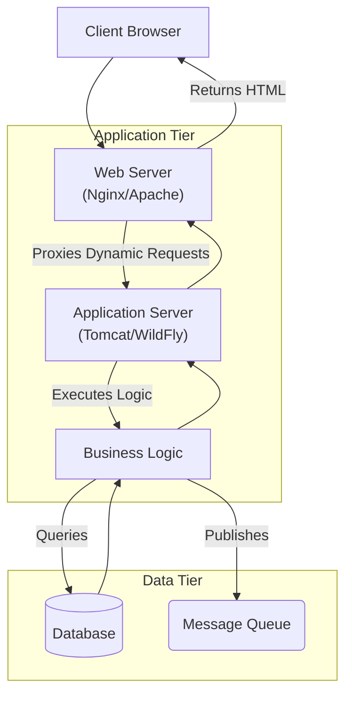

# Application Server

An **Application Server** is a comprehensive software framework that provides a runtime environment for developing and running enterprise applications. Unlike a [[web-server|web server]], which primarily handles HTTP requests and serves static content, an application server is designed to execute complex business logic, manage transactions, and facilitate interaction between the application and backend resources like databases, messaging systems, and legacy applications.

In the [[n-tier-architecture|n-tier architecture]], the application server occupies the middle tier (logic tier), sitting between the web server (presentation tier) and the database (data tier). It acts as the engine that powers dynamic, data-driven applications.

## Core Capabilities

Application servers provide a rich set of services that abstract away the complexity of infrastructure management, allowing developers to focus on business logic. Key capabilities include:

1.  **Business Logic Execution**: It hosts and executes the core application code (e.g., Java Beans, EJBs, C# components) that processes data and implements business rules.
2.  **Transaction Management**: It ensures data integrity by managing [[acid|ACID transactions]]. If a complex operation fails halfway, the application server can roll back all changes to ensure the system remains in a consistent state.
3.  **Database Connection Pooling**: It maintains a pool of open connections to the database, allowing multiple client requests to reuse them. This significantly improves [[software-architecture/system-design-fundamentals/index#Performance-vs-Scalability|performance]] by avoiding the overhead of opening and closing a connection for every request. It also acts as a form of the [[bulkhead|Bulkhead pattern]], preventing database exhaustion from bringing down the entire server.
4.  **Security**: It provides a centralized [[software-architecture/security/|security]] framework for authentication and authorization, ensuring that only authorized users can access specific application components or data.
5.  **[[messaging|Messaging]] and Asynchrony**: It often includes support for message queues (like [[message-queue|JMS]] or RabbitMQ integration) to enable [[asynchronous-messaging|asynchronous communication]] between different parts of the application or with other systems.
6.  **Clustering and Failover**: To ensure high availability and [[software-architecture/system-design-fundamentals/index#Scalability|scalability]], application servers can be clustered. If one server fails, traffic is automatically failed over to another node in the cluster.

## Web Server vs. Application Server

While they often work in tandem, their roles are distinct. A helpful analogy is a restaurant: the **Web Server** is the waiter who takes your order and brings you the food (static content), while the **Application Server** is the chef in the kitchen who actually cooks the meal (executes logic) using raw ingredients (data).

| Feature | Web Server | Application Server |
| :--- | :--- | :--- |
| **Primary Function** | Serve HTTP content (HTML, CSS, Images). | Execute business logic and generate dynamic content. |
| **Protocols** | Primarily HTTP/HTTPS. | HTTP, but also RMI, RPC, IIOP, JMS, etc. |
| **Content Type** | Static (files). | Dynamic (computed results). |
| **Resource Management** | Limited (mostly file handles & sockets). | Extensive (Transactions, DB Pools, Threads, Messaging). |
| **Examples** | Nginx, Apache HTTPD, Caddy. | Apache Tomcat, JBoss/WildFly, WebLogic. |

### Complementary Architecture

In a production environment, they are typically deployed together using a [[proxy-pattern#Reverse-Proxy|reverse proxy]] pattern.

*Description: The Web Server handles static assets and SSL termination, forwarding dynamic requests to the Application Server. The App Server executes the logic, interacting with the Database and Message Queue as needed.*

## Key Examples

### Apache Tomcat
Apache Tomcat is an open-source implementation of the Jakarta Servlet, Jakarta Server Pages (JSP), and Jakarta WebSocket technologies.
*   **Type**: It is technically a **Servlet Container** (or Web Container), not a full JEE Application Server, although it is often classified as a lightweight application server.
*   **Use Case**: Ideal for light-to-medium weight Java web applications (Spring Boot, simple Servlets) that don't require the full suite of Enterprise Java (JEE) features like EJB or distributed transactions out of the box.
*   **Popularity**: It is the most widely used Java server due to its lightweight nature, speed, and open-source ecosystem.

> [Official Website](https://tomcat.apache.org/)

### WildFly (formerly JBoss)
WildFly is a powerful, modular, and lightweight application server written in Java. It is the upstream project for Red Hat JBoss Enterprise Application Platform.
*   **Type**: Full JEE Application Server.
*   **Key Feature**: Incredible boot speed and low memory footprint due to its modular architecture. It only loads the subsystems you actually need.
*   **Use Case**: Enterprise-grade Java applications requiring full Jakarta EE compliance.

> [Official Website](https://www.wildfly.org/)

### Oracle WebLogic & IBM WebSphere
These are the heavyweights of the enterprise world.
*   **Type**: Commercial, Full JEE Application Servers.
*   **Characteristics**: They offer extensive features for high availability, clustering, advanced monitoring, and integration with their respective vendor ecosystems (Oracle DB, IBM Mainframes).
*   **Use Case**: Large-scale, mission-critical enterprise systems in banking, insurance, and telecommunications where support contracts and extreme reliability are paramount.

## Modern Context: The Shift to Microservices

With the rise of [[microservices]] and cloud-native architectures, the role of the traditional, monolithic application server has evolved.

1.  **Embedded Servers**: Frameworks like **Spring Boot** embed the application server (usually Tomcat or Jetty) directly into the application executable (JAR file). You don't "deploy to" a server anymore; the application *is* the server.
2.  **[[containerization|Containerization]]**: Technologies like [[containers/docker|Docker]] and [[kubernetes|Kubernetes]] handle many of the responsibilities previously managed by app servers, such as clustering, failover, and configuration management.
3.  **Lightweight Runtimes**: There is a shift away from heavy JEE servers towards lighter, reactive runtimes (like Quarkus or Micronaut) designed specifically for serverless and containerized environments.

---

## Resources & links

### Articles

1.  **[What is an application server? - IBM](https://www.ibm.com/think/topics/application-server)**
    This article from IBM provides a fundamental definition of application servers, explaining their role in hosting business logic and connecting user interfaces to backend databases. It highlights key benefits like improved performance, centralized management, and security, and touches on the market growth and diversity of solutions from open-source to enterprise-grade.

2.  **[Web Server vs. Application Server: What's the Difference? - Payara](https://payara.fish/blog/web-server-vs-application-server/)**
    A detailed comparison that breaks down the architectural differences between web servers and application servers. It contrasts their resource management strategies (lightweight vs. robust threading), protocol support (HTTP vs. RMI/JMS/SOAP), and primary functions (static content delivery vs. dynamic business logic execution). It also explains how they are often combined in production environments.

### Videos

1.  **[Web Server and Application Server | Explained 🔥🔥](https://www.youtube.com/watch?v=thJSev60yfg)**
    This video offers a clear and energetic explanation of the core differences between web servers and application servers. It uses simple analogies to illustrate how web servers handle static requests while application servers manage complex processing and database interactions, making it an excellent resource for grasping the fundamental concepts quickly.
