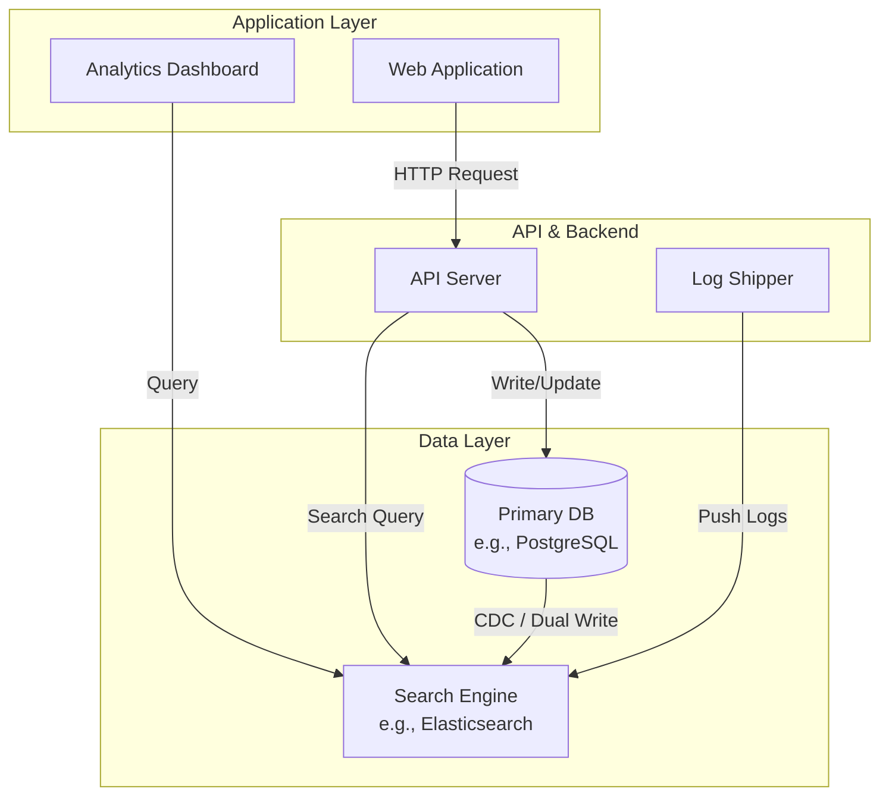
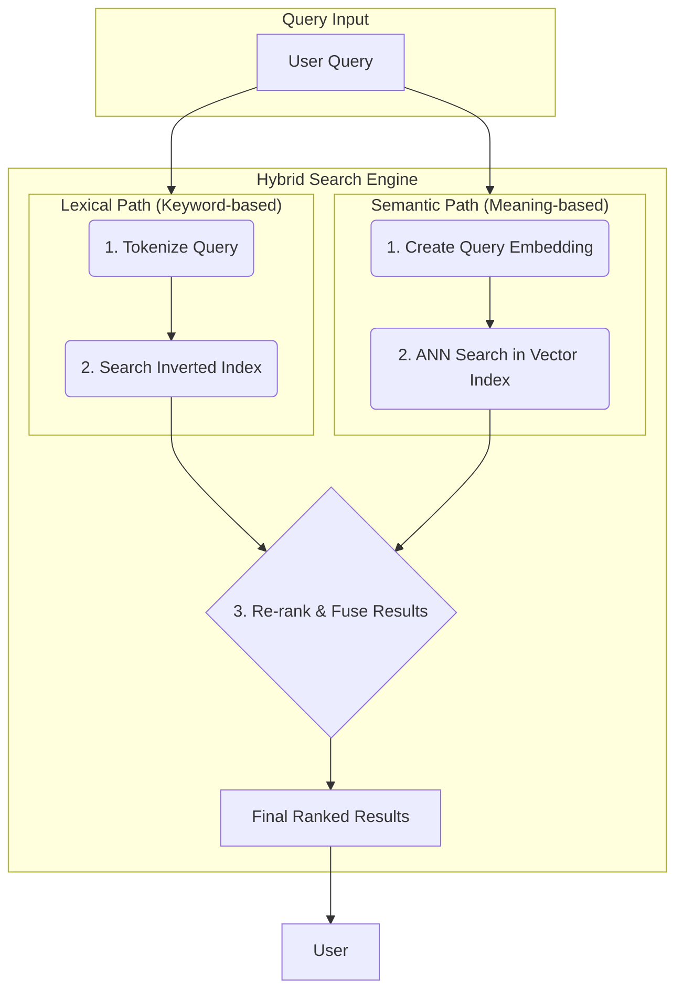

# Search Engines

In system design, **Search Engines** are a specialized class of data store engineered for extremely fast, scalable searching and analysis of large volumes of data, particularly unstructured or semi-structured text. While a traditional [[rdbms|RDBMS]] is optimized for transactional integrity and structured queries, a search engine is built for speed, relevance, and complex analytical queries across vast, often denormalized, datasets.

They form the backbone of any feature that requires finding a needle in a haystack—whether that haystack is a billion log entries, a catalog of millions of products, or the entire web. Their power lies in their ability to "understand" text and rank results by relevance, a task that is computationally prohibitive for most other database types.

## Core Concepts

At the heart of every search engine are a few fundamental concepts that enable their remarkable performance.

1.  **Inverted Index**: This is the cornerstone of a search engine's speed. Instead of mapping a document ID to its content (a "forward index"), an inverted index maps each unique word (term) to a list of documents where it appears. This allows the engine to find all documents containing a search term almost instantly, without scanning every document.

2.  **Indexing and Analysis**: Before data can be searched, it must be processed through an "analysis" pipeline. This involves:
    *   **Tokenization**: Breaking text down into individual terms (tokens).
    *   **Normalization**: Converting terms to a standard form (e.g., lowercasing).
    *   **Stemming/Lemmatization**: Reducing words to their root form (e.g., "running" -> "run").
    The resulting tokens are then used to build the inverted index.

3.  **Relevance Ranking**: A search engine doesn't just find results; it ranks them. Early algorithms like **TF-IDF** (Term Frequency-Inverse Document Frequency) scored documents based on how often a term appears in a document relative to its rarity across all documents. Modern engines use more sophisticated, tunable algorithms to calculate a relevance score for each result.

4.  **Distributed Architecture**: To handle massive scale, search engines are inherently distributed. Data is partitioned into **shards**, and each shard can be replicated for high availability and fault tolerance. Queries are executed in parallel across shards and the results are aggregated before being returned to the client. This architecture is key to achieving both [[software-architecture/system-design-fundamentals/reliability-engineering|reliability]] and horizontal scalability.

5.  **Query DSL (Domain Specific Language)**: Search engines provide a rich Query DSL, typically based on [[json-api|JSON]], to construct sophisticated queries. This allows for much more than simple keyword search, enabling complex filtering, multi-term matching, aggregations (analytics), and fine-tuning of relevance scoring.

## Architectural Integration & Use Cases

Search engines are rarely standalone systems; they are components integrated into a broader architecture.

*Description: A common pattern where a primary database handles transactional writes, and data is synchronized to a search engine to power complex search and analytical queries. The search engine also serves as a destination for log data, enabling observability.*

### Common Patterns

1.  **Full-Text Search Offload**: In this pattern, the primary application database (e.g., a [[rdbms|relational database]]) handles core transactions, while a search engine is used to provide powerful full-text search capabilities. Data is synchronized from the primary DB to the search engine, often using a dual-write approach or Change Data Capture (CDC).

2.  **[[cqrs|CQRS (Command Query Responsibility Segregation)]]**: Search engines are a natural fit for the "Read" side of a CQRS architecture. The "Write" model processes commands and persists state to a transactional store, while events are published to update a denormalized "Read" model in the search engine, which is highly optimized for complex queries.

3.  **Log Aggregation and Observability**: A ubiquitous use case is centralizing logs, metrics, and traces from a distributed system. Services push their operational data to a search engine, which indexes it in near real-time. This allows developers and SREs to search, visualize, and alert on the health and behavior of the entire system. This is the foundation of the popular ELK (Elasticsearch, Logstash, Kibana) stack for [[software-architecture/observability/monitoring|monitoring]].

## Popular Implementations

While many search engines exist, most are built upon the same core library: **Apache Lucene**.

| Engine | Key Characteristic | Architecture | Best For |
| :--- | :--- | :--- | :--- |
| **Elasticsearch** | Speed, scalability, and a powerful API | Distributed, RESTful, JSON-based | Log analytics, real-time application search, security analytics (SIEM). |
| **Apache Solr** | Rich feature set, enterprise-grade | Highly configurable, REST-like APIs | Enterprise search, content management systems, complex faceting and filtering. |

### Elasticsearch
Elasticsearch is a distributed, RESTful search and analytics engine. Its primary strengths are its ease of use, powerful HTTP-based API, and incredible scalability. It stores data as schema-flexible JSON documents, making it a great fit for rapidly evolving applications. Its tight integration with Logstash (for data ingestion) and Kibana (for visualization) has made it the de-facto standard for log management.

> [Official Website](https://www.elastic.co/elasticsearch/)

### Apache Solr
Apache Solr is a mature, open-source enterprise search platform. It offers a very rich feature set for full-text search, including advanced faceting, highlighting, and support for a wide variety of document formats (like PDF and Word). While historically requiring more complex XML configuration, modern versions have adopted more user-friendly APIs. Solr remains a top choice for large-scale enterprise and content-centric applications where deep, powerful search is paramount.

> [Official Website](https://solr.apache.org/)

---

## The Evolution: AI-Powered and Vector Search

While traditional search engines are masters of lexical search (matching keywords), a new generation has emerged to handle **semantic search**—understanding the *meaning* and *intent* behind a query. This is primarily achieved through **vector search** and is often delivered as a **hybrid model**.

### Core Concepts of AI-Powered Search

1.  **Vector Embeddings**: The core idea is to use deep learning models to convert data (text, images, audio) into high-dimensional numerical vectors called **embeddings**. These embeddings capture the semantic meaning of the data. For example, the vectors for "dog" and "canine" will be very close to each other in the vector space.

2.  **Vector Search (Similarity Search)**: Once data is converted into vectors, searching is no longer about matching keywords. Instead, the search query is also converted into a vector, and the engine finds the vectors in its database that are closest to the query vector using algorithms like **Approximate Nearest Neighbor (ANN)**.

3.  **Hybrid Search**: This powerful approach combines the best of both worlds. It executes a traditional keyword search and a vector search in parallel. The results from both are then fused together in a "re-ranking" step to produce a final list that balances lexical precision with semantic relevance.

*Description: A hybrid search model processes a query through two parallel paths: a lexical path for keyword matching and a semantic path for meaning-based similarity. The results are then fused to provide a more relevant final ranking.*

### AI-Powered Search Solutions

The ecosystem for AI-powered search is evolving rapidly. The trend is to integrate these new capabilities into existing and new search engine platforms.

| Engine | Key Characteristic | Architecture | Best For |
| :--- | :--- | :--- | :--- |
| **Google Vertex AI Search** | Fully managed, end-to-end | Cloud-native, integrated with Google Cloud | Enterprise search, e-commerce, and applications needing ready-to-use semantic search without managing infrastructure. |
| **Azure AI Search** | Managed service with "cognitive skills" | Integrated with Azure services | Similar to Vertex AI, for enterprises within the Microsoft Azure ecosystem. |

#### Google Vertex AI Search
A fully managed service that handles the entire semantic search pipeline, from data ingestion and embedding generation to indexing and querying. It allows developers to build sophisticated search experiences with minimal infrastructure management.
> [Official Website](https://cloud.google.com/enterprise-search)

#### Azure AI Search
Formerly known as Azure Cognitive Search, this is a managed platform that provides developers with APIs and tools to build rich search experiences over heterogeneous content. It has strong capabilities in both traditional and vector search, often enriched with "cognitive skills" for data extraction.
> [Official Website](https://azure.microsoft.com/en-us/products/ai-services/ai-search)

It's also important to note that traditional engines like **Elasticsearch** are rapidly adding dense vector search capabilities, allowing them to serve as a single backend for hybrid search. Separately, a new category of specialized **vector databases** (like Pinecone or Weaviate) has emerged, but they focus exclusively on the vector similarity search component and represent a distinct architectural choice.