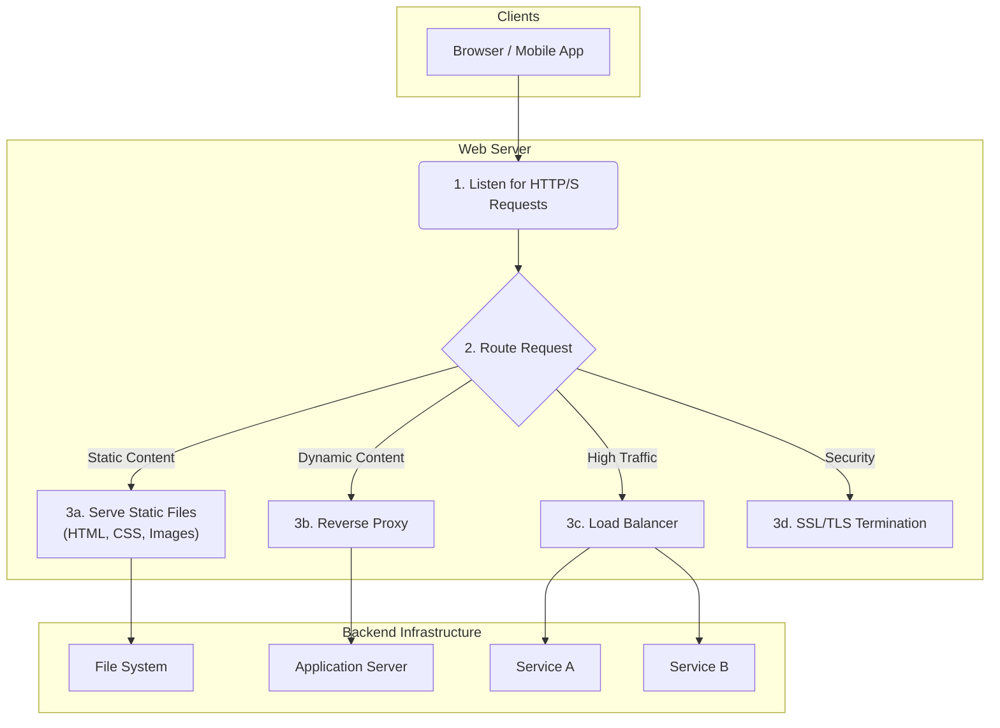
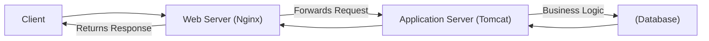

# Web Server

A web server is a fundamental component of any web-based application, acting as the intermediary between a client (e.g., a web browser) and the server-side resources. Its primary function is to process incoming [[http|HTTP/HTTPS]] requests and deliver web content, such as HTML pages, images, stylesheets, and JavaScript files.

In the [[client-server]] model, the web server is the software that runs on the "server" machine, listening for requests from clients. Upon receiving a request, it locates the requested resource or passes the request to another component (like an [[application-server|application server]]) and returns a response to the client.

## Core Responsibilities

While originally designed to [[static-content-hosting|serve static files]], modern web servers are multi-faceted components that handle a variety of tasks. Their role has expanded to improve [[software-architecture/security/|security]], [[software-architecture/system-design-fundamentals/index#Performance-vs-Scalability|performance]], and [[software-architecture/system-design-fundamentals/index#Scalability|scalability]].

*Description: A web server listens for requests and routes them based on their nature. It can serve static files directly from the file system, act as a reverse proxy to application servers, perform load balancing across multiple services, and handle SSL/TLS encryption.*

### Key Functions Explained

1.  **[[static-content-hosting|Serving Static Content]]**: This is the most basic function. The web server retrieves files (like `.html`, `.css`, `.jpg`) from the local file system and sends them to the client. This process is highly optimized for speed and efficiency.

2.  **[[posa#Proxy|Reverse Proxy]]**: In modern architectures, a web server often sits in front of application servers (e.g., Node.js, Python, Java servers). It forwards client requests to these backend servers and returns their responses. This pattern is central to [[microservices]] architectures and provides several benefits:
    *   **Abstraction**: Hides the topology of the backend from the client.
    *   **Security**: The application servers are not directly exposed to the internet.
    *   **Flexibility**: Simplifies swapping out or scaling backend services.
    A web server acting as a reverse proxy shares many characteristics with an [[api-gateway|API Gateway]].

3.  **Load Balancing**: To achieve [[software-architecture/system-design-fundamentals#Scalability|horizontal scalability]], traffic must be distributed across multiple servers. Web servers like Nginx can act as a [[load-balancing|load balancer]], distributing incoming requests among a pool of backend servers to prevent any single server from being overwhelmed.

4.  **SSL/TLS Termination**: Web servers can handle the encryption and decryption of HTTPS traffic. This is known as [[ssl-tls|SSL/TLS termination]]. It offloads the computational overhead of encryption from the backend application servers, simplifying their logic. This is a crucial aspect of [[security-fundamentals|web security]].

5.  **Caching**: To improve performance, a web server can [[caching|cache]] frequently requested content. When a request for a cached resource arrives, the server can return the cached copy immediately without accessing the file system or a backend service.

## Web Server vs. Application Server

While the terms are sometimes used interchangeably, they refer to components with distinct primary roles.

*   A **Web Server** is primarily concerned with handling HTTP requests and serving static content or acting as a proxy.
*   An **[[application-server|Application Server]]** is designed to execute business logic and interact with databases, messaging systems, and other services. It provides a runtime environment for applications (e.g., a Java EE environment in Tomcat).

In many modern stacks, they work together: a web server (like Nginx) acts as a reverse proxy that forwards requests to an application server (like Tomcat or Gunicorn).

*Description: A common pattern where Nginx handles the initial client connection and proxies the request to a Tomcat application server, which executes the application logic.*

## Common Implementations

Different web servers are optimized for different use cases. The choice depends on factors like performance needs, flexibility, and the underlying operating system.

| Server | Key Characteristic | Architecture | Best For |
| :--- | :--- | :--- | :--- |
| **Nginx** | High performance, concurrency | Asynchronous, Event-Driven | Reverse proxying, load balancing, serving static files at scale. |
| **Apache** | Flexibility, rich feature set | Process-driven / Thread-driven, Modular | Shared hosting, dynamic content with its module system (`.htaccess`). |
| **Caddy** | Simplicity, automatic HTTPS | Go-based, modern | Quick deployments, small-to-medium projects, developers prioritizing ease of use. |
| **MS IIS** | Windows integration | Integrated into Windows Server | Hosting ASP.NET applications and enterprise deployments in a Windows environment. |

### Nginx
Nginx is a high-performance web server renowned for its efficiency and low resource consumption. Its asynchronous, event-driven architecture allows it to handle tens of thousands of concurrent connections with a small memory footprint, making it a top choice for high-traffic websites and as a reverse proxy or load balancer in modern application deployments.

> [Official Website](https://nginx.org/)

### Apache HTTP Server
Apache has been a dominant force on the web for decades. Its power lies in its flexibility and its rich ecosystem of modules, which can extend its functionality significantly. Its process-driven model can consume more resources under heavy load compared to Nginx, but its `.htaccess` configuration system allows for powerful, decentralized configuration, making it popular in shared hosting environments.

> [Official Website](https://httpd.apache.org/)

### Caddy
Caddy is a modern, open-source web server written in Go. Its standout feature is **automatic HTTPS** by default, using Let's Encrypt to provision and renew [[ssl-tls|TLS certificates]] automatically. Its configuration is famously simple, making it an excellent choice for developers who need to get a secure site running quickly without complex setup.

> [Official Website](https://caddyserver.com/)

### Microsoft IIS (Internet Information Services)
IIS is a flexible and secure web server from Microsoft, tightly integrated with the Windows Server operating system. It is the go-to choice for hosting ASP.NET web applications and provides robust management tools through a graphical interface. It is a mature product well-suited for enterprise environments that are heavily invested in the Microsoft ecosystem.

> [Official Website](https://www.iis.net/)

---

## Resources & links

### Articles

1.  **[What is a web server? - MDN Web Docs](https://developer.mozilla.org/en-US/docs/Learn/Common_questions/What_is_a_web_server)**
    The official Mozilla documentation provides a foundational explanation of what a web server is, distinguishing between the hardware and software components. It covers how web servers process HTTP requests to serve static and dynamic content, and explains their role in the client-server model.

2.  **[What Is a Web Server and How It Works - Hostinger](https://www.hostinger.com/uk/tutorials/what-is-a-web-server)**
    This tutorial offers a comprehensive overview of web servers, explaining their function in storing and delivering website files. It details the client-server model, the difference between static and dynamic web servers, and lists key features and popular server software like Apache and Nginx.

### Videos

1.  **[Web Server and Application Server | Difference Explained](https://www.youtube.com/watch?v=9J1nJOivdyw)**
    This video clarifies the often-confused roles of web servers and application servers. It explains that a web server's primary job is to handle HTTP requests and serve static content, while an application server is responsible for executing business logic and generating dynamic content. The video illustrates how they work together in a typical web architecture.
