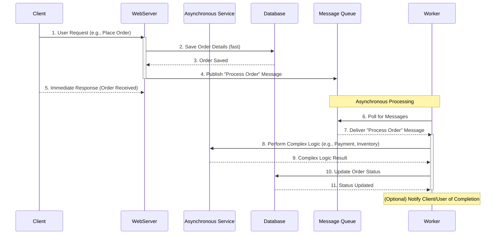

# Asynchronism

Asynchronism is a fundamental paradigm in modern system design, particularly crucial for distributed systems and high-performance applications. It refers to the ability of a system to perform multiple operations concurrently without waiting for each operation to complete before starting the next. Instead of blocking the execution flow, an asynchronous operation initiates a task and immediately returns control to the caller, allowing it to continue processing other work. The caller is then notified (e.g., via a callback, a promise, or a message) when the asynchronous task has finished.

This approach contrasts sharply with synchronous execution, where each operation must complete sequentially. Asynchronism is vital for improving system responsiveness, throughput, and [[workload-management|workload management]], especially when dealing with I/O-bound operations (like network requests, database queries, or file system access) that involve waiting for external resources.

## Key Characteristics and Benefits

-   **Non-Blocking Operations**: The primary characteristic is that operations do not block the main execution thread. This prevents the system from becoming unresponsive while waiting for slow operations.
-   **Improved Responsiveness**: By offloading long-running tasks, the system can remain responsive to user interactions or other incoming requests.
-   **Enhanced Throughput**: A single thread or process can manage multiple concurrent operations, leading to a higher number of tasks processed per unit of time.
-   **Better Resource Utilization**: Resources (CPU, memory) are not idled waiting for I/O operations to complete; instead, they can be used to process other tasks. This is a key principle of [[workload-management|Workload Management]].
-   **Scalability**: Facilitates the design of scalable systems by allowing components to operate independently and process workloads more efficiently.
-   **Resilience**: Enables systems to handle transient failures more gracefully, as operations can be retried or managed in the background without impacting the main flow.

## Asynchronous Workflows

Asynchronous workflows are particularly beneficial for operations that are time-consuming or involve external dependencies. They help reduce request times for expensive operations that would otherwise be performed in-line. They can also help by doing time-consuming work in advance, such as periodic aggregation of data.

Consider a typical web application where a user request might involve multiple steps, some of which are slow:

*Description: This diagram illustrates an asynchronous workflow where a client's request (e.g., placing an order) is quickly acknowledged by the Web Server after saving basic details. The time-consuming processing (payment, inventory updates) is offloaded to an Asynchronous Service via a Message Queue and processed by a Worker, allowing the client to receive an immediate response and the system to remain responsive.*

## Related Concepts and Patterns

Asynchronism is often implemented and managed through various patterns and mechanisms:

-   **[[message-queue|Message Queues]]**: Essential for decoupling producers and consumers, enabling asynchronous communication and buffering tasks.
-   **[[background-jobs|Background Jobs]]**: Often powered by message queues or task queues, these allow long-running or non-critical operations to be executed outside the main request-response cycle.
-   **[[back-pressure|Back Pressure]]**: A crucial mechanism in asynchronous systems to prevent a fast producer from overwhelming a slower consumer, ensuring system stability.
-   **[[event-driven|Event-Driven Architecture]]**: A style where components communicate by emitting and reacting to events, inherently asynchronous.
-   **[[asynchronous-messaging|Asynchronous Messaging]]**: The broader concept of communication where sender and receiver do not need to be available at the same time.

## Resources & links

### Articles

1.  **[Asynchronous Processing in System Design - GeeksforGeeks](https://www.geeksforgeeks.org/system-design/asynchronous-processing-in-system-design/)**
    This article provides a comprehensive overview of asynchronous processing in system design, covering its importance, benefits, and various implementation strategies. It delves into how asynchronous operations contribute to building scalable and responsive distributed systems.

2.  **[Asynchronous Processing in System Design - Part 2 (Medium)](https://medium.com/@kiranvutukuri/asynchronous-processing-in-system-design-part-22-56c821477286)**
    This is the second part of a series on asynchronous processing, offering deeper insights into advanced concepts and patterns. It explores further techniques and considerations for effectively integrating asynchronous mechanisms into complex system architectures.