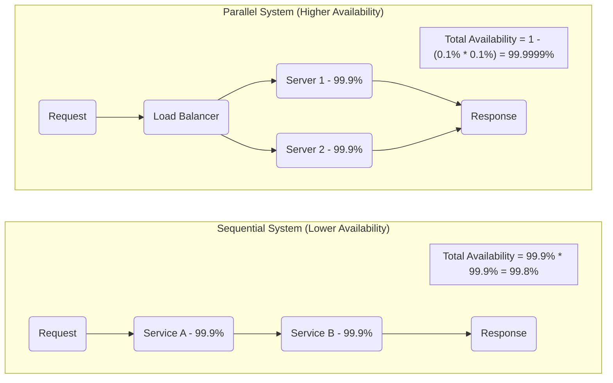

# Availability

Availability is a fundamental concept in system design that measures a system's uptime and its ability to respond to requests. The practice of tracking these measures is handled by [[monitoring]]. It is a key indicator of a system's reliability and is often a cornerstone of Service Level Agreements (SLAs).

High availability is achieved by building resilient systems that can withstand failures of individual components. The primary strategy for this is **redundancy**, which is implemented through various [[availability-patterns]]. For globally distributed systems, advanced patterns like the [[geode|Geode pattern]] provide extreme availability by serving traffic from multiple active regions simultaneously.

---

## Availability in Numbers (The Nines)

Availability is commonly expressed as a percentage of uptime over a period (usually a year), often referred to as "the nines."

| Availability % | "The Nines" | Allowed Downtime per Year | per Month   | per Week   | per Day   |
| :------------- | :---------- | :------------------------ | :---------- | :--------- | :-------- |
| 99%            | 2 nines     | 3 days 15h 39m 30s        | 7h 18m 17s  | 1h 40m 48s | 14m 24s   |
| 99.9%          | 3 nines     | 8h 45m 57s                | 43m 50s     | 10m 4.8s   | 1m 26s    |
| 99.99%         | 4 nines     | 52m 36s                   | 4m 23s      | 1m 0.48s   | 8.6s      |
| 99.999%        | 5 nines     | 5m 16s                    | 26s         | 6s         | 0.86s     |

## Calculating System Availability

Understanding how component availability affects the total system availability is crucial.

*   **In Sequence (Serial):** If components are chained sequentially (A calls B), the total availability is the product of their individual availabilities. The system is only up if *all* components are up.
    *   `A_total = A_component1 * A_component2 * ...`

*   **In Parallel:** If components are redundant and in parallel (e.g., multiple servers behind a [[load-balancing|load balancer]]), the total availability is calculated based on the probability of all components failing simultaneously.
    *   `A_total = 1 - (1 - A_component1) * (1 - A_component2) * ...`

*Description: A sequential system's availability is limited by its weakest link. A parallel system increases availability because it can tolerate the failure of one or more components.*
