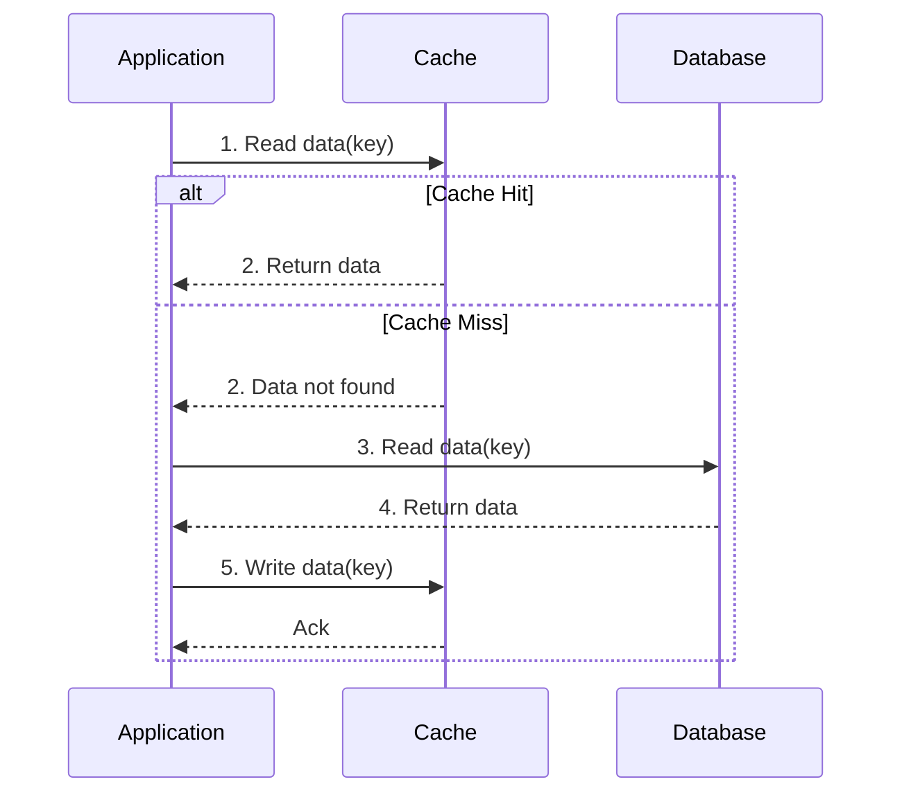
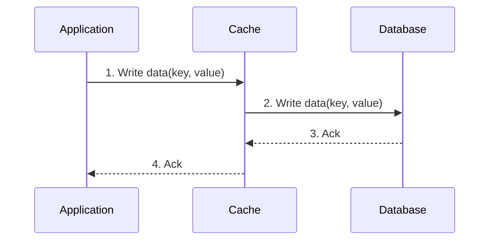
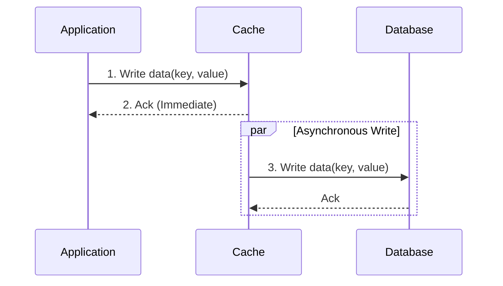

# Caching

Caching is a fundamental and ubiquitous technique in modern system design, crucial for enhancing both performance and scalability. At its essence, caching involves storing copies of frequently accessed data in a temporary, high-speed storage layer – the cache – located closer to the consumer of that data. The primary objective is to drastically reduce the latency associated with retrieving data from its original, often slower, source (such as a [[rdbms|database]], a remote API, or a complex computation).

By intercepting and serving repeated data requests from the cache, systems can achieve several critical benefits:
- **Reduced Latency:** Data retrieval becomes significantly faster, leading to a more responsive user experience.
- **Decreased Load on Backend Systems:** The number of requests hitting the primary data source is minimized, alleviating pressure and allowing backend services to handle more overall traffic or perform other tasks.
- **Improved Throughput:** The system can process a higher volume of requests per unit of time.
- **Cost Efficiency:** Less load on expensive backend resources can translate into lower infrastructure costs.

However, the power of caching comes with an inherent and critical challenge: **data consistency**. When data is duplicated in a cache, there's always a risk that the cached copy may become "stale" – meaning it no longer reflects the most up-to-date version in the source of truth. Effectively managing this trade-off between maximizing performance (by caching aggressively) and ensuring data freshness (by minimizing staleness) is the central design problem in any caching strategy. This involves careful consideration of cache invalidation, expiration policies, and the acceptable level of eventual consistency for a given application.

---

## Caching Strategies

The strategy defines the rules for how and when data is moved into and out of the cache. The choice of strategy depends heavily on the application's data access patterns and consistency requirements.

### 1. Cache-Aside (Lazy Loading)

This is the most common caching strategy. The cache sits on the "side," and the application is responsible for managing it. The data is loaded into the cache on-demand (lazily).

**Flow:**
1.  The application first requests data from the cache.
2.  If the data is found (a **cache hit**), it is returned to the application.
3.  If the data is not found (a **cache miss**), the application retrieves the data from the database (the source of truth).
4.  The application then stores a copy of the data in the cache for future requests.
5.  The data is returned to the application.

**Pros:**
- **Resilience:** The cache being down doesn't break the application, which can fall back to the database (though performance will degrade).
- **Relevant Data:** Only data that is actually requested is cached, preventing the cache from being filled with unused data.

**Cons:**
- **Higher Latency on Miss:** The first request for any piece of data will always be a cache miss, resulting in three trips (cache, DB, cache), which means higher latency for that request.
- **Data Stale:** Data can become stale if it is updated in the database directly without invalidating the corresponding cache entry.
This strategy is conceptually similar to how a [[cdn#1-pull-cdn|Pull CDN]] operates, fetching content from the origin only when requested and not found in the cache.

### 2. Write-Through

In this strategy, the cache is positioned in-line with the database. The application writes directly to the cache, which then synchronously writes the data to the database. This treats the cache as the main source of truth from the application's perspective.

**Flow:**
1.  The application issues a write (or update) to the cache.
2.  The cache synchronously writes the data to the database.
3.  The database confirms the write is complete.
4.  The cache confirms the write is complete to the application.

**Pros:**
- **Data Consistency:** Data in the cache and database is always consistent. Writes are atomic.
- **Read Simplicity:** Reads are simple, as the data is always in the cache after being written.

**Cons:**
- **Higher Write Latency:** Every write operation must go through both the cache and the database, making it slower than writing directly to the cache.
- **Cache Churn:** Most of the data written may never be read again, yet it still consumes cache space. Setting a Time-To-Live (TTL) can help mitigate this.

### 3. Write-Behind (Write-Back)

This strategy is similar to Write-Through, but it decouples the write to the database, making it asynchronous. The application writes to the cache, which immediately confirms, and the cache then writes the data to the database in the background.

**Flow:**
1.  The application issues a write to the cache.
2.  The cache acknowledges the write immediately.
3.  The cache asynchronously writes the data to the database at a later time (in a batch or after a delay).

**Pros:**
- **Low Write Latency:** Write operations are extremely fast as they only involve writing to memory.
- **Reduced Load on DB:** Can absorb write bursts and reduce the overall number of write operations to the database by batching them.

**Cons:**
- **Risk of Data Loss:** If the cache fails before the data is persisted to the database, the data is lost permanently. This makes it unsuitable for systems that cannot tolerate any data loss.
- **Implementation Complexity:** More complex to implement due to the need to manage the asynchronous writes and handle potential failures.

### 4. Refresh-Ahead

This strategy proactively refreshes popular or recently accessed data in the cache *before* it expires. The system attempts to predict which items will be needed and pre-fetches them.

**Flow:**
1.  An item in the cache is accessed.
2.  The cache checks if this item is close to its expiration time.
3.  If it is, the cache proactively fetches the latest version from the database and updates the cache entry, resetting its TTL.

**Pros:**
- **Reduced Latency:** Can hide latency from the user by refreshing data in the background, making it less likely for a user to experience a cache miss on popular items.

**Cons:**
- **Prediction Complexity:** If the prediction of which items to refresh is wrong, it can lead to wasted work and potentially reduce performance by loading data that is never used.
- **Potential Stampede:** If not managed carefully, many items could be scheduled for refresh at the same time, causing a load spike on the database.

---

## Types of Caching

Caching can be implemented at various layers of a system architecture. Each layer offers different trade-offs in terms of performance, scope, and complexity.

### 1. Client Caching
This involves storing data on the client-side, such as in a web browser. It is the closest possible cache to the user.
- **Examples:** Browser caching of static assets (images, CSS, JS) as dictated by [[http|HTTP]] headers (`Cache-Control`, `Expires`). This is a key principle applied in the [[static-content-hosting|Static Content Hosting]] pattern.
- **Benefits:** Extremely fast, reduces server load, and saves network bandwidth.
- **Drawbacks:** Data is scoped to a single user, and cache invalidation can be difficult.

### 2. CDN Caching
For detailed information on Content Delivery Networks, refer to the dedicated page: [[cdn|Content Delivery Network (CDN)]].

### 3. Web Server Caching
Web servers or dedicated reverse proxies can cache responses to avoid hitting application servers.
- **Examples:** A [[load-balancing|reverse proxy]] like Nginx or Varnish can cache entire rendered pages or API responses.
- **Benefits:** Reduces the load on application logic, which is often the bottleneck.
- **Drawbacks:** Can be complex to configure, especially for dynamic content that varies per user.

### 4. Application Caching
This involves using an in-memory data store that sits between the application and the database.
- **Examples:** Using dedicated caching servers like **Redis** or **Memcached**. These are key-value stores that hold data in RAM for microsecond-level access.
- **Benefits:** Highly flexible, allowing the application to cache arbitrary data (e.g., database query results, complex objects, session data).
- **Drawbacks:** Requires managing another piece of infrastructure and dealing with cache invalidation logic within the application.

### 5. Database Caching
Most database systems have their own internal caching mechanisms to optimize performance.
- **Examples:** PostgreSQL's shared buffers, MySQL's InnoDB buffer pool. These caches keep frequently accessed data blocks, indexes, and query execution plans in memory.
- **Benefits:** Completely transparent to the application and highly optimized for the database's specific workload.
- **Drawbacks:** The cache is local to the database instance and may not be sufficient for very high read loads, often necessitating a separate application cache.

---

## Resources & links

### Articles

1.  **[System Design Primer - Application Caching](https://github.com/donnemartin/system-design-primer#application-caching)**
    A section within a comprehensive guide to system design, focusing on application-level caching strategies and considerations.

2.  **[Caching - System Design Concept - GeeksforGeeks](https://www.geeksforgeeks.org/system-design/caching-system-design-concept-for-beginners/)**
    An introductory article explaining the fundamental concepts of caching in system design, its benefits, and basic strategies for beginners.
