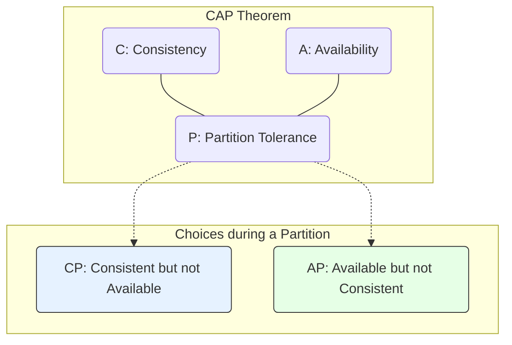

# The CAP Theorem

The **CAP theorem** is a fundamental principle in distributed systems design. While often summarized as "you can only pick two out of three," a more precise statement is: **in the presence of a network partition (P), a distributed system must choose between Consistency (C) and Availability (A).**

- **Consistency (C):** Every read receives the most recent write or an error. This ensures that all clients see the same data at the same time, regardless of which node they connect to. This is also known as **strong consistency** or linearizability.
- **[[availability-patterns|Availability]] (A):** Every request receives a (non-error) response, without the guarantee that it contains the most recent write. The system remains operational and responsive even if some nodes are down.
- **Partition Tolerance (P):** The system continues to operate despite an arbitrary number of messages being dropped (or delayed) by the network between nodes. In modern distributed systems, **partition tolerance is not a choice; it is a necessity.** Network failures will happen.

Therefore, the theorem forces a trade-off between C and A. When a network partition occurs, you must decide: do you cancel the operation to ensure consistency (making the system unavailable), or do you proceed with the operation and risk data inconsistency (keeping the system available)?

---

## The Two Main Choices: CP vs. AP

The choice between Consistency and Availability is a critical architectural decision based on an application's specific needs and business requirements.

### 1. CP-Oriented Systems (Consistency & Partition Tolerance)

**Goal:** To ensure [[data-integrity|data integrity]] and accuracy above all else.

**Behavior:** When a network partition occurs, these systems prioritize consistency. If a client attempts to write data, and the system cannot guarantee that all replicas will be updated and synchronized, it will block the operation and return an error. The system becomes temporarily unavailable for that transaction, but it prevents any data inconsistencies.

**Application Examples:**
* **Banking Systems:** Financial transactions require absolute accuracy. A bank cannot risk allowing a client to withdraw money if the system cannot verify the current, consistent balance across all nodes. In this scenario, it is better for the system to be temporarily unavailable than to make a financial error.
* **Ticket Reservation Systems:** It is impossible to sell the same concert seat to two different people. The system must guarantee that once a seat is sold, it is marked as unavailable to all other potential buyers, even if there's a network issue. The [[data-integrity|integrity]] of the data is more important than ensuring every single person can attempt a purchase at all times.

**Typical Databases:**
* **Relational Databases (SQL):** Most traditional [[rdbms|relational databases]] like PostgreSQL and MySQL are designed with a strong emphasis on **[[acid|ACID]]** (Atomicity, Consistency, Isolation, Durability) properties, making them CP-oriented by nature.
* **MongoDB:** While it's a flexible [[nosql|NoSQL database]] , its default replication architecture with a primary node often leads it to prioritize consistency. It can be configured for eventual consistency, but its standard setup leans towards CP.

---

### 2. AP-Oriented Systems (Availability & Partition Tolerance)

**Goal:** To ensure continuous operation and responsiveness, even at the cost of immediate data accuracy.

**Behavior:** When a network partition occurs, these systems prioritize availability. They continue to accept writes and reads, even if they cannot synchronize data across all nodes. This results in **"eventual consistency,"** meaning the data will eventually become consistent once the network partition is resolved.

**Application Examples:**
* **Social Media Feeds:** For a social media app, it's more important for the user to be able to "like" a photo immediately and receive a response than it is for the total like count to be instantly accurate for every single user worldwide. A temporary inconsistency is a small price to pay for uninterrupted service.
* **Messaging Apps:** For an instant messaging service, the key is for messages to be sent and received without delay. The system should continue to operate even if some servers are temporarily disconnected. Users accept that a message might take a few extra seconds to sync to all devices if it means the service is always available.

**Typical Databases:**
* **Cassandra:** A classic example of an AP-oriented database. It uses a **multi-master architecture** where all nodes can accept writes. This design ensures that the system remains highly available and scalable, with consistency being resolved later on.
* **Riak:** This key-value store was built from the ground up for high availability and partition tolerance, making it a prime example of an AP system. It can accept writes to any node at any time and resolves data conflicts later.

---

### The Theoretical Case: CA (Consistency & Availability)

A system that guarantees both consistency and availability is only possible if it **does not tolerate partitions**. This means it is a [[monolithic|single-node system]] where there is no risk of communication failure between different parts. If that single node fails, the entire system becomes unavailable. This is why the CA model is largely considered a theoretical impossibility for modern, distributed systems.

---

## Beyond CAP: The PACELC Theorem

A limitation of the CAP theorem is that it only describes the trade-off during a network partition. The **PACELC theorem**, proposed by Daniel Abadi, provides a more complete model. It states:

*   If there is a **P**artition, a system must choose between **A**vailability and **C**onsistency.
*   **E**lse (during normal operation), a system must choose between **L**atency and **C**onsistency.

The "Else" part is critical: even without a partition, a system often has to trade lower latency for weaker consistency. For example, to achieve strong consistency, a write operation may need to be replicated to multiple nodes and confirmed before returning a success message, which increases latency. An eventually consistent system can respond faster (lower latency) by writing to a single node and replicating in the background.

## **Resources & Links**

### **Articles**

1.  **[What is the CAP Theorem? A Practical Guide](https://www.hellointerview.com/learn/system-design/deep-dives/cap-theorem)**
    This article from Hello Interview is an excellent guide for understanding the CAP theorem in the context of system design interviews. It explains in detail the three properties (Consistency, Availability, Partition Tolerance) and how trade-offs impact system design, using concrete examples of technologies like DynamoDB and Google Spanner. It's a very practical resource for applying the theorem's theory.

2.  **[The CAP Theorem: Navigating the Trade-offs in Distributed Systems and Database Choices](https://roshancloudarchitect.me/the-cap-theorem-navigating-the-trade-offs-in-distributed-systems-and-database-choices-57a505be4a24)**
    This resource from Roshan Cloud Architect is very useful for understanding the trade-offs in distributed systems. It explores use cases for systems that prioritize consistency (like financial systems) or availability (like social networks), which helps to contextualize the CAP theorem in the real world. It also touches on PACELC, which is an extension of the CAP theorem.

***

### **Videos**

1.  **[What is the CAP Theorem?](https://www.youtube.com/watch?v=k-Yaq8AHlFA)**
    This video is an excellent tutorial that explains the CAP theorem using a simple example of a banking system with two ATMs. It defines consistency, availability, and partition tolerance and clearly shows the trade-off that must be made between consistency and availability in the event of a network failure.

2.  **[CAP Theorem Explained](https://www.youtube.com/watch?v=9SSvdLnmDiI)**
    In this video, Mark Richards from "Software Architecture Monday" explains the CAP theorem and its related trade-offs. He explains why partition tolerance is a necessity in distributed systems and focuses on the choices between "AP" (Availability & Partition Tolerance) and "CP" (Consistency & Partition Tolerance) architectures. The graphs and visual examples he uses are excellent for fully understanding the topic.