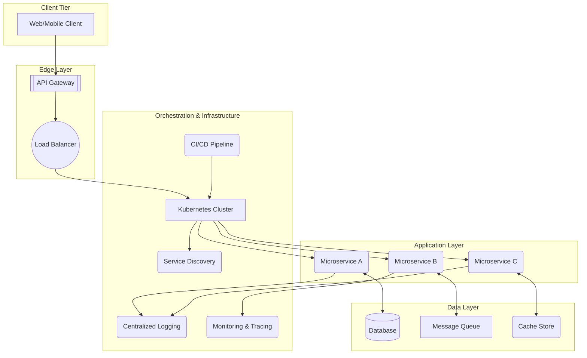

# Cloud-Native Principles

Cloud-native applications are designed and built to take full advantage of cloud computing environments. This approach emphasizes speed, agility, scalability, and resilience, enabling organizations to deliver new features rapidly and operate systems reliably at scale. Cloud-native architectures are not just about *where* applications are deployed, but *how* they are designed and built.

---

## Core Principles

Cloud-native applications adhere to a set of principles that guide their design and development:

*   **[[microservices|Microservices]] Architecture**: Applications are decomposed into small, independent, and loosely coupled services. Each service is built around a specific business capability and can be developed, deployed, and scaled independently. This promotes agility and fault isolation.
*   **Containerization**: Services are packaged into lightweight, portable, and self-sufficient containers (e.g., Docker). Containers encapsulate an application and its dependencies, ensuring consistent behavior across different environments.
*   **Orchestration**: Containerized services are managed and automated by orchestrators (e.g., Kubernetes). Orchestration platforms handle deployment, scaling, load balancing, and self-healing of microservices.
*   **[[twelve-factor-app|The Twelve-Factor App]] Methodology**: Cloud-native applications often follow the Twelve-Factor App principles, which provide guidelines for building robust, portable, and scalable applications, especially in distributed environments.
*   **[[devops|DevOps]] and Continuous Delivery**: Cloud-native development embraces DevOps practices, emphasizing automation, continuous integration (CI), and continuous delivery (CD). This enables rapid iteration, frequent deployments, and faster time-to-market.
*   **API-First Design**: Services expose well-defined APIs, promoting clear contracts and enabling seamless integration between services and with external consumers.
*   **[[event-driven|Event-Driven Architecture]]**: Many cloud-native applications leverage event-driven patterns for asynchronous communication between services, enhancing decoupling and responsiveness.
*   **[[observability|Observability]]**: Cloud-native systems are designed with observability in mind, incorporating comprehensive [[monitoring]], [[opentelemetry|tracing]], and logging to understand system behavior and troubleshoot issues in distributed environments.
*   **Automation**: Manual processes are minimized through extensive automation of infrastructure provisioning ([[iac|Infrastructure as Code]]), deployment, and operational tasks.

---

## Key Components and Communication Flow

A typical cloud-native application leverages several key components:

*Description: A cloud-native application architecture showing clients interacting via an API Gateway and Load Balancer with microservices deployed on a Kubernetes cluster. Services utilize various data stores and are supported by centralized logging, monitoring, and CI/CD pipelines.*

1.  **Clients**: Web, mobile, or desktop applications that consume the services.
2.  **[[api-gateway|API Gateway]]**: A single entry point for all client requests, handling routing, authentication, and rate limiting.
3.  **[[load-balancing|Load Balancer]]**: Distributes incoming traffic across multiple instances of services.
4.  **[[microservices|Microservices]]**: Independent, loosely coupled services that encapsulate specific business capabilities.
5.  **[[kubernetes|Container Orchestration (e.g., Kubernetes)]]**: Manages the deployment, scaling, and operation of containerized microservices.
6.  **[[service-discovery|Service Discovery]]**: Enables microservices to find and communicate with each other dynamically.
7.  **[[software-architecture/databases/|Databases]]**: Often a mix of [[rdbms|relational]] and [[nosql|NoSQL]] databases, chosen based on the specific needs of each microservice (polyglot persistence).
8.  **[[message-queue|Message Queues]] / [[publish-subscribe|Event Brokers]]**: Facilitate asynchronous communication and decoupling between services.
9.  **[[caching|Caching]]**: Used at various layers to improve performance and reduce load on backend services.
10. **[[observability|Observability]] (Logging, Monitoring, Tracing)**: Centralized systems for collecting and analyzing telemetry data to understand application behavior.
11. **[[ci-cd|CI/CD Pipelines]]**: Automate the build, test, and deployment processes.

---

## Advantages and Technical Challenges

### Advantages (Benefits)

*   **Agility and Speed**: Rapid development and deployment cycles due to independent services, automated processes, and small, focused teams.
*   **Scalability**: Services can be scaled independently and horizontally, allowing the application to handle fluctuating loads efficiently.
*   **[[reliability-engineering|Resilience]]**: Fault isolation ensures that a failure in one service does not bring down the entire application. Orchestration platforms provide self-healing capabilities.
*   **Flexibility and Innovation**: Teams can choose the best technology stack for each service, fostering innovation and avoiding technology lock-in.
*   **Cost Optimization**: Efficient resource utilization through containerization and orchestration, often combined with pay-as-you-go cloud models.

### Challenges

*   **Increased Complexity**: Distributed systems are inherently more complex to design, develop, test, and operate than monolithic applications.
*   **Operational Overhead**: Requires mature DevOps practices, robust automation, and specialized skills for managing container orchestrators, service meshes, and distributed tracing.
*   **Data [[consistency|Consistency]]**: Maintaining data consistency across multiple, independent databases in a microservices architecture is challenging and often leads to [[consistency#Eventual Consistency|eventual consistency]] models.
*   **Debugging and Troubleshooting**: Tracing requests across multiple services and identifying root causes of issues can be difficult without proper [[observability|observability]] tools.
*   **Network Latency**: Inter-service communication over the network introduces latency and potential reliability issues that must be carefully managed.

---

## Related Patterns, Concepts and Variations

Cloud-native applications are built upon and heavily leverage numerous architectural patterns and principles:

*   **[[microservices|Microservices Architecture]]**: The foundational architectural style for most cloud-native applications.
*   **[[twelve-factor-app|The Twelve-Factor App]]**: A set of principles for building SaaS applications that thrive in cloud environments.
*   **[[containerization|Containerization]] (Docker, Kubernetes)**: Essential technologies for packaging and orchestrating cloud-native services.
*   **[[serverless|Serverless Architecture]]**: An evolution of cloud-native where the cloud provider manages server infrastructure entirely.
*   **[[service-mesh|Service Mesh]]**: Provides a dedicated infrastructure layer for managing inter-service communication, security, and observability in microservices.
*   **[[api-gateway|API Gateway]]**: Acts as a single entry point for clients, abstracting backend service complexity.
*   **[[event-driven|Event-Driven Architecture]]**: A common communication paradigm for loosely coupled services.
*   **[[observability|Observability]]**: Critical for understanding and managing complex distributed systems.
*   **[[iac|Infrastructure as Code (IaC)]]**: Automates the provisioning and management of cloud resources.

---

## Resources & Links

### Articles

1.  **[What is Cloud Native? - Microsoft](https://learn.microsoft.com/en-us/dotnet/architecture/cloud-native/definition)**
    This article defines cloud-native architecture and technologies, emphasizing their role in building scalable applications that leverage cloud computing models. It covers key pillars like modern design, microservices, containers, backing services, and automation.

2.  **[Cloud Native Architecture: Principles, Pros, and Cons - Tigera](https://www.tigera.io/learn/guides/cloud-native-security/cloud-native-architecture/)**
    This guide explores cloud-native architecture, detailing its benefits like scalability and resilience, challenges such as security and dependencies, and core principles including microservices, containerization, and automation. It also touches upon security with Calico.

### Videos

1.  **[But What Is Cloud Native Really All About? - ByteByteGo](https://www.youtube.com/watch?v=p-88GN1WVs8)**
    Explore the evolving concept of "Cloud Native," comparing it to cloud computing. This ByteByteGo video examines its four pillars: microservices architecture, containers, DevOps practices, and open standards. Learn if a cloud-native approach suits your application.

2.  **[What is Cloud Native? - IBM Technology](https://www.youtube.com/watch?v=fp9_ubiKqFU)**
    This video, featuring Andrea Crawford, provides a quick overview of cloud-native applications. It explains that cloud-native applications are built from reusable microservices and are designed for integration into any cloud environment. The video highlights the benefits of this flexible and scalable approach for enterprises looking to improve existing applications, build new ones, and enhance user experience, ultimately driving innovation and speed.