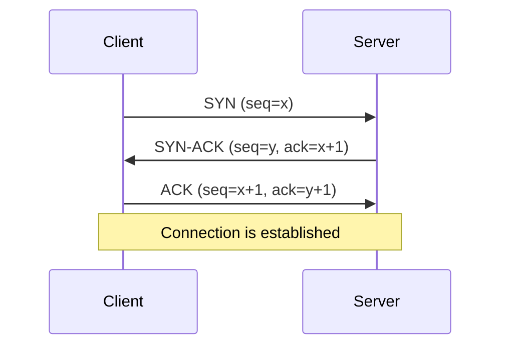

Network protocols are the foundational rules that govern how data is exchanged between computer systems. In modern system design, understanding these protocols is crucial, as nearly all systems are distributed and rely on communication over a network. They define the syntax, semantics, and synchronization of communication, ensuring that different systems can interact reliably and efficiently.

This document covers fundamental network protocols like TCP, UDP, and HTTP, as well as communication styles like RPC and its modern implementation, gRPC.

## Transmission Control Protocol (TCP)

TCP is a connection-oriented protocol that provides reliable, ordered, and error-checked delivery of a stream of bytes between applications running on hosts communicating over an IP network. It is the most common protocol used on the internet.

### Key Characteristics

- **Reliability**: TCP guarantees that data sent from one end of the connection will be received by the other end, intact and in the correct order. It uses a system of sequence numbers, acknowledgments (ACKs), and retransmissions to achieve this.
- **Connection-Oriented**: A connection must be established before any data can be sent. This is done through a three-way handshake (`SYN`, `SYN-ACK`, `ACK`). The connection is terminated with a similar handshake.
- **Ordered Data Transfer**: TCP ensures that data packets are delivered to the application layer in the same order they were sent.
- **Flow Control**: Prevents a fast sender from overwhelming a slow receiver. The receiver advertises a "window" size, indicating how much data it can buffer.
- **Congestion Control**: Manages network congestion by adjusting the rate at which data is sent.

### Three-Way Handshake

The TCP connection is established via a three-way handshake, which ensures both the client and server are ready to communicate.

*Description: The client sends a synchronization (SYN) packet. The server acknowledges it (SYN-ACK) and sends its own SYN. The client then sends a final acknowledgment (ACK).*

### Use Cases

TCP is ideal for applications where data integrity is critical and latency is a secondary concern.
- **Web Browsing**: Historically, and for HTTP/1.x and HTTP/2, [[#HyperText Transfer Protocol (HTTP)|HTTP]] runs on top of TCP to ensure web pages load completely. With HTTP/3, the underlying transport shifts to QUIC/UDP.
- **Email**: SMTP, POP3, and IMAP use TCP for reliable message delivery.
- **File Transfer**: FTP and SSH rely on TCP to ensure files are transferred without corruption.
- **[[software-architecture/databases/|Database Connections]]**: Ensuring that queries and results are transmitted without error.

## User Datagram Protocol (UDP)

UDP is a connectionless protocol that offers a simpler, more direct way to send data. It provides no guarantees of delivery, ordering, or error correction, making it much faster but less reliable than TCP.

### Key Characteristics

- **Connectionless**: No handshake is required. Packets (datagrams) are sent to the destination without establishing a connection first.
- **Unreliable**: There is no guarantee that datagrams will arrive, arrive in order, or arrive without errors.
- **Low Latency**: The absence of handshakes, acknowledgments, and retransmissions makes UDP very fast.
- **Broadcasting**: UDP supports sending datagrams to all devices on a subnet, a feature used by protocols like DHCP.

### Use Cases

UDP is suitable for applications where speed is more important than reliability, and where occasional data loss is acceptable.
- **Real-time Communication**: VoIP, video conferencing, and online gaming. Late data is often useless in these scenarios.
- **Streaming**: Live video and audio streaming.
- **[[dns|DNS]]**: DNS queries are typically small and use UDP for fast lookups.
- **Monitoring**: Sending metrics or logs where losing a few data points is not critical.

### TCP vs. UDP

| Feature                | TCP                                      | UDP                                    |
| ---------------------- | ---------------------------------------- | -------------------------------------- |
| **Reliability**        | High (guaranteed delivery and order)   | Low (no guarantees)                    |
| **Connection**         | Connection-oriented (three-way handshake)| Connectionless                         |
| **Speed**              | Slower (due to overhead)                 | Faster (minimal overhead)              |
| **Header Size**        | 20 bytes                                 | 8 bytes                                |
| **Use Cases**          | Web, Email, File Transfer                | Streaming, Gaming, DNS, VoIP           |

## HyperText Transfer Protocol (HTTP)

HTTP is an application-layer protocol for transmitting hypermedia documents, such as HTML. It is designed for communication between web browsers and web servers, but it can also be used for other purposes. HTTP is the foundation of data communication for the World Wide Web.

### HTTP Message Structure
An HTTP message is a textual, formatted block of data. As shown below, both requests and responses share a similar structure, composed of four main parts:

*Image credit: [Mozilla Developer Network](https://developer.mozilla.org/en-US/docs/Web/HTTP/Guides/Messages)*

-   **Start Line**: The first line. For a request, it contains the HTTP method, the target resource path, and the HTTP version. For a response, it contains the HTTP version, a status code, and a status message.
-   **Headers**: A series of key-value pairs that provide metadata about the message, such as the content type, length, or caching policy.
-   **Empty Line**: A single blank line (CRLF) that serves as a mandatory separator between the headers and the body.
-   **Body**: An optional block of data that contains the message payload. It is used in requests like `POST` to send data to the server, and in responses to transmit the requested resource (e.g., an HTML page or JSON data).

### Key Characteristics

- **Request-Response Model**: Communication follows a strict request-response pattern. The client sends a request, and the server sends a response.
- **Stateless**: Each request from a client to a server is treated as an independent transaction. The server does not store any state about the client between requests. (State can be managed using cookies or sessions).
- **Extensible**: Custom headers can be added to requests and responses to extend its functionality.

### Common HTTP Methods

| Verb   | Description                   | Idempotent* | Safe** | Cacheable                               |
|--------|-------------------------------|-------------|--------|-----------------------------------------|
| GET    | Reads a resource              | Yes         | Yes    | Yes                                     |
| POST   | Creates a resource or triggers an action | No          | No     | Yes if response contains freshness info |
| PUT    | Creates or replaces a resource | Yes         | No     | No                                      |
| PATCH  | Partially updates a resource  | No          | No     | Yes if response contains freshness info |
| DELETE | Deletes a resource            | Yes         | No     | No                                      |

_*An operation is **idempotent** if making the same request multiple times produces the same result as making it once._
_**A **safe** method is one that does not alter the state of the server._

### Evolution: HTTP/2 and HTTP/3
- **HTTP/1.1**: This version, like HTTP/2, relies on [[#Transmission Control Protocol (TCP)|TCP]] for its transport layer. It suffers from head-of-line blocking, where a slow request can block all subsequent requests on the same TCP connection.
- **HTTP/2**: Also built on [[#Transmission Control Protocol (TCP)|TCP]], HTTP/2 introduces multiplexing, allowing multiple requests and responses to be sent concurrently over a single TCP connection. It also adds header compression (HPACK) to reduce overhead, addressing some of HTTP/1.1's performance limitations while retaining TCP's reliability.
- **HTTP/3**: This is a significant evolution as it fundamentally changes the transport layer. HTTP/3 uses QUIC (Quick UDP Internet Connections), a new transport protocol that runs on top of [[#User Datagram Protocol (UDP)|UDP]]. While UDP itself is unreliable, QUIC re-implements the reliability features of TCP (like acknowledgements and retransmissions) at the application layer. This approach provides the reliability of TCP while avoiding transport-layer head-of-line blocking, as a lost packet only affects the specific stream it belongs to, not the entire connection, leading to improved performance and reduced latency, especially on unreliable networks.
## Resources & Links

The following resources provide more detailed information on the communication protocols discussed in this document.

### Articles

1.  **[Everything you need to know about HTTP](https://cs.fyi/guide/http-in-depth)**
    An in-depth guide covering the evolution of HTTP, from its early versions to HTTP/2, and explaining core concepts like multiplexing, header compression, and security improvements.

2.  **[Transmission Control Protocol (TCP)](https://www.geeksforgeeks.org/computer-networks/what-is-transmission-control-protocol-tcp/)**
    A GeeksforGeeks article detailing TCP as a reliable, connection-oriented protocol, explaining its features, working mechanism, and its advantages and disadvantages.

3.  **[What is User Datagram Protocol (UDP)?](https://www.cloudflare.com/learning/ddos/glossary/user-datagram-protocol-udp/)**
    A Cloudflare article that defines UDP, explaining its use in time-sensitive applications where speed is prioritized over reliability, such as DNS, VoIP, and online gaming.
