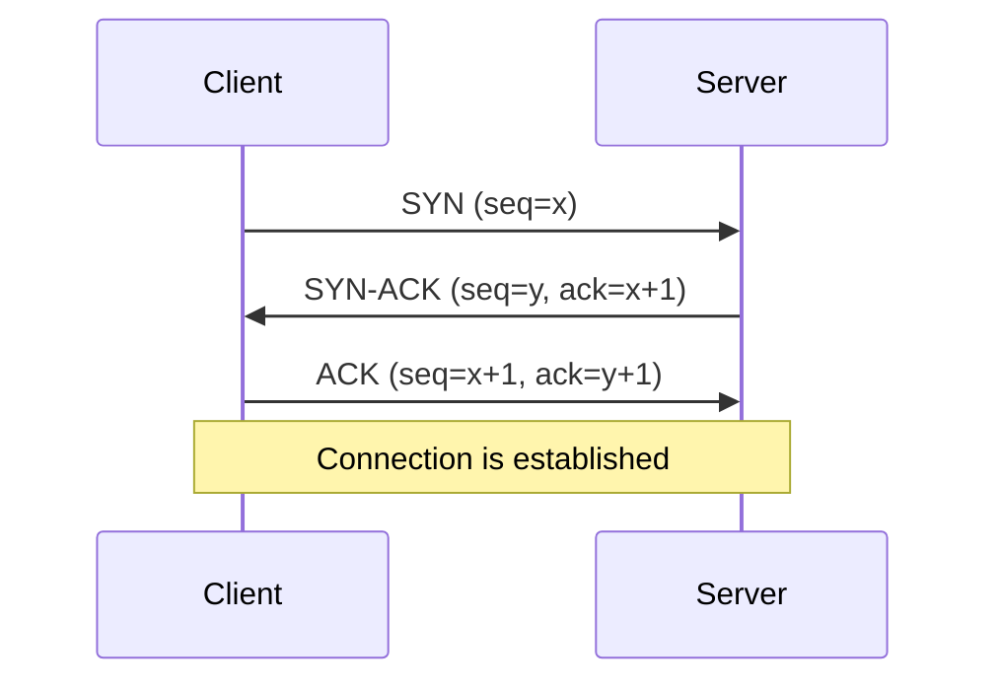
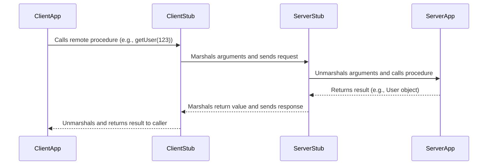
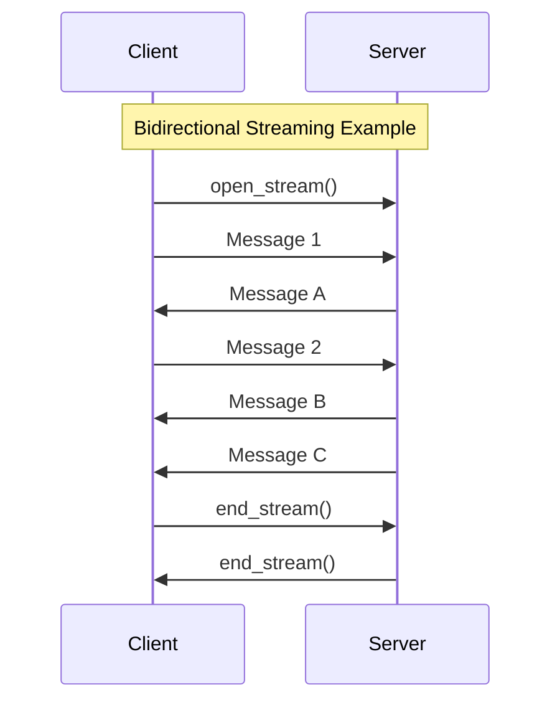

Network protocols are the foundational rules that govern how data is exchanged between computer systems. In modern system design, understanding these protocols is crucial, as nearly all systems are distributed and rely on communication over a network. They define the syntax, semantics, and synchronization of communication, ensuring that different systems can interact reliably and efficiently.

This document covers fundamental network protocols like TCP, UDP, and HTTP, as well as communication styles like RPC and its modern implementation, gRPC.

## Transmission Control Protocol (TCP)

TCP is a connection-oriented protocol that provides reliable, ordered, and error-checked delivery of a stream of bytes between applications running on hosts communicating over an IP network. It is the most common protocol used on the internet.

### Key Characteristics

- **Reliability**: TCP guarantees that data sent from one end of the connection will be received by the other end, intact and in the correct order. It uses a system of sequence numbers, acknowledgments (ACKs), and retransmissions to achieve this.
- **Connection-Oriented**: A connection must be established before any data can be sent. This is done through a three-way handshake (`SYN`, `SYN-ACK`, `ACK`). The connection is terminated with a similar handshake.
- **Ordered Data Transfer**: TCP ensures that data packets are delivered to the application layer in the same order they were sent.
- **Flow Control**: Prevents a fast sender from overwhelming a slow receiver. The receiver advertises a "window" size, indicating how much data it can buffer.
- **Congestion Control**: Manages network congestion by adjusting the rate at which data is sent.

### Three-Way Handshake

The TCP connection is established via a three-way handshake, which ensures both the client and server are ready to communicate.


*Description: The client sends a synchronization (SYN) packet. The server acknowledges it (SYN-ACK) and sends its own SYN. The client then sends a final acknowledgment (ACK).*

### Use Cases

TCP is ideal for applications where data integrity is critical and latency is a secondary concern.
- **Web Browsing**: [[#HyperText Transfer Protocol (HTTP)|HTTP]] runs on top of TCP to ensure web pages load completely.
- **Email**: SMTP, POP3, and IMAP use TCP for reliable message delivery.
- **File Transfer**: FTP and SSH rely on TCP to ensure files are transferred without corruption.
- **[[software-architecture/databases/|Database Connections]]**: Ensuring that queries and results are transmitted without error.

## User Datagram Protocol (UDP)

UDP is a connectionless protocol that offers a simpler, more direct way to send data. It provides no guarantees of delivery, ordering, or error correction, making it much faster but less reliable than TCP.

### Key Characteristics

- **Connectionless**: No handshake is required. Packets (datagrams) are sent to the destination without establishing a connection first.
- **Unreliable**: There is no guarantee that datagrams will arrive, arrive in order, or arrive without errors.
- **Low Latency**: The absence of handshakes, acknowledgments, and retransmissions makes UDP very fast.
- **Broadcasting**: UDP supports sending datagrams to all devices on a subnet, a feature used by protocols like DHCP.

### Use Cases

UDP is suitable for applications where speed is more important than reliability, and where occasional data loss is acceptable.
- **Real-time Communication**: VoIP, video conferencing, and online gaming. Late data is often useless in these scenarios.
- **Streaming**: Live video and audio streaming.
- **[[dns|DNS]]**: DNS queries are typically small and use UDP for fast lookups.
- **Monitoring**: Sending metrics or logs where losing a few data points is not critical.

### TCP vs. UDP

| Feature                | TCP                                      | UDP                                    |
| ---------------------- | ---------------------------------------- | -------------------------------------- |
| **Reliability**        | High (guaranteed delivery and order)   | Low (no guarantees)                    |
| **Connection**         | Connection-oriented (three-way handshake)| Connectionless                         |
| **Speed**              | Slower (due to overhead)                 | Faster (minimal overhead)              |
| **Header Size**        | 20 bytes                                 | 8 bytes                                |
| **Use Cases**          | Web, Email, File Transfer                | Streaming, Gaming, DNS, VoIP           |

## HyperText Transfer Protocol (HTTP)

HTTP is an application-layer protocol for transmitting hypermedia documents, such as HTML. It is designed for communication between web browsers and web servers, but it can also be used for other purposes. HTTP is the foundation of data communication for the World Wide Web.

### HTTP Message Structure
An HTTP message is a textual, formatted block of data. As shown below, both requests and responses share a similar structure, composed of four main parts:


*Image credit: [Mozilla Developer Network](https://developer.mozilla.org/en-US/docs/Web/HTTP/Guides/Messages)*

-   **Start Line**: The first line. For a request, it contains the HTTP method, the target resource path, and the HTTP version. For a response, it contains the HTTP version, a status code, and a status message.
-   **Headers**: A series of key-value pairs that provide metadata about the message, such as the content type, length, or caching policy.
-   **Empty Line**: A single blank line (CRLF) that serves as a mandatory separator between the headers and the body.
-   **Body**: An optional block of data that contains the message payload. It is used in requests like `POST` to send data to the server, and in responses to transmit the requested resource (e.g., an HTML page or JSON data).

### Key Characteristics

- **Request-Response Model**: Communication follows a strict request-response pattern. The client sends a request, and the server sends a response.
- **Stateless**: Each request from a client to a server is treated as an independent transaction. The server does not store any state about the client between requests. (State can be managed using cookies or sessions).
- **Extensible**: Custom headers can be added to requests and responses to extend its functionality.

### Common HTTP Methods

| Verb   | Description                   | Idempotent* | Safe** | Cacheable                               |
|--------|-------------------------------|-------------|--------|-----------------------------------------|
| GET    | Reads a resource              | Yes         | Yes    | Yes                                     |
| POST   | Creates a resource or triggers an action | No          | No     | Yes if response contains freshness info |
| PUT    | Creates or replaces a resource | Yes         | No     | No                                      |
| PATCH  | Partially updates a resource  | No          | No     | Yes if response contains freshness info |
| DELETE | Deletes a resource            | Yes         | No     | No                                      |

_*An operation is **idempotent** if making the same request multiple times produces the same result as making it once._
_**A **safe** method is one that does not alter the state of the server._

### Evolution: HTTP/2 and HTTP/3
- **HTTP/1.1**: Suffers from head-of-line blocking, where a slow request can block all subsequent requests on the same [[#Transmission Control Protocol (TCP)|TCP]] connection.
- **HTTP/2**: Introduces multiplexing, allowing multiple requests and responses to be sent concurrently over a single [[#Transmission Control Protocol (TCP)|TCP]] connection. It also adds header compression (HPACK) to reduce overhead.
- **HTTP/3**: Uses QUIC (Quick UDP Internet Connections), a new transport protocol that runs on top of [[#User Datagram Protocol (UDP)|UDP]]. While UDP itself is unreliable, QUIC re-implements the reliability features of TCP (like acknowledgements and retransmissions) at the application layer. This approach provides the reliability of TCP while avoiding transport-layer head-of-line blocking, as a lost packet only affects the specific stream it belongs to, not the entire connection.

## Remote Procedure Call (RPC)

RPC is a communication style where a client executes a procedure on a remote server as if it were a local call. It abstracts the network communication, making distributed computing feel more like a traditional, single-process application.

### How it Works: Stubs and Marshalling

The core idea is to use a "stub" on the client side that mirrors the remote procedure. When the client calls the stub, it handles the process of **marshalling** (serializing) the arguments into a message, sending them to the server, awaiting the response, and **unmarshalling** (deserializing) the return value.


*Description: The client application makes a simple method call. Stubs on both the client and server handle the complexity of network communication.*

Popular RPC frameworks include **[[#gRPC]]**, **Apache Thrift**, and **Apache Avro**.

### Advantages
- **Simplicity**: For internal, action-oriented APIs, defining a function and calling it can be simpler and more direct than designing a resource-based RESTful interface.
- **Performance**: RPC frameworks often use efficient binary serialization formats and can be highly optimized for low-latency, high-throughput communication between internal services.

### Disadvantages

- **[[cohesion-coupling|Tight Coupling]]**: The client and server are tightly coupled. A change in the server-side procedure signature often requires the client to be updated.
- **Discovery**: Discovering what procedures are available can be difficult without a shared interface definition file (like a `.proto` file in [[#gRPC]]).
- **Caching Complexity**: Caching is not natively supported by standard web infrastructure. See [[#Caching Challenges for RPC-Based Communication]] for details.

## gRPC

gRPC is a modern, high-performance, open-source RPC framework developed by Google. It uses **Protocol Buffers (Protobuf)** as its interface definition language (IDL) and data serialization format, and it is built on top of [[#Evolution: HTTP/2 and HTTP/3|HTTP/2]].

### Advantages
- **High Performance**: Achieved through binary serialization with Protobuf and multiplexing over HTTP/2, making it significantly faster than text-based protocols like JSON.
- **Streaming**: Natively supports unary, client-streaming, server-streaming, and bi-directional streaming, enabling more complex and efficient communication patterns.
- **Strong Typing**: Service contracts defined in `.proto` files generate strongly-typed client and server code, reducing runtime errors and improving developer productivity.
- **Language Agnostic**: A wide range of officially supported and community-supported languages.

### Disadvantages
- **Contract Coupling**: While the `.proto` contract file solves discovery, it still creates a form of tight coupling. Both client and server are bound to the exact service and message definitions. Any change to the contract requires regenerating client code, which is less flexible than the looser coupling of REST APIs.
- **Caching Complexity**: Like other RPC frameworks, caching is not natively supported by standard web infrastructure. See [[#Caching Challenges for RPC-Based Communication]] for details.
- **Less Human-Readable**: The use of the binary Protobuf format makes it difficult to debug and inspect messages using standard text-based tools like `curl` or browser developer tools. Specialized tools (like `grpcurl`) are required.
- **Steeper Learning Curve**: For teams accustomed to REST and JSON, adopting gRPC, Protocol Buffers, and the associated tooling can require a significant initial learning investment.

### Protocol Buffers (Protobuf)
At the core of gRPC is the `.proto` file, which defines the services and message types. This file acts as a contract between the client and server.

**Example `user_service.proto`:**
```protobuf
syntax = "proto3";

service UserService {
  // A simple RPC
  rpc GetUser(UserRequest) returns (UserResponse);

  // A server-to-client streaming RPC
  rpc ListUsers(Empty) returns (stream UserResponse);
}

message UserRequest {
  int32 id = 1;
}

message UserResponse {
  int32 id = 1;
  string name = 2;
  string email = 3;
}

message Empty {}
```
From this file, gRPC tools can generate strongly-typed client and server code in various languages.

### Key Features & Communication Types

gRPC leverages [[#Evolution: HTTP/2 and HTTP/3|HTTP/2]] to support four types of communication:

1.  **Unary RPC**: The client sends a single request and gets a single response, just like a traditional RPC call.
2.  **Server Streaming RPC**: The client sends a single request and gets a stream of messages back from the server.
3.  **Client Streaming RPC**: The client sends a stream of messages to the server and gets a single response back.
4.  **Bidirectional Streaming RPC**: Both the client and server send a stream of messages to each other over a single connection.



gRPC is commonly used for high-performance communication between internal [[microservices]]. It is a powerful evolution of the traditional [[#Remote Procedure Call (RPC)|RPC]] pattern, addressing many of its original drawbacks by providing streaming, strong typing, and high efficiency.

## Caching Challenges for RPC-Based Communication

Unlike [[rest|RESTful APIs]] which benefit from standardized HTTP semantics, RPC-based communication (including frameworks like [[#gRPC]], Apache Thrift, and Avro) presents unique caching challenges. Standard infrastructure like public CDNs, browser caches, and generic reverse proxies cannot inspect or cache RPC calls out-of-the-box.

This is due to two main factors:
1.  **Non-Uniform Interfaces**: RPC calls don't use a uniform set of methods (like GET, POST) or resource paths (URLs) that a cache can easily understand.
2.  **Binary Protocols**: Many RPC frameworks use binary serialization formats (like Protobuf) that are opaque to intermediaries that expect plain text HTTP.

To overcome this, several strategies can be employed:
- **Client-Side Caching**: The client application itself implements logic to store and reuse responses, preventing redundant network calls for identical requests.
- **Proxy Caching**: A specialized intermediary proxy (e.g., Envoy) that is built to understand the specific RPC protocol (like gRPC) can be used. It terminates the call, inspects the payload, and serves a cached response when appropriate.
- **Data-Layer Caching**: A common and often simpler approach is to cache the underlying data that the service retrieves, rather than the RPC call itself. The service can use a distributed cache (e.g., Redis, Memcached) to store frequently accessed data, which speeds up responses without needing to intercept the RPC call.

## Resources & Links

The following resources provide more detailed information on the communication protocols discussed in this document.

### Articles

1.  **[Everything you need to know about HTTP](https://cs.fyi/guide/http-in-depth)**
    An in-depth guide covering the evolution of HTTP, from its early versions to HTTP/2, and explaining core concepts like multiplexing, header compression, and security improvements.

2.  **[Transmission Control Protocol (TCP)](https://www.geeksforgeeks.org/computer-networks/what-is-transmission-control-protocol-tcp/)**
    A GeeksforGeeks article detailing TCP as a reliable, connection-oriented protocol, explaining its features, working mechanism, and its advantages and disadvantages.

3.  **[What is User Datagram Protocol (UDP)?](https://www.cloudflare.com/learning/ddos/glossary/user-datagram-protocol-udp/)**
    A Cloudflare article that defines UDP, explaining its use in time-sensitive applications where speed is prioritized over reliability, such as DNS, VoIP, and online gaming.

4.  **[Communication Protocols For RPCs](https://www.geeksforgeeks.org/computer-networks/communication-protocols-for-rpcs/)**
    This article details the underlying communication protocols for RPCs, including the Request (R), Request/Reply (RR), and Request/Reply/Acknowledgement-Reply (RRA) protocols.

5.  **[What is gRPC?](https://www.wallarm.com/what/the-concept-of-grpc)**
    An overview of gRPC as a high-performance RPC framework, discussing its architecture based on HTTP/2 and Protocol Buffers, its advantages, and its limitations.
