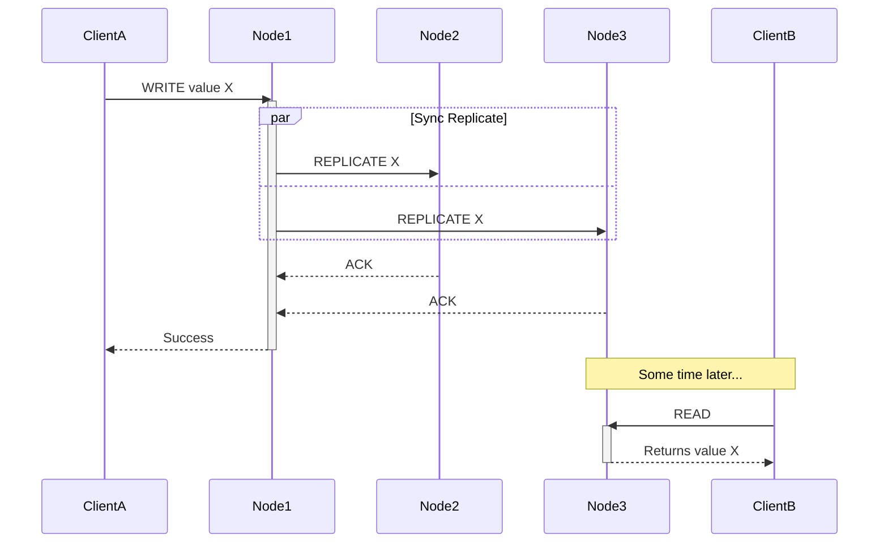
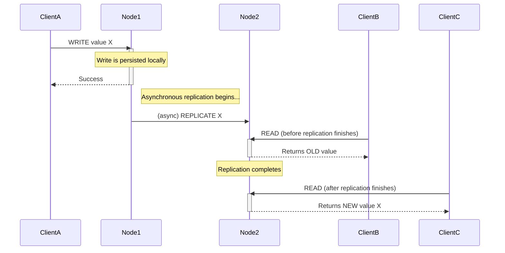

# Consistency Patterns

In a distributed system, consistency refers to the guarantee that all clients see the same data at the same time, regardless of which node they connect to. Maintaining consistency is a critical challenge because data is replicated across multiple nodes that are separated by a network.

A consistency model is a contract between a datastore and the applications that use it. It defines the rules for how and when updates become visible to readers. The choice of a consistency model is a fundamental trade-off, often balancing data integrity against performance, latency, and availability, as famously described in the [[cap|CAP Theorem]].

Consistency is not a binary choice but a spectrum, with the most common models being Strong, Eventual, and Weak consistency.

---

## Strong Consistency

Strong consistency is the strictest and most intuitive model. It guarantees that after a write operation completes, any subsequent read operation—from any client on any node—will return that new value.

This model provides a **linearizable** view of data, meaning the system behaves as if there is only a single, up-to-date copy of the data.

### How It Works

To achieve strong consistency, write operations must be synchronously replicated to all necessary replicas *before* the success confirmation is sent back to the client. This is often implemented using consensus algorithms or protocols like Two-Phase Commit (2PC).

*Description: The system waits for all replicas to acknowledge the write before confirming success to the client, ensuring any future read will see the new data.*

### Use Cases & Examples

*   **Pros:** Simplifies application development as data is always predictable and correct.
*   **Cons:** High write latency (due to synchronous replication) and lower availability (writes can fail if a replica is down, forcing a CP trade-off).
*   **Examples:**
    *   **Technologies:** Relational databases (PostgreSQL, MySQL) in default configurations; CP-oriented distributed databases like Google Spanner, CockroachDB.
    *   **Use Cases:** Financial transaction systems, e-commerce inventory management, and any system where data accuracy is paramount.

---

## Eventual Consistency

Eventual consistency is a widely adopted model for large-scale distributed systems. It is a specific form of weak consistency that guarantees that, *if no new updates are made to a given data item*, all replicas will eventually converge to the same value.

It prioritizes availability and low latency over immediate consistency, making it a key enabler for AP systems as described in the [[cap|CAP Theorem]].

### How It Works

Updates are applied to a local replica first, and the success confirmation is returned to the client immediately. The data is then replicated to other nodes asynchronously in the background.

*Description: The write is confirmed quickly. For a short period (the "inconsistency window"), reads from different nodes may return different values until replication is complete.*

### Use Cases & Examples

*   **Pros:** High availability and very low write latency.
*   **Cons:** More complex for developers, who must account for reading stale data. Can lead to a confusing user experience if not handled carefully.
*   **Examples:**
    *   **Technologies:** NoSQL databases like Cassandra, Riak, and Amazon DynamoDB are built on this principle. DNS (Domain Name System) is a classic example.
    *   **Architectures:** [[event-driven|Event-Driven Architectures]] and systems using asynchronous replication.
    *   **Use Cases:** Social media feeds (likes, comments), content delivery networks (CDNs), and other systems where high availability is more critical than immediate, perfect consistency.

---

## Weak Consistency

Weak consistency is the most relaxed model and forms a general category that includes eventual consistency. In a weakly consistent system, after a write, there is no guarantee of when subsequent reads will see that new value. The system gives no promises about the time it will take for replicas to converge.

While eventual consistency provides the useful guarantee of *eventual* convergence, pure weak consistency does not. For this reason, most practical systems that choose an AP path opt for the more predictable model of eventual consistency.

### Use Cases & Examples

*   **Pros:** Extremely low latency and high availability.
*   **Cons:** Very difficult for developers to work with due to the lack of guarantees.
*   **Examples:**
    *   **Use Cases:** Real-time communication tools like VoIP or live video streaming, where dropping a packet (losing an update) is acceptable and doesn't break the overall experience. Some caching systems where stale data is not critical might also fall into this category.

---

## Resources & Links

### Articles

1.  **[Consistency Patterns](https://www.geeksforgeeks.org/system-design/consistency-patterns/)**
    A comprehensive overview from GeeksforGeeks that details various consistency models, including strong, eventual, and weak consistency. It explores specific implementation patterns like Two-Phase Locking, Quorum, and Vector Clocks.

2.  **[Consistency Models in Distributed Systems](https://systemdesign.one/consistency-patterns/)**
    This article provides a clear breakdown of different consistency models and their relationship with the CAP theorem. It's a great resource for understanding the trade-offs between consistency, availability, and performance.

### Videos

1.  **[Data Consistency and Tradeoffs in Distributed Systems](https://www.youtube.com/watch?v=m4q7VkgDWrM)**
    This video offers a visual explanation of data consistency challenges and trade-offs in distributed systems, helping to clarify the practical implications of choosing a consistency model.
