# Domain Name System (DNS)

The Domain Name System (DNS) is a foundational component of the internet, often described as its "phonebook." Its primary function is to translate human-readable domain names (e.g., `www.example.com`) into machine-readable IP addresses (e.g., `93.184.216.34`) that computers use to connect to each other.

DNS is a globally distributed and hierarchical system, which makes it highly resilient and scalable. Without it, we would have to remember the IP addresses of all our favorite websites.

---

## How DNS Works: The Resolution Process

When you type a domain name into your browser, a multi-step process called DNS resolution occurs to find the corresponding IP address. This process typically involves several types of servers.

*Description: This diagram shows an iterative query process. The client asks its resolver, which then queries the hierarchy of DNS servers—from Root to TLD to Authoritative—to find the correct IP address.*

- **DNS Resolver (or Recursor):** Usually operated by your Internet Service Provider (ISP), this is the server that receives the initial query from the client. It's responsible for orchestrating the resolution process.
- **Root Name Server:** The first step in the resolution chain. There are 13 root server clusters worldwide that know where to find the Top-Level Domain (TLD) servers.
- **TLD Name Server:** Manages all domain names that share a common extension, such as `.com`, `.org`, or `.net`. It directs the resolver to the authoritative name server for the specific domain.
- **Authoritative Name Server:** The final authority. This server holds the actual DNS records for the specific domain and provides the IP address to the resolver.

### DNS Caching

To improve performance and reduce load on the DNS hierarchy, query results are [[caching|cached]] at various levels (browser, operating system, resolver). The duration for which a record is cached is determined by its **Time-To-Live (TTL)** value, which is set in the DNS record itself.

---

## Common DNS Record Types

DNS servers store different types of records to provide various services.

- **A Record (Address):** The most common type. It maps a domain name to an IPv4 address.
- **AAAA Record:** Maps a domain name to an IPv6 address.
- **CNAME (Canonical Name): Privilege Escalation** Acts as an alias, pointing a domain name to another domain name. For example, `ftp.example.com` could be a CNAME pointing to `example.com`.
- **MX (Mail Exchange):** Specifies the mail servers responsible for accepting email messages on behalf of a domain.
- **NS (Name Server):** Delegates a domain or subdomain to a set of authoritative name servers.

---

## DNS as a Load Balancer: Use Cases and Limitations

Beyond simple name-to-IP translation, DNS can be used as the first layer of [[load-balancing|Load Balancing]], particularly for distributing traffic across different geographic regions. This is known as **Global Server Load Balancing (GSLB)**. However, it is not a replacement for dedicated [[load-balancing|load balancers]].

This is configured at your DNS provider (e.g., AWS Route 53, Cloudflare) and is typically managed by an infrastructure or DevOps team.

```mermaid
graph TD
    User --> DNS[DNS acting as GSLB];
    subgraph "Internet"
        DNS;
    end

    subgraph "US-EAST Region"
        LB_US[Local LB - US];
        S1_US[Server 1];
        S2_US[Server 2];
        LB_US --> S1_US;
        LB_US --> S2_US;
    end

    subgraph "EU-WEST Region"
        LB_EU[Local LB - EU];
        S1_EU[Server 1];
        S2_EU[Server 2];
        LB_EU --> S1_EU;
        LB_EU --> S2_EU;
    end

    DNS -- "Geolocation Routing" --> LB_EU;
    User -- "Connects to EU" --> LB_EU;

    style DNS fill:#f9f,stroke:#333,stroke-width:2px
    style LB_EU fill:#bbf,stroke:#333,stroke-width:2px
```

*Description: The DNS, acting as a Global Server Load Balancer (GSLB), directs the user to the nearest regional entry point (the Local LB). The Local Load Balancer for that region then takes over to distribute traffic among the individual servers.*

### Why Dedicated Load Balancers Are Still Necessary

DNS-based load balancing has critical limitations that dedicated [[load-balancing|load balancers]] solve:

| Feature | DNS Load Balancing | Dedicated Load Balancer (ELB, Nginx) |
| :--- | :--- | :--- |
| **Level** | Global (directs to a region/DC) | Local (directs to a server) |
| **Health Checks** | Limited or none | Granular and immediate |
| **Reaction Time**| Slow (due to TTL/caching) | Instant |
| **Awareness** | Protocol-agnostic (IP level) | Layer 4/7 aware (TCP/HTTP) |
| **Primary Use** | Global traffic distribution | Balancing load across servers in a cluster |

1.  **No Health Awareness:** A standard DNS server doesn't know if a server at an IP address is healthy. If it returns the IP of a dead server, the user gets an error. A dedicated load balancer constantly runs health checks and instantly removes failed servers from its routing pool.
2.  **Caching and Slow Propagation:** DNS responses are heavily [[caching|cached]]. If you need to take a server out of rotation, the change can take minutes or hours to propagate due to TTL. A dedicated load balancer can react instantly.
3.  **Coarse-Grained Control:** DNS is best for coarse, global routing (e.g., sending European users to the EU datacenter). It is not suited for finely balancing traffic between dozens of servers within that datacenter—that is the job of a dedicated load balancer.
4.  **No Application-Layer Awareness:** DNS knows nothing about application load, HTTP sessions, or request content. A Layer 7 load balancer can make intelligent routing decisions based on cookies, headers, or URL paths.

In summary, DNS is used for **global load balancing**, and a dedicated **[[load-balancing|Load Balancer]]** is used for **local [[load-balancing|load balancing]]**.

---

## Resources & links

### Articles

1.  **[What is DNS? | How DNS works | Cloudflare](https://www.cloudflare.com/learning/dns/what-is-dns/)**
    An excellent overview of the DNS resolution process, covering the different types of DNS servers, queries, and caching mechanisms.

2.  **[System Design Primer - Domain Name System](https://github.com/donnemartin/system-design-primer#domain-name-system)**
    A concise summary of DNS within the context of system design, listing common record types and advanced routing methods offered by managed DNS services.
