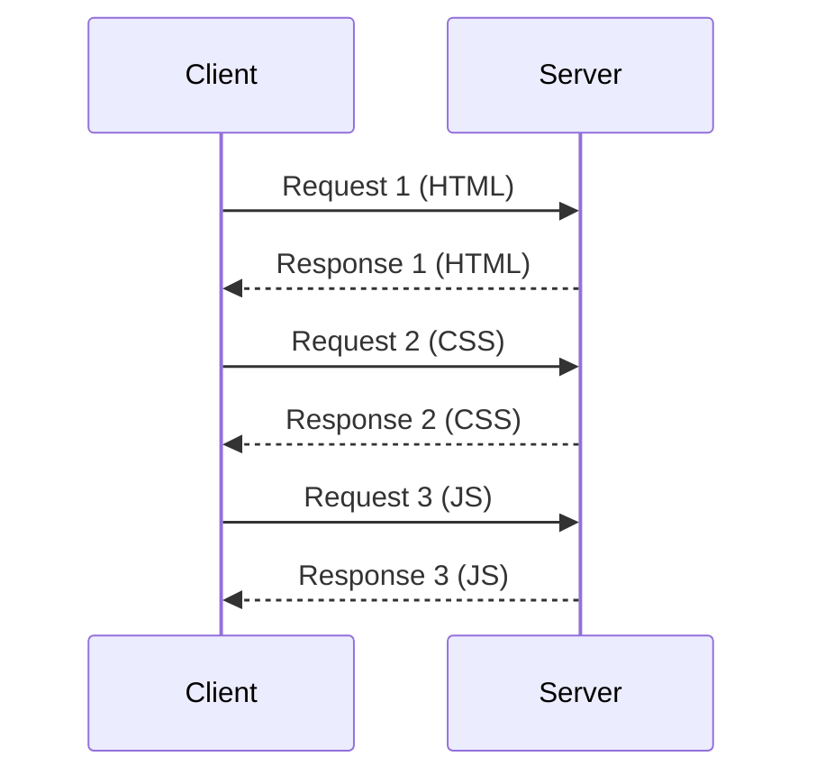
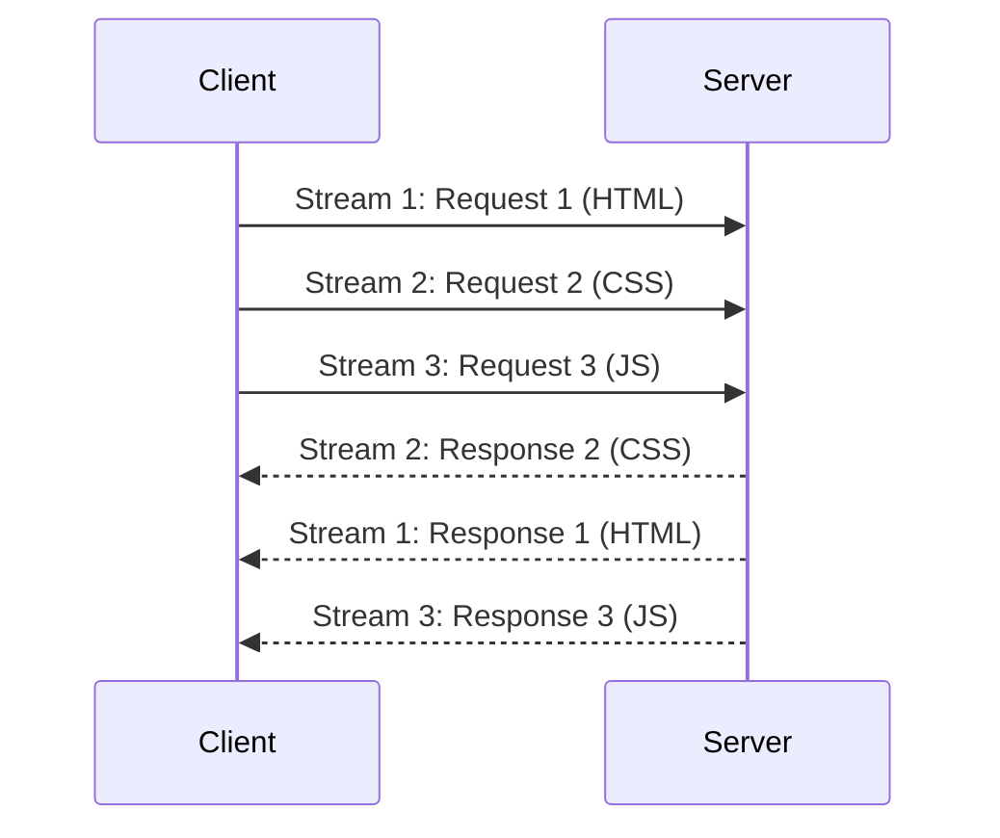
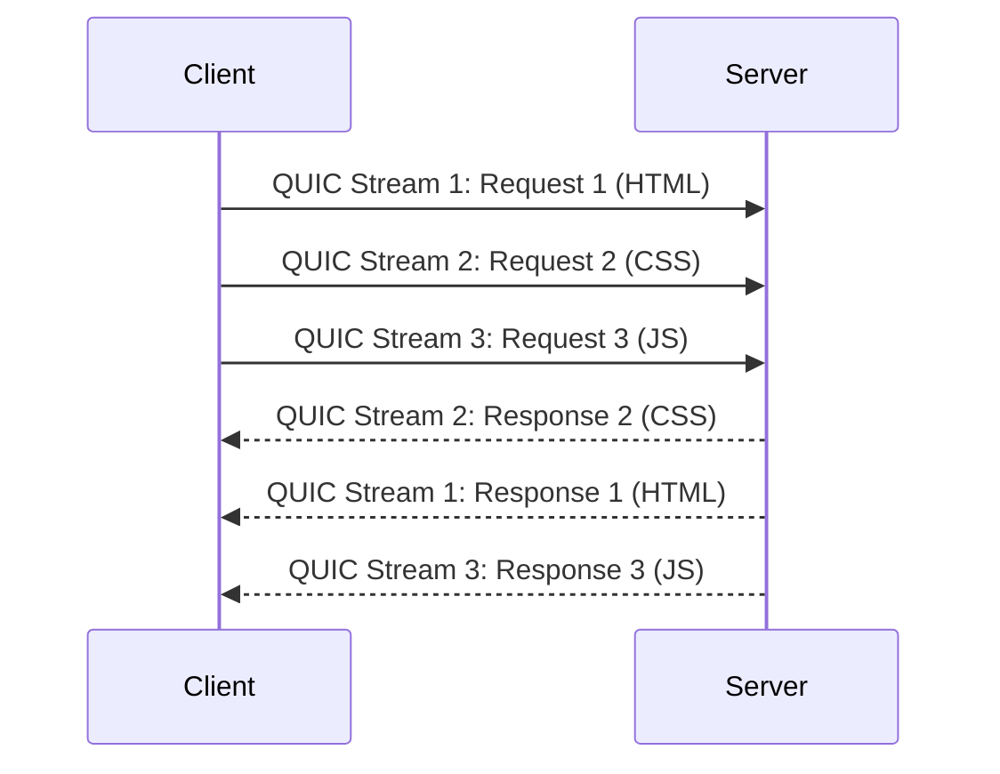

HTTP (Hypertext Transfer Protocol) is the application-layer protocol that serves as the foundation of data communication for the World Wide Web. It is a client-server protocol where requests are initiated by the recipient, usually a web browser or an API client. A complete document is reconstructed from the different sub-documents fetched, for instance, text, layout description, images, videos, scripts, and more.

Understanding HTTP is crucial in API design as it provides the structure for how requests and responses should be constructed and handled. It dictates how endpoints are defined, how data should be transferred, and what status codes should be used to convey specific scenarios. When secured with [[ssl-tls|TLS]], it is known as **HTTPS**.

## Key Characteristics

- **Request-Response Model**: Communication follows a strict request-response pattern. The client sends a request, and the server sends a response.
- **Stateless**: Each request from a client to a server is treated as an independent transaction. The server does not store any state about the client between requests. State can be managed on the client-side using [[#Cookies|cookies]] or on the server-side using sessions.
- **Extensible**: Custom headers and methods can be added to extend its functionality, which is a cornerstone of modern API design.

## HTTP Versions

The evolution of HTTP has significantly shaped how APIs are designed and interact. Each version has introduced crucial advancements in performance, security, and capabilities, directly influencing the efficiency and robustness of client-server communication. Notably, HTTP versions up to 2 primarily rely on [[communication-protocols#Transmission Control Protocol (TCP)|TCP]] for transport, whereas HTTP/3 marks a significant shift by utilizing [[communication-protocols#User Datagram Protocol (UDP)|UDP]]. Understanding these iterations, from the foundational HTTP/0.9 to the modern HTTP/3, is key for effective API development.

Each version of HTTP has brought improvements in performance, security, and capabilities.

-   **[[#HTTP/0.9]]**
-   **[[#HTTP/1.0]]**
-   **[[#HTTP/1.1]]**
-   **[[#HTTP/2]]**
-   **[[#HTTP/3]]**

### HTTP/0.9

The initial version, often referred to as "The One-Line Protocol," was extremely simple. Requests were a single line, starting with `GET` followed by the resource path. Responses consisted only of the file itself (e.g., HTML), with no HTTP headers, status codes, or error codes. Only HTML files could be transmitted.

### HTTP/1.0

This version introduced significant enhancements, including versioning information (`HTTP/1.0`) in requests and a status code line at the beginning of responses. It also brought in HTTP headers for both requests and responses, allowing metadata transmission like `Content-Type`, which enabled the transfer of documents other than plain HTML. Each request typically established a new TCP connection.

### HTTP/1.1

HTTP/1.1 became the standardized protocol, introducing persistent connections (Keep-Alive) to reuse a single TCP connection for multiple requests, reducing latency. It also supported pipelining (though often problematic in practice), chunked encoding for large data transfers, and advanced cache control mechanisms. Content negotiation and the `Host` header (enabling multiple domains on one IP) were also added. However, it still suffered from **Head-of-Line (HOL) blocking**, where a slow request could block all subsequent requests on the same TCP connection. Browsers often mitigated this by using multiple parallel TCP connections.

#### HTTP/1.1 Request-Response Model


*Description: In HTTP/1.1, requests are typically processed sequentially over a single connection, leading to Head-of-Line blocking if one request is slow.*

### HTTP/2

Based on Google's SPDY protocol, HTTP/2 was standardized in 2015 as a binary protocol, making it more efficient for parsing than its text-based predecessors. It introduced multiplexing, allowing multiple requests and responses to be sent concurrently over a single TCP connection, effectively eliminating application-layer Head-of-Line blocking. Header compression (HPACK) was also added to reduce overhead. While it solved application-layer HOL blocking, it remained vulnerable to transport-layer HOL blocking since it still runs on [[communication-protocols#Transmission Control Protocol (TCP)|TCP]].

#### HTTP/2 Request-Response Model


*Description: HTTP/2 uses multiplexing, allowing multiple requests and responses to be sent and received concurrently over a single TCP connection, mitigating Head-of-Line blocking at the application layer.*

### HTTP/3

A major evolution defined in RFC 9114, HTTP/3 uses **QUIC** (Quick UDP Internet Connections), a new transport protocol built on top of [[communication-protocols#User Datagram Protocol (UDP)|UDP]]. QUIC re-implements reliability features at the application layer, effectively eliminating transport-layer HOL blocking. This leads to significantly better performance, especially on unreliable networks, as packet loss in one stream does not block other streams. HTTP/3 maintains the same semantics as earlier HTTP versions but leverages QUIC for lower latency and improved efficiency.

#### HTTP/3 Request-Response Model


*Description: HTTP/3 uses QUIC, which provides stream multiplexing over UDP, eliminating Head-of-Line blocking at the transport layer and improving performance, especially on unreliable networks.*

## HTTP Message Structure

An HTTP message is a textual, formatted block of data. Both requests and responses share a similar structure, composed of four main parts:


*Image credit: [Mozilla Developer Network](https://developer.mozilla.org/en-US/docs/Web/HTTP/Guides/Messages)*

-   **Start Line**: The first line. For a request, it contains the HTTP method, the target resource path, and the HTTP version. For a response, it contains the HTTP version, a status code, and a status message.
-   **Headers**: A series of key-value pairs that provide metadata about the message, such as the content type, length, or caching policy.
-   **Empty Line**: A single blank line (CRLF) that serves as a mandatory separator between the headers and the body.
-   **Body**: An optional block of data that contains the message payload. It is used in requests like `POST` to send data to the server, and in responses to transmit the requested resource (e.g., an HTML page or JSON data).

### Example Request

```http
POST /api/users HTTP/1.1
Host: example.com
Content-Type: application/json
Content-Length: 54

{
  "username": "john_doe",
  "email": "john.doe@example.com"
}
```

### Example Response

```http
HTTP/1.1 201 Created
Content-Type: application/json
Location: /api/users/123

{
  "id": 123,
  "username": "john_doe"
}
```

## HTTP Methods

HTTP methods, often referred to as HTTP verbs, are fundamental to API design, dictating the intended action a client wishes to perform on a server resource. These methods establish the interaction framework between clients and servers, making their proper understanding crucial for building robust and effective APIs. Common methods like GET, POST, PUT, DELETE, and PATCH each signify distinct request types, enabling diverse and functional interactions with API endpoints.

| Verb   | Description                   | Idempotent* | Safe** | Cacheable                               |
|--------|-------------------------------|-------------|--------|-----------------------------------------|
| GET    | Reads a resource              | Yes         | Yes    | Yes                                     |
| POST   | Creates a resource or triggers an action | No          | No     | Yes if response contains freshness info |
| PUT    | Creates or replaces a resource | Yes         | No     | No                                      |
| PATCH  | Partially updates a resource  | No          | No     | Yes if response contains freshness info |
| DELETE | Deletes a resource            | Yes         | No     | No                                      |
| HEAD   | Asks for the headers of a GET request | Yes         | Yes    | Yes                                     |
| OPTIONS| Describes the communication options for the target resource | Yes | Yes | No                                      |

*An operation is **idempotent** if making the same request multiple times produces the same result as making it once. See [[idempotent-operations]].*
*A **safe** method is one that does not alter the state of the server.*

## HTTP Status Codes

HTTP Status Codes are crucial in API design, serving as concise 3-digit indicators of a server's response to a client's request. The first digit categorizes the response type (e.g., '2xx' for success, '4xx' for client errors), while the subsequent digits provide specific details. Effective utilization of these codes enhances an API's robustness, making interactions more transparent and debugging simpler.

They are grouped into five classes:

- **`1xx` (Informational)**: The request was received, continuing process.
- **`2xx` (Successful)**: The request was successfully received, understood, and accepted.
- **`3xx` (Redirection)**: Further action needs to be taken to complete the request.
- **`4xx` (Client Error)**: The request contains bad syntax or cannot be fulfilled.
- **`5xx` (Server Error)**: The server failed to fulfill an apparently valid request.

Proper use of status codes is essential for [[api-error-handling|API error handling]].

| Code | Name | Description |
|---|---|---|
| 200 | OK | The request succeeded. |
| 201 | Created | The request succeeded, and a new resource was created. |
| 202 | Accepted | The request has been accepted for processing, but the processing has not been completed. |
| 204 | No Content | The request succeeded, but there is no content to return. |
| 301 | Moved Permanently | The resource has been permanently moved to a new URL. |
| 304 | Not Modified | The resource has not been modified since the version specified by the request headers. |
| 400 | Bad Request | The server cannot process the request due to a client error (e.g., malformed syntax). |
| 401 | Unauthorized | The client must authenticate itself to get the requested response. |
| 403 | Forbidden | The client does not have access rights to the content. |
| 404 | Not Found | The server cannot find the requested resource. |
| 405 | Method Not Allowed | The request method is known by the server but has been disabled and cannot be used. |
| 409 | Conflict | The request could not be completed due to a conflict with the current state of the target resource. |
| 422 | Unprocessable Entity | The server understands the content type of the request entity, and the syntax of the request entity is correct, but it was unable to process the contained instructions. |
| 429 | Too Many Requests | The user has sent too many requests in a given amount of time ("rate limiting"). |
| 500 | Internal Server Error | The server has encountered a situation it doesn't know how to handle. |
| 501 | Not Implemented | The request method is not supported by the server and cannot be handled. |
| 503 | Service Unavailable | The server is not ready to handle the request (e.g., due to maintenance or overload). |

## HTTP Headers

HTTP Headers are key components in API design, acting as metadata carriers within HTTP requests and responses. They facilitate the exchange of crucial information between clients and servers, covering aspects like content type, authentication, caching instructions, and more. Effective use of these headers is fundamental for building robust, secure, and efficient APIs, ensuring smooth data flow and proper error handling.

| Header | Description |
|---|---|
| `Content-Type` | Specifies the media type of the resource being sent or expected (e.g., `application/json`, `text/html`). Crucial for both requests and responses. |
| `Accept` | Indicates the media types that the client can process and prefers to receive in the response. |
| `Authorization` | Carries authentication credentials (e.g., `Bearer <token>`, Basic Auth) from the client to authenticate with the server. |
| `Cache-Control` | Directives for caching mechanisms, controlling how and for how long responses can be stored and reused by clients or intermediate caches. |
| `Location` | Used in redirection responses (3xx status codes) to specify the new URL of a resource, or in `201 Created` responses to point to the newly created resource. |
| `User-Agent` | Identifies the client application, operating system, or browser making the request, useful for server-side analytics or content adaptation. |
| `Set-Cookie` | Sent by the server to the client to instruct the client to store a cookie, enabling stateful sessions over the stateless HTTP protocol. |
| `Cookie` | Sent by the client to the server, containing previously stored cookies to maintain session state or user preferences. |
| `WWW-Authenticate` | Included in `401 Unauthorized` responses by the server to indicate the authentication scheme(s) and parameters required for accessing the resource. |
| `Access-Control-Allow-Origin` | A Cross-Origin Resource Sharing (CORS) header sent by the server to specify which origins are permitted to access the resource. |

## Cookies

Cookies are small data fragments stored by a user's browser, essential for enabling stateful interactions over the stateless HTTP protocol in API design. They are primarily used for session management, such as maintaining user [[authentication]] and preferences across requests, and can also facilitate personalization and tracking.

When a server sends a response, it includes a `Set-Cookie` [[#HTTP Headers|header]]. The browser then stores this cookie and sends it back to the server with every subsequent request in a `Cookie` header.

Key attributes for secure and effective API cookie usage include:

-   **`Secure`**: Ensures the cookie is only transmitted over encrypted HTTPS connections, safeguarding against Man-in-the-Middle (MITM) attacks.
-   **`HttpOnly`**: Prevents client-side JavaScript from accessing the cookie, significantly reducing the risk of Cross-Site Scripting (XSS) vulnerabilities.
-   **`SameSite`**: Controls the cookie's behavior with cross-site requests, providing robust protection against Cross-Site Request Forgery (CSRF) attacks. Options like `Lax` or `Strict` offer varying degrees of protection.
-   **`Expires` / `Max-Age`**: Defines the cookie's lifespan. `Expires` sets a specific expiration date, while `Max-Age` specifies a duration from the time of issuance.
-   **`Domain` / `Path`**: Specifies the host and URL path for which the cookie is valid, precisely controlling its scope and preventing unintended exposure.

## CORS (Cross-Origin Resource Sharing)

[[cors|CORS]] is a crucial security mechanism in API design that uses HTTP headers to enable a web application from one origin (domain, protocol, or port) to safely request resources from a different origin. By default, web browsers enforce the **Same-Origin Policy**, blocking such cross-origin requests. CORS provides a controlled and secure way to relax this policy by allowing servers to define explicit rules for cross-domain communication.

## HTTP Caching

[[caching|HTTP Caching]] is a fundamental aspect of API design focused on storing copies of HTTP responses to accelerate future requests. When an API receives a repeated request, it can serve a previously stored response instead of re-processing it, significantly enhancing performance and efficiency. This mechanism, distinct from general application-level caching, is primarily controlled by HTTP headers, such as `Cache-Control`, which dictate how and for how long responses can be cached at various points in the network path. For example, `Cache-Control: public, max-age=3600` tells any cache (browser or proxy) that it can store the response for one hour. Effective HTTP caching can drastically reduce latency, minimize network traffic, and improve the overall responsiveness of an API.

---

## Resources & Links

### Articles

1.  **[Evolution of HTTP Versions](https://www.baeldung.com/cs/http-versions)**
    This article details the progression of the Hypertext Transfer Protocol (HTTP) from its initial versions (0.9, 1.0) to its more modern iterations (1.1, 2.0, and 3.0). It highlights key advancements such as the introduction of headers and new methods in HTTP 1.0, persistent connections and more methods in HTTP 1.1, performance improvements like multiplexing and server push in HTTP 2.0, and the shift to QUIC as the transport layer protocol in HTTP 3.0.

2.  **[Understanding HTTP Methods](https://blog.postman.com/what-are-http-methods/)**
    This article explains HTTP methods (also known as HTTP verbs) and their role in defining the action a client wants to perform on a resource in a REST API. It covers common methods like GET (retrieve), POST (create), PUT (replace), PATCH (update partially), and DELETE (remove), clarifying their usage and distinguishing between safe and idempotent operations.

3.  **[HTTP Status Codes Explained](https://developer.mozilla.org/en-US/docs/Web/HTTP/Reference/Status)**
    This article provides a comprehensive overview of HTTP response status codes, which indicate the outcome of an HTTP request. It categorizes these codes into five classes: Informational (1xx), Successful (2xx), Redirection (3xx), Client Error (4xx), and Server Error (5xx), offering examples and explanations for many common status codes within each category.

4.  **[API Cookies: Purpose, Types, and Best Practices](https://apidog.com/articles/what-are-api-cookies/)**
    This article explains API cookies, which are small pieces of data sent by a web server and stored on a client's device to track user interactions. It differentiates API cookies from HTTP cookies, highlighting their use primarily for API authentication and session management. The article also covers various types of cookies (session, persistent, tracking, authentication, first-party, third-party) and provides best practices for their secure and effective use, such as avoiding sensitive data storage and regularly rotating tokens.

5.  **[Understanding HTTP Headers](https://blog.postman.com/what-are-http-headers/)**
    This article defines HTTP headers as key-value pairs containing metadata exchanged between clients and servers in HTTP requests and responses. It details common request headers like `Accept`, `User-Agent`, `Authorization`, `Content-Type`, and `Cookie`, as well as response headers such as `Content-Type`, `Cache-Control`, `Server`, `Set-Cookie`, and `Content-Length`. The article emphasizes their role in defining caching behavior, facilitating authentication, managing session state, and optimizing API communication, along with best practices for their use, including conciseness, leveraging caching, prioritizing security, and safely handling CORS.

6.  **[Cross-Origin Resource Sharing (CORS) Explained](https://aws.amazon.com/what-is/cross-origin-resource-sharing/)**
    This article clarifies Cross-Origin Resource Sharing (CORS) as a mechanism that allows client web applications loaded from one domain to interact with resources from a different domain. It explains how CORS extends the same-origin policy to enable authorized resource sharing, preventing issues like cross-site request forgery (CSRF). The article details the CORS workflow, including the use of `Access-Control-Allow-Origin` headers, and describes "preflight requests" for complex HTTP methods. It also contrasts CORS with JSONP and offers best practices for configuring CORS securely, such as defining appropriate access lists and avoiding null origins.

7.  **[REST API Response Caching](https://restfulapi.net/caching/)**
    This article discusses caching in the context of REST APIs, defining it as the ability to store copies of frequently accessed data along the request-response path to reduce bandwidth, latency, and server load. It highlights that being cacheable is a REST architectural constraint, with `GET` requests being cacheable by default. The article explains how HTTP headers like `Expires`, `Cache-Control`, `ETag`, and `Last-Modified` are used to control caching behavior, indicating whether a response can be cached, by whom, and for how long. It also details how these headers help in validating cached responses to ensure freshness.