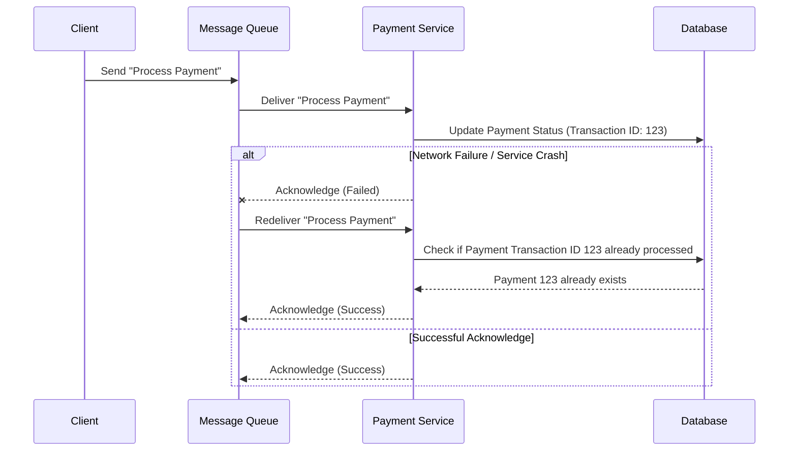

# Idempotent Operations

Idempotent operations are a cornerstone of robust and reliable distributed systems and software architecture. An operation is considered idempotent if applying it multiple times produces the same result as applying it once. This means that after the first successful execution, subsequent identical executions will not cause any further side effects or changes to the system state. The state of the system remains consistent regardless of how many times the operation is performed.

This characteristic is crucial in environments where operations might be retried due to network failures, [[posa#Timeout|timeouts]], or other transient issues. Without idempotency, retrying a non-idempotent operation could lead to unintended consequences, such as duplicate data entries, incorrect financial transactions, or inconsistent system states.

## Characteristics of Idempotency

The core idea behind idempotency is that the *effect* of the operation is the same, not necessarily that the operation itself is identical each time. For example, deleting a resource is idempotent: the first deletion removes it, and subsequent deletions of the same resource will still result in the resource being absent, even if the operation itself might return a "not found" error on subsequent attempts. The *state* of the system (resource is deleted) remains unchanged.

Key characteristics include:
-   **Predictable State:** The system's state after one execution is identical to its state after N executions.
-   **Fault Tolerance:** Operations can be safely retried without adverse effects, which is vital for fault-tolerant systems.
-   **Simplicity in [[api-error-handling|Error Handling]]:** Simplifies error recovery logic, as there's no need to track whether an operation has already been successfully applied.

## Why Idempotency Matters in Distributed Systems

In complex distributed systems, guaranteeing "exactly once" delivery or processing of messages or tasks is notoriously difficult and often comes with significant performance overhead. Many [[message-queue|message queues]] and task processing systems offer "at least once" delivery semantics. This means a message or task might be delivered and processed multiple times.

Consider a scenario where a service processes an order:
1.  The service receives an "order payment" message.
2.  It processes the payment and updates the order status in the database.
3.  Before it can acknowledge the message back to the queue, the service crashes or a network issue occurs.
4.  The message queue, not having received an acknowledgment, redelivers the message.
5.  The service processes the payment again.

If the payment processing is not idempotent, the customer might be charged twice. By designing the payment processing to be idempotent, the system can safely handle these retries without double-charging. This allows developers to leverage the simpler and more performant "at least once" delivery guarantees of many messaging systems, shifting the complexity from the messaging layer to the application logic.


*Description: This diagram illustrates how an idempotent payment service handles message redelivery. Upon receiving a duplicate message, the service checks if the transaction has already been processed using a unique transaction ID. If it has, it simply acknowledges the message without re-executing the payment, ensuring the customer is not charged multiple times.*

## Examples of Idempotent and Non-Idempotent Operations

### Idempotent Operations

-   **Setting a value:** `SET x = 5`. If `x` is already 5, setting it again has no further effect.
-   **Deleting a resource:** `DELETE /users/123`. After the first deletion, the user is gone. Subsequent deletions will still result in the user being absent.
-   **Creating a resource with a unique identifier:** `PUT /orders/order-abc` with a specific payload. If `order-abc` already exists, the `PUT` operation typically updates it or returns a conflict, but doesn't create a duplicate.
-   **Incrementing a counter with a transaction ID:** `INCREMENT counter WHERE id = X AND transaction_id = Y`. If `transaction_id` `Y` has already been applied for `id` `X`, the increment is skipped.

### Non-Idempotent Operations

-   **Incrementing a value:** `INCREMENT x`. Each execution increases `x` by one.
-   **Adding an item to a list without checking for duplicates:** `POST /items` to add a new item. Each `POST` creates a new item.
-   **Sending an email:** `SEND_EMAIL(to, subject, body)`. Each execution sends a new email.
-   **Transferring funds:** `TRANSFER(amount, from_account, to_account)`. Each execution moves the specified amount.

## Implementing Idempotency

Implementing idempotency often involves introducing a unique identifier for each operation or request. This identifier, sometimes called an **idempotency key** or **transaction ID**, allows the system to detect and discard duplicate requests.

Common strategies include:

1.  **Unique Request IDs:**
    *   The client generates a unique ID (e.g., a UUID) for each request and includes it in the request header or body.
    *   The server stores this ID along with the result of the operation.
    *   If a request with an already seen ID arrives, the server returns the previous result without re-executing the operation. This is particularly common in [[rest|RESTful APIs]] for `POST` requests.

    ```pseudo
    function processPayment(request):
        idempotency_key = request.headers["X-Idempotency-Key"]
        if idempotency_key is null:
            return error("Idempotency key is required")

        // Check if this request has been processed before
        cached_response = get_cached_response(idempotency_key)
        if cached_response is not null:
            return cached_response // Return previous result without re-processing

        // Process the payment (non-idempotent part)
        payment_result = perform_actual_payment(request.body)

        // Store the result with the idempotency key
        cache_response(idempotency_key, payment_result)
        return payment_result
    ```
    *Description: Pseudo-code illustrating how a server-side function can use an idempotency key to prevent duplicate processing. It first checks for a cached response associated with the key. If found, it returns the cached result; otherwise, it proceeds with the operation and caches the outcome.*

2.  **Conditional Updates:**
    *   Using optimistic locking or version numbers. Before updating a record, check if its version matches the one the operation was based on. If not, it means another operation has already modified it.
    *   `UPDATE accounts SET balance = balance + 100 WHERE id = X AND version = Y`. If `version` `Y` is no longer current, the update fails, indicating a concurrent modification or a duplicate.

3.  **State-based Idempotency:**
    *   The operation itself checks the current state of the system before making changes. For example, if an "activate user" operation is received, it first checks if the user is already active. If so, it does nothing.

## Idempotency and Statelessness

While not strictly the same, idempotency and statelessness are closely related concepts that often complement each other in system design. A stateless service does not store any client-specific data between requests; each request contains all the necessary information for the service to process it. This inherent lack of session state can greatly simplify the implementation of idempotent operations.

For a stateless service, processing a duplicate request is often naturally idempotent if the operation itself is designed to be so. The service doesn't rely on a previous state to determine its current action, making it easier to ensure that repeated calls yield the same outcome. For example, a stateless API endpoint that processes a payment using an idempotency key can simply check if that key has been seen before without needing to maintain complex session state.

Conversely, stateful services can also implement idempotency, but it typically requires more explicit mechanisms to manage and reconcile state changes across retries, such as transaction logs or versioning. Therefore, designing services to be stateless where possible can significantly reduce the complexity of achieving idempotency.

## Trade-offs and Considerations

Implementing idempotency, while crucial for reliability in distributed systems, comes with its own set of trade-offs and considerations:

*   **Increased Complexity:** Introducing idempotency keys, managing their storage (e.g., in a database or a dedicated cache), and implementing the logic to check for duplicates adds complexity to the application code and infrastructure.
*   **Performance Overhead:** Each idempotent operation typically requires an additional lookup (e.g., a database query or a cache read) to check if the request has already been processed. This can introduce a small amount of latency and increase the load on the data store.
*   **Storage Requirements:** Storing idempotency keys and their associated results (especially for a period long enough to cover potential retries) consumes storage resources. This needs to be managed, potentially with expiration policies.
*   **Granularity of Idempotency:** Deciding the appropriate scope for idempotency is important. Should it be per request, per user, per transaction? This depends on the business logic and the acceptable level of risk.
*   **Error Handling:** While idempotency simplifies [[retry]] logic, careful consideration is still needed for handling errors that occur *during* the idempotent check or the storage of the result. For example, what if the system crashes after processing but before caching the result?

Despite these considerations, the benefits of idempotency in terms of system reliability, data consistency, and simplified error recovery in distributed environments often outweigh the costs.

## Related Concepts and Patterns

-   **[[message-queue|Message Queues]]**: Idempotency is critical when working with message queues that provide "at least once" delivery guarantees.
-   **[[asynchronous-messaging|Asynchronous Messaging]]**: In asynchronous systems, messages can be retried, making idempotent consumers essential.
-   **[[saga|Saga Pattern]]**: In distributed transactions, sagas often involve a series of local transactions. Each step in a saga should ideally be idempotent to handle failures and retries gracefully.
-   **[[event-sourcing|Event Sourcing]]**: When replaying events, the event handlers must be idempotent to ensure the system state is correctly reconstructed.
-   **[[rest|RESTful APIs]]**: HTTP methods like `GET`, `PUT`, and `DELETE` are inherently idempotent, while `POST` is generally not. Designing `POST` endpoints to be idempotent (e.g., by using idempotency keys) is a common practice.
-   **[[microservices|Microservices]]**: In a microservices architecture, where services communicate over a network and failures are common, idempotency is vital for ensuring consistency and reliability.

## Resources & links

### Articles

1.  **[Idempotent Operations - Baeldung](https://www.baeldung.com/cs/idempotent-operations)**
    This comprehensive guide from Baeldung delves into the core concept of idempotency, explaining its fundamental importance in software development, particularly within distributed systems. It provides clear definitions, explores various practical examples across different contexts, and discusses common implementation strategies to ensure operations can be safely retried without unintended side effects.

2.  **[The Power of Idempotency: Understanding Its Significance - Codementor](https://www.codementor.io/@sidverma32/the-power-of-idempotency-understanding-its-significance-22zkyc7ci1)**
    This article highlights the critical role of idempotency in building resilient and fault-tolerant systems. It covers the "why" behind idempotency, illustrating its benefits in scenarios involving retries, message queues, and distributed transactions. The author provides practical insights into how to design and implement idempotent operations effectively to prevent data inconsistencies and improve overall system reliability.

### Videos

1.  **[Idempotency - System Design Concepts](https://www.youtube.com/watch?v=XAccGbtl3Z8&t)**
    This video offers a clear and concise explanation of idempotency as a fundamental system design concept. It covers what idempotent operations are, why they are crucial in distributed systems, and provides practical examples to illustrate the concept. The discussion often includes scenarios related to payment processing and message delivery, making it accessible for understanding real-world applications.

2.  **[Idempotency in Distributed Systems](https://www.youtube.com/watch?v=t99NvIazD68)**
    This presentation dives deeper into the challenges and solutions for achieving idempotency in complex distributed environments. It explores various strategies for implementing idempotent operations, such as using unique transaction IDs and conditional updates, and discusses the trade-offs involved. The video is particularly useful for understanding how idempotency contributes to fault tolerance and data consistency in large-scale architectures.
