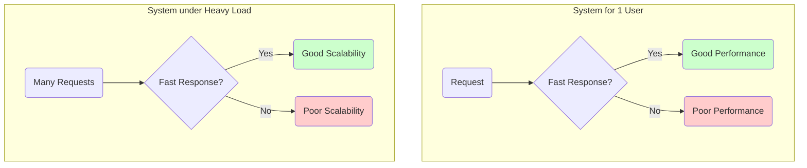
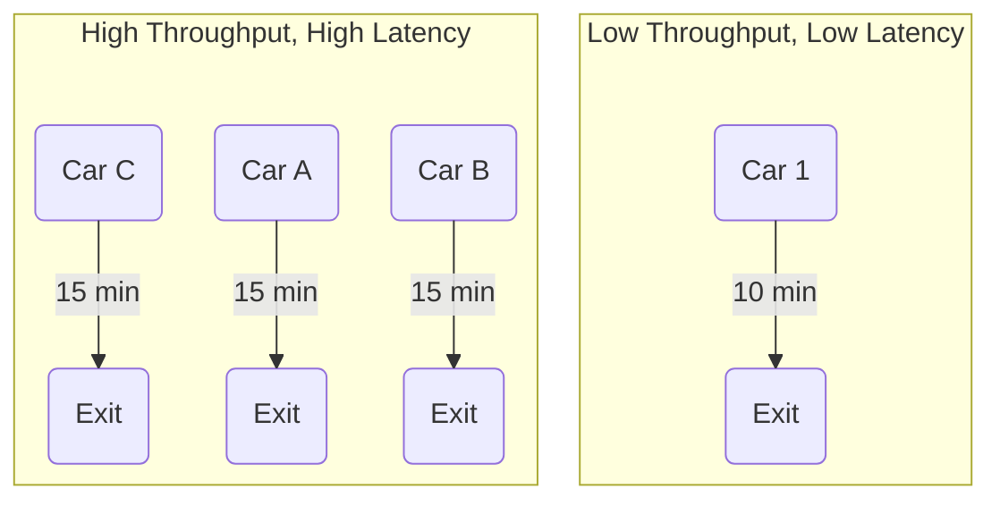

# System Design Fundamentals

This page covers the fundamental concepts and trade-offs that form the foundation of distributed system design. Understanding these core ideas is essential for building systems that are scalable, resilient, and maintainable.

---

## Performance vs. Scalability

While often used interchangeably, performance and scalability are distinct concepts that address different challenges.

*   **Performance** is a measure of a system's efficiency for a single user or operation. It answers the question: "How fast is the system?" A system with a performance problem feels slow even with only one user.
*   **Scalability** is the system's ability to handle a growing amount of load, for instance, by adding more resources. It answers the question: "How well does the system handle more users or more data?" A system with a scalability problem is fast for a single user but becomes slow under heavy load.

A system is scalable if its performance increases proportionally to the resources added. This can be achieved through two primary methods:

1.  **Vertical Scaling (Scaling Up):** Increasing the resources of a single server (e.g., adding more CPU, RAM, or a faster disk). This is simple but has physical limits and can become very expensive.
2.  **Horizontal Scaling (Scaling Out):** Adding more servers to the system and distributing the load among them. This is the foundation of modern, large-scale architectures and is virtually limitless.

---

## Latency vs. Throughput

Latency and throughput are key metrics for measuring a system's performance.

*   **Latency** is the time it takes to process a single request—the delay between sending a request and receiving a response. It is measured in units of time (e.g., milliseconds).
*   **Throughput** is the number of requests the system can handle in a given time period. It is a measure of capacity, often expressed as "requests per second" (RPS) or "transactions per second" (TPS).

A common analogy is a highway:
*   **Latency** is the time it takes for a single car to travel from the start to the end of the highway.
*   **Throughput** is the total number of cars that can pass a certain point on the highway in an hour.

Widening the highway (adding more lanes) increases its throughput, but it doesn't necessarily reduce the time it takes for one car to travel its length (latency). In fact, the two are often in opposition. For example, a system might batch multiple requests together to process them more efficiently. This increases overall throughput but can increase the latency for any individual request that has to wait for the batch to be processed.

The goal is always to achieve the **maximum possible throughput while maintaining an acceptable latency** that aligns with the user's expectations and business requirements.

---

## Availability vs. Consistency

In distributed systems, availability and consistency represent a fundamental trade-off, famously described by the **[[cap|CAP Theorem]]**.

*   **[[availability-patterns|Availability]]** is the guarantee that the system is operational and able to respond to every request, even if some of its nodes have failed. It is often measured in "nines" of uptime (e.g., 99.9% availability, or "three nines," allows for about 8.77 hours of downtime per year).

*   **Consistency** (in the context of CAP) is the guarantee that every read operation returns the most recent write. This ensures all clients see the same view of the data at the same time.

The trade-off becomes critical during a **network partition**—a situation where nodes in a distributed system cannot communicate with each other. At that point, the system must choose:

1.  **Prioritize Consistency (CP - Consistent & Partition-Tolerant):** To guarantee that data remains consistent, the system may have to refuse some requests (e.g., writes) until the partition is resolved. This sacrifices availability to ensure data integrity. This is often the choice for financial systems or critical inventory management.

2.  **Prioritize Availability (AP - Available & Partition-Tolerant):** To ensure the system always responds, it may serve data that is stale or allow writes that cannot be immediately propagated to other nodes. This sacrifices strong consistency for uptime, settling for **eventual consistency**. This is a common choice for social media feeds or other non-critical systems where being always online is more important than every user seeing the exact same data instantly.

## Other Topics

* [[availability-patterns|Availability Patterns]]
* [[cap|CAP Theorem]]
* [[consistency-patterns|Consistency Patterns]]
* [[dns|Domain Name System (DNS)]]
