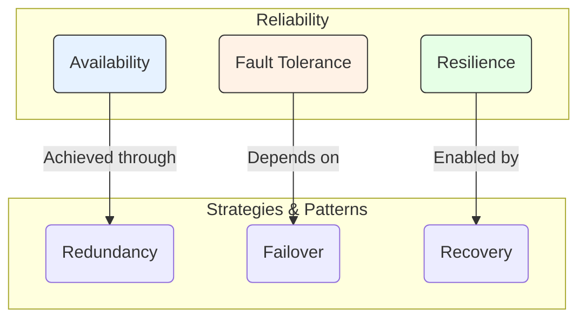

# Reliability Engineering

Reliability engineering is a discipline focused on designing and operating systems to meet user expectations for dependability. It encompasses several key concepts that ensure a system can withstand failures, maintain high levels of performance, and recover gracefully from disruptions. The primary goal is to build systems that are not just available, but also resilient and fault-tolerant.

---

## Core Concepts of Reliability

*Description: Reliability is built on three pillars: Availability (being operational), Resilience (ability to recover), and Fault Tolerance (ability to withstand failures). These are achieved through strategies like redundancy, failover, and recovery.*

### 1. Availability

Availability is a measure of a system's uptime and its ability to respond to requests. The practice of tracking these measures is handled by [[monitoring]]. It is the most common metric for reliability and is often a cornerstone of Service Level Agreements (SLAs).

High availability is achieved by building systems that can withstand failures of individual components. The primary strategy for this is **redundancy**, which is implemented through various [[availability-patterns]]. For globally distributed systems, advanced patterns like the [[geode|Geode pattern]] provide extreme availability by serving traffic from multiple active regions simultaneously.

#### Availability in Numbers (The Nines)

Availability is commonly expressed as a percentage of uptime over a period (usually a year), often referred to as "the nines."

| Availability % | "The Nines" | Allowed Downtime per Year | per Month   | per Week   | per Day   |
| :------------- | :---------- | :------------------------ | :---------- | :--------- | :-------- |
| 99%            | 2 nines     | 3 days 15h 39m 30s        | 7h 18m 17s  | 1h 40m 48s | 14m 24s   |
| 99.9%          | 3 nines     | 8h 45m 57s                | 43m 50s     | 10m 4.8s   | 1m 26s    |
| 99.99%         | 4 nines     | 52m 36s                   | 4m 23s      | 1m 0.48s   | 8.6s      |
| 99.999%        | 5 nines     | 5m 16s                    | 26s         | 6s         | 0.86s     |

#### Calculating System Availability

Understanding how component availability affects the total system availability is crucial.

*   **In Sequence (Serial):** If components are chained sequentially (A calls B), the total availability is the product of their individual availabilities. The system is only up if *all* components are up.
    *   `A_total = A_component1 * A_component2 * ...`

*   **In Parallel:** If components are redundant and in parallel (e.g., multiple servers behind a [[load-balancing|load balancer]]), the total availability is calculated based on the probability of all components failing simultaneously.
    *   `A_total = 1 - (1 - A_component1) * (1 - A_component2) * ...`

### 2. Resilience

Resiliency is the ability of a system to gracefully handle and recover from failures, both inadvertent and malicious. The nature of cloud hosting, where applications are often multi-tenant, use shared platform services, and communicate over the Internet, means there is an increased likelihood that both transient and more permanent faults will arise.

Detecting failures and recovering quickly and efficiently is necessary to maintain resiliency. This involves implementing patterns that allow the system to adapt to failures and continue functioning, even if in a degraded state.

### 3. Fault Tolerance

Fault tolerance is the property that enables a system to continue operating properly in the event of the failure of some of its components. A fault-tolerant system is designed to automatically switch to a redundant or standby component or system upon the failure of a primary component. This is often achieved through fail-over mechanisms.

---

## Reliability Patterns

These patterns provide a way to design and implement systems that can withstand failures, maintain high levels of performance, and recover quickly from disruptions.

*   **[[availability-patterns|Availability Patterns]]:** Core strategies for implementing redundancy and failover.
*   **[[retry|Retry Pattern]]:** Handles transient failures by re-issuing a failed operation.
*   **[[circuit-breaker|Circuit Breaker]]:** Prevents an application from repeatedly trying to execute an operation that is likely to fail.
*   **[[bulkhead|Bulkhead Pattern]]:** Isolates elements of an application into separate pools to prevent cascading failures.
*   **[[leader-election|Leader Election]]:** Coordinates actions by electing a single instance as a leader.
*   **[[health-endpoint-monitoring|Health Endpoint Monitoring]]:** Exposes an endpoint to report the health of the application.
*   **[[back-pressure|Back Pressure]]:** Allows a downstream service to signal to an upstream service that it is overloaded.
*   **[[idempotent-operations|Idempotent Operations]]:** Ensures that repeating an operation multiple times has the same effect as performing it once, which is critical for safe retries.
