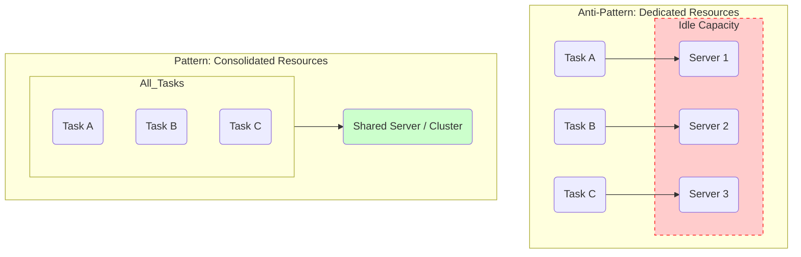

# Workload Management

This page covers fundamental principles and patterns for managing the load placed on a system to ensure stability, performance, and cost-effectiveness. It addresses the core challenge of matching the system's processing capacity with its incoming workload.

---

## Compute Resource Consolidation

**Compute Resource Consolidation** is the principle of combining multiple tasks, processes, or services into a shared computational unit to maximize resource utilization and reduce cost. Instead of dedicating a separate resource (like a server or container) for each individual task, consolidation seeks to pack them together efficiently.

This principle directly combats the problem of under-utilized resources, where many components are provisioned but spend most of their time idle, leading to wasted capacity and unnecessary costs.

### Core Strategies

There are two primary strategies for applying this principle:

1.  **Consolidating Tasks within a Process (Micro-consolidation)**: This involves grouping multiple small operations into a single, larger unit of work. A classic example is **batch processing**, where instead of processing one item at a time, the system collects multiple items and processes them together. This reduces the overhead of starting and stopping operations, making the overall process more efficient.

2.  **Consolidating Processes on an Infrastructure (Macro-consolidation)**: This involves placing multiple independent services or applications onto shared infrastructure. This is the most common interpretation in modern cloud architecture. Instead of one server per service, services are packed onto a shared cluster of nodes. This is the core concept behind container orchestration.

*Consolidation moves from a model of one-resource-per-task to a model of shared resources for multiple tasks, improving utilization.*

### Benefits & Trade-offs

**Benefits:**
-   **Increased Resource Utilization & Reduced Cost**: This is the primary driver. By packing more work onto the same hardware, you reduce the number of idle servers and lower infrastructure costs.
-   **Simplified Management**: Fewer virtual machines or servers to monitor, patch, and manage.
-   **Reduced Communication Latency**: When services are consolidated onto the same host, they can often communicate over a local network interface or inter-process communication, which is much faster than network calls between different machines.

**Trade-offs & Challenges:**
-   **Resource Contention (Noisy Neighbor)**: If one service suddenly consumes a large amount of CPU or memory, it can starve the other consolidated services on the same machine, degrading their performance. This is a classic "[[system-performance#9. Noisy Neighbor|noisy neighbor]]" problem.
-   **Risk of Failure**: If the underlying shared hardware or host OS fails, all consolidated services on that unit fail simultaneously. This reduces [[reliability-engineering#1. Availability|availability]] if not managed properly.
-   **Security & Isolation**: Services sharing the same host must be properly isolated to prevent a security breach in one service from affecting the others.

### Modern Implementations

Modern tools are designed to mitigate the trade-offs while maximizing the benefits of consolidation:

-   **Containerization & Orchestration**: This is the most successful implementation of the principle.
    -   **[[docker|Docker]]** provides process isolation, while **[[kubernetes|Kubernetes]]** automates the complex task of packing containers onto nodes efficiently (a process known as **bin packing**). 
    -   Orchestrators manage resource contention through **resource limits and requests**, ensuring that a "noisy neighbor" cannot consume more than its allocated share of CPU and memory.
-   **[[serverless|Serverless]] Functions**: While it may seem counter-intuitive, deploying multiple related API endpoints within a single serverless function (e.g., an AWS Lambda with multiple routes) is a form of consolidation that helps reduce cold starts and management overhead compared to having one function per endpoint.
-   **[[background-jobs|Background Job]] Processors**: A single worker process can pull different types of jobs from a [[message-queue]], effectively consolidating the execution of various asynchronous tasks into one computational unit.

---

### Resources & links

#### Articles

1.  **[Compute Resource Consolidation Pattern - GeeksforGeeks](https://www.geeksforgeeks.org/system-design/compute-resource-consolidation-pattern-system-design/)**
    An article explaining the Compute Resource Consolidation pattern, its benefits, and how it helps in optimizing resource utilization in system design.

2.  **[Compute Resource Consolidation pattern - Microsoft Azure](https://learn.microsoft.com/en-us/azure/architecture/patterns/compute-resource-consolidation)**
    Microsoft Azure's official documentation on the Compute Resource Consolidation pattern, detailing its application in cloud-hosted applications to reduce costs and management overhead.

---

## Related Workload Management Patterns

While "Compute Resource Consolidation" is a fundamental principle, several specific design patterns are used to manage system workload.

### Queue-Based Load Leveling

This pattern uses a queue to buffer and smooth out intermittent or heavy workloads, preventing a service from being overwhelmed. It decouples producers and consumers, allowing the system to process work at a steady, manageable pace.

For more details, see the dedicated **[[queue-based-load-leveling]]** pattern page.

### Throttling

This pattern controls the consumption of resources by limiting the rate at which requests are processed. When a defined limit is exceeded, new requests are temporarily rejected, protecting the system from being overwhelmed.

For more details, see the dedicated **[[throttling]]** pattern page.

### Rate Limiting

A specific type of throttling that limits how many requests a user or client can make in a given time window. It is often used for API security, fair usage, and to enforce commercial agreements.

For more details, see the dedicated **[[rate-limiting]]** pattern page.

### Back Pressure

This pattern allows a downstream service to signal to an upstream service that it is overloaded. Instead of dropping requests, the system as a whole slows down, pushing the "pressure" back to the original caller to prevent overload.

For more details, see the dedicated **[[back-pressure]]** pattern page.
