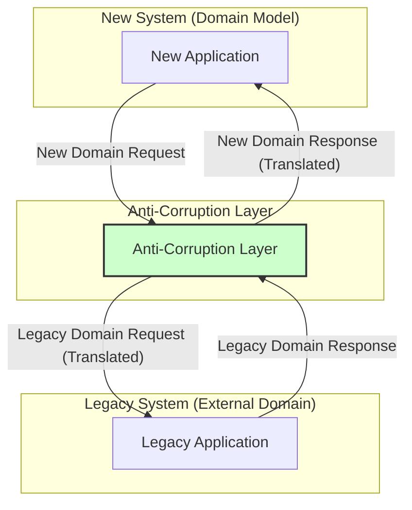

# Anti-Corruption Layer (ACL)

The **Anti-Corruption Layer (ACL)** is a [[software-architecture/system-design-patterns/|system-design-pattern]] that acts as an **architectural boundary** or **translation layer** between two distinct systems or [[ddd#Bounded-Context|Bounded Contexts]] with incompatible domain models. It typically achieves this by implementing a [[gof#Facade|facade]] or [[gof#Adapter|adapter]] layer. Its primary purpose is to isolate the domain model of a new or evolving system from the complexities and inconsistencies of a legacy or external system, preventing "corruption" of the clean model.

This pattern was first described by Eric Evans in his book "Domain-Driven Design". It acts as a translation layer, ensuring that the new system's design is not "corrupted" by the concepts, data structures, or behaviors of the external system.

---

## The Problem it Solves

When integrating a new system (often with a rich [[ddd|Domain-Driven Design]]) with an existing legacy system or a third-party service, a direct integration can lead to several problems:

-   **Domain Model Corruption**: The new system's clean, well-defined domain model can become polluted with concepts and data structures from the legacy system, making it harder to understand, maintain, and evolve.
-   **[[cohesion-coupling|Tight Coupling]]**: Direct integration creates tight coupling between the two systems, making it difficult to change either system independently.
-   **Complexity**: The legacy system might have outdated or convoluted logic, and directly exposing this to the new system increases its complexity.
-   **Inconsistent Semantics**: Concepts that seem similar might have different meanings or behaviors in each system (e.g., "Customer" in one system might be "Account Holder" in another, with different attributes and rules).

---

## How it Works

The ACL sits between the two systems, acting as a bidirectional translator. It intercepts calls from the new system to the legacy system and vice-versa, translating requests and responses into the appropriate formats and semantics for each domain.

1.  **Translation**: The ACL translates data and commands from the new system's domain model into the legacy system's domain model, and vice-versa. This involves mapping data structures, converting values, and adapting method calls.
2.  **Isolation**: It isolates the new system from changes in the legacy system. If the legacy system's API changes, only the ACL needs to be updated, not the entire new system.
3.  **Adaptation**: It can adapt the behavior of the legacy system to fit the needs of the new system, potentially simplifying complex legacy interactions.
4.  **Protection**: It protects the new system's domain model from being "corrupted" by the legacy system's outdated or inconsistent concepts.

---

## Benefits & Trade-offs

### Benefits

-   **Protects the Domain Model**: Ensures the new system's domain model remains clean, consistent, and focused on its own business logic.
-   **Reduces [[cohesion-coupling|Coupling]]**: Decouples the new system from the legacy system, allowing each to evolve independently.
-   **Simplifies Integration**: Hides the complexity and inconsistencies of the legacy system from the new system.
-   **Facilitates Migration**: Essential for [[strangler-fig|Strangler Fig Pattern]] migrations, allowing new functionality to be built without being constrained by the old system.

### Trade-offs

-   **Increased Complexity**: The ACL itself adds an additional layer of abstraction and code, increasing the overall complexity of the solution.
-   **Development Overhead**: Building and maintaining the translation logic within the ACL requires significant development effort.
-   **Performance Overhead**: The translation process can introduce a slight performance overhead due to data transformations.
-   **Potential for "Big Ball of Mud"**: If not carefully designed, the ACL can become a complex, monolithic component that is difficult to manage.

---

## Related Patterns, Concepts and Variations

-   **[[strangler-fig|Strangler Fig Pattern]]**: The ACL is almost always used in conjunction with the Strangler Fig Pattern during migrations from monolithic to microservices architectures. It helps to isolate the newly extracted services from the legacy monolith.
-   **[[gof#Facade|Facade Pattern]]**: The ACL can be seen as a specialized form of the Facade pattern, providing a simplified and translated interface to a complex subsystem.
-   **[[gof#Adapter|Adapter Pattern]]**: Adapters are often used within the ACL to translate between different interfaces and data formats.
-   **[[ddd|Domain-Driven Design (DDD)]]**: The ACL is a core tactical pattern in DDD, used to manage integrations between different [[ddd#Bounded-Context|Bounded Contexts]] that have different domain models.

### ACL vs. API Gateway vs. API Management

It is common to confuse the Anti-Corruption Layer with an [[api-gateway|API Gateway]] or an API Management platform, as all three act as intermediaries. However, their primary purposes and operational domains are distinct:

| Feature / Pattern | Anti-Corruption Layer (ACL) | API Gateway | API Management Platform |
| :---------------- | :-------------------------- | :---------- | :---------------------- |
| **Primary Goal** | Protect internal domain model from external incompatibilities. | Provide a single, unified entry point for backend services. | Manage the full lifecycle of APIs (exposure, security, monitoring, monetization). |
| **Core Focus** | Deep semantic translation between incompatible domain models. Domain model isolation. | Routing, security (authN/authZ), rate limiting, monitoring, protocol translation at API level. | API governance, developer experience, analytics, policy enforcement, security. |
| **Translation Depth** | Deep, business-logic-aware semantic translation. | Syntactic or light semantic translation (e.g., XML to JSON, simple data mapping). | Syntactic or light semantic translation. |
| **Operational Scope** | Internal integration point between a clean domain and a "corrupting" one. | Edge of the system, managing external access to services. | Edge of the system, managing APIs exposed to external consumers. |
| **Use Case** | Integrating with legacy systems, external services with incompatible domain models. | Managing external access to microservices, simplifying client-side consumption. | Exposing APIs to partners/developers, monetizing APIs, enforcing API policies. |
| **Relationship** | Often used *within* a service that an API Gateway routes to. | Can be a component *within* an API Management platform. | A comprehensive platform that *includes* an API Gateway. |

---

## Resources & links

### Articles

1.  **[Anti-Corruption Layer - DDD Practitioners](https://ddd-practitioners.com/home/glossary/bounded-context/bounded-context-relationship/anticorruption-layer/)**
    This article from DDD Practitioners provides a concise explanation of the Anti-Corruption Layer within the context of Bounded Contexts and their relationships in Domain-Driven Design.

2.  **[Anti-Corruption Layer pattern - Microsoft Azure](https://learn.microsoft.com/en-us/azure/architecture/patterns/anti-corruption-layer)**
    A detailed guide from Microsoft on the ACL pattern, covering its benefits, challenges, and implementation considerations in cloud-native architectures.

### Videos

1.  **[Can an "Anti-Corruption Layer" save your bad software architecture ...](https://www.youtube.com/watch?v=_oAYFR-hexg)**
    The Anti-Corruption Layer is a pattern often used when communicating between different subsystems that don't share the same semantics, whether a legacy system or a 3rd party API. Let's explore its benefits and implications.

2.  **[Anti-corruption Layer for mapping between Boundaries](https://www.youtube.com/watch?v=Dok2Ikcjaro)**
    What does an anti-corruption layer solve? Most systems rely on data or behaviors from another service or an external 3rd party. The problem is they often don't share the same semantics or data structures. Left unchecked this leads to convoluting up your own boundary with concepts from another boundary. Let me explain how you can use an an anti-corruption layer as a way to translate the concepts from another boundary in isolation.
