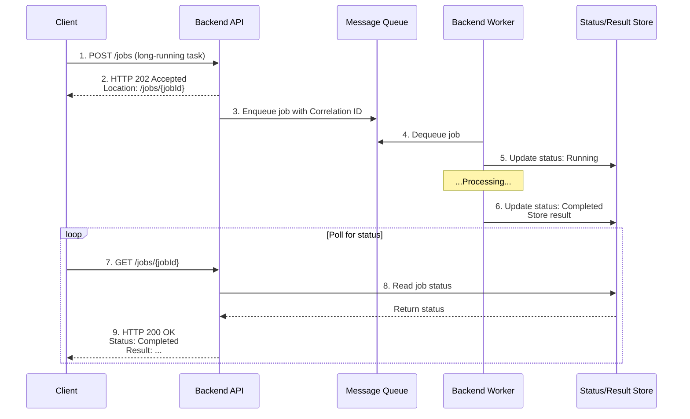

# Asynchronous Messaging Models: Queues vs. Topics & Streams

Building upon the general principles of [[asynchronism]], asynchronous messaging is the foundational communication method that enables modern, decoupled distributed systems. It relies on a central **[[broker]]** that acts as an intermediary between message **Producers** and **Consumers**.

This document compares the two fundamental low-level models of asynchronous communication. These models serve as the technical backbone for higher-level architectural styles like **[[message-driven|Message-Driven Architecture]]** and **[[event-driven|Event-Driven Architecture]]**.

---

## The Two Core Models

There are two primary models for asynchronous messaging, each serving a different purpose:

1.  **[[message-queue|Message Queue]]:** This model is used for **one-to-one** communication. A message is sent to a queue and delivered to a single consumer. It is ideal for distributing tasks and commands.

2.  **[[publish-subscribe|Publish-Subscribe (Topic or Stream)]]:** This model is used for **one-to-many** communication. A message is published to a central channel and broadcast to all interested subscribers. It is ideal for notifying different parts of a system about an event. The implementation of this channel can be a simple topic or a more robust **[[publish-subscribe#Topics vs. Event Streams|Event Stream]]**.

### High-Level Comparison

| Characteristic | **Point-to-Point (Queue)** | **Publish-Subscribe (Topic / Stream)** |
| :--- | :--- | :--- |
| **Communication Model** | **One-to-One**. A single message is processed by exactly one consumer. | **One-to-Many**. A single message is broadcast to all interested consumers. |
| **Consumption Logic** | **Destructive Read**. When a consumer processes a message, it is removed from the queue. | **Non-Destructive Read**. Consumers read from the channel without removing the message. |
| **Primary Use Case** | **Task/Command Distribution**. Ideal for distributing work among a pool of identical workers. | **Event Notification**. Ideal for broadcasting that something has happened, allowing different parts of a system to react independently. |

For a detailed explanation of each pattern, please refer to their dedicated documents:
*   **Deep Dive: [[message-queue|Message Queue]]**
*   **Deep Dive: [[publish-subscribe|Publish-Subscribe]]**

---

## General Advantages of Asynchronous Messaging

* **[[cohesion-coupling|Decoupling]]**: Services have no direct dependency on one another, which simplifies system development, maintenance, and evolution.
* **Resilience**: If a consumer fails, messages are not lost; they remain in the **[[broker]]** until a service resumes processing.
* **Scalability**: The **[[broker]]** handles traffic spikes by acting as a buffer. It is easy to add more consumers to increase processing capacity without impacting the rest of the system.
* **Flexibility**: Different services can be developed using distinct technologies as long as they adhere to the common communication protocol with the **[[broker]]**.

## Asynchronous Request-Reply Pattern

The **Asynchronous Request-Reply** pattern is a messaging model used to decouple a client from a long-running backend process, while still allowing the client to get a clear response when the process is complete. It is essential for scenarios where a backend operation cannot be completed synchronously within the limits of a standard HTTP request-response cycle.

Instead of blocking the client, the backend immediately acknowledges the request and provides a mechanism for the client to check the status of the operation and retrieve the result later.

### How It Works

The pattern orchestrates a synchronous API call with an asynchronous backend worker, using a status endpoint as the bridge.

1.  **Initial Request**: The **Client** sends a request to a synchronous **Backend API** endpoint.
2.  **Acknowledge and Offload**: The API acknowledges the request immediately by returning an `HTTP 202 Accepted` status code. This response includes a `Location` header pointing to a unique **Status Endpoint** URL where the client can check the job's progress. The API then offloads the long-running task by sending a message (containing a `Correlation ID` and job details) to a [[message-queue]].
3.  **Asynchronous Processing**: A **Backend Worker** picks up the message from the queue and starts processing the long-running task. It periodically updates the job's status (e.g., `Pending`, `Running`, `Completed`, `Failed`) in a persistent store.
4.  **Client Polling**: The **Client** periodically polls the **Status Endpoint** URL.
5.  **Status Check**: The Status Endpoint queries the job status from the persistent store and returns it to the client.
6.  **Result Retrieval**: Once the job is complete, the Status Endpoint can respond in one of two ways:
    *   Return the final result directly in the response body.
    *   Return an `HTTP 302 Found` or `HTTP 303 See Other` redirect to a new URL where the result can be fetched.

*Description: The client initiates a long-running job and immediately gets a `202 Accepted` response with a status URL. The client then polls this URL until the job is completed by an asynchronous worker, at which point it receives the final result.*

### Use Cases

-   **Long-Running API Workflows**: For tasks that take minutes or even hours, such as generating complex reports, processing large datasets, or video encoding.
-   **Interactions with Slow Third-Party Systems**: When an API call depends on a slow external service, this pattern prevents holding the client connection open.
-   **Batch Processing Initiation**: Kicking off a batch job via a REST API call and providing a way to monitor its progress.
-   **Resource-Intensive Computations**: For scientific or financial calculations that cannot be completed in real-time.

### Challenges and Considerations

-   **Client-Side Complexity**: The client is more complex than in a simple synchronous interaction. It must be designed to poll for the status, handle different states (`Pending`, `Failed`), and implement a [[posa#Timeout|timeout]] strategy to avoid polling indefinitely.
-   **State Management**: The backend must reliably track the state of every asynchronous job. This typically requires a database or a distributed cache to store the status, progress, and final result.
-   **Result Delivery Alternatives**: While polling is common, it can be inefficient. For more advanced use cases, consider push-based notifications to inform the client when the result is ready. The following patterns are detailed in the [[real-time-communication]] document:
    -   **[[real-time-communication#WebSockets|WebSockets]]**: For rich, bidirectional communication.
    -   **[[real-time-communication#Server-Sent Events (SSE)|Server-Sent Events (SSE)]]**: For simple, unidirectional server-to-client updates.
    -   **[[webhooks|Webhooks]]**: The client can provide a callback URL that the backend calls when the job is done.
-   **HTTP Status Codes**: Proper use of HTTP status codes is critical. `202 Accepted` for acknowledgment, `200 OK` for status updates, and `302`/`303` for redirection to the final result.
-   **Error Handling**: The backend worker must be able to report a `Failed` state to the status store. When the client polls the status endpoint, there are two types of errors to consider:
    -   **The Asynchronous Job Fails:** The backend worker fails to complete the task (e.g., due to invalid data). In this case, the status endpoint itself should still return `HTTP 200 OK`, because the request *for the status* was successful. The response body will contain the terminal state of the job, e.g., `{ "status": "Failed", "reason": "Input data could not be processed." }`.
    -   **The Status Request Fails:** The request to the status endpoint itself fails (e.g., the `jobId` does not exist). In this case, the server should return a standard [[api-error-handling|HTTP error code]] like `404 Not Found`.

---

## **Resources & links**

### **Articles**

1.  **[Asynchronous Request-Reply pattern - Microsoft Azure](https://learn.microsoft.com/en-us/azure/architecture/patterns/async-request-reply)**

    This official documentation from the Azure Architecture Center provides a detailed overview of the pattern. It explains how to decouple a backend process from a frontend host using HTTP polling, a status endpoint, and the `202 Accepted` status code. It covers implementation details, alternative approaches, and key considerations for building resilient, long-running asynchronous workflows.

2.  **[Building efficient workflows: Asynchronous Request-Reply pattern (Medium)](https://redpanda-data.medium.com/building-efficient-workflows-asynchronous-request-reply-pattern-f9d59050d2f5)**

    This article demonstrates a practical implementation of the pattern using a modern data streaming stack (Redpanda/Kafka, Python, and FastAPI). It highlights how the pattern is essential for non-blocking processing in microservices architectures and provides a concrete example of offloading image processing, using dedicated request and reply topics. The implementation uses WebSockets to deliver the final response, showcasing a push-based alternative to polling.