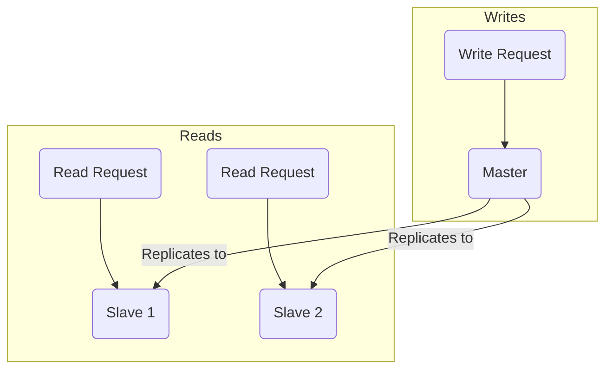
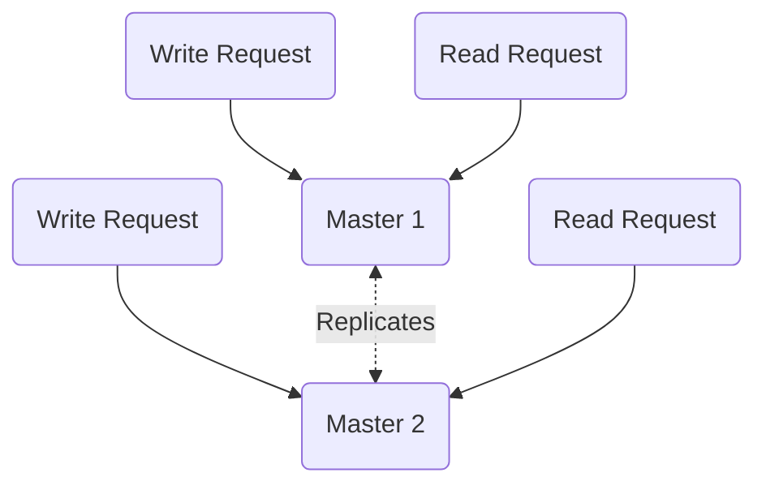
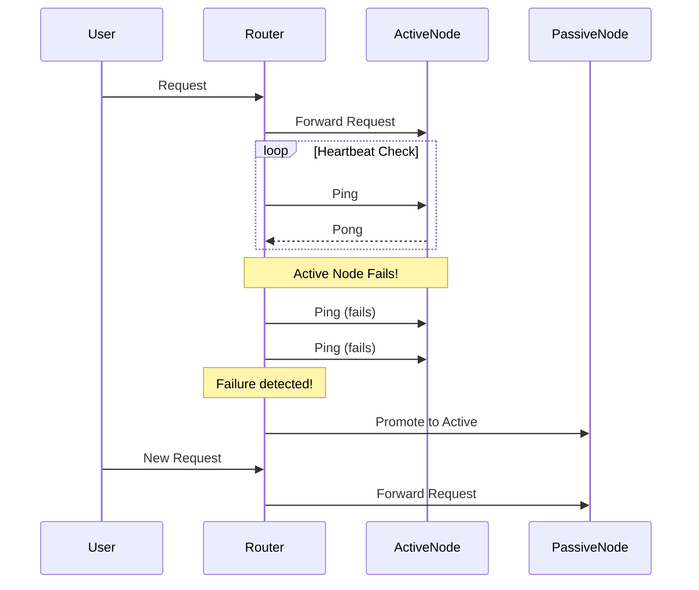
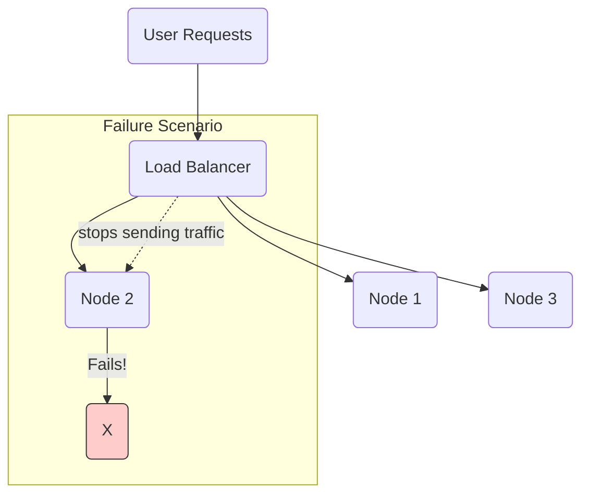

# Availability Patterns

Availability is a measure of a system's uptime and its ability to respond to requests. For a deeper dive into how availability is measured and calculated, see the fundamental concept of [[availability]].

In distributed systems, achieving high availability means designing a system that is resilient to failures, such as server crashes, network partitions, or software bugs.

The core strategy for high availability is **redundancy**—eliminating single points of failure by having more than one of everything. Availability patterns are practical techniques for implementing redundancy for both services and data. These patterns are the building blocks for creating AP (Available & Partition-Tolerant) systems, as described in the [[cap|CAP Theorem]].

---

## Replication Patterns

Replication is the core strategy for data availability and a prerequisite for failover. It involves keeping identical copies of data on multiple nodes.

### Master-Slave Replication

In this model, one node is designated as the **Master** (or primary), and it handles all write operations. The data is then replicated from the master to one or more **Slave** (or secondary/replica) nodes. The slaves can be used to serve read requests.

*Description: All writes go to a single master, which then propagates the changes to read-only slaves.*

*   **Pros:** Simple write logic (no conflicts), good for read-heavy workloads.
*   **Cons:** The master is a single point of failure for writes. There can be a replication lag, leading to stale reads from slaves ([[consistency-patterns|eventual consistency]]).

### Master-Master (Multi-Master) Replication

In this model, two or more nodes can accept both read and write operations. Each master node replicates its writes to the other master(s).

*Description: Both nodes can accept writes and reads, and they synchronize with each other.*

*   **Pros:** High write availability, as there is no single point of failure.
*   **Cons:** Much more complex. Write conflicts are possible and require a resolution strategy (e.g., last-write-wins, CRDTs).

---

## Fail-Over Patterns

Fail-over is the mechanism of switching to a redundant standby system when the primary system fails. This process relies on having data synchronized between systems, which is achieved through the **[[#Replication Patterns|Replication Patterns]]** discussed previously. A **heartbeat** mechanism is typically used to detect failures and trigger the fail-over.

### Active-Passive Fail-Over

This pattern is the classic high-availability pairing. An active node handles traffic while a passive (standby) node is kept in sync but does not serve traffic. This synchronization is typically achieved using **[[#Master-Slave Replication|Master-Slave Replication]]**, where the active node is the master and the passive node is the slave.

A [[monitoring]] component (like a [[load-balancing|load balancer]] or cluster manager) detects when the active node fails and automatically redirects traffic to the passive node, promoting it to become the new master.

*Description: When the Active node stops responding to heartbeats, the router promotes the Passive node and redirects traffic.*

*   **Pros:** Relatively simple to implement and manage.
*   **Cons:** The passive node's resources are idle most of the time, making it expensive ("Hot-Standby") or leading to slower recovery ("Cold-Standby").

### Active-Active Fail-Over

In this configuration, all nodes are active and simultaneously serve traffic, typically behind a [[load-balancing|load balancer]]. If one node fails, the [[load-balancing|load balancer]] detects the failure (e.g., via health checks) and simply removes it from the pool, distributing its traffic among the remaining healthy nodes.

This is not so much a fail-over pattern as it is the natural state of a [[system-design-fundamentals|horizontally-scaled, load-balanced system]].

*Description: All nodes serve traffic. When a node fails, the [[load-balancing|load balancer]] simply stops routing requests to it.*

*   **Pros:** Efficient use of resources, seamless failover with no downtime.
*   **Cons:** The system must be designed to be [[twelve-factor-app|stateless]] or have its state distributed.

---

## Resources & Links

### Articles

1.  **[High Availability, Replication, and Failover Explained with Stuffed Animals](https://andrewbrookins.com/technology/explaining-high-availability-with-stuffed-animals/)**
    This article provides a wonderfully simple and effective analogy using a child's favorite stuffed animal to explain complex topics like replication, failover, consensus, and the split-brain problem. It's a great starting point for building an intuitive understanding.

### Videos

1.  **[Fail-over and High-Availability (Explained by Example)](https://www.youtube.com/watch?v=Zgy1miPsTNs)**
    This video clearly explains the mechanics of failover, including concepts like Virtual IPs (VIP) and VRRP, using practical examples. It's useful for understanding how traffic is actually redirected in a high-availability setup.

2.  **[Database Replication Explained | System Design Interview Basics](https://www.youtube.com/watch?v=WG6k74VSOOU)**
    Focusing on the data aspect of availability, this video breaks down database replication patterns. It covers the main-replica (master-slave) model and its importance for scaling reads and ensuring data redundancy.

