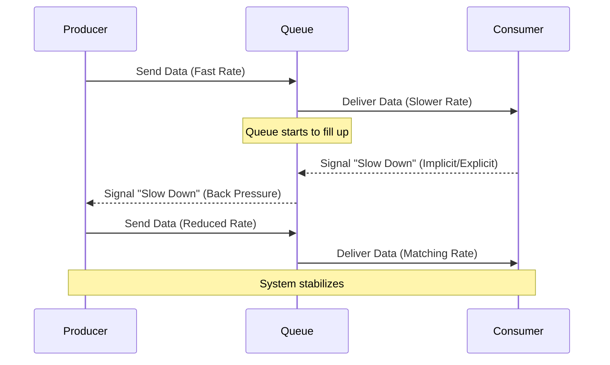

# Back Pressure

Back pressure is a crucial mechanism in [[asynchronism|asynchronous]] and distributed systems designed to prevent a fast producer from overwhelming a slower consumer. In essence, it's a feedback mechanism that allows a consumer to signal to its producer that it is reaching its capacity limits and needs the producer to slow down. Without effective back pressure, a system can easily become overloaded, leading to cascading failures, increased latency, and ultimately, system instability.

The problem often arises in pipelines or chains of processing where different components operate at varying speeds. If a component (consumer) cannot process data as quickly as it receives it from an upstream component (producer), a queue will build up. If this queue grows indefinitely, it can exhaust memory, lead to excessive garbage collection, cache misses, and eventually cause the system to crash. Back pressure ensures that the producer adjusts its rate to match the consumer's capacity, maintaining a healthy and stable system.

## Why Back Pressure is Essential

-   **System Stability**: Prevents resource exhaustion (memory, CPU) in downstream components, avoiding crashes and ensuring continuous operation.
-   **Predictable Performance**: Helps maintain consistent latency and throughput by preventing overload.
-   **Resource Management**: Optimizes [[workload-management#Compute Resource Consolidation|resource utilization]] by ensuring that work is not queued unnecessarily, which can lead to wasted processing if tasks are eventually dropped or timed out.
-   **Fault Isolation**: Contains issues to specific parts of the system, preventing a slow component from bringing down the entire pipeline.

## How Back Pressure Works

Back pressure mechanisms typically involve a signal from the consumer to the producer. This signal can be explicit (e.g., a "stop" or "slow down" message) or implicit (e.g., a full buffer or a timeout).

### Common Strategies

1.  **Blocking (Explicit Back Pressure)**:
    *   The simplest form, where the producer is directly blocked when the consumer's buffer is full. This is common in synchronous systems or within a single process (e.g., a bounded queue).
    *   **Example**: A thread writing to a `BlockingQueue` will pause if the queue is full until space becomes available.

2.  **Throttling (Rate Limiting)**:
    *   The producer limits its output rate based on a predefined threshold or a signal from the consumer. This can be implemented by introducing delays or by dynamically adjusting the production rate.
    *   **Example**: A message broker might limit the rate at which it delivers messages to a consumer if the consumer's acknowledgment rate drops.

3.  **Buffering with Limits**:
    *   Consumers use bounded queues to temporarily store incoming data. When the queue reaches its limit, it signals back pressure to the producer.
    *   **Example**: A [[message-queue|message queue]] with a maximum size. If the queue is full, new messages are rejected or the producer is blocked.

4.  **Dropping (Implicit Back Pressure)**:
    *   If the consumer cannot keep up and the buffer is full, new incoming data is simply dropped. This is acceptable in scenarios where data loss is tolerable (e.g., monitoring metrics, real-time video streams).
    *   **Example**: A UDP-based streaming service might drop packets if the receiver's buffer is full.

5.  **Exponential Backoff**:
    *   When a consumer (or client) encounters an overloaded producer (or server), it retries the operation after an increasing delay. This is a common strategy for clients interacting with APIs that implement rate limiting or return "server busy" errors.
    *   **Example**: A client retrying a failed API request will wait 1 second, then 2 seconds, then 4 seconds, etc., before subsequent retries.

*Description: This diagram illustrates the concept of back pressure. A fast Producer sends data to a Queue, which is consumed at a slower rate. As the Queue fills up, the Consumer (or the Queue itself) signals back pressure to the Producer, causing it to reduce its data production rate and stabilize the system.*

## Related Concepts and Patterns

-   **[[asynchronism|Asynchronism]]**: Back pressure is a critical control mechanism in any asynchronous system to manage data flow.
-   **[[message-queue|Message Queues]]**: Often implement back pressure mechanisms to prevent producers from overwhelming consumers.
-   **[[load-balancing|Load Balancing]]**: Can work in conjunction with back pressure by distributing load more evenly, but back pressure is still needed to manage individual consumer capacity.
-   **[[software-architecture/design-patterns/posa#retry|Retry Pattern]]**: Often used by clients in response to back pressure signals (e.g., HTTP 429 Too Many Requests or 503 Service Unavailable).
-   **[[fail-fast|Fail-Fast]]**: In some scenarios, dropping data (a form of implicit back pressure) can be a fail-fast strategy.

## Resources & links

### Articles

1.  **[Apply Back Pressure When Overloaded - Mechanical Sympathy Blog](http://mechanical-sympathy.blogspot.com/2012/05/apply-back-pressure-when-overloaded.html)**
    A seminal article by Martin Thompson that introduces the concept of back pressure in the context of high-performance computing. It explains the necessity of flow control in data pipelines to prevent system collapse under heavy load and discusses various strategies for implementing effective back pressure mechanisms.

2.  **[Backpressure in Reactive Streams - Baeldung](https://www.baeldung.com/reactive-streams-backpressure)**
    This article provides a detailed explanation of back pressure within the Reactive Streams specification. It covers how producers and consumers communicate their capacity, the different strategies for handling back pressure (e.g., buffering, dropping, erroring), and its importance in building resilient asynchronous applications.
