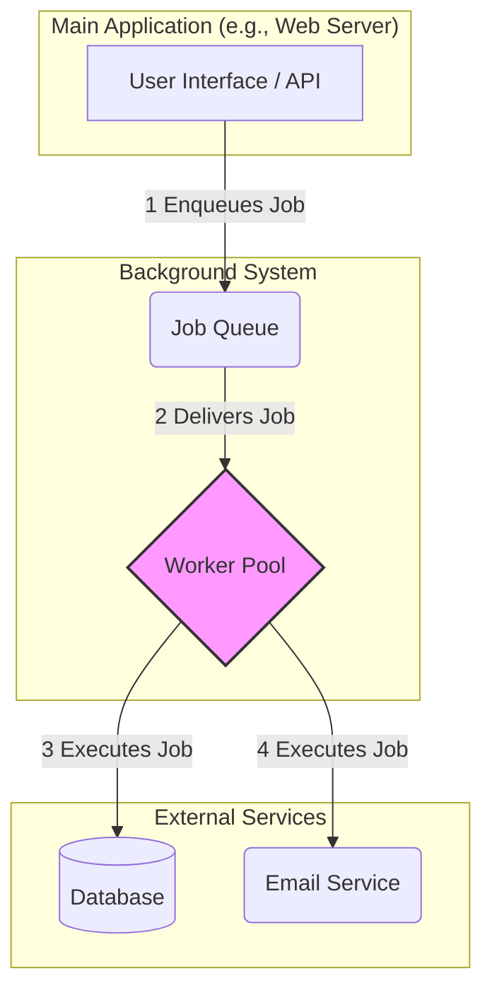
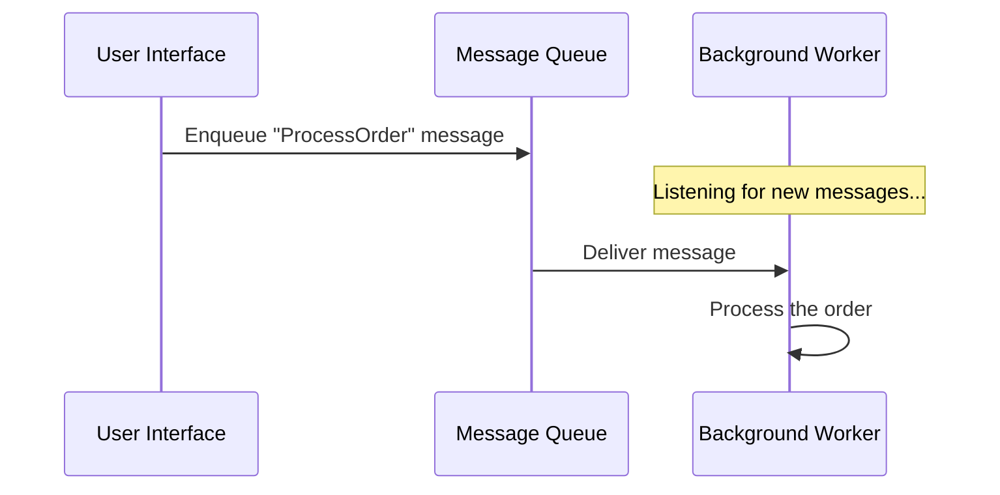
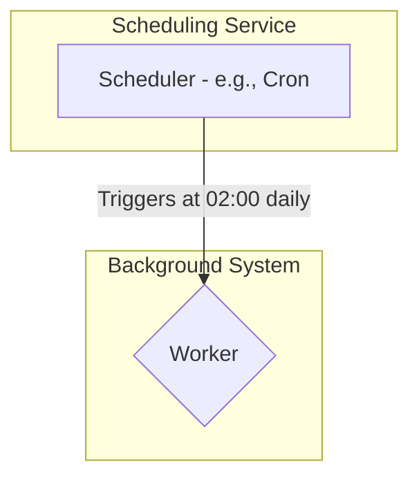
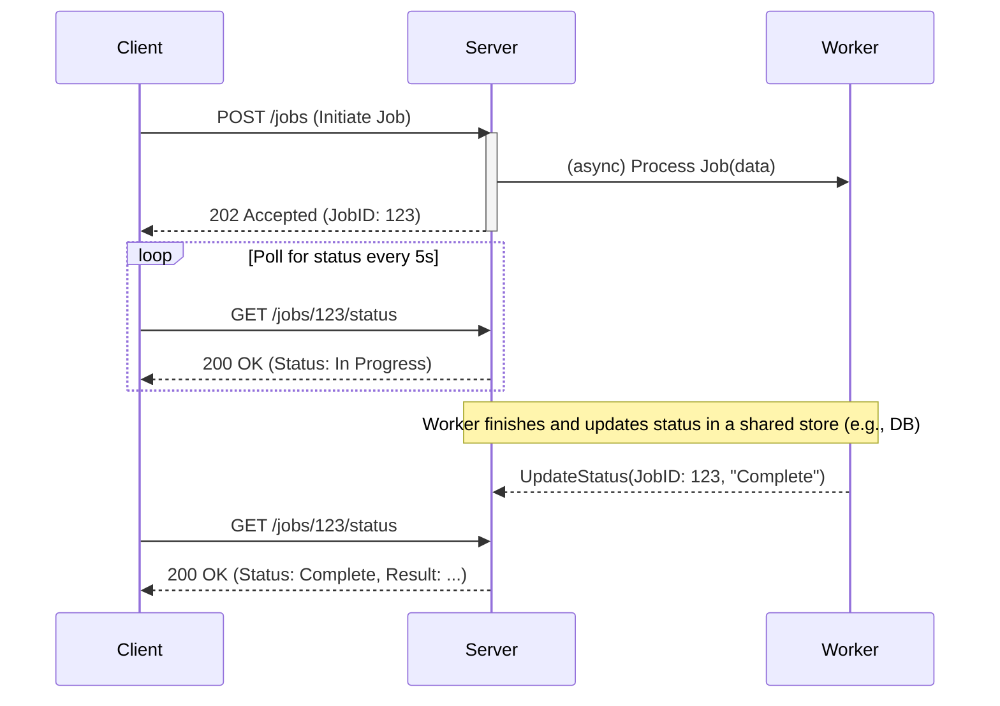
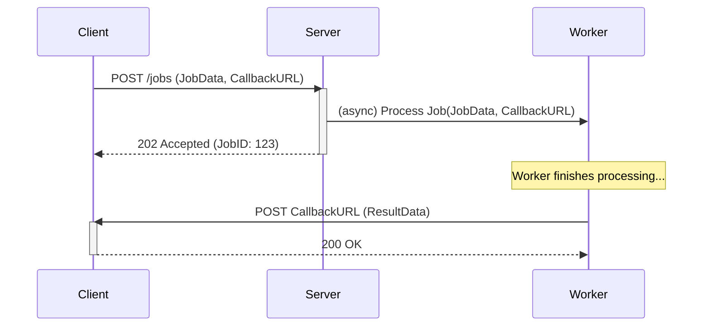
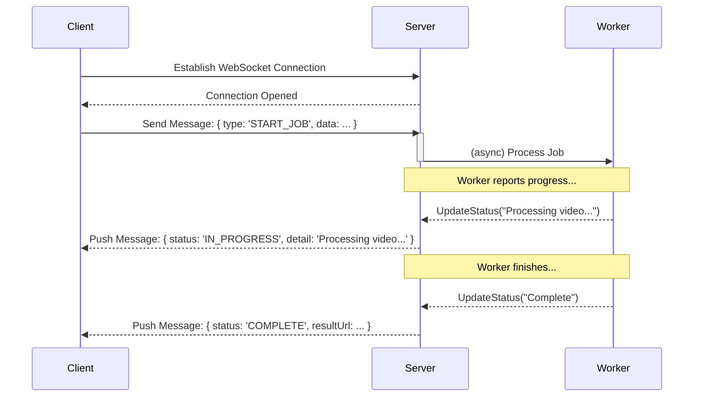

# Background Jobs Pattern

The **Background Jobs** pattern is a fundamental approach in system design for offloading tasks to be executed asynchronously, independent of the main application thread or user interface. This pattern is crucial for building responsive, scalable, and resilient applications by preventing long-running operations from blocking the user or a critical process.

A background job can be used for a wide variety of tasks, such as:
- **CPU-intensive processing:** Performing long-running computations like generating a thumbnail for an uploaded video or running a machine learning model.
- **I/O-intensive operations:** Interacting with external services, such as sending emails or push notifications, without making the user wait.
- **Batch processing:** Handling large volumes of data, such as importing a CSV file, generating nightly reports, or backing up a database.
- **Maintenance tasks:** Performing routine cleanup of old data or re-indexing a search database.

The core principle is to decouple the task invocation from its execution. The main application simply triggers the job and can immediately continue its primary work.

*Description: The diagram shows a typical flow. The main application receives a request and, instead of processing it directly, places a job in a queue. A separate pool of workers consumes jobs from the queue and executes them, interacting with other services as needed. This decouples the main application from the heavy lifting.*

---

## Triggering Mechanisms

Background jobs can be initiated in several ways, but the two most common triggers are events and schedules.

### 1. Event-Driven Triggers

In an [[event-driven|event-driven architecture]], a background job is started in response to an event that occurs in the system. This is the most common and powerful way to trigger asynchronous work, as it allows the system to react dynamically to user actions or state changes.

This is typically implemented using a **[[message-queue|Message Queue]]** or a **[[publish-subscribe|Publish-Subscribe]]** channel.

- **How it works:** An application (the **Producer**) publishes a message to a channel. A background worker (the **Consumer**) listening on that channel receives the message and executes the job.
- **Examples:**
    - A user places an order, and an `OrderPlaced` event is sent to a queue. A background worker processes this event to handle payment, update inventory, and send a confirmation email.
    - A user uploads a profile picture. The file upload event triggers a background job to resize the image into different formats.
- **Technologies:** [[message-queue|Message queues]] like RabbitMQ, Amazon SQS, or event brokers like Apache Kafka, which are implementations of the [[broker|Broker Pattern]].

*Description: The UI sends a message to a queue and immediately becomes free. A worker picks up the message asynchronously to process it.*

### 2. Schedule-Driven Triggers

Schedule-driven jobs are executed at specific, predetermined times or intervals. This approach is less dynamic than event-driven triggers but offers simplicity and predictability, making it ideal for routine maintenance and batch processing tasks.

- **How it works:** A scheduler, often configured with a `cron` expression, invokes the job at a defined frequency (e.g., every hour, or at 2 AM every Sunday). The job is executed regardless of the system's state or user activity.
- **Use Cases:**
    - **Batch Processing:** Generating daily sales reports, updating machine learning models with new data, or processing nightly payroll.
    - **Data Maintenance:** Regularly archiving old records, cleaning up temporary files, or re-building search indexes.
    - **System Health Checks:** Pinging services every few minutes to ensure they are responsive.
- **Trade-offs:** While simple and reliable, this model can introduce latency. A task is only processed at its next scheduled time, not immediately when a state change occurs. For immediate processing, an event-driven approach is superior.
- **Technologies:** The classic `cron` utility on Linux, Kubernetes `CronJob` resources, or managed cloud services like **AWS Lambda Scheduled Events**, **Azure Logic Apps**, and **GCP Cloud Scheduler**.

*Description: A scheduler triggers a worker process at a fixed time or interval to perform a routine task.*

---

## Returning Results

Since background jobs are asynchronous ("fire and forget"), the calling process does not wait for completion. However, it often needs to know the status or result of the job. Several patterns can be used to handle this.

### 1. Polling

The client application periodically polls a status endpoint or a database value to check if the job is complete.

*Description: The client initiates a job with the server, which delegates it asynchronously to a worker and immediately returns a Job ID. The client uses this ID to poll the server periodically. Meanwhile, the worker processes the job and updates its status upon completion. On the next poll, the server returns the 'Complete' status to the client.*

- **Pros:** Simple to implement.
- **Cons:** Can be inefficient, introduces latency in detecting completion, and adds load to the status endpoint.

### 2. Callback / Webhook

The initial request from the client includes a "callback URL" (a webhook). When the background job is finished, the worker is responsible for sending an HTTP POST request to this URL with the result.

*Description: The client provides a callback URL when starting the job. Once the worker completes the task, it sends the result directly to the client's URL.*

- **Pros:** Efficient and provides near real-time notification.
- **Cons:** Requires the client to expose a public, stable endpoint, which can be complex and introduces security considerations (e.g., the client must validate that the callback is legitimate).

### 3. Real-time Notifications

For a richer user experience, a persistent connection can be established between the client and server. The server can then push status updates to the client as the job progresses.

*Description: The client maintains an open WebSocket connection. The server pushes status updates and the final result to the client over this connection as they become available.*

- **Pros:** Provides the best user experience with granular, real-time updates.
- **Cons:** The most complex to implement, as it requires managing persistent connections, which can be stateful and harder to scale.
- **Technologies:** WebSockets, Server-Sent Events (SSE).

---

## Key Considerations

- **Idempotency:** A background job should be designed to be idempotent, meaning it can be executed multiple times with the same input but produce the same result. This is critical because in a distributed system, a job might be delivered more than once.
- **Error Handling & Retries:** Failures are inevitable. Implement robust error handling and a [[posa|Retry]] strategy (e.g., exponential backoff) for transient failures. For permanent failures, use a **Dead-Letter Queue (DLQ)** to store failed messages for later inspection.
- **Scalability:** The worker pool can be scaled independently of the main application, allowing you to handle a high volume of jobs. This is a key benefit of the pattern.

---

## Resources & links

### Articles

1.  **[Recommendations for developing background jobs - Microsoft Azure Well-Architected Framework](https://learn.microsoft.com/en-us/azure/well-architected/design-guides/background-jobs)**
    This guide offers recommendations for developing background jobs, covering triggers, data return strategies, and hosting options within the Azure ecosystem.

2.  **[Design Resilient Systems with Background Jobs - Medium](https://medium.com/@smrutid12/background-jobs-in-system-design-a-technical-perspective-6c21d3d9c8c6)**
    This article defines background jobs as asynchronous operations vital for scalable systems, exploring different types of jobs and the queue technologies that enable them.