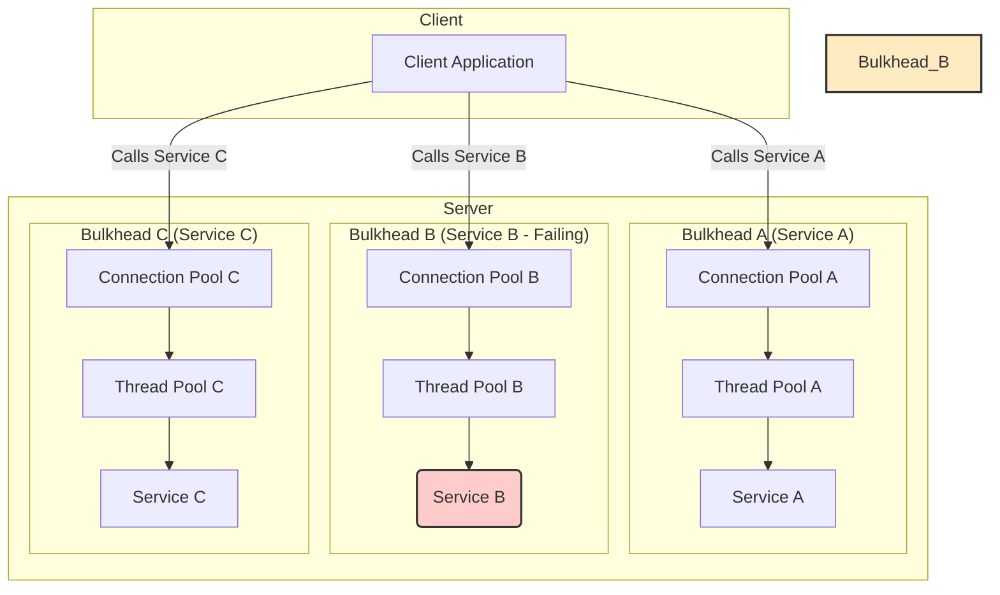

# Bulkhead Pattern

The **Bulkhead** pattern is a design strategy for building fault-tolerant applications. It isolates elements of an application into separate pools so that if one fails, the others can continue to function. The name comes from the sectioned partitions (bulkheads) in a ship's hull; if the hull is compromised, only the damaged section fills with water, preventing the ship from sinking. It is one of the resiliency patterns catalogued in the **[[posa|Pattern-Oriented Software Architecture (POSA)]]** series of books.

In software, a failure in one component (e.g., a slow downstream service) can exhaust critical resources like threads or connections. This resource exhaustion can cascade, bringing down the entire system. The Bulkhead pattern prevents this by partitioning resources and allocating them to specific components.


*Description: Resources are partitioned into bulkheads. When Service B fails, it only exhausts the resources in Bulkhead B. Services A and C remain unaffected and can still serve requests.*

---

## Why Use the Bulkhead Pattern?

- **Fault Isolation:** Contains failures within a single "bulkhead," preventing them from spreading and causing a system-wide outage.
- **Resilience:** Allows the system to withstand partial failures and continue to operate, albeit with potentially reduced functionality.
- **Predictable Performance:** By limiting the resources a single component can consume, the pattern prevents a "[[performance-antipatterns#Noisy Neighbor|noisy neighbor]]" from degrading the performance of the entire system.

---

## Types of Bulkheads

The Bulkhead pattern can be implemented at different levels.

### 1. Thread Pool Bulkhead

This is the most common implementation. The application maintains separate thread pools for calls to different services. If a call to `ServiceB` is slow and blocks, it will only exhaust the threads in its dedicated pool. The threads for `ServiceA` and `ServiceC` remain available.

**Example: Using Resilience4j in Java**

Libraries like Resilience4j provide a straightforward way to implement thread pool bulkheads.

```java
// Create a bulkhead that limits concurrent calls to 20
// and has a queue of 5 for waiting requests.
BulkheadConfig config = BulkheadConfig.custom()
    .maxConcurrentCalls(20)
    .maxWaitDuration(Duration.ofMillis(500))
    .build();

// Create a ThreadPoolBulkhead with more detailed configuration
ThreadPoolBulkheadConfig threadPoolConfig = ThreadPoolBulkheadConfig.custom()
    .maxThreadPoolSize(10) // Max threads in the pool
    .coreThreadPoolSize(2)  // Core threads that are always present
    .queueCapacity(20)      // Queue for tasks when all threads are busy
    .build();

// Create a Bulkhead registry to manage instances
BulkheadRegistry registry = BulkheadRegistry.of(config);
ThreadPoolBulkheadRegistry threadPoolRegistry = ThreadPoolBulkheadRegistry.of(threadPoolConfig);

// Get a bulkhead instance by name
Bulkhead bulkhead = registry.bulkhead("serviceA");
ThreadPoolBulkhead threadPoolBulkhead = threadPoolRegistry.bulkhead("serviceB");

// Decorate a supplier with the bulkhead
Supplier<String> decoratedSupplier = Bulkhead.decorateSupplier(bulkhead, () -> myRemoteCall());
```

### 2. Connection Pool Bulkhead

Similar to thread pools, you can maintain separate connection pools for different services. If a service's database is slow, it will only exhaust its own connection pool, not the application's global pool.

### 3. Process/Container Bulkhead

In a [[microservices]] architecture, each service runs in its own process or container. This is a form of bulkhead at the process level. Container orchestration platforms like Kubernetes take this further by allowing you to set resource limits (CPU, memory) for each container. This ensures that a memory leak or a CPU-intensive bug in one service cannot starve other services running on the same host machine.

---

## Relationship with Other Resiliency Patterns

The Bulkhead pattern is a core component of a resilient architecture and is often used with other patterns:

- **[[circuit-breaker|Circuit Breaker]]:** This is a crucial pairing. A circuit breaker detects when a service is failing and stops sending requests to it. When combined with a bulkhead, the circuit breaker for `ServiceB` would trip, preventing new calls and immediately releasing the threads in Bulkhead B's pool, rather than having them block until they time out.

- **[[retry|Retry]]:** Retries should be done with caution. A retry for a failing service can put more pressure on an already exhausted bulkhead pool. It's often better to let the circuit breaker open and fail fast.

- **[[posa#Timeout|Timeout]]:** Every call made within a bulkhead should have a timeout. This ensures that a thread in the pool is not blocked indefinitely and can eventually be released, even if the circuit breaker fails to open.

---

## Challenges

- **Increased Complexity:** Partitioning the system into isolated components can make the overall design more complex to manage.
- **Resource Fragmentation:** Segregated resource pools can sometimes lead to underutilization. `PoolA` might be idle while `PoolB` is overwhelmed. This is a trade-off: you sacrifice some efficiency for a significant gain in resilience.
- **Configuration:** The size of each bulkhead (e.g., the number of threads in a pool) needs to be carefully configured based on expected load and performance testing.

---

## Resources & Links

### Articles

1.  **[Bulkhead pattern - Azure Architecture Center](https://learn.microsoft.com/en-us/azure/architecture/patterns/bulkhead)**
    The official Microsoft documentation provides a comprehensive overview of the Bulkhead pattern. It explains how isolating resources for backend services can prevent cascading failures and improve system resilience. The article discusses different implementation strategies, such as partitioning by connection pools, thread pools, and processes, and provides guidance on when to use this pattern.

2.  **[Bulkhead Pattern - GeeksforGeeks](https://www.geeksforgeeks.org/system-design/bulkhead-pattern/)**
    This article offers a clear and concise explanation of the Bulkhead pattern, using the ship analogy to illustrate the core concept. It details the benefits of the pattern, such as improved fault tolerance and performance, and discusses various implementation types. The article also provides a simple Java example to demonstrate how the pattern can be applied in code.

### Videos

1.  **[The Bulkhead Pattern](https://www.youtube.com/watch?v=Kh3HxWk8YF4)**
    This video provides a high-level, conceptual overview of the Bulkhead pattern. It explains the problem of cascading failures and how resource partitioning can prevent them. The video is a great starting point for understanding the "why" behind the pattern and its importance in building resilient systems.

2.  **[Bulkhead Pattern Explained: Resilience in Microservices](https://www.youtube.com/watch?v=2I3-lbnMXec)**
    This video focuses on the application of the Bulkhead pattern in a microservices architecture. It demonstrates how to implement thread pool bulkheads using the Resilience4j library in a Spring Boot application. The video provides a practical, hands-on example of how to configure and use bulkheads to protect against failures in downstream services.