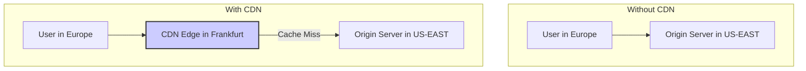
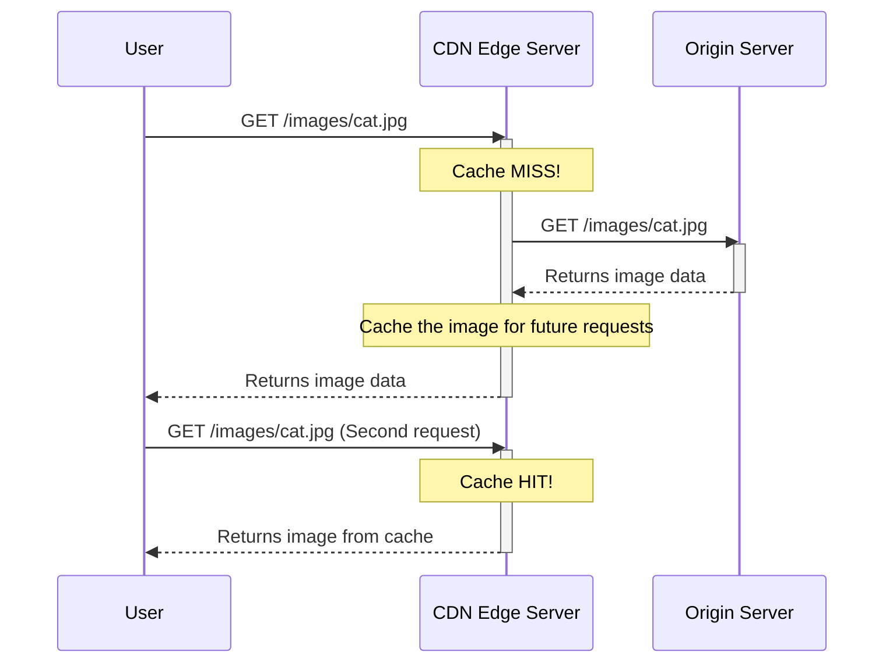
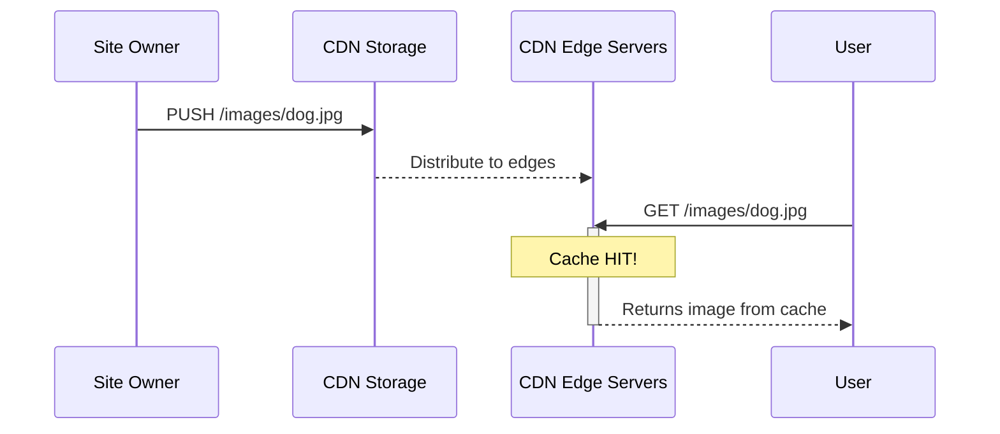

# Content Delivery Network (CDN)

A **Content Delivery Network (CDN)** is a pattern that uses a globally distributed network of proxy servers to [[caching|cache]] and serve content from locations that are physically closer to the end-user. By reducing the physical distance between the user and the content, CDNs dramatically decrease [[system-design-fundamentals|latency]] and improve application performance.

Typically, CDNs are used for serving static assets that don't change often, such as images, videos, CSS stylesheets, and JavaScript libraries. However, modern CDNs can also cache dynamic content and even run code at the edge.


*Description: Without a CDN, a user in Europe must fetch content from a distant server in the US, resulting in high latency. With a CDN, the user fetches the same content from a nearby "edge" location in Frankfurt, resulting in a much faster response.*

---

## How CDNs Improve Performance

1.  **Reduced Latency:** The primary benefit. By caching content in multiple Points of Presence (PoPs) around the world, a CDN ensures that a user's request travels a much shorter physical distance, significantly reducing the round-trip time (RTT).

2.  **Reduced Origin Server Load:** By serving [[caching|cached]] content from the edge, a CDN absorbs a significant portion of traffic that would otherwise hit the origin server. This frees up the origin server's resources (CPU, memory, bandwidth) to focus on its core tasks, like processing dynamic requests and business logic.

3.  **Increased Availability:** The distributed nature of a CDN provides inherent redundancy. If one edge server is down, traffic can be automatically rerouted to another nearby server. Some CDNs can even serve stale content from the cache if the origin server is unavailable, keeping the site online.

### The Role of DNS

A CDN relies heavily on **[[dns|DNS]]** to work its magic. When a user requests a resource from a CDN-enabled domain, the DNS query is resolved by a specialized DNS service. Using **Geolocation-based routing**, the DNS server detects the user's geographic location and returns the IP address of the nearest edge server (PoP). This ensures the user is transparently connected to the optimal location.

---

## CDN Models: Pull vs. Push

There are two main strategies for getting content onto the CDN: Pull and Push.

### 1. Pull CDN

A Pull CDN operates on an on-demand, reactive basis. You leave your content on your origin server and simply rewrite the URLs for your assets to point to the CDN. When a user requests an asset for the first time, the CDN "pulls" it from your origin server, caches it, and then serves it to the user.


*Description: On the first request, the CDN has a cache miss and must fetch the content from the origin. Subsequent requests are served directly from the CDN's cache until the TTL expires.*

-   **Pros:** Easy to set up, and storage on the CDN is minimized as only requested content is cached.
-   **Cons:** The first request for any new asset is slower. Can result in redundant traffic if content expires and is re-pulled before it has actually changed.
-   **Best for:** Sites with a large volume of assets and high traffic, where it's impractical to push all content to the CDN proactively.
This strategy is conceptually similar to the [[caching#1-cache-aside-lazy-loading|Cache-Aside (Lazy Loading)]] pattern used in application-level caching.

### 2. Push CDN

A Push CDN requires you to proactively upload your content directly to the CDN's storage. You are fully responsible for managing the content on the CDN. When content is updated, you must push the new version.


*Description: The site owner pushes content to the CDN, which distributes it to its edge locations. All user requests are then served directly from the cache.*

-   **Pros:** Faster performance for all requests (no initial cache miss). Gives you fine-grained control over what content is on the CDN and when it expires.
-   **Cons:** Requires a more complex upload process. Can lead to higher storage costs on the CDN.
-   **Best for:** Sites with a smaller amount of content or with large files that are not updated frequently, such as software installers, video-on-demand libraries, or game assets.

### Advanced Pull Strategy: Proactive Cache Invalidation

This advanced strategy enhances the standard Pull CDN to provide the immediate content freshness typically associated with a Push model. It achieves this by using proactive **cache invalidation** to overcome the challenge of long TTLs.

The core problem is: "How do you tell the CDN that content has changed on the origin server before its TTL expires?" The answer is to explicitly invalidate the cache.

There are two primary methods for this:

1.  **API Purging:** Most CDN providers offer an API to selectively "purge" or "invalidate" content. When a file is updated on your origin server, your deployment process can make an API call to the CDN, telling it to delete its cached copy. The next time a user requests the file, the CDN will be forced to pull the fresh version from the origin.

2.  **Versioning (Cache Busting):** This is the most robust and widely used strategy. Instead of using a static filename like `style.css`, the file is named with a unique identifier that changes whenever the content changes (e.g., `style.a1b2c3d4.css`). This is typically handled automatically by modern web development build tools.

    ```mermaid
    sequenceDiagram
        participant User
        participant CDN
        participant Origin

        User->>CDN: GET /style.a1b2c3d4.css (New Version)
        activate CDN
        Note over CDN: Cache MISS! (URL is new)
        CDN->>Origin: GET /style.a1b2c3d4.css
        activate Origin
        Origin-->>CDN: Returns new CSS file
        deactivate Origin
        CDN-->>User: Serves new file & caches it
        deactivate CDN
    ```
    *Description: By changing the asset's URL, we guarantee that the CDN will have a cache miss and be forced to fetch the new version from the origin.*

This "Pull with Invalidation" strategy provides an excellent balance, offering the operational simplicity of a Pull CDN with the immediate update benefits of a Push model.

---

## Resources & links

### Articles

1.  **[System Design Primer - Content Delivery Network](https://github.com/donnemartin/system-design-primer#content-delivery-network)**
    A concise and practical overview of CDNs within the context of system design, covering the core concepts, Push vs. Pull models, and key trade-offs.

2.  **[The Differences Between Push and Pull CDNs - Travel Blog Advice](http://www.travelblogadvice.com/technical/the-differences-between-push-and-pull-cdns/)**
    A clear, non-technical explanation of the two main CDN models, helping to understand the practical differences and use cases for each.

3.  **[Content delivery network - Wikipedia](https://en.wikipedia.org/wiki/Content_delivery_network)**
    The Wikipedia article provides a comprehensive and detailed history of CDNs, their technical workings, and their role in the modern internet infrastructure.
