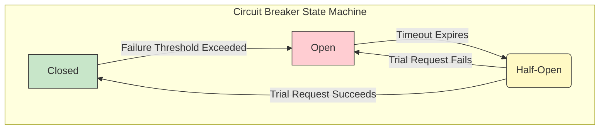

# Circuit Breaker Pattern

The **Circuit Breaker** pattern is a stateful resiliency pattern used to prevent an application from repeatedly trying to execute an operation that is likely to fail. When a remote service is failing or latent, repeated calls can exhaust critical resources (like threads, CPU, and memory) and lead to cascading failures across the system.

The circuit breaker acts as a proxy or state machine for operations that might fail. It monitors for failures and, if they reach a certain threshold, it "trips" or "opens the circuit," causing subsequent calls to fail immediately without ever attempting to contact the remote service. This gives the failing service time to recover.

## The Three States of a Circuit Breaker

The pattern has three distinct states:

1.  **Closed**: This is the normal, operational state. Requests are passed through to the remote service. The circuit breaker counts the number of recent failures. If the failure count exceeds a configured threshold within a time period, the breaker trips and moves to the `Open` state.

2.  **Open**: In this state, the circuit breaker immediately rejects all incoming requests with an error, without attempting to execute the underlying operation. This is a "fail-fast" mechanism. After a configured timeout, the breaker moves to the `Half-Open` state.

3.  **Half-Open**: The breaker allows a limited number of trial requests to pass through to the remote service.
    *   If these trial requests succeed, the breaker assumes the service has recovered and transitions back to the `Closed` state, resetting its failure counts.
    *   If any trial request fails, the breaker trips again and returns to the `Open` state, restarting the recovery timeout.



---

## Why Use the Circuit Breaker Pattern?

- **[[fail-fast|Fail-Fast]]**: Prevents the application from wasting resources on operations that are likely to fail, providing a faster response to the caller.
- **Resilience**: Stops cascading failures. A problem in a downstream service is contained and doesn't bring down the calling service.
- **Automatic Recovery**: The pattern provides a mechanism for the system to automatically detect when a failing service has recovered, without manual intervention.

---

## Fallback Strategies

A critical part of the Circuit Breaker pattern is defining a **fallback** action for when the circuit is open. Instead of just throwing an error, the application can gracefully degrade functionality. Common strategies include:

- **Returning a Cached Response**: If the data is available in a cache, return it. This is suitable for data that doesn't need to be real-time.
- **Returning a Default Value**: Return a static default or a "stubbed" response (e.g., an empty list of transactions).
- **Queueing for Later**: For write operations, the request could be placed in a [[message-queue|queue]] to be processed later when the service recovers.
- **Calling a Secondary Service**: If a replica or secondary service is available, the fallback could route the request there.

**Example: Using Resilience4j in Java**

Libraries like Resilience4j make it easy to implement both a circuit breaker and a fallback.

```java
// Configure a Circuit Breaker
CircuitBreakerConfig config = CircuitBreakerConfig.custom()
    .failureRateThreshold(50) // Trip if 50% of calls fail
    .waitDurationInOpenState(Duration.ofMillis(10000)) // Wait 10s in Open state
    .permittedNumberOfCallsInHalfOpenState(2) // Allow 2 trial requests
    .slidingWindowSize(10) // Base failure rate on the last 10 calls
    .build();

CircuitBreakerRegistry registry = CircuitBreakerRegistry.of(config);
CircuitBreaker circuitBreaker = registry.circuitBreaker("myService");

// Define a fallback function
Supplier<String> fallback = () -> "Returning a cached or default value";

// Decorate the original call with the circuit breaker and a fallback
Supplier<String> decoratedSupplier = Decorators.ofSupplier(this::myRemoteCall)
    .withCircuitBreaker(circuitBreaker)
    .withFallback(CallNotPermittedException.class, e -> fallback.get())
    .decorate();

// Execute the decorated call
String result = decoratedSupplier.get();
```

---

## Relationship with Other Resiliency Patterns

- **[[bulkhead|Bulkhead]]:** These two patterns are the cornerstones of resiliency. The Bulkhead pattern isolates resources (like thread pools) for different services, while the Circuit Breaker prevents calls to a failing service. They are almost always used together. A call from a thread in a bulkhead pool is wrapped in a circuit breaker.

- **[[retry|Retry]]:** The Retry pattern can be used *inside* a circuit breaker's logic. For example, you might configure the circuit breaker to consider an operation a "failure" only after 3 retry attempts have failed. However, you should not retry when the circuit is open; the point of the open state is to fail fast.

- **[[timeout|Timeout]]:** A timeout is a critical signal for a circuit breaker. A call that times out is typically counted as a failure. The circuit breaker's failure threshold is often based on a combination of exceptions and timeouts.

---

## Challenges

- **Configuration**: The thresholds for failure rates and recovery timeouts need to be carefully tuned. If too sensitive, the breaker may trip unnecessarily. If not sensitive enough, it may not prevent cascading failures effectively.
- **Distributed State**: In a distributed system with multiple instances of a service, you might need a distributed circuit breaker that shares its state across all instances, which adds complexity.
- **Fallback Logic**: Implementing meaningful fallback logic can be difficult. For some operations, there may be no reasonable fallback other than returning an error.

## **Resources & links**

### **Articles**

1.  **[Circuit Breaker Pattern](https://learn.microsoft.com/en-us/azure/architecture/patterns/circuit-breaker)**

A comprehensive guide from Microsoft Azure Architecture Center explaining the Circuit Breaker pattern, its states (Closed, Open, Half-Open), benefits in preventing cascading failures, and considerations for implementation in distributed systems. It emphasizes how this pattern enhances resilience by gracefully handling service outages.

2.  **[What is Circuit Breaker Pattern in Microservices?](https://www.geeksforgeeks.org/system-design/what-is-circuit-breaker-pattern-in-microservices/)**

This article delves into the Circuit Breaker pattern specifically within microservices architectures. It details the three states of the circuit breaker, its role in improving fault tolerance and system responsiveness, and practical aspects of its implementation to protect shared resources and manage intermittent connectivity.

---

### **Videos**

1.  **[Circuit Breaker Pattern in Microservices](https://www.youtube.com/watch?v=dJI2saoM5_k)**

A video explanation that visually clarifies the Circuit Breaker pattern's mechanism and its importance in microservices. It covers the core concepts of how to prevent system overload and ensure stability when downstream services fail, making complex ideas accessible through visual aids.

2.  **[The Circuit Breaker Pattern | Resilient Microservices](https://www.youtube.com/watch?v=5_Bt_OEg0no)**

This video focuses on the application of the Circuit Breaker pattern for building resilient microservices. It discusses how the pattern contributes to overall system robustness by isolating failures and allowing services to recover, providing insights into practical strategies for fault-tolerant system design.
