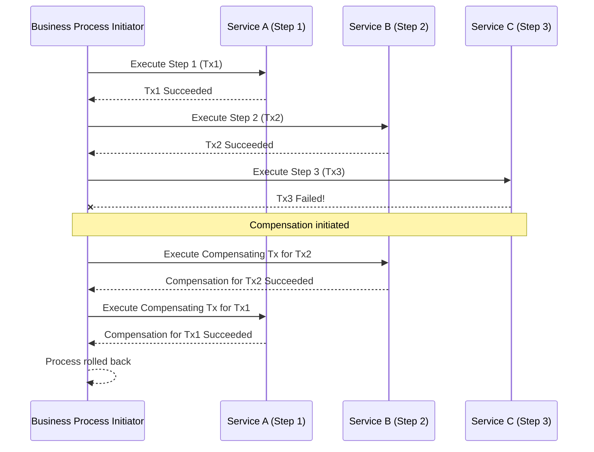

# Compensating Transaction Pattern

The **Compensating Transaction** pattern is a design approach used in distributed systems to undo the effects of a series of previously completed operations if a subsequent operation in the sequence fails. Unlike a traditional database rollback, which discards uncommitted changes, a compensating transaction applies business logic to reverse the work of a committed transaction. It's a crucial mechanism for maintaining data consistency in environments where traditional [[acid|ACID]] (Atomicity, Consistency, Isolation, Durability) transactions spanning multiple services or data stores are not feasible.

## How it Works

In a long-running business process composed of several distinct steps, each step performs a local transaction and commits its changes. If any step later in the process fails, the system must revert the effects of the preceding successful steps. This is achieved by executing a corresponding compensating transaction for each completed step, typically in reverse order.

A compensating transaction is a new operation that is the logical inverse of an original operation. For example:
*   To compensate for a "Debit Account" operation, a "Credit Account" operation is performed.
*   To compensate for a "Book Flight" operation, a "Cancel Flight" operation is performed.

The workflow orchestrating the process must keep track of all successful steps and their corresponding compensation actions. If a failure occurs, it triggers the execution of these compensation actions.

## Key Characteristics

*   **Eventual Consistency:** This pattern is fundamental for achieving [[consistency#Eventual Consistency|eventual consistency]] in distributed systems. The system might be in an inconsistent state temporarily (after a step commits but before compensation completes), but it eventually reaches a consistent state.
*   **Logical Reversal:** It performs a business-specific reversal rather than a technical rollback. The original transaction and its compensation both remain in the system's history, providing an audit trail.
*   **Idempotency:** Compensating transactions must be designed to be [[idempotent-operations|idempotent]]. This means that if the same compensating action is triggered multiple times (e.g., due to message retries or network issues), it should only execute its logic once. A naive implementation like simply crediting an account is not idempotent. To achieve idempotency, the handler for the compensating transaction should first check if the action has already been performed. For instance, before issuing a refund, it should verify if a refund for that specific original transaction ID has already been processed. This prevents duplicate compensations, ensuring that a customer is not refunded multiple times for the same failed operation.
*   **Can Fail:** A compensating transaction can itself fail. Robust error-handling strategies are required, such as retries (with exponential backoff), manual intervention, or alerting mechanisms. The system must be designed to be resilient to such failures.
*   **Order Matters:** Compensating transactions must typically be executed in the reverse order of the original successful transactions to ensure proper state reversal.

## Use Cases

*   **Long-Running Business Processes:** Essential for workflows that span multiple services, involve human interaction, or take a significant amount of time, where holding locks for the entire duration is impractical.
*   **Distributed Transactions (Sagas):** It is a core component of the [[saga|Saga Pattern]], enabling data consistency across multiple microservices, each with its own database.
*   **Integration with External Systems:** When interacting with third-party services, legacy systems, or non-transactional data stores that do not support global [[acid|ACID]] transactions.
*   **Cloud-Native Applications:** Widely used in cloud environments where distributed architectures and eventual consistency are common.

## Advantages

*   **Enables Consistency in Distributed Systems:** Provides a mechanism to achieve data consistency across disparate services without relying on costly and often impractical distributed [[acid|ACID]] transactions.
*   **Improved Resilience:** Allows long-running processes to complete even if intermediate steps fail, by providing a clear path to revert to a consistent state.
*   **Reduced Resource Locking:** Avoids holding database locks for extended periods, improving system throughput and scalability.
*   **Auditability:** Both the original and compensating transactions are recorded, providing a complete history of operations.

## Disadvantages and Challenges

*   **Complexity:** Designing and implementing robust compensating logic is complex. Each business operation needs a well-defined inverse, and the overall workflow must manage the state and trigger compensations correctly.
*   **No True Isolation:** The effects of successful intermediate steps are visible to other parts of the system before the entire process completes or is compensated. This can lead to "dirty reads" if other processes act on data that might later be undone.
*   **Compensation Failure:** Compensating transactions can fail. Handling these failures (e.g., through retries, [[message-queue#Dead-Letter Queue (DLQ)|dead-letter queues]], or manual intervention) adds significant complexity.
*   **Irreversible Operations:** Some operations are inherently irreversible (e.g., sending an email, launching a rocket). For such operations, compensation might involve a subsequent action (e.g., sending a follow-up email explaining the error) rather than a true undo, or the system must be designed to prevent failure after such a step.
*   **Application-Specific Logic:** Compensating logic is highly application-specific and cannot be generalized or automated by a generic transaction manager.

## Related Patterns and Concepts

*   **[[saga|Saga Pattern]]:** The primary architectural pattern that heavily relies on compensating transactions to manage distributed transactions.
*   **[[idempotent-operations|Idempotency]]:** A critical property for compensating transactions to ensure reliable execution in the face of retries.
*   **[[event-driven|Event-Driven Architecture]]:** Often used in conjunction with compensating transactions, where events trigger both forward progress and compensation flows.
*   **[[circuit-breaker|Circuit Breaker Pattern]]:** Can be used to prevent cascading failures in distributed systems, potentially reducing the need for compensation if failures are caught early.
*   **[[retry|Retry Pattern]]:** Can minimize the need for compensating transactions by handling transient failures, allowing operations to succeed on subsequent attempts.
*   **Business Process Management (BPM) Systems:** Often provide built-in support for defining and executing long-running processes with compensation logic.

## Resources & links

### Articles

1.  **[Compensating Transaction pattern - Microsoft Azure](https://learn.microsoft.com/en-us/azure/architecture/patterns/compensating-transaction)**

    The official documentation from Microsoft's Azure Architecture Center. It provides a detailed breakdown of the pattern, its challenges, and when to use it, with a focus on cloud-based applications.

2.  **[Compensating Transaction Design Pattern - David Mosyan](https://medium.com/@dmosyan/compensating-transaction-design-pattern-c7bf921580fe)**

    A clear explanation of the pattern, focusing on its role in achieving eventual consistency in distributed systems. It highlights the difference between a technical rollback and a logical compensation.

3.  **[Compensating Transaction in Microservices - Javed Iqbal](https://medium.com/codex/compensating-transaction-in-microservices-15b1f88a7c29)**

    This article details how the pattern is applied specifically within a microservices architecture to maintain data consistency. It connects the concept directly to the Saga pattern as a primary implementation strategy.
