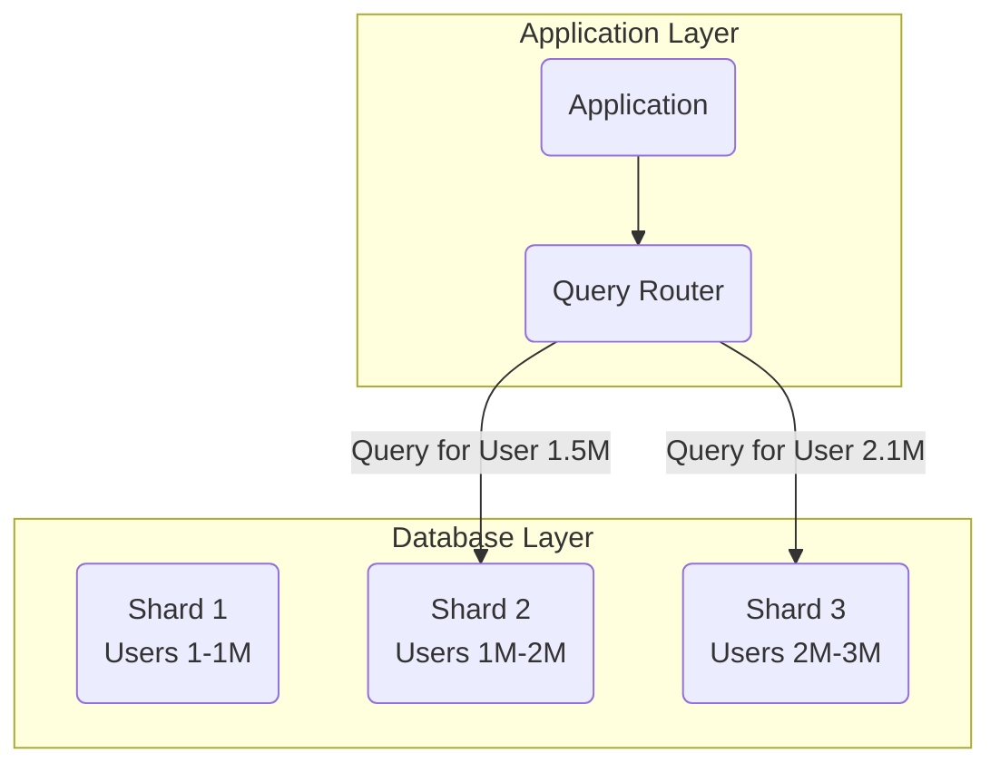
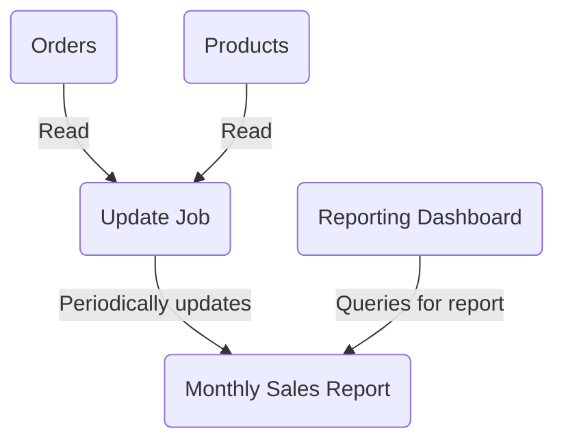
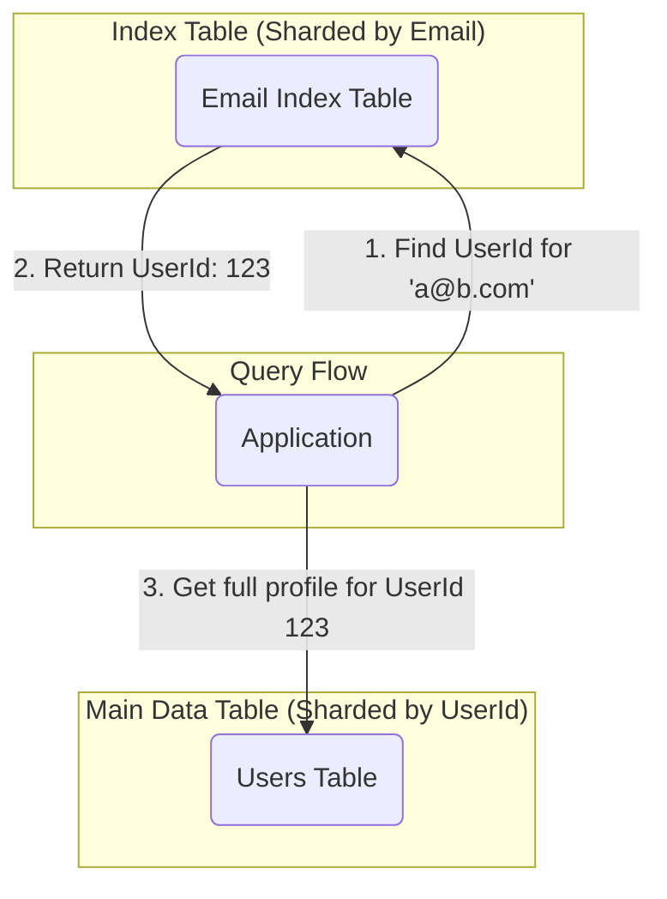

# Data Management Patterns

Data management is a critical element of cloud applications and influences most quality attributes. The patterns on this page cover common strategies to solve challenges of performance, [[software-architecture/system-design-fundamentals/index#Scalability|scalability]], and availability found when working with both traditional [[rdbms|Relational Databases]] and modern [[nosql|NoSQL Databases]]. Data is often hosted in different locations and across multiple servers, which requires specific patterns to maintain consistency and efficiency.

This page covers a collection of patterns designed to solve common problems in data management.

---

## 1. Data Storage

Choosing the right data storage solution is fundamental to system design, impacting [[software-architecture/system-design-fundamentals/index#Scalability|scalability]], performance, and cost.

*   **[[rdbms|Relational Databases (SQL)]]**: Traditional databases emphasizing [[acid|ACID]] properties, structured schemas, and powerful querying with SQL. Ideal for complex transactions and [[data-integrity|data integrity]].
*   **[[nosql|NoSQL Databases]]**: A diverse category of databases offering flexible schemas, horizontal [[software-architecture/system-design-fundamentals/index#Scalability|scalability]], and high performance for specific workloads. Includes:
    *   **Document Stores**: For semi-structured data (e.g., MongoDB).
    *   **Key-Value Stores**: For simple, high-speed data retrieval (e.g., Redis).
    *   **Graph Databases**: For highly interconnected data (e.g., Neo4j).
    *   **Column-Family Stores**: For large-scale analytical workloads (e.g., Cassandra).
*   **Object Storage**: Highly scalable and durable storage for unstructured data like images, videos, and backups (e.g., Amazon S3, Azure Blob Storage). Often used in conjunction with [[static-content-hosting|Static Content Hosting]].

---

## 2. Data Access

Efficient data access is crucial for application performance and responsiveness.

*   **[[caching|Caching]]**: Storing copies of frequently accessed data closer to the consumer to reduce latency and load on primary data sources.
*   **[[cdn|Content Delivery Network (CDN)]]**: Distributing static and dynamic content globally to reduce latency for end-users.
*   **Data Lakes**: Centralized repositories that store vast amounts of raw data in its native format, suitable for big data analytics.
*   **Data Warehouses**: Optimized for analytical queries and reporting, typically storing structured and transformed data from various sources.

---

## 3. Data Consistency

Ensuring data consistency across distributed systems is a fundamental challenge, often involving trade-offs with availability and latency.

*   **[[consistency|Consistency Models]]**: Different models define the guarantees about when data updates become visible to readers:
    *   **Strong Consistency**: Guarantees that every read returns the most recent write.
    *   **Eventual Consistency**: Guarantees that all replicas will eventually converge to the same value if no new updates are made.
*   **[[cap|CAP Theorem]]**: A fundamental principle stating that a distributed system can only guarantee two out of three properties: Consistency, Availability, and Partition Tolerance.

---

## 4. Data Partitioning

Dividing data into smaller, more manageable pieces to improve [[software-architecture/system-design-fundamentals/index#Scalability|scalability]] and performance.

*   **[[sharding|Sharding]]**: Horizontally partitioning a large dataset across multiple independent data stores (shards).
*   **Partitioning**: General term for dividing a database into smaller, independent sections, often by function (vertical partitioning) or rows (horizontal partitioning/sharding).

---

## 5. Data Replication

Creating and maintaining multiple copies of data to ensure high availability and read [[software-architecture/system-design-fundamentals/index#Scalability|scalability]].

*   **[[availability-patterns#Master-Slave Replication|Master-Slave Replication]]**: One node handles all writes, and data is replicated to read-only slave nodes.
*   **[[availability-patterns#Master-Master (Multi-Master) Replication|Multi-Master Replication]]**: Multiple nodes can accept both read and write operations, with writes replicated between them.

---

## 6. Specific Data Management Patterns

These patterns address particular data-related challenges.

### Sharding

The Sharding pattern is a technique for horizontally partitioning a large dataset across multiple independent data stores (shards). It is a primary strategy for achieving massive [[software-architecture/system-design-fundamentals/index#Scalability|scalability]] and performance when a single database server is no longer sufficient to handle the load.

### Problem

A single database server has finite resources (CPU, memory, storage, I/O). As an application grows, it can hit these limits, leading to slow queries and system failure. Vertical scaling (upgrading the server) is expensive and has an upper limit.

### Solution

Horizontally partition the data. Each shard is a separate, independent database that holds a subset of the total data. A routing layer in front of the shards directs application queries to the correct shard that contains the requested data.

*Diagram: A query router inspects the query and directs it to the appropriate shard based on the shard key (e.g., User ID).* 

### Sharding Strategies

1.  **Range-Based Sharding**: Divides data based on a range of values (e.g., User IDs 1-1000 go to Shard A, 1001-2000 to Shard B). Simple to implement but can lead to hotspots if data is not evenly distributed.
2.  **Hash-Based Sharding**: A hash function is applied to the shard key, and the result determines which shard the data goes to. This typically leads to a more even data distribution but makes range queries (e.g., "find all users in a zip code") very difficult.
3.  **Directory-Based Sharding**: A lookup table (the "directory") maintains a mapping between shard keys and the physical shard location. This is highly flexible but adds the complexity of managing the lookup table itself.

### Considerations

-   **Complexity**: Sharding adds significant operational complexity to the system.
-   **Cross-Shard Joins**: Joins across different shards are extremely inefficient and generally avoided. This often requires denormalizing data.
-   **Rebalancing**: As data grows or access patterns change, shards may need to be split or rebalanced, which is a complex operation.
-   **Shard Key**: The choice of the shard key is critical and difficult to change once the system is live.

### Resources & Links

1.  **[Sharding pattern - Azure Architecture Center | Microsoft Learn](https://learn.microsoft.com/en-us/azure/architecture/patterns/sharding)**
    The official Microsoft documentation for the pattern, explaining how it can improve [[software-architecture/system-design-fundamentals/index#Scalability|scalability]], performance, and availability.

2.  **[Database Sharding: Examples, Strategies, Tools & More | DataCamp](https://www.datacamp.com/blog/database-sharding)**
    A comprehensive article covering the different strategies for sharding, its benefits, and how it compares to other techniques like partitioning and replication.

---

### Materialized View

The Materialized View pattern improves query performance by pre-calculating and storing the results of expensive queries. Instead of computing the results on-the-fly every time, applications query the stored, "materialized" data.

### Problem

Complex queries involving joins, aggregations, and filtering over large datasets can be slow and resource-intensive. This is common in reporting dashboards, analytics, and summary pages where the same expensive query is run repeatedly by many users.

### Solution

Create a separate table or view that stores the pre-computed results. This view is periodically updated from the source data. Applications can then query this simple, pre-computed view directly, resulting in much faster response times.

*Diagram: A background job periodically reads from base tables (Orders, Products) to update the Materialized View (Monthly Sales Report), which is then queried directly by the client.*

### Considerations

-   **Data Staleness**: The biggest trade-off. The data in the materialized view is only as fresh as its last update. This may not be acceptable for all use cases.
-   **Maintenance**: The process for updating the view must be managed. Updates can be triggered on a schedule (e.g., every hour) or when the base data changes (which adds write overhead).
-   **Storage Cost**: The pre-computed data consumes additional storage space.
-   This pattern is a form of [[caching]] and is often used in conjunction with [[cqrs]].

### Resources & Links

1.  **[Materialized View pattern - Azure Architecture Center | Microsoft Learn](https://learn.microsoft.com/en-us/azure/architecture/patterns/materialized-view)**
    Microsoft's official documentation, detailing how pre-populated views can optimize query performance.

2.  **[Understanding Materialized Views | Materialize](https://materialize.com/guides/materialized-views/)**
    A guide that explains what materialized views are, how they differ from standard views, and the importance of "view maintenance" to keep them up-to-date.

---

### Index Table

The Index Table pattern improves query performance by creating a separate table that acts as a secondary index over a primary data store.

While a standard [[rdbms|relational database]] uses a `CREATE INDEX` command for this, the **Index Table pattern** is particularly relevant in two main scenarios:
1.  When using a [[nosql]] database that does not support native secondary indexes.
2.  When using a sharded database (either SQL or NoSQL).

### Problem

An application needs to query a large, sharded dataset using an attribute that is **not** the shard key. For example, finding a user by their `email` address when the `users` table is sharded by `userId`. A simple secondary index on `email` would exist on each shard, but the query router would not know which shard contains the email. This would force it to query *every shard* (a "fan-out" query), which is slow and defeats the purpose of sharding.

### Solution

Create a new, globally-aware table—the Index Table—where the primary key is the attribute you want to query by (e.g., `email`). The columns of this table contain the necessary information to locate the data, such as the primary key (`userId`) and potentially the shard ID. A query first looks up the `email` in the fast, efficient Index Table to get the location of the full data, and then sends a targeted request to the correct shard.

*Diagram: To find a user by email, the application first queries the Index Table to get the `UserId`, then uses that key to efficiently read from the main data table.*

### Considerations

-   **Consistency**: The Index Table and the main data table are two separate data stores that must be kept in sync. A transaction that updates the main table must also update the index table. Failure to do so can lead to data inconsistency.
-   **Write Overhead**: Every write to the main table may now require a second write to the index table, increasing write latency and complexity.
-   **Data Duplication**: The index table duplicates data, which adds to storage costs.

### Resources & Links

1.  **[Index Table pattern - Azure Architecture Center | Microsoft Learn](https://learn.microsoft.com/en-us/azure/architecture/patterns/index-table)**
    The official documentation explaining how to use an index table to support efficient queries in data stores with limited native indexing.
