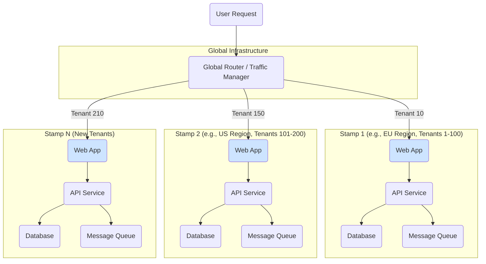

# Deployment Stamp Pattern

The **Deployment Stamp** pattern is a cloud architecture strategy for deploying multiple independent copies of an application and its entire supporting infrastructure. Each self-contained copy is called a **stamp** (or sometimes a *scale unit*, *service unit*, or *cell*). This pattern is primarily used to improve [[software-architecture/system-design-fundamentals/index#Scalability|scalability]], provide strong tenant isolation, and facilitate deployments across multiple geographic regions.

Instead of [[software-architecture/system-design-fundamentals/index#Scalability|scaling up]], the solution is [[software-architecture/system-design-fundamentals/index#Scalability|scaled out]] by adding more stamps as demand grows. A global [[load-balancing|routing layer]] directs traffic to the appropriate stamp, but otherwise, each stamp is autonomous.

## How It Works

The core principle is to define a complete, self-contained application stack and then replicate it.

1.  **Define the Stamp**: A single stamp's architecture is defined using [[iac|Infrastructure as Code (IaC)]]. This includes all necessary resources: web servers, application services, [[databases|databases]], [[message-queue|message queues]], etc.
2.  **Provision Stamps**: Multiple instances of this stamp are provisioned. Each stamp is identical in its composition but is configured for its specific context (e.g., which tenants it serves).
3.  **Route Traffic**: A global routing component sits in front of all the stamps. It inspects incoming requests and uses metadata (like a tenant ID from a [[jwt|JWT]], a subdomain, or a geographic header) to direct the user to their assigned stamp. This router is often a combination of [[dns|DNS]]-based routing and a Layer 7 [[load-balancing|load balancer]].
4.  **Manage and Monitor**: A centralized management plane is used to orchestrate deployments, updates, and [[monitoring|monitoring]] across all stamps, ensuring consistency and operational visibility.

## The Critical Role of Infrastructure as Code

The Deployment Stamp pattern is not merely enhanced by [[iac|Infrastructure as Code (IaC)]]; it is fundamentally enabled by it. Attempting to manage multiple stamps manually is impractical and defeats the purpose of the pattern, which relies on consistency and automation.

IaC serves as the master **blueprint** for a stamp. This blueprint, written in a declarative language like Terraform, Bicep, or CloudFormation, provides several key guarantees:

-   **Repeatability and Consistency**: IaC ensures that every stamp provisioned from the blueprint is identical. This eliminates "configuration drift," where manual changes cause environments to diverge over time, leading to unpredictable behavior.
-   **Automated Provisioning**: When the system needs to scale, a new stamp can be provisioned automatically by executing the IaC template. This allows for rapid, on-demand scaling without manual intervention, reducing both lead time and the risk of human error.
-   **Centralized and Version-Controlled Updates**: When a change is required—such as updating a service, patching a vulnerability, or modifying a resource configuration—the change is made once in the IaC source code. This change can then be reviewed, tested, and rolled out across all stamps in a controlled manner (e.g., using a ring-based deployment). This provides a single source of truth for the entire architecture.
-   **Lifecycle Management**: IaC tools manage the full lifecycle of the infrastructure, including not only creation but also updates and, critically, decommissioning. This ensures that resources are cleaned up properly when a stamp is no longer needed.

*Description: A global router directs user traffic to the appropriate independent stamp based on tenant or regional information. Each stamp contains a full, isolated copy of the application stack.*

## Use Cases

-   **High Scalability for SaaS**: When a multi-tenant application needs to scale to a very large number of customers with predictable performance and cost per tenant.
-   **Strong Tenant Isolation**: For applications requiring strict data or performance isolation between tenants, such as in healthcare (HIPAA) or finance (PCI compliance). An issue in one stamp (e.g., a [[performance-antipatterns#Noisy-Neighbor|noisy neighbor]]) does not affect tenants in other stamps.
-   **Geographic Distribution (Geo-fencing)**: To deploy instances in specific regions to reduce latency for users in that region or to comply with data residency laws (e.g., GDPR). For extreme availability and active-active global distribution, this approach can be evolved into the [[geode|Geode pattern]].
-   **Controlled, Ring-Based Rollouts**: New versions of the application can be deployed to a single stamp (a "ring") serving a small group of early adopters or internal users before being rolled out to all stamps, minimizing the blast radius of a bad deployment.
-   **Disaster Recovery**: Stamps can be deployed across different availability zones or regions, providing a high degree of [[reliability-engineering#1. Availability|fault tolerance]].

## Implementation on Cloud Platforms

While the pattern is platform-agnostic, its implementation varies slightly across major cloud providers:

-   **Microsoft Azure**: The pattern is a first-class concept in many Azure services.
    -   **Stamp Definition**: Azure Resource Manager (ARM) templates or Bicep files are used to define the stamp's resources.
    -   **Routing**: Azure Front Door or Azure Traffic Manager can act as the global router.
    -   **Orchestration**: Azure DevOps Pipelines or GitHub Actions are used to automate the provisioning and updating of stamps.

-   **Amazon Web Services (AWS)**:
    -   **Stamp Definition**: AWS CloudFormation or Terraform is used to define a stamp's resources within a VPC (e.g., EC2 instances in an Auto Scaling Group, an RDS database, SQS queues).
    -   **Routing**: Amazon Route 53 can be used for [[dns|DNS]]-based routing, or an Application Load Balancer can inspect requests and route them to the correct target group representing a stamp.
    -   **Orchestration**: AWS Control Tower or custom scripts with AWS Systems Manager can be used to manage deployments across multiple AWS accounts or regions, where each account/region can represent a stamp.

-   **Google Cloud Platform (GCP)**:
    -   **Stamp Definition**: Google Cloud Deployment Manager or Terraform defines the stamp's resources (e.g., GKE clusters, Cloud SQL instances, Pub/Sub topics).
    -   **Routing**: Cloud Load Balancing can serve as the global router, directing traffic based on host, path, or headers.
    -   **Orchestration**: Cloud Build can be used to automate the deployment and management of stamps across different projects or regions.

## Challenges and Considerations

-   **Deployment Complexity**: This pattern is entirely dependent on mature and robust [[iac|Infrastructure as Code (IaC)]] practices. Managing and updating a large number of stamps requires a very high degree of automation, as manual management is not feasible.
-   **Cost**: The pattern can be more expensive at a small scale because it duplicates infrastructure that might otherwise be shared. However, it offers more predictable, linear cost scaling as the user base grows.
-   **Cross-Stamp Operations**: Performing operations that span all tenants, such as global analytics or reporting, is complex. This often requires a separate system to aggregate data from all stamps into a centralized data warehouse.
-   **Tenant Migration**: Moving a tenant from one stamp to another (e.g., for rebalancing) is a complex operation that requires careful planning and custom tooling to migrate data and update routing rules without downtime.
-   **Global Component Management**: The global router is a critical component and a potential single point of failure. It must be designed for high [[reliability-engineering#1. Availability|availability]] and resilience.

---

## **Resources & links**

### **Articles**

1.  **[Deployment Stamp pattern - Microsoft Azure](https://learn.microsoft.com/en-us/azure/architecture/patterns/deployment-stamp)**

    The official documentation from the Azure Architecture Center, which provides a comprehensive overview of the pattern, its use cases, and key considerations. It is the foundational reference for this pattern.

2.  **[Deployment Stamps 101 (Medium)](https://blog.devgenius.io/deployment-stamps-101-7c04a6f704a2)**

    A practical article that explains the concept with clear diagrams and discusses the "why" behind the pattern, focusing on scalability, resilience, and cost-effectiveness.
