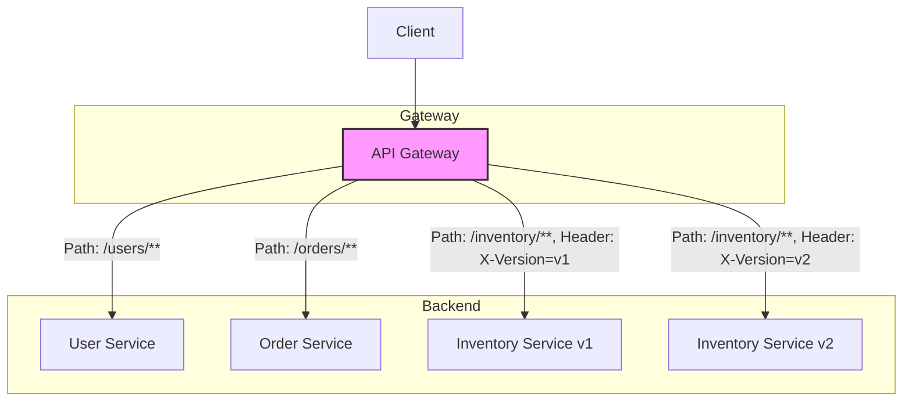
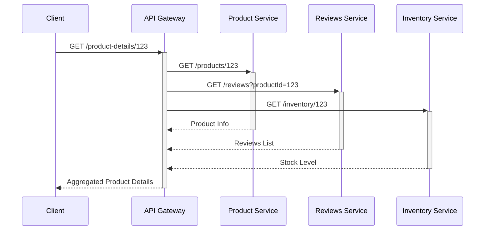
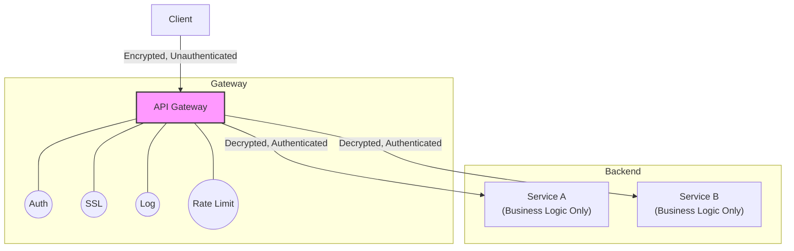

# Gateway Patterns

This page describes common tactical patterns implemented by an [[api-gateway]]. For a full explanation of the API Gateway itself, please see the main [[api-gateway]] page.

---

## Gateway Routing

The Gateway Routing pattern uses a single endpoint to route requests to multiple backend services based on the request's content. This abstracts the underlying service topology from the client, which only needs to know about the gateway's endpoint.

### The Problem it Solves

Clients should not need to know the specific IP addresses or endpoint structures of every [[microservices|microservice]]. This would create tight coupling and make refactoring or scaling the backend services impossible without breaking clients. Clients need a stable endpoint that can intelligently forward their requests.

### How it Works

The [[api-gateway]] inspects incoming requests and uses Layer 7 routing rules to determine the appropriate destination. Common routing criteria include:

-   **Path-based Routing**: `https://api.example.com/users/*` is routed to the User Service, while `https://api.example.com/orders/*` is routed to the Order Service.
-   **Header-based Routing**: A request with the header `X-Version: v2` is routed to a new version of a service, enabling canary releases.
-   **Host-based Routing**: `users.api.example.com` and `orders.api.example.com` can be routed to different services from the same gateway IP.

*A gateway routing requests based on URL path and headers to different backend services and versions.*

---

## Gateway Aggregation

This pattern uses the gateway to aggregate multiple calls to different backend services into a single request-response cycle for the client. It is a powerful technique for reducing chattiness and improving client-side performance.

### The Problem it Solves

A single screen in a client application (e.g., a product detail page) might require data from several microservices (e.g., product info, reviews, inventory, recommendations). Making separate calls for each piece of data from the client is inefficient, increases latency, and drains battery on mobile devices.

### How it Works

The client makes a single, composite request to the [[api-gateway]]. The gateway, in turn, calls all the necessary backend services in parallel, waits for their responses, and then composes them into a single, unified response object to send back to the client.

This pattern is a cornerstone of the [[Backend-for-Frontend]] architecture.

*A gateway aggregating calls to three backend services into a single client operation.*

---

## Gateway Offloading

Gateway Offloading moves common cross-cutting concerns and shared functionalities from individual services to the gateway. This simplifies the services, reduces code duplication, and centralizes the management of these concerns.

### The Problem it Solves

Functionalities like [[authentication]], [[ssl-tls|TLS termination]], detailed logging, and rate limiting are required by almost every service. Implementing and maintaining this logic in every single service is inefficient, error-prone, and leads to inconsistencies. 

### How it Works

The [[api-gateway]] acts as the first point of contact for all traffic and handles these shared tasks before forwarding requests to the appropriate backend service. This ensures that policies are applied consistently and that the microservices can focus solely on their core business logic.

Common offloaded functionalities include:

-   **SSL/TLS Termination**: The gateway decrypts HTTPS traffic and forwards unencrypted requests to internal services.
-   **Authentication/Authorization**: Validates JWTs or API keys.
-   **Rate Limiting**: Protects services from being overwhelmed.
-   **Caching**: Stores responses for common requests.
-   **Logging & Tracing**: Creates a centralized point for observing traffic.

*A gateway offloading concerns like SSL, Authentication, Logging, and Rate Limiting from backend services.*

---

## Resources & links

### Articles

1.  **[Gateway Routing pattern - Microsoft Azure](https://learn.microsoft.com/en-us/azure/architecture/patterns/gateway-routing)**
    The official Microsoft documentation for the Gateway Routing pattern, explaining how to route requests to multiple backends using a single endpoint.

2.  **[Gateway Aggregation pattern - Microsoft Azure](https://learn.microsoft.com/en-us/azure/architecture/patterns/gateway-aggregation)**
    The official documentation for the Gateway Aggregation pattern, detailing how to use a gateway to aggregate multiple downstream service calls into a single client request.

3.  **[Gateway Offloading pattern - Microsoft Azure](https://learn.microsoft.com/en-us/azure/architecture/patterns/gateway-offloading)**
    The official documentation for the Gateway Offloading pattern, showing how to offload shared functionalities like SSL termination to the gateway.

