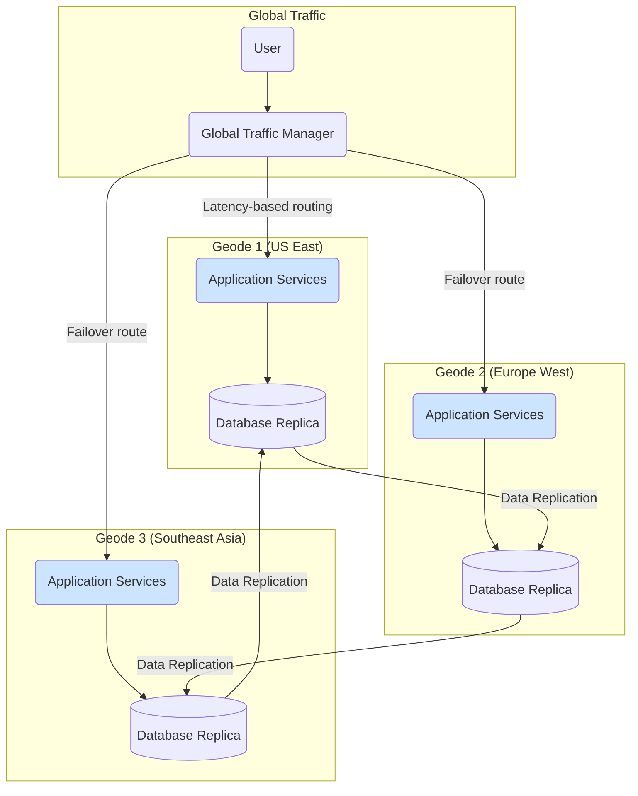

# Geode Pattern

The **Geode** pattern is a deployment strategy for achieving extreme availability and [[availability-patterns|resilience]] for global applications. It involves deploying an application's backend services across multiple, geographically distributed, and independent regions called "geodes." Each geode is a self-contained deployment that can serve any user request from anywhere in the world. All geodes are active simultaneously, operating in an [[availability-patterns#Active-Active Fail-Over|active-active configuration]].

The name is an analogy to a geological geode: a single, unified entity on the outside that is composed of many individual, independent crystals on the inside. Similarly, the application appears as a single, global service to the end-user, but it is internally composed of multiple autonomous deployment stamps.

This pattern is a specific implementation of the [[deployment-stamps|Deployment Stamp]] pattern, specialized for global, active-active deployments to maximize availability and reduce latency.

## Key Characteristics

- **Geographic Distribution**: Geodes are deployed across multiple geographic regions to be close to users and to provide resilience against regional outages.
- **Active-Active Configuration**: All geodes are online and actively serving traffic. There are no passive or hot-standby geodes.
- **Autonomy**: Each geode is self-contained and independent. A failure in one geode should have no impact on the others.
- **Global Routing**: A global traffic manager or [[load-balancing|load balancer]] sits in front of all geodes, routing incoming requests to the most appropriate geode based on factors like user location (latency), geode health, and load.
- **[[availability-patterns#Replication-Patterns|Data Replication]]**: To provide a consistent user experience, data must be replicated across all geodes, often asynchronously. This requires a globally distributed database or a robust data synchronization strategy.
- **Stateless Services**: The application services within a geode should ideally be [[twelve-factor-app#VI. Processes|stateless]]. This allows any geode to handle any request, simplifying routing and [[availability-patterns#Fail-Over Patterns|failover]].

## How It Works

The workflow of the Geode pattern is centered around a smart global routing layer.

1.  **User Request**: A user initiates a request to the application's global endpoint.
2.  **Global Routing**: A global [[load-balancing|load balancer]] (e.g., Azure Front Door, AWS Global Accelerator) intercepts the request. This router is configured to be aware of all available geodes and their real-time health.
3.  **Geode Selection**: The router directs the request to the "best" geode. The definition of "best" can be configured based on:
    *   **Latency-based routing**: Directs the user to the geographically closest geode to minimize round-trip time.
    *   **Failover routing**: If a geode becomes unhealthy or a whole region experiences an outage, the router automatically redirects traffic to the next nearest healthy geode.
    *   **Weighted routing**: Can be used to distribute load unevenly, for example during a canary release of a new version to a single geode.
4.  **Request Processing**: The selected geode processes the request. Since all geodes are identical and have access to replicated data, any geode can fulfill the request.
5.  **Data Synchronization**: If the request modifies data, that change is persisted to the geode's local database and then [[availability-patterns#Replication-Patterns|replicated]] to all other geodes to ensure [[consistency#Eventual Consistency|eventual consistency]] across the globe.

*Description: A global traffic manager routes users to the nearest healthy geode. Each geode is an independent copy of the application stack. Data is replicated across all geodes to ensure a consistent state.*

## Use Cases

- **Globally Distributed Applications**: For applications with a large, global user base where low latency is a key requirement (e.g., social media, e-commerce, media streaming).
- **Mission-Critical Systems**: For systems that require the highest possible level of [[reliability-engineering|availability]] and must be resilient to entire regional failures.
- **Disaster Recovery**: The pattern provides an inherent and automatic disaster recovery capability. If a region goes down, traffic is seamlessly routed to other regions.

## Benefits

- **Extreme High Availability**: By having multiple active regions, the application can survive the failure of one or even multiple regions without downtime.
- **Improved Performance & Low Latency**: Users are served from the geode closest to them, which significantly reduces network latency.
- **Simplified Failover**: Failover is automatic and handled at the global routing layer, requiring no manual intervention.
- **[[software-architecture/system-design-fundamentals/index#Scalability|Scalability]]**: The application can be scaled by adding more geodes in new regions as the user base grows.

## Challenges and Considerations

- **Cost**: This is a very expensive pattern to implement. Running multiple fully-provisioned, active regions incurs significant costs for compute, storage, and data transfer.
- **Data Consistency**: Achieving [[consistency#Strong Consistency|strong consistency]] across geographically distributed databases is difficult and often violates the [[cap|CAP theorem]]. Most geode architectures opt for [[consistency#Eventual Consistency|eventual consistency]], which may not be suitable for all applications (e.g., financial transactions). Managing data replication and resolving conflicts adds complexity.
- **Operational Complexity**: Managing a globally distributed infrastructure is complex. It requires mature DevOps practices, extensive automation for deployments (using [[iac|Infrastructure as Code - IaC]]), and sophisticated [[monitoring]] to track the health and performance of all geodes.
- **Stateful Services**: The pattern works best with stateless application tiers. Handling user session state or other "sticky" data requires careful design, often involving a [[caching|distributed cache]] or routing all requests from a single user to the same geode, which can complicate failover.

## Implementation on Cloud Platforms

- **Microsoft Azure**:
    - **Routing**: Azure Front Door is the primary service for global HTTP load balancing and routing.
    - **Data**: Azure Cosmos DB is a globally distributed, multi-master database that is a natural fit for the geode pattern.
    - **Infrastructure**: [[iac|Infrastructure as Code (IaC)]] using Bicep or ARM templates to define the geode stamp.

- **Amazon Web Services (AWS)**:
    - Routing: AWS Global Accelerator or Amazon Route 53's latency-based routing policies.
    - Data: Amazon Aurora Global Database or Amazon DynamoDB Global Tables provide multi-master replication across regions.
    - Infrastructure: [[iac|IaC]] using AWS CloudFormation or Terraform.

- **Google Cloud Platform (GCP)**:
    - **Routing**: Google Cloud Load Balancing (Global External HTTP(S) Load Balancer).
    - **Data**: Google Spanner is a globally distributed, strongly consistent database. CockroachDB can also be deployed on GCP for this purpose.
    - **Infrastructure**: [[iac|IaC]] using Google Cloud Deployment Manager or Terraform.

## Related Patterns

- **[[deployment-stamps|Deployment Stamp]]**: The Geode pattern is a specific, globally-distributed variant of the Deployment Stamp pattern.
- **[[load-balancing|Load Balancing]]**: A global load balancer is a prerequisite for this pattern.
- **[[cdn|CDN]]**: Shares the goal of reducing latency by serving content from locations close to the user.
- **[[publish-subscribe|Publish-Subscribe]]**: Can be used as a mechanism for replicating data changes between geodes.

---

## Resources & Links

### Articles

1.  **[Geode pattern - Azure Architecture Center](https://learn.microsoft.com/en-us/azure/architecture/patterns/geodes)**
    The official Microsoft documentation for the Geode pattern. It describes the pattern as a collection of geographically distributed, independent backend services (geodes) that can each serve any user request. The article emphasizes the use of a global load balancer and geo-replicated data services like Azure Cosmos DB to achieve extreme availability and low latency in an active-active configuration. It also discusses when to use this pattern and its limitations, such as for systems with strict data residency requirements.

2.  **[Geode Pattern - System Design - GeeksforGeeks](https://www.geeksforgeeks.org/system-design/geode-pattern-system-design/)**
    This article provides a comprehensive overview of the Geode pattern from a general system design perspective. It details the key characteristics, such as distributed nodes, data partitioning, and replication. The article covers the benefits ([[software-architecture/system-design-fundamentals/index#Scalability|scalability]], fault tolerance) and the challenges (data consistency, complexity). It also provides real-world examples like Amazon DynamoDB and Netflix, and discusses best practices for implementation.