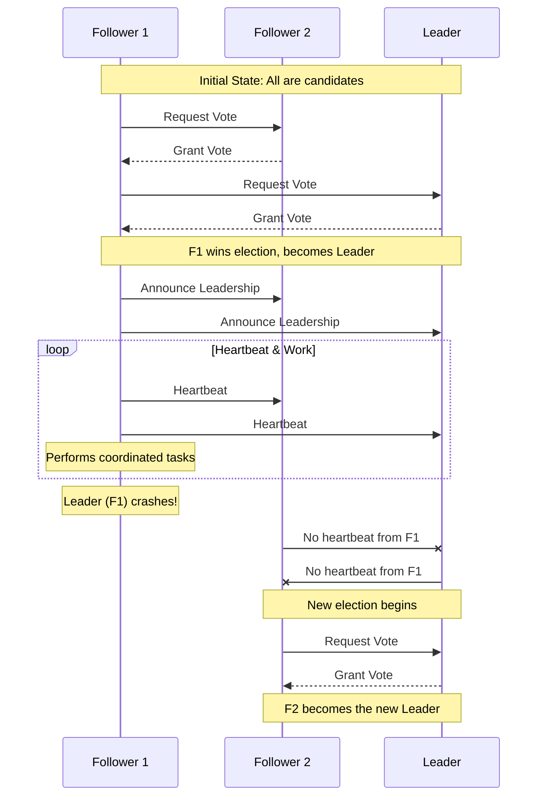

# Leader Election Pattern

The **Leader Election** pattern is a fundamental design pattern in distributed systems used to coordinate the actions of multiple collaborating instances. It works by electing a single instance as the **leader**, which assumes responsibility for managing and coordinating the other instances (followers). This prevents conflicts over shared resources, ensures that tasks are performed by only one instance at a time, and provides a mechanism for fault tolerance.

In any distributed system where multiple nodes need to agree on which one will take on a special role—such as a task scheduler, a primary database replica, or a central coordinator—a leader election process is required. The pattern is crucial for building resilient and consistent systems.

## How it Works

The core of the pattern is an election process where all candidate instances attempt to claim leadership. Only one can succeed. The process generally follows these steps:

1.  **Election**: When the system starts, or when a previous leader fails, the remaining instances (followers) participate in an election to choose a new leader.
2.  **Leadership**: One instance wins the election and becomes the leader. It notifies the other instances that it is now the leader.
3.  **Coordination**: The leader takes on its special responsibilities, such as assigning tasks, managing a shared resource, or acting as the primary point of contact.
4.  **[[health-endpoint-monitoring|Health Monitoring]]**: The leader periodically sends a "heartbeat" signal to the followers to indicate that it is still alive and active. The followers monitor these heartbeats.
5.  **Failure Detection**: If the followers stop receiving heartbeats from the leader for a certain period, they assume the leader has failed. They then initiate a new election to choose a successor.

*Description: This diagram shows a simplified election process. Initially, instances vote for a leader. Once elected, the leader sends periodic heartbeats. If the leader fails, followers detect the absence of heartbeats and start a new election.*

## Implementation Strategies

Leader election can be implemented in several ways, often relying on external coordination services or consensus algorithms.

1.  **Using a Distributed Lock Service (e.g., ZooKeeper, etcd, Consul)**
    This is a common approach where instances compete to acquire a distributed lock or create an ephemeral node in a service like Apache ZooKeeper.
    *   **Mechanism**: The first instance to acquire the lock or create the node becomes the leader.
    *   **Failure Detection**: If the leader fails, its session with the service times out, and the ephemeral node is automatically deleted (or the lock is released). This signals to other instances that they can attempt to acquire leadership.

2.  **Using a Lease Mechanism**
    In this approach, instances attempt to acquire a lease on a shared resource. The lease has a fixed duration and must be renewed periodically.
    *   **Mechanism**: The instance holding the lease is the leader.
    *   **Failure Detection**: If the leader fails to renew the lease before it expires (e.g., due to a crash), other instances can attempt to acquire the expired lease.
    *   **Example**: Kubernetes uses this mechanism for its internal components like the controller manager.

3.  **Using Consensus Algorithms**
    Algorithms like **Raft** and **Paxos** have leader election built into their core design. They are used to achieve consensus in a cluster of nodes.
    *   **Mechanism**: These algorithms provide a provably safe way to elect a leader and ensure that all nodes agree on the leader's identity, even in the presence of network partitions and other failures.
    *   **Examples**: Found in distributed databases like CockroachDB and TiDB, as well as messaging systems like Apache Kafka.

## Challenges and Considerations

*   **Split Brain**: This is a critical failure scenario where, due to network partitions, two or more instances believe they are the leader. This can lead to data corruption and inconsistent state. Mechanisms like **fencing** (isolating the old leader) are needed to prevent this.
*   **Election Latency**: The time it takes to detect a leader failure and elect a new one can be a period of unavailability for the coordinated task. This latency needs to be minimized.
*   **Heartbeat and [[posa#Timeout|Timeout]] Tuning**: Setting appropriate intervals for heartbeats and timeouts is a trade-off. Short timeouts lead to faster failure detection but can cause false positives in a slow network. Long timeouts are more tolerant of network issues but increase recovery time.
*   **Follower Overhead**: In large clusters, the leader may have significant overhead in sending heartbeats to all followers.

## Use Cases

*   **High-Availability Stateful Services**: Ensuring that only one instance of a stateful service is active at a time, with other instances acting as hot standbys.
*   **Distributed Schedulers**: A single leader instance is responsible for scheduling tasks across a cluster of worker nodes.
*   **Primary-Backup Database Replication**: The leader is the primary database that handles all write operations, while followers are read-only replicas.
*   **Cluster Coordination**: In systems like Kubernetes, leader election is used by controller managers to ensure that only one controller is actively managing a set of resources.

## Related Patterns and Concepts

*   **Consensus Algorithms**: Algorithms like Raft and Paxos are advanced forms of leader election that also guarantee consensus.
*   **[[circuit-breaker|Circuit Breaker]]**: Can be used by followers to avoid sending requests to a failed leader.
*   **[[health-endpoint-monitoring|Health Endpoint Monitoring]]**: The mechanism often used by followers to detect a leader's failure.
*   **Apache ZooKeeper**: A common coordination service used to implement leader election.
*   **[[posa#Leader Election|POSA Leader Election]]**: This pattern is also described in the Pattern-Oriented Software Architecture (POSA) series, where it is categorized under Coordination patterns.

## Resources & links

### Articles

1.  **[Leader Election pattern - Microsoft Azure](https://learn.microsoft.com/en-us/azure/architecture/patterns/leader-election)**

    The official documentation from Microsoft's Azure Architecture Center. It provides a comprehensive overview of the pattern, the problems it solves, and various implementation strategies in a cloud context.

2.  **[Leader Election in System Design - GeeksforGeeks](https://www.geeksforgeeks.org/system-design/leader-election-in-system-design/)**

    A detailed article that defines leader election, explains its importance for fault tolerance and consistency, and describes common algorithms like Bully, Ring, Paxos, and Raft.

3.  **[Leader election in distributed systems - AWS Builders' Library](https://aws.amazon.com/fr/builders-library/leader-election-in-distributed-systems/)**

    This article from the Amazon Builders' Library explains the trade-offs of leader election, discussing its benefits for efficiency and its drawbacks, such as creating potential single points of failure. It also provides insight into Amazon's lease-based approach to implementation.
