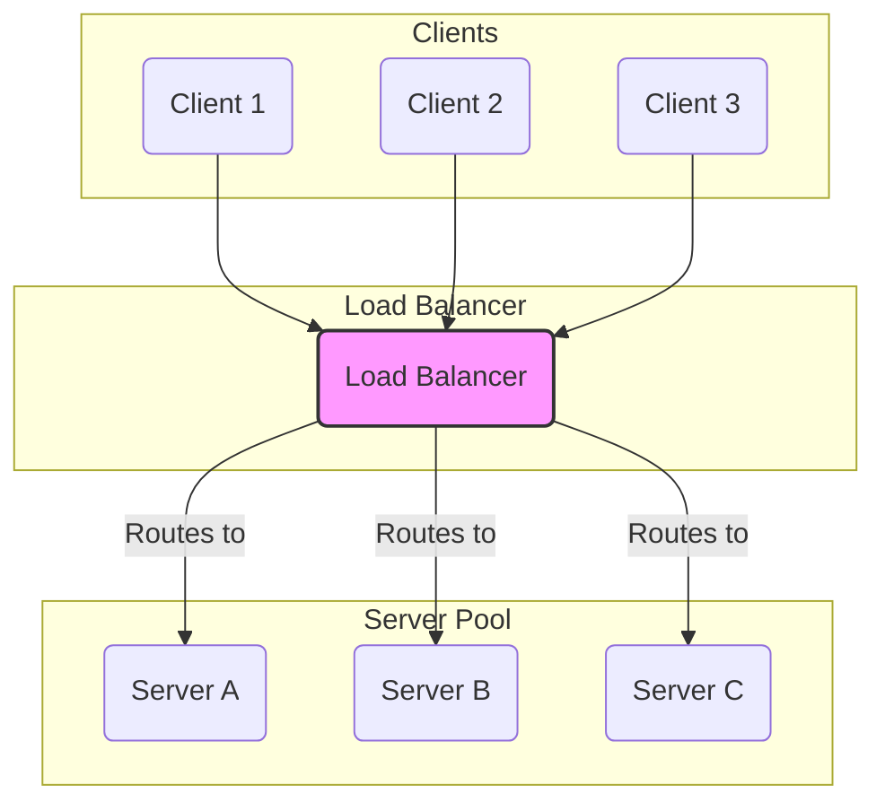
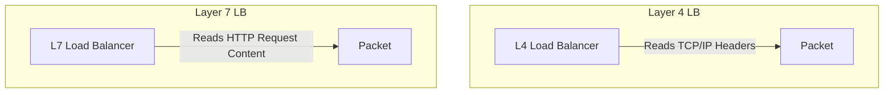

# Load Balancing

A **Load Balancer** is a component that acts as a "traffic cop" for your servers. It sits in front of your backend resources and distributes incoming network traffic across multiple servers to ensure no single server becomes overwhelmed. Load balancing is a fundamental pattern for building [[system-design-fundamentals#Scalability|scalable]], [[system-design-fundamentals#Availability-vs-Consistency|available]], and [[system-design-fundamentals#Performance-vs-Scalability|performant]] distributed systems.

*Description: The Load Balancer receives all incoming requests and distributes them across a pool of backend servers according to a specific algorithm.*

---

## Core Benefits

- **High Availability:** By performing [[monitoring#Health Monitoring|health checks]], a load balancer can automatically detect if a server is unhealthy and stop sending traffic to it, preventing failures.
- **Scalability:** A load balancer is the key enabler of [[system-design-fundamentals#Scalability|horizontal scaling]], allowing you to add or remove servers from the pool transparently.
- **Performance:** By distributing the load, it ensures that users are always directed to a responsive server, improving overall application performance.
- **Eliminates Single Points of Failure:** A single web server is a [[availability-patterns|single point of failure]]. A load balancer, used in front of a server pool, removes this risk (though the LB itself can become one if not made redundant).

### Additional Features

Modern software load balancers (like NGINX, HAProxy) often provide extra features:

- **SSL Termination:** The LB can handle the decryption of incoming HTTPS requests and send unencrypted traffic to the internal backend servers, offloading a CPU-intensive task.
- **Session Persistence ("Sticky Sessions"):** For stateful applications, the LB can ensure that all requests from a specific client are always routed to the same server, typically by using cookies.

---

## Load Balancer vs. Reverse Proxy

While the terms are often used interchangeably, there is a subtle difference:

- A **[[posa|Reverse Proxy]]** is a server that sits in front of one or more backend servers, forwarding client requests. It can provide caching, security, and SSL termination, even for a single server.
- A **Load Balancer** is a specialized type of reverse proxy that is capable of distributing traffic across *multiple* backend servers.

In short, **all load balancers are reverse proxies, but not all reverse proxies are load balancers.** Tools like NGINX and HAProxy are powerful reverse proxies that can also be configured to act as sophisticated load balancers.

---

## Load Balancing Algorithms

An algorithm determines how the load balancer chooses which backend server to send a request to.

- **Static Algorithms:**
    - **Round Robin:** Requests are distributed sequentially across the group of servers. Simple and predictable.
    - **Weighted Round Robin:** Servers with higher capacity are assigned a higher weight and receive more traffic.
    - **IP Hash:** The client's IP address is used to determine which server receives the request. This provides a form of session persistence without needing cookies.

- **Dynamic Algorithms:**
    - **Least Connection:** The request is sent to the server with the fewest active connections. This is more intelligent than Round Robin, as it accounts for the current server load.
    - **Least Response Time:** The request is sent to the server with the fastest response time and fewest active connections.

---

## Layer 4 vs. Layer 7 Load Balancing

This distinction refers to the layer of the OSI model at which the load balancer operates.

### Layer 4 (Transport Layer) Load Balancing

A Layer 4 LB makes its routing decisions based on information from the transport layer, primarily the source/destination IP addresses and ports. It does not inspect the content of the packets.

- **How it works:** It performs Network Address Translation (NAT) to forward packets to a backend server without terminating the connection.
- **Pros:** Extremely fast and efficient as it doesn't need to inspect packet contents.
- **Cons:** Not application-aware. It can't make routing decisions based on the type of content being requested (e.g., images vs. API calls).
- **Example:** AWS Network Load Balancer (NLB).

### Layer 7 (Application Layer) Load Balancing

A Layer 7 LB operates at the application layer and can inspect the content of the request, such as HTTP headers, cookies, and URL paths.

- **How it works:** It terminates the client connection, reads the request, and then makes an intelligent routing decision before establishing a new connection to the chosen backend server.
- **Pros:** Highly flexible. Allows for content-based routing (e.g., sending requests for `/api/video` to video processing servers) and easier session persistence.
- **Cons:** More CPU-intensive than L4 balancing, though this is often negligible with modern hardware.
- **Example:** AWS Application Load Balancer (ALB), NGINX, HAProxy.

---

## How Load Balancers Enable Horizontal Scaling

As defined in the [[system-design-fundamentals|System Design Fundamentals]], horizontal scaling is the practice of adding more machines to a resource pool. A load balancer is the critical component that makes this strategy work.

By providing a single, stable entry point (a single IP address or domain name), the load balancer abstracts away the backend server pool. This allows you to:

- **Add servers** to the pool to handle increased traffic without any client-side changes.
- **Remove servers** for maintenance or during low-traffic periods.
- **Deploy new code** using rolling updates, by gradually adding new servers to the pool and removing old ones.

To achieve this, backend servers must be designed to be **[[twelve-factor-app|stateless]]**. This means they should not store any user-specific data (like session information) on their local disk or in memory. Any state must be externalized to a shared data store, such as a [[software-architecture/databases/|database]] (SQL/[[nosql|NoSQL]] ) or a distributed cache (Redis, Memcached).

---

## Resources & links

### Articles

1.  **[What Is a Reverse Proxy vs. Load Balancer? - F5](https://www.f5.com/glossary/reverse-proxy)**
    A clear explanation from L5 on the subtle but important differences between these two related concepts.

2.  **[Types of load balancing algorithms - Cloudflare](https://www.cloudflare.com/learning/performance/types-of-load-balancing-algorithms/)**
    A comprehensive guide from Cloudflare detailing the most common static and dynamic load balancing algorithms.

3.  **[What Is Layer 4 Load Balancing? - F5](https://www.f5.com/glossary/layer-4-load-balancing)**
    A technical definition from F5 that explains how Layer 4 load balancers operate at the transport layer.
