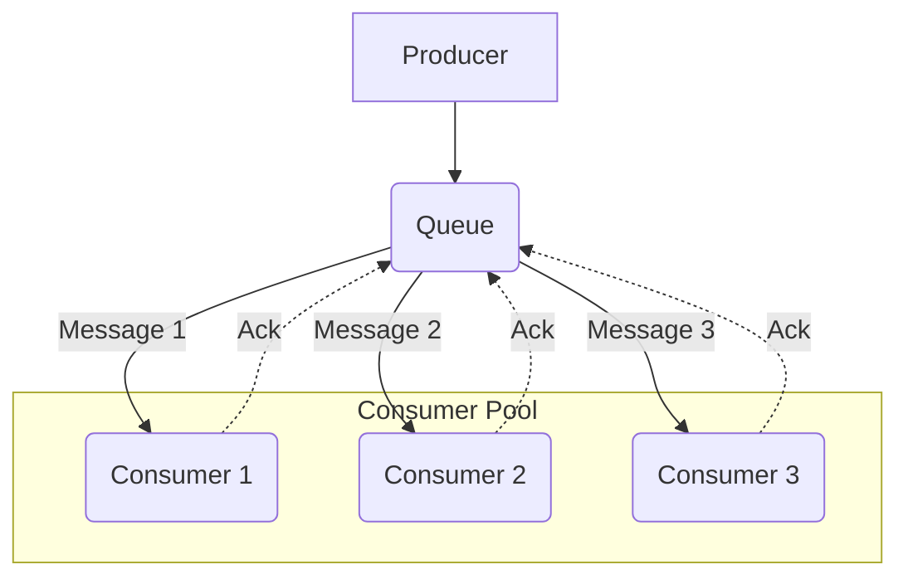
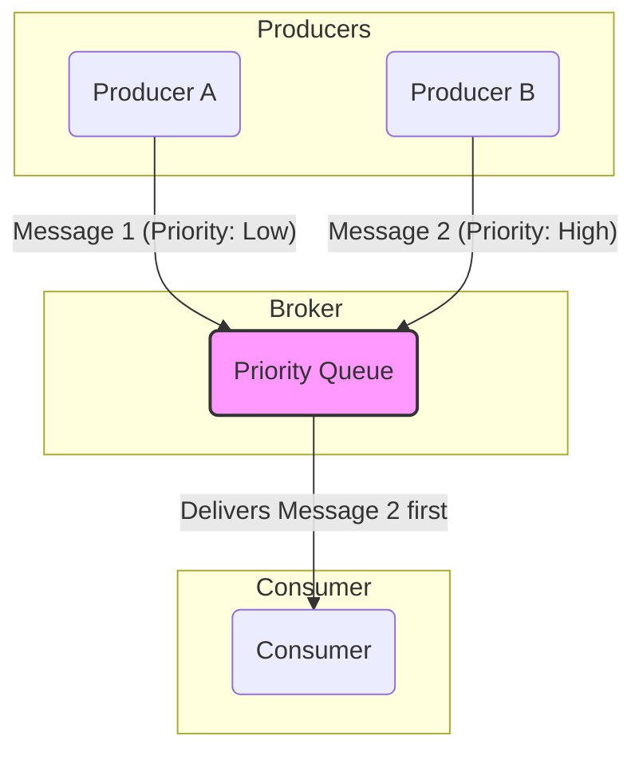
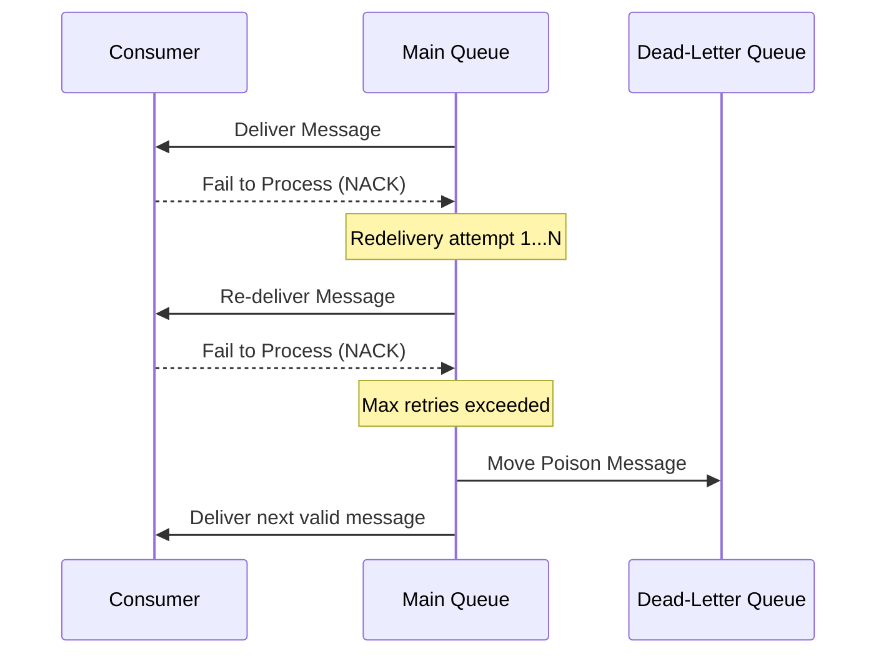
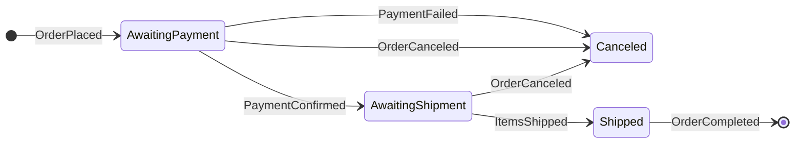
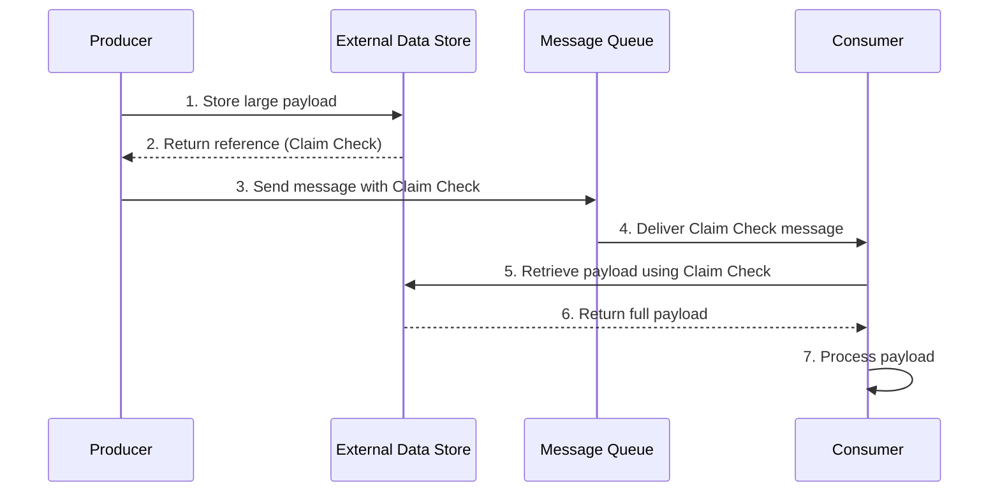

# The Message Queue Pattern

The **Message Queue** pattern is an [[software-architecture/architectural-patterns/|architectural pattern]] for [[asynchronous-messaging|asynchronous communication]] between distributed components. It uses a central **Queue** to manage messages sent from a **Producer** to a **Consumer**, ensuring reliable one-to-one delivery and decoupling the components.

In this model, a message producer sends a message to a specific destination called a **Queue**. The message is then delivered to a single consumer that is listening on that queue. This ensures a **one-to-one** relationship for each message, even if multiple consumers are available. This is often implemented using the **Competing Consumers** pattern, where several consumers compete to be the first to receive and process a message from the queue.

* **Core Principles:**
    * **One-to-One Delivery:** Each message is processed by exactly one consumer.
    * **[[cohesion-coupling|Decoupling]]:** The message producer does not know which specific consumer will process the message.
    * **[[load-balancing|Load Balancing]]:** The queue naturally distributes the load among available consumers.
    * **Task Distribution:** Ideal for offloading work, where each message represents a self-contained task or command.

---

## Key Components and Communication Flow

1.  **Producer:** The component that creates a message (often a **command**) and sends it to the queue.
2.  **Queue:** A durable channel that stores messages in a first-in, first-out (FIFO) order until a consumer is ready to process them.
3.  **Consumer:** A component that connects to the queue, retrieves a message, and processes it.
4.  **[[broker|Broker]]:** The underlying messaging system that manages the queue and guarantees message delivery.

**Typical Data Flow:**
1.  The **Producer** sends a message (a command or task) to the **Queue**.
2.  The **[[broker|Broker]]** delivers the message to one of the available consumers in the pool (e.g., `Consumer 1`). The message is now "locked" and invisible to other consumers to prevent duplicate processing.
3.  `Consumer 1` processes the message.
4.  Upon successful completion, `Consumer 1` sends an **acknowledgment (Ack)** back to the queue.
5.  The queue receives the `Ack` and permanently deletes the message. If the consumer fails and does not send an `Ack` (or sends a Nack), the message lock will time out, and it will be redelivered to another available consumer.

---

## Advantages and Use Cases

* **Advantages:**
    * **Reliable Task Offloading:** Perfect for background jobs like sending emails, generating reports, or processing images.
    * **Scalability:** You can easily increase processing throughput by adding more consumer instances to the pool.
    * **Resilience:** If a consumer fails while processing a message, the message can be safely re-processed by another consumer.
    * **Flow Control:** The queue acts as a buffer, smoothing out load spikes and preventing the system from being overwhelmed. This is the core principle behind the [[workload-management#Queue-Based Load Leveling|Queue-Based Load Leveling]] pattern.

* **Use Cases:**
    * **Background Job Processing:** A web application can place a "GenerateThumbnail" job in a queue, and a pool of worker services can process these jobs asynchronously.
    * **Order Processing Systems:** Each step in an order fulfillment process (e.g., `ValidateOrder`, `ProcessPayment`, `UpdateInventory`) can be a message processed by a dedicated consumer.
    * **Data Ingestion Pipelines:** Ingesting and processing large volumes of data in a controlled, scalable manner.

---

## Implementations and Characteristics

Different [[broker|message brokers]] offer varying guarantees and are suited for different use cases.

*   **Redis**: While primarily an in-memory data store, Redis can be used as a simple, lightweight message broker. However, because it is not designed for durability, messages can be lost if a server fails. It is best suited for transient, low-priority messaging.
*   **RabbitMQ**: A mature, popular, and feature-rich message broker that implements the AMQP protocol. It offers flexible routing, durability, and reliability but requires managing your own nodes and understanding its protocol.
*   **Amazon SQS (Simple Queue Service)**: A fully managed, highly scalable service. It can have variable latency and guarantees **at-least-once delivery**, meaning a message might be delivered more than once. This requires consumers to be designed with [[idempotent-operations|idempotency]] in mind.
*   **Apache Kafka**: More than just a message queue, Kafka is a distributed event store and stream-processing platform. It is designed for high-throughput, persistent, and ordered message streams, making it ideal for log aggregation, real-time analytics, and event sourcing.

---

## Advanced Concepts and Variations

### Priority Queue

The **Priority Queue** pattern is a variation of the standard message queue that reorders messages based on a priority assigned to them. Instead of processing messages in a strict First-In, First-Out (FIFO) order, a priority queue ensures that messages with a higher priority are processed before messages with a lower priority. This is essential for applications that need to handle certain requests faster than others, often to meet Service Level Agreements (SLAs) or to handle urgent system tasks.

#### How It Works

1.  **Priority Assignment**: The message producer assigns a priority level (usually a number) to each message before sending it to the queue.
2.  **Broker Reordering**: The [[broker|message broker]] is responsible for managing the messages in a way that prioritizes delivery. When a consumer requests a message, the broker provides the highest-priority message that is available.
3.  **FIFO within Priorities**: Within the same priority level, messages are typically still processed in FIFO order.

*Description: Even if the low-priority message arrives first, the Priority Queue ensures the high-priority message is delivered to the consumer as soon as it is available.*

#### Use Cases

-   **SLA Adherence**: In a multi-tenant system, requests from "Premium" customers (high priority) can be processed before requests from "Free" or "Standard" tier customers (low priority).
-   **Urgent System Tasks**: Prioritizing critical administrative tasks, security alerts, or system health notifications over routine, background processing.
-   **Interactive vs. Batch Operations**: Ensuring that a user-initiated action (e.g., a password reset request) is handled before a long-running, low-impact batch job (e.g., generating a weekly report).

#### Challenges and Considerations

-   **Message Starvation**: The biggest risk of this pattern is **starvation**, where a continuous stream of high-priority messages prevents low-priority messages from ever being processed.
    -   **Solution**: A common mitigation is **priority aging**, where the priority of a message is gradually increased the longer it remains in the queue.
-   **Broker Support**: Native support for priority queues varies among [[broker|message brokers]].
    -   **RabbitMQ**: Provides excellent support for priority queues out of the box.
    -   **Amazon SQS**: Does not support priority queues directly. The common pattern is to use multiple SQS queues (e.g., `high-priority-queue`, `low-priority-queue`) and have the consumer pool poll the high-priority queue more frequently or with more dedicated workers.
    -   **Apache Kafka**: Does not have a native priority queue concept, as it is a log stream. Implementing it requires custom logic, often involving multiple topics and sophisticated consumer logic, which adds significant complexity.
-   **Defining Priorities**: Establishing a clear and consistent priority scheme across all producers is a critical design decision. Too many priority levels can add unnecessary complexity.

### Dead-Letter Queue (DLQ)

A Dead-Letter Queue (DLQ) is a critical complementary pattern for building robust, fault-tolerant messaging systems. Its primary purpose is to isolate and store messages that cannot be processed successfully by a consumer. This prevents problematic messages, often called "poison pills," from being endlessly redelivered and blocking the processing of valid messages in the main queue.

#### How It Works

The process of moving a message to a DLQ is managed by the [[broker|message broker]] and is triggered by a redelivery policy.

1.  **Processing Failure**: A consumer fetches a message from the main queue but fails to process it due to errors (e.g., invalid data,a bug in the processing logic, or a downstream service being unavailable). When calling a downstream service, this failure is often triggered by a **[[circuit-breaker|Circuit Breaker]]** that has opened, causing the consumer to "fail fast."
2.  **Retry Mechanism**: The consumer (or broker) allows the message to be redelivered for a configured number of attempts (`maxReceiveCount`). This handles transient failures.
3.  **Move to DLQ**: If the message continues to fail processing after the maximum number of retries, the message broker automatically moves the message from the source queue to the designated DLQ.

This isolates the poison message, allowing consumers to continue processing the rest of the messages in the main queue without interruption.

*Description: A consumer repeatedly fails to process a message. After exceeding the maximum retry count, the broker moves the "poison" message to the DLQ, unblocking the main queue.*

#### Key Benefits

-   **System Stability**: Prevents poison messages from repeatedly crashing consumers or blocking the entire queue, which is a major cause of system-wide outages.
-   **Isolation of Failures**: Bad messages are safely stored and isolated without being lost, allowing the main system to continue functioning normally.
-   **Asynchronous Debugging**: Developers and operators can inspect the contents of the DLQ asynchronously to diagnose the root cause of the failure without the pressure of a live incident.

#### Implementation Considerations

-   **Broker Configuration**: Most message brokers require explicit configuration to enable the DLQ functionality. This typically involves setting a `dead-letter-exchange` (in RabbitMQ) or a `redrivePolicy` (in Amazon SQS) on the source queue, which specifies the target DLQ and the `maxReceiveCount`.
-   **Monitoring and Alerting**: A DLQ should never have messages in it during normal operation. It is critical to set up monitoring and alerts to notify the team immediately when a message enters the DLQ, as this indicates a real problem.
-   **DLQ Message Analysis**: The messages in the DLQ should contain enough context (e.g., headers with error information, original enqueue time) to make debugging possible.
-   **Redrive / Reprocessing Strategy**: Once the underlying bug is fixed, you need a mechanism to "redrive" the messages from the DLQ back into the main queue for reprocessing. Many cloud providers offer this functionality in their UI or via an API.

### Competing Consumers

The **Competing Consumers** pattern is a fundamental model for scaling message processing. It enables multiple concurrent consumers to process messages received on the same messaging channel. By having multiple consumers "compete" for messages from a single queue, a system can process messages in parallel, which significantly improves throughput, scalability, and availability.

The introduction of this page already mentions this pattern as a core implementation detail, and the diagram in the "Key Components" section illustrates it perfectly. This section provides a more detailed focus on its specific trade-offs.

#### Key Benefits

-   **Improved Throughput**: Work is processed in parallel by multiple consumers, dramatically increasing the rate of message processing.
-   **Enhanced Scalability**: To handle an increase in message volume, you can simply add more consumer instances to the pool. This allows for easy horizontal scaling.
-   **High Availability and Fault Tolerance**: If one consumer instance fails or becomes unavailable, the other consumers in the pool can continue processing messages, preventing a single point of failure.
-   **Automatic Load Balancing**: The [[broker|message broker]] automatically distributes the load of messages across the available consumers, ensuring that work is spread evenly.

#### Challenges and Considerations

-   **Loss of Message Order**: This is the most critical trade-off. While a queue may be FIFO, distributing messages to multiple parallel consumers means there is **no guarantee** that messages will be processed in the order they were sent. For example, Message B might be processed by a fast consumer before Message A is finished by a slower consumer.
    -   **Solution**: If strict ordering is required, you must use a different pattern, such as a [[#Sequential Convoy|Sequential Convoy]], or ensure that all messages for a specific logical entity are processed by the same consumer (a technique often used in Apache Kafka with partitioned topics).
-   **Requirement for Idempotency**: Since a consumer could fail after processing a message but before acknowledging it, the same message might be delivered to another consumer for reprocessing. Therefore, the message handling logic must be [[idempotent-operations|idempotent]] to prevent duplicate processing from causing errors or data inconsistencies.
-   **Poison Message Handling**: A single malformed message (a "poison pill") that causes consumers to crash can be repeatedly redelivered, blocking all consumers in the pool one by one. This makes having a robust [[#Dead-Letter Queue (DLQ)|Dead-Letter Queue (DLQ)]] strategy essential.

### Sequential Convoy

The **Sequential Convoy** is a messaging pattern that ensures a group of related messages are processed in a specific, sequential order by a single consumer instance. It is the direct solution to the ordering problem introduced by the [[#Competing Consumers|Competing Consumers]] pattern. It solves the problem of handling ordered, stateful operations in a distributed system where messages might otherwise be processed in parallel or out of order.

This pattern is crucial for implementing complex, long-running business processes that depend on a sequence of steps. It acts as a state machine where each message in the "convoy" triggers a state transition, and the system ensures that only the correct message can be processed at each state.

#### How It Works

The core of the pattern relies on three key components: correlation, ordered delivery, and stateful processing.

1.  **Correlation Identifier**: All messages belonging to the same convoy share a unique identifier (e.g., `OrderId`, `TransactionId`). This allows the system to group them together.
2.  **Stateful Consumer**: The consumer that processes the messages is stateful. It keeps track of the current step in the sequence for each convoy.
3.  **Ordered Processing Logic**: The consumer contains logic that defines the required order of messages. It will only process a message if it matches the expected next step in the sequence for that specific convoy.

When a message arrives, the consumer inspects its correlation ID and checks its internal state. If the message is the one it expects for that convoy, it processes it and updates its state to await the next message in the sequence. If an unexpected message arrives, it is either rejected, re-queued for later, or put aside in a separate queue.

#### State Machine Diagram

A sequential convoy is best modeled as a state machine. Consider an e-commerce order process:

*Description: This state diagram shows a sequential convoy for an order. The process can only move from `AwaitingPayment` to `AwaitingShipment` after a `PaymentConfirmed` message arrives. Any other message for this order would be ignored or deferred until the correct one is received.*

#### Key Benefits

-   **Guaranteed Order of Operations**: Ensures that dependent steps in a business process are executed in the correct sequence.
-   **Stateful Workflows**: Enables the implementation of complex, long-running, and stateful processes across distributed services.
-   **Reliability and Consistency**: By processing messages for a single business transaction sequentially, it simplifies error handling and helps maintain data consistency throughout the process.

#### Challenges and Considerations

-   **Consumer Bottleneck**: Since all messages for a given convoy must be processed by a single consumer instance, that instance can become a bottleneck. This is a classic challenge of stateful services, often requiring "sticky sessions" or routing based on the correlation ID to ensure a message always lands on the correct, state-holding instance.
-   **State Management**: The consumer must reliably store its state. If the consumer crashes, it must be able to recover its state and resume processing where it left off. This often requires an external persistence mechanism (e.g., a database or a distributed cache like Redis).
-   **Handling Out-of-Order Messages**: The system needs a clear strategy for messages that arrive too early. Common approaches include using a temporary holding queue or simply rejecting them and letting the sender retry.
-   **Timeout and Escalation**: The process may get stuck if a message in the sequence is lost or never arrives. The system must have a [[posa#Timeout|timeout]] mechanism to detect stalled convoys and trigger a compensating action or an alert.

### Claim Check

The **Claim Check** pattern is a technique used to handle large messages that would otherwise exceed the size limits of a [[message-queue|message queue]] or overwhelm the [[broker|message broker]]. The core idea is to split a large message into two parts: the payload (the large data) and the claim check (a small reference to the payload). The payload is stored in an external data store, and the lightweight claim check is sent through the message queue.

This approach keeps the messages within the messaging system small and uniform, which improves performance and reduces costs, as blob storage is typically cheaper than the resource units of a messaging platform.

#### How It Works

The flow involves separating the message's journey from the payload's storage.

1.  **Store Payload**: The **Producer** takes a large message, extracts its payload, and stores it in an external data store (e.g., Amazon S3, Azure Blob Storage, or a database).
2.  **Get Claim Check**: The external store returns a unique ID or reference for the stored payload. This ID is the "claim check."
3.  **Send Claim Check**: The Producer sends a small message to the queue containing only the claim check and any other necessary metadata.
4.  **Receive Claim Check**: A **Consumer** receives the claim check message from the queue.
5.  **Retrieve Payload**: The Consumer uses the ID from the claim check to fetch the full payload directly from the external data store.
6.  **Process Payload**: The Consumer processes the payload as required.

*Description: The producer stores the large payload in an external service to get a "claim check," then sends this small check to the message queue. The consumer receives the check and uses it to retrieve the full payload from the external store for processing.*

#### Use Cases

-   **Handling Large Payloads**: The most common use case is for processing messages that exceed the size limits of the chosen message broker (e.g., 256 KB in Amazon SQS, or configurable limits in RabbitMQ). This includes images, videos, large JSON/XML documents, or binary files.
-   **Cost Optimization**: Storing large amounts of data in a message broker can be expensive. Object storage services are significantly cheaper for storing large binary data, making this pattern highly cost-effective.
-   **Reducing Broker Load**: Sending large messages consumes more bandwidth and memory on the broker. By keeping messages small, the broker can operate more efficiently and handle a higher throughput of messages.
-   **Securing Sensitive Data**: If the payload contains sensitive data, it can be stored in a more secure, audited data store with fine-grained access control. The message in the queue only contains a reference, reducing the risk of data exposure within the messaging infrastructure. The [[valet-key|Valet Key]] pattern is often used here to grant the consumer temporary, scoped access to the specific resource.

#### Challenges and Considerations

-   **Payload Lifecycle Management**: This is the most significant challenge. When should the payload be deleted from the external store?
    -   **Consumer Deletes**: The consumer can delete the payload after successful processing. **Risk**: If the consumer fails right after processing but before deleting, the payload becomes an orphan, leading to storage costs.
    -   **Garbage Collection**: A separate background process can periodically scan the data store and delete payloads that are no longer referenced or have expired. This is more robust but adds complexity.
    -   **Time-to-Live (TTL)**: Some data stores allow setting a TTL on objects. The TTL should be set to a value that allows enough time for the message to be processed and re-processed in case of failures.
-   **Increased Latency and Complexity**: The pattern introduces extra steps (writing to and reading from an external store), which adds network latency to the overall processing time. It also increases the architectural complexity of both the producer and consumer.
-   **Data Store Availability**: The system now has a hard dependency on the availability of the external data store. If the data store is down, consumers cannot retrieve the payload, and the entire process halts, even if the message queue is operational.
-   **Idempotency**: Just like with other messaging patterns, the consumer logic should be [[idempotent-operations|idempotent]]. It's possible for a consumer to process a payload but fail before acknowledging the message. A redelivery would cause the consumer to re-process the same data, so the logic must handle this gracefully.

### Other Related Patterns

*   **[[publish-subscribe|Publish-Subscribe]]:** The other fundamental messaging model, which uses a one-to-many broadcast approach instead of one-to-one.
*   **[[message-driven|Message-Driven Architecture]]:** The Message Queue pattern is a key enabler for command-driven architectures, a flavor of MDA.

---

## **Resources & links**

### **Articles**

1.  **[Message Queues - System Design (GeeksforGeeks)](https://www.geeksforgeeks.org/system-design/message-queues-system-design/)**

    This article details how **Message Queues (MQs)** are crucial for distributed systems, providing a buffer for **asynchronous communication**. It outlines the core components (**Producer**, **Queue**, **Consumer**, and optional **Broker**) and highlights key benefits like **scalability**, **fault tolerance**, and **[[load-balancing|load balancing]]**. It also differentiates between two main types: **Point-to-Point** and **Publish-Subscribe** message queues, and touches upon advanced features like **Dead Letter Queues (DLQs)** and **Message Prioritization**.

2.  **[Message Queues: The Backbone of Scalable Systems (Medium)](https://medium.com/@amoljadhav_48655/message-queues-the-backbone-of-scalable-systems-2d015d9fa645)**

    This article emphasizes MQs as the backbone for **scalable** and **reliable** microservices architectures. It explains the core concepts (**Producer**, **Consumer**, **Message**, **Queue**) and the main advantages, particularly **Decoupling** services to allow independent scaling. The text presents common MQ patterns (**Point-to-Point**, **Publish-Subscribe**, **Request-Reply**) and lists popular implementations like **RabbitMQ**, **Apache Kafka**, and **Amazon SQS**, alongside best practices such as ensuring message [[idempotent-operations|Idempotency]] and managing **DLQs**.

3.  **[Sequential Convoy Pattern - Microsoft Azure](https://learn.microsoft.com/en-us/azure/architecture/patterns/sequential-convoy)**
    The official Azure Architecture Center documentation on the pattern, providing a clear overview and use cases.

4.  **[Competing Consumers pattern - Microsoft Azure](https://learn.microsoft.com/en-us/azure/architecture/patterns/competing-consumers)**
    The official Azure documentation for the Competing Consumers pattern, detailing how it enables scalability and availability.

5.  **[Priority Queue pattern - Microsoft Azure](https://learn.microsoft.com/en-us/azure/architecture/patterns/priority-queue)**
    The official Azure documentation for the Priority Queue pattern, explaining how to prioritize messages to handle urgent requests first.

6.  **[What is a Dead-Letter Queue (DLQ)? - AWS](https://aws.amazon.com/what-is/dead-letter-queue/)**
    A clear explanation from Amazon Web Services on the role of DLQs in handling message failures, particularly within the context of Amazon SQS.

7.  **[Claim-Check pattern - Azure Architecture Center | Microsoft Learn](https://learn.microsoft.com/en-us/azure/architecture/patterns/claim-check)**
    This article from the Azure Architecture Center explains the Claim-Check pattern, a technique for handling large messages in messaging systems by separating the payload from the message itself. It details how the payload is stored externally, and a small "claim check" token is sent via the message queue, which is then used by the receiver to retrieve the actual data.

---

### **Videos**

1.  **[Message Queues in System Design](https://www.youtube.com/watch?v=DYFocSiPOl8)**

    This video from **Hayk Simonyan** explains **Message Queues** in system design using an online store example. It covers how message queues, as durable components, support asynchronous communication, decouple services, and provide scalability and reliability by buffering requests for later processing.

2.  **[What is a Message Queue?](https://www.youtube.com/watch?v=xErwDaOc-Gs)**

    **Jamil Spain** from **IBM Technology** explains what a **Message Queue** is, defining it as an architectural technique for asynchronous communication in distributed applications. The video breaks down the concepts of messages and queues, provides examples like email, and discusses different messaging patterns (point-to-point, [[publish-subscribe|pub/sub]], request-reply) and the benefits of decoupling and scalability.