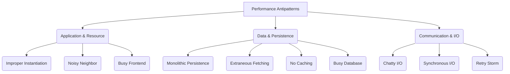
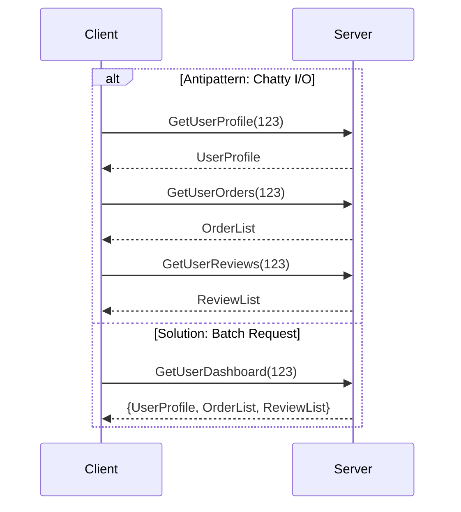
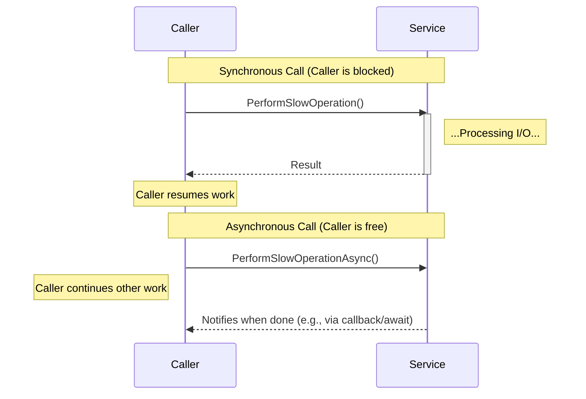
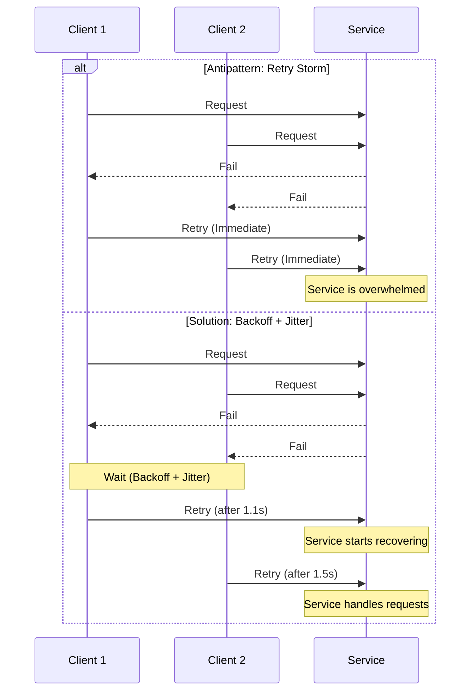

# Performance Antipatterns

Performance antipatterns are common but ineffective solutions to recurring problems that degrade a system's speed, scalability, and efficiency. While they may seem like a straightforward approach initially, they create significant bottlenecks, increase latency, and lead to poor resource utilization. Understanding these antipatterns is crucial for building robust and [[software-architecture/system-design-fundamentals/index#Performance vs. Scalability|performant]] systems.

These antipatterns often emerge from a misunderstanding of underlying system behaviors, especially in distributed environments. Addressing them typically involves a trade-off, such as increasing code complexity or infrastructure costs to achieve better performance and reliability.



## List of Performance Antipatterns

## List of Performance Antipatterns

### 1. Improper Instantiation

**Problem:** This antipattern occurs when an application creates new instances of expensive-to-initialize objects for each request or operation, rather than reusing them. Objects that manage network connections (like HTTP clients or database connectors), read large configuration files, or perform heavy computations on startup are common culprits. Frequent creation and destruction of these objects lead to high CPU usage, memory pressure, and garbage collection overhead.

**Example:** Creating a new database connection object for every single query.

```java
// Antipattern: Creating a new database connection for each query
public User getUser(int id) throws SQLException {
    // Creates a new connection every time the method is called, which is very slow.
    String url = "jdbc:mysql://localhost:3306/mydatabase";
    try (Connection connection = DriverManager.getConnection(url, "user", "password")) {
        PreparedStatement statement = connection.prepareStatement("SELECT * FROM users WHERE id = ?");
        statement.setInt(1, id);
        ResultSet resultSet = statement.executeQuery();
        // ... process result set and return user
    }
    return null; // Simplified
}
```

**Solution:** Use long-lived instances for expensive objects. This can be achieved through dependency injection with a singleton scope, a static factory, or an object pool. For database connections, always use a connection pool.

```java
// Solution: Use a shared connection pool (e.g., HikariCP, C3P0)
// The dataSource is configured once at application startup and reused.
private static DataSource dataSource = configureDataSource();

public User getUser(int id) throws SQLException {
    // Borrows a connection from the pool; it's returned automatically by try-with-resources.
    try (Connection connection = dataSource.getConnection()) {
        PreparedStatement statement = connection.prepareStatement("SELECT * FROM users WHERE id = ?");
        statement.setInt(1, id);
        ResultSet resultSet = statement.executeQuery();
        // ... process result set and return user
    }
    return null; // Simplified
}
```

### 2. Chatty I/O

**Problem:** This antipattern involves making a large number of small, frequent I/O requests (e.g., over the network) instead of bundling them into fewer, larger requests. Each network call has inherent latency and overhead. When an operation requires multiple round-trips to complete, the cumulative latency can severely degrade performance.

It's important to recognize the inherent trade-off between this antipattern and [[#3-extraneous-fetching|Extraneous Fetching]]. Solving Chatty I/O at the API level by creating a single, larger "batch" endpoint can inadvertently create an Extraneous Fetching problem at the database level. If the new endpoint is not carefully implemented, it might fetch too much data in an inefficient way. The key is to ensure that batching at the API layer is supported by an equally efficient data access strategy at the persistence layer, bundling only data that is **systematically used together** for a given context.

**Example:** A client application making separate API calls to get a user's profile, their orders, and their reviews, instead of one call that retrieves all the required information.

**Diagram:** Chatty vs. Batch Communication


**Solution:**
- **Batching:** Combine multiple individual operations into a single request based on common usage patterns.
- **Fuller Payloads:** Design APIs to return all necessary data for a specific context in a single response.
- **GraphQL:** Use technologies like [[graphql]] that allow clients to specify exactly what data they need in a single query, which can be an effective way to manage this trade-off.

### 3. Extraneous Fetching

**Problem:** This antipattern involves retrieving more data from a data source than the application actually needs for a given operation. This wastes resources at every level: the database uses more CPU and I/O, the network is congested with unnecessary data, and the application uses more memory to store it.

**Example (N+1 Query Problem):** A common form of extraneous fetching where an application retrieves a list of items (1 query) and then makes a separate query for each item to get related data (N queries).

```java
// Antipattern: N+1 Query (using JPA/Hibernate)
// 1. Fetch all posts (1 query)
List<Post> posts = entityManager.createQuery("SELECT p FROM Post p", Post.class).getResultList();

// 2. Loop and trigger a query for each post's author (N queries)
for (Post post : posts) {
    // This lazy-loads the author, causing a new query for each post
    String authorName = post.getAuthor().getName();
}
```

**Solution:**
- **Eager Loading:** Use framework features (e.g., `JOIN FETCH` in JPQL, `JOIN` in SQL) to retrieve all required data in a single, efficient query. This directly solves the N+1 problem.
- **Careful Use of Lazy Loading:** Lazy loading defers fetching related data until it's accessed. While it can be the *cause* of the N+1 problem (as shown in the antipattern example), it is also a powerful tool to *prevent* extraneous fetching of large, rarely-needed data collections. The key is to use it deliberately and not access lazy properties inside a loop. For instance, marking a `user.getLoginHistory()` collection as lazy is efficient if you only need that history 1% of the time.
- **Projections:** Select only the specific columns or fields you need, rather than entire entities (e.g., `SELECT id, name` instead of `SELECT *`).
- **[[poeaa#Data Transfer Object (DTO)|Data Transfer Objects (DTOs)]]:** Create specialized objects that only contain the data required for a specific view or API response.

```java
// Solution: Eager Loading with a JOIN FETCH (using JPA/Hibernate)
// Fetches all posts and their authors in a single database query
List<Post> posts = entityManager.createQuery(
    "SELECT p FROM Post p JOIN FETCH p.author", Post.class)
    .getResultList();
```

### 4. Synchronous I/O

**Problem:** Blocking a thread of execution while waiting for an I/O operation (e.g., a database query, an HTTP request, or a file read) to complete. In a server environment, a blocked thread cannot do any other work, severely limiting the application's ability to handle concurrent requests. This leads to poor vertical scalability and thread pool exhaustion.

**Diagram:** Synchronous vs. Asynchronous Flow


**Solution:**
- **Embrace Asynchronism:** Use asynchronous programming models (`async/await` in C#/JavaScript, `CompletableFuture` or Project Loom in Java, `goroutines` in Go) for all I/O-bound operations.
- **Asynchronous Libraries:** Prefer libraries that offer an asynchronous API (e.g., WebFlux instead of Spring MVC for reactive web stacks).
- **Decoupling:** For long-running tasks, use patterns like [[asynchronous-messaging]], [[message-queue]], and [[publish-subscribe]] to decouple the initial request from the final processing.

#### A Note on Modern Asynchronous I/O in Java & Spring

Achieving non-blocking database access in Java is a common challenge, as the traditional **JDBC** API is inherently blocking. While a connection pool is essential, it does not prevent I/O blocking. In modern Java and Spring, there are three distinct approaches, with a clear recommendation for most applications.

**1. The Recommended Modern Approach: Project Loom (Virtual Threads)**

As of Java 21, Project Loom is the simplest and most powerful solution for the vast majority of applications. It allows developers to write clear, synchronous-style code that behaves in a non-blocking way.

-   **How it works:** By running on a "virtual thread," a blocking I/O call (like JDBC's `executeQuery()`) no longer monopolizes an expensive OS thread. The JVM transparently handles the wait, freeing the underlying OS thread for other tasks.
-   **Spring Boot Integration:** Spring Boot 3.2+ makes this effortless. By simply setting `spring.threads.virtual.enabled=true` in your properties, Spring runs each incoming web request on a virtual thread. Your standard, blocking `JpaRepository` and `JdbcTemplate` code automatically gains the scalability of an asynchronous application with zero code changes.
-   **Benefit:** This approach avoids the "function coloring" problem, where `CompletableFuture` or other reactive types must be returned up the entire call stack, dramatically simplifying the codebase.

**2. Alternative Approaches (For Specific Use Cases)**

While Loom is the future for most, two other patterns exist:

-   **The Reactive Stack (R2DBC & WebFlux):** This is a fully non-blocking, functional paradigm. It's powerful for I/O-intensive applications that require high-performance data streaming or complex event processing with operators (map, filter, flatMap, etc.). It requires a full buy-in to the reactive model, using `Mono` and `Flux` publishers throughout the application.

-   **The Legacy Offloading Strategy (`@Async`):** Before Project Loom, a common pattern was to wrap blocking calls in a service method annotated with `@Async` and returning a `CompletableFuture`. This offloads the blocking work to a separate thread pool. While it works, it introduces the complexity of `CompletableFuture` throughout the call stack (the "coloring" problem) and is now largely superseded by the simplicity of virtual threads for most use cases.

### 5. No Caching

**Problem:** Repeatedly fetching the same, infrequently changing data from its source of truth (like a database or a remote service). This is highly inefficient, as it places unnecessary load on backend systems and increases response latency for the end-user.

**Solution:** Implement a [[caching]] strategy. Caching can be applied at many layers:
- **Client-Side:** Browsers cache static assets.
- **CDN:** A [[cdn]] caches content at the edge, close to users.
- **Application/In-Memory:** A local cache within a service instance (e.g., a `ConcurrentHashMap`, Ehcache, or Guava Cache).
- **Distributed Cache:** An external, shared cache like Redis or Memcached that provides a fast data layer for multiple services.

### 6. Busy Database

**Problem:** The database becomes the central bottleneck for the entire system, constantly operating near its resource limits (CPU, I/O, memory). This can be caused by inefficient queries, missing indexes, lock contention, or simply an overwhelming volume of requests.

**Solution:**
- **Query Optimization:** Analyze and tune slow queries using tools like `EXPLAIN` to inspect the query plan, as described in [[rdbms#SQL-Tuning]].
- **Indexing:** Ensure proper [[rdbms#SQL-Tuning|indexes are in place]] for common query patterns.
- **Read Replicas:** Offload read traffic to one or more read-only copies of the database, a technique known as [[rdbms#1-replication|Replication]].
- **Connection Pooling:** Reuse database connections to avoid the overhead of establishing them for each request.
- **Sharding:** For extreme scalability, horizontally partition the data across multiple database servers. This is a more complex scaling strategy also known as [[rdbms#2-partitioning|Horizontal Partitioning]].

### 7. Monolithic Persistence

**Problem:** Using a single, one-size-fits-all database for every type of data in an application. Different data has different needs regarding consistency, structure, and query patterns. Forcing everything into a relational database, for example, can be inefficient for storing unstructured logs, graph-like social connections, or simple key-value data.

**Solution:**
- **Polyglot Persistence:** Choose the right database for the right job. This often involves embracing [[nosql|NoSQL databases]] alongside traditional relational ones. The idea is to use a combination of data stores, picking the one that best fits the data model and query patterns of each component. For example:
    - [[rdbms]] for transactional, structured data.
    - A **document database** (like MongoDB) for unstructured or semi-structured data.
    - A **key-value store** (like Redis) for [[caching]] or session storage.
    - A **graph database** (like Neo4j) for highly connected data.
- **Decoupling:** This approach works well with architectures like [[microservices]] or [[cqrs]], where different components can manage their own specialized data stores.

### 8. Retry Storm

**Problem:** When a service fails or becomes slow, multiple clients may start aggressively retrying their requests. This flood of retries can overwhelm the recovering service, preventing it from ever becoming healthy again. This is a form of cascading failure also known as a thundering herd problem.

**Diagram:** Retry Storm vs. Backoff + Jitter


**Solution:**
- **Exponential Backoff with Jitter:** This is a strategy built upon the fundamental [[posa#Retry|Retry pattern]]. Instead of retrying immediately, clients should wait for an exponentially increasing interval between retries (e.g., 1s, 2s, 4s, 8s). Simply using backoff is not enough, as it can lead to synchronized waves of retries. This is prevented by adding a **jitter**: a small, random amount of time to each backoff delay. This "smears" the retry attempts over time and prevents overwhelming the recovering service.
- **Circuit Breaker:** Implement the [[posa#Circuit Breaker|Circuit Breaker]] pattern. After a certain number of failures, the circuit "opens," and the client fails fast without even attempting to contact the failing service for a period of time, giving it space to recover.

### 9. Noisy Neighbor

**Problem:** In a multi-tenant environment where multiple services or customers share the same underlying resources (CPU, memory, network, databases), one tenant (the "noisy neighbor") can consume a disproportionate amount of resources, degrading the performance for all other tenants.

**Solution:**
- **[[posa#Bulkhead|Bulkhead Pattern]]:** This pattern isolates system resources into separate pools, dedicating a pool to each tenant or workload. For example, instead of one large thread pool for all incoming requests, you can create a separate, smaller thread pool for each tenant. If a "noisy" tenant's requests are slow or numerous, they will only exhaust the threads in their own dedicated pool. This leaves the thread pools for other tenants untouched and free to process requests, effectively containing the failure and preserving resources for well-behaved tenants. The same principle applies to database connection pools or any other finite resource.
- **Resource Quotas:** Enforce limits on how much of a resource any single tenant can consume.
- **Containerization/Virtualization:** Run tenants in separate containers (e.g., Docker) or VMs to enforce hard resource limits at the OS level.

### 10. Busy Frontend

**Problem:** This antipattern occurs when too much processing is offloaded to the client-side (the user's browser), leading to a slow, unresponsive UI. This can be caused by rendering massive datasets, executing complex JavaScript computations, or downloading large, unoptimized assets (images, CSS, JS bundles).

**Solution:**
- **Asset Optimization:** Minify and compress JavaScript and CSS. Optimize images for the web.
- **Code Splitting & Lazy Loading:** Only load the code and assets needed for the current view. Load other resources on demand as the user navigates the application.
- **Server-Side Rendering (SSR) or Static Site Generation (SSG):** For content-heavy sites, render the initial HTML on the server to provide a fast first-paint, instead of sending an empty page that requires extensive client-side rendering.
- **Pagination/Virtualization:** When displaying large lists, only render the items currently visible in the viewport.
- **Use a [[cdn|CDN]]:** Serve static assets from a Content Delivery Network to reduce latency.

---

## Resources & links

### Articles

1.  **[What are Performance Anti-Patterns in System Design - GeeksforGeeks](https://www.geeksforgeeks.org/system-design/what-are-performance-anti-patterns-in-system-design/)**
    An overview of several key performance antipatterns and strategies for identifying and avoiding them during the system design process.

2.  **[Performance antipatterns for cloud applications - Microsoft Azure](https://learn.microsoft.com/en-us/azure/architecture/antipatterns/)**
    A catalog of common antipatterns encountered in cloud applications, provided by Microsoft's Azure Architecture Center. This was a primary source for this document.