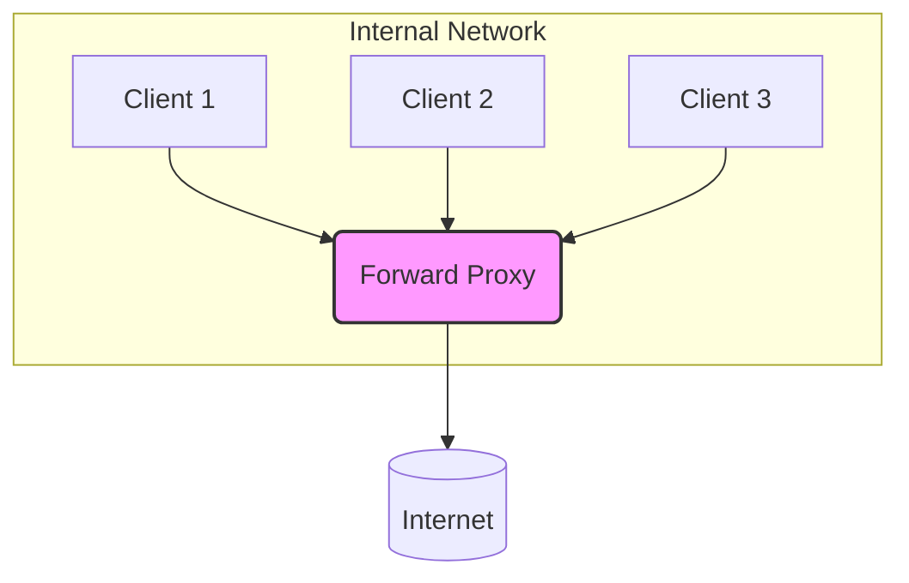
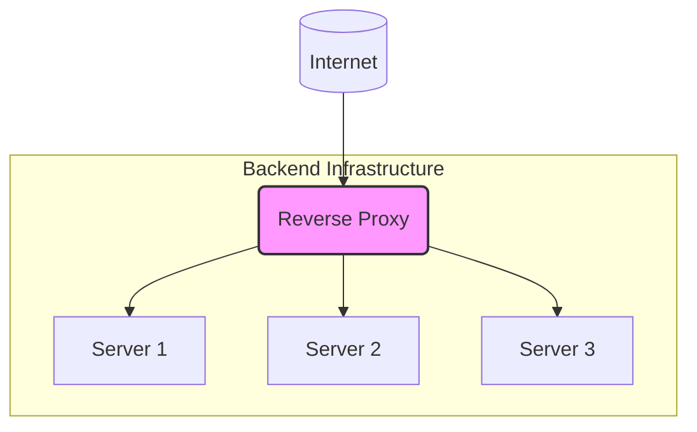

# Proxy Pattern

In network architecture, a **Proxy** is an intermediary server that sits between a client and a destination server, relaying requests and responses. Its primary role is to act on behalf of either the client or the server, adding a layer of separation that provides security, control, and performance benefits.

This architectural pattern is fundamentally different from the [[gof#Proxy|Proxy design pattern]] described by the Gang of Four, which is a software design pattern focused on providing a surrogate or placeholder object to control access to another object within an application's code. The architectural proxy operates at the network level.

There are two main types of architectural proxies: **Forward Proxies** and **Reverse Proxies**. The distinction depends on whose behalf the proxy is acting.

---

## Forward Proxy (or "Proxy")

A **Forward Proxy** is a server that sits in front of a group of **client** machines. When one of these clients makes a request to a server on the internet, the request is sent to the forward proxy first. The proxy then forwards the request to the destination server *on behalf of the client*. From the perspective of the destination server, the request appears to have originated from the proxy server, not the actual client.

*Description: A forward proxy intercepts outgoing requests from an internal network and forwards them to the internet, hiding the identity of the original clients.*

### Use Cases for Forward Proxies

1.  **[[software-architecture/security/|Security]] & Content Filtering**: Companies often use forward proxies to prevent employees from accessing malicious websites or content that violates company policy. The proxy inspects outgoing requests and blocks them if they match a denylist.
2.  **[[caching|Caching]]**: A forward proxy can cache frequently accessed resources from the internet. If multiple clients request the same resource, the proxy can serve it from its cache instead of fetching it again, saving bandwidth and improving performance.
3.  **Bypassing Browsing Restrictions**: Individuals can use a forward proxy to bypass regional content restrictions or censorship. By connecting to a proxy in a different country, a user can make it appear as if their traffic is originating from that location.
4.  **Anonymity**: By hiding the original client's IP address, forward proxies provide a degree of anonymity on the internet.

---

## Reverse Proxy

A **Reverse Proxy** is a server that sits in front of one or more **backend servers**. It accepts requests from clients on the internet and distributes them to the appropriate backend server. From the perspective of the client, it appears to be communicating directly with the backend application, but in reality, it is only interacting with the reverse proxy. The reverse proxy hides the existence and characteristics of the origin servers.

*Description: A reverse proxy accepts incoming requests from the internet and forwards them to one of many backend servers, hiding the backend infrastructure from the clients.*

### Use Cases for Reverse Proxies

This is a very common pattern in modern system design, and many components act as reverse proxies.

1.  **[[load-balancing|Load Balancing]]**: A reverse proxy can distribute incoming traffic across a pool of backend servers, ensuring that no single server is overwhelmed. This is fundamental to achieving horizontal [[software-architecture/system-design-fundamentals/index#Scalability|scalability]].
2.  **[[ssl-tls|SSL/TLS Termination]]**: The reverse proxy can handle the decryption of incoming HTTPS requests, offloading this computationally expensive task from the backend servers. It can then forward unencrypted traffic internally, simplifying the application logic. This is a key aspect of [[security-fundamentals|web security]].
3.  **[[caching|Caching]]**: A reverse proxy can cache responses from the backend servers. When a subsequent request for the same resource arrives, the proxy can serve it directly from its cache, reducing the load on the backend.
4.  **[[software-architecture/security/|Security]] and Anonymity for Servers**: By hiding the IP addresses and topology of the backend infrastructure, a reverse proxy protects servers from direct attack. It can also be configured to block malicious requests before they reach the application.
5.  **Request Routing & [[api-gateway|API Gateway]]**: A reverse proxy can route requests to different services based on the URL path or other request attributes. This is the core principle behind the [[api-gateway|API Gateway]] pattern in [[microservices]] architectures.

Components like **[[web-server|Web Servers]]** (e.g., Nginx, Apache) and **[[api-gateway|API Gateways]]** are often implemented as or configured to be reverse proxies.

---

## Summary: Forward Proxy vs. Reverse Proxy

| Characteristic | Forward Proxy | Reverse Proxy |
| :--- | :--- | :--- |
| **Acts on behalf of** | The **Client** | The **Server** |
| **Protects** | The **Client**'s identity | The **Server**'s identity and infrastructure |
| **Placement** | On the edge of the client's network | On the edge of the server's network |
| **Primary Use Cases** | Outbound traffic filtering, caching, anonymity | Load balancing, SSL termination, caching, security |
| **Visibility** | The destination server sees the proxy. | The client sees the proxy. |

---

## Other Proxy Classifications

Beyond the fundamental Forward/Reverse distinction, proxies can also be classified by their transparency and how they handle encrypted traffic.

### Transparent vs. Non-Transparent Proxies

This classification relates to how the client is configured to use the proxy.

-   **Non-Transparent Proxy (or Explicit Proxy)**: This is the standard mode for a forward proxy. The client application (e.g., a web browser) must be explicitly configured with the proxy's address. The client is fully aware that it is sending its traffic to a proxy.

-   **Transparent Proxy (or Intercepting Proxy)**: This type of proxy intercepts traffic at the network level without requiring any client-side configuration. The client is unaware of the proxy's existence. This is often implemented by network routers that redirect specific types of traffic (e.g., all HTTP traffic on port 80) through the proxy.
    -   **Use Cases**: Commonly used by Internet Service Providers (ISPs) for caching or content filtering, and in corporate environments to enforce security policies without touching every client machine.

### [[ssl-tls|SSL/TLS]] Handling in Proxies

How a proxy handles encrypted traffic is a critical design consideration.

-   **SSL/TLS Termination Proxy**: This type of proxy (typically a reverse proxy) decrypts incoming HTTPS traffic. It acts as the endpoint for the TLS connection from the client. After decrypting the request, it can inspect the traffic (e.g., for routing or security checks) and then forwards it to the backend servers, often unencrypted. This offloads the computational cost of TLS from the backend.

-   **SSL/TLS Passthrough Proxy**: This proxy does not terminate the TLS connection. It allows encrypted traffic to "pass through" it untouched, forwarding it directly to the backend server. This type of proxy operates at a lower network layer (Layer 4) and cannot inspect the content of the requests. It is used when end-to-end encryption is required or when the proxy doesn't need to understand the application-level data.
