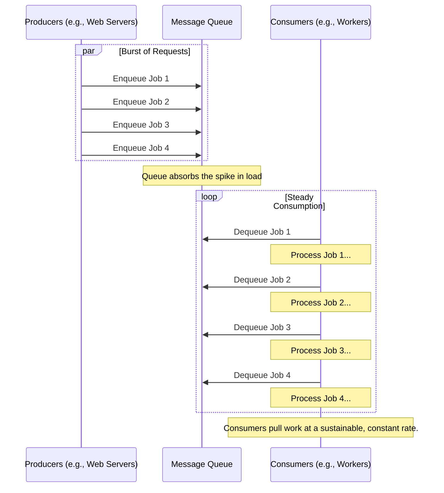

# Queue-Based Load Leveling

The **Queue-Based Load Leveling** pattern uses a [[message-queue|queue]] as a buffer between a service and the tasks that call it. This smooths out intermittent or heavy workloads, preventing the service from being overwhelmed by peaks in demand. By decoupling the task producers from the service consumers, the system gains stability and resilience.

This pattern is essential in any architecture where a service with limited or variable capacity is called by a process with unpredictable demand. It prevents failures, timeouts, and ensures that the service can process work at a steady, manageable pace.

## How It Works

The core idea is to introduce a queue between the task (producer) and the service (consumer).

1.  **Task Submission**: Instead of calling the service directly, a task submits a message containing the work details to a queue. This is a fast, lightweight operation that rarely fails.
2.  **Buffering**: The queue holds these messages, acting as a temporary storage buffer. The size of the queue can grow to absorb sudden spikes in incoming requests.
3.  **Service Processing**: The service, or a set of worker instances, pulls messages from the queue at its own pace. It processes the work described in the message and, upon completion, can pull the next message.

This creates a load-leveling effect: the service is shielded from the erratic arrival of tasks and can instead process a steady, predictable stream of work.

*This diagram shows how producers can send a burst of messages during a peak in demand. The queue acts as a buffer, absorbing this spike and allowing the consumers to pull messages and process them at a steady, manageable rate, thus "leveling" the load on the service.*

## Key Benefits

-   **Enhanced [[availability|Availability]]**: The service is less likely to fail due to sudden traffic spikes. If the service is temporarily unavailable, tasks can still be queued and will be processed once the service recovers.
-   **Improved Responsiveness**: The task submitting the work gets a quick response as soon as the message is enqueued, rather than waiting for the work to be completed. This improves the user experience in interactive applications.
-   **Increased Reliability**: If a consumer fails while processing a message, the message can often be retained in the queue and retried by another consumer, preventing data loss. This is a key part of building resilient, [[asynchronous-messaging|asynchronous systems]].
-   **Cost Optimization**: Consumers can be scaled based on the queue length. If the queue is consistently long, more consumers can be added. If it's empty, consumers can be scaled down to zero, saving costs.

## Challenges and Considerations

-   **Queue Management**: The queue itself can become a bottleneck or a single point of failure if not managed correctly. It's important to use a robust, scalable queuing service (e.g., RabbitMQ, Kafka, AWS SQS, Azure Service Bus).
-   **Data Latency**: This pattern introduces latency by design. It is not suitable for workflows that require an immediate, synchronous response.
-   **Handling Poison Messages**: A message that repeatedly causes a consumer to fail (a "poison message") must be handled. This usually involves implementing a dead-letter queue (DLQ) where such messages are moved after a certain number of failed processing attempts.
-   **Message Order**: Not all queues guarantee First-In, First-Out (FIFO) ordering, especially at scale. If the order of processing is critical, a FIFO queue or a more advanced streaming platform like Apache Kafka might be necessary.

## Common Use Cases

-   **Image and Video Processing**: A web application allows users to upload images for processing (e.g., thumbnail generation). The upload request places a job in a queue, and background workers process the images without making the user wait.
-   **Order Processing**: In an e-commerce system, an incoming order is placed in a queue. A separate order fulfillment service processes the orders, handling payment, inventory, and shipping. This ensures that the checkout process remains fast even during a sales event.
-   **Fan-Out/Fan-In Processing**: A single message can be sent to a topic that multiple, different services subscribe to, allowing for parallel processing. This is a core concept of the [[publish-subscribe]] pattern.

## Related Patterns and Concepts

-   **[[asynchronous-messaging|Asynchronous Messaging]]**: This pattern is a specific implementation of asynchronous communication.
-   **[[broker|Broker Pattern]]**: A message broker is often the technology that implements the queue.
-   **[[publish-subscribe|Publish-Subscribe Pattern]]**: A variation where a message is delivered to multiple consumers.
-   **[[background-jobs|Background Jobs]]**: The consumers in this pattern are often implemented as background job processors.
-   **[[throttling|Throttling]]**: While load leveling reacts to and smooths out load, throttling proactively limits the load that is accepted in the first place. They are often used together.

---

## Resources & links

### Articles

1.  **[Queue-Based Load Leveling Pattern - GeeksforGeeks](https://www.geeksforgeeks.org/system-design/queue-based-load-leveling-pattern-system-design/)**
    An article explaining the Queue-Based Load Leveling pattern, its benefits, and how it helps in optimizing resource utilization in system design.

2.  **[Queue-Based Load Leveling pattern - Microsoft Azure](https://learn.microsoft.com/en-us/azure/architecture/patterns/queue-based-load-leveling)**
    Microsoft Azure's official documentation on the Queue-Based Load Leveling pattern, detailing its application in cloud-hosted applications to reduce costs and management overhead.
