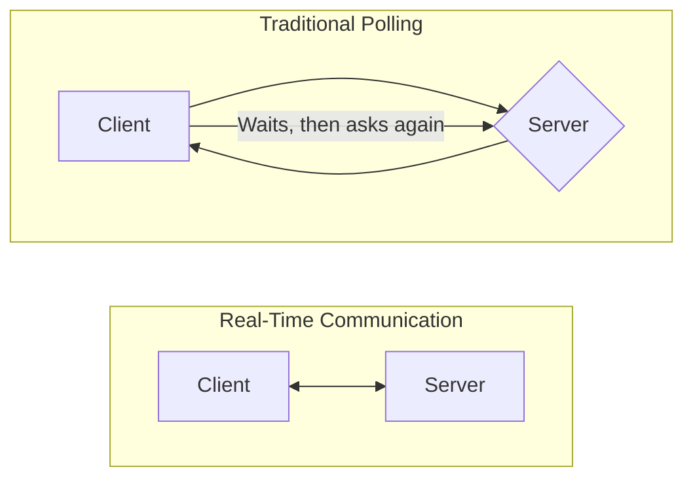
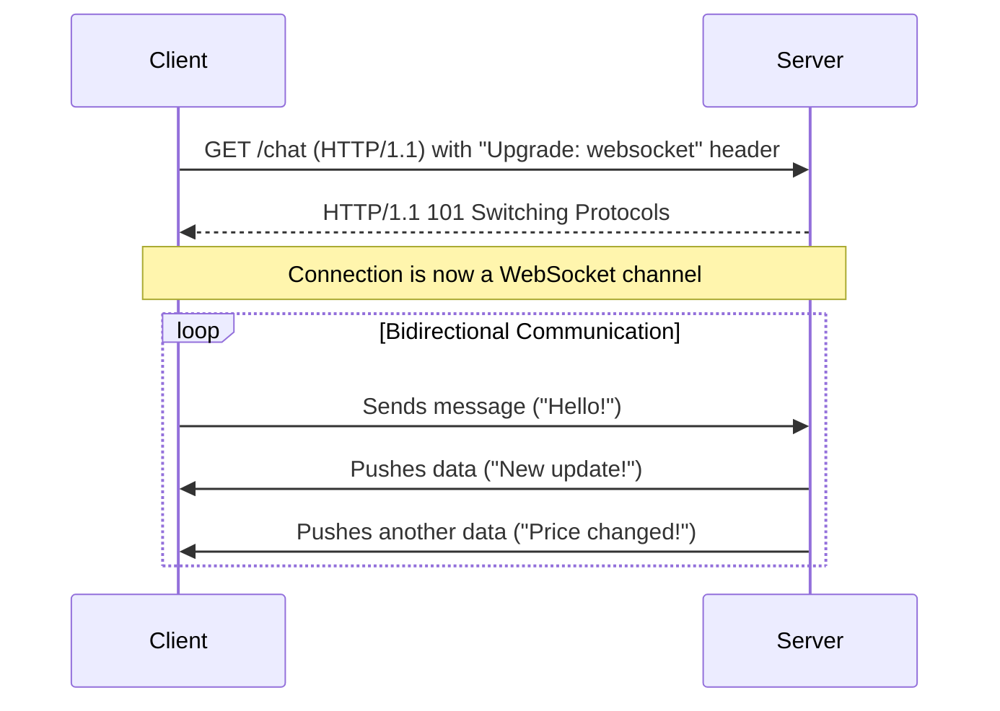
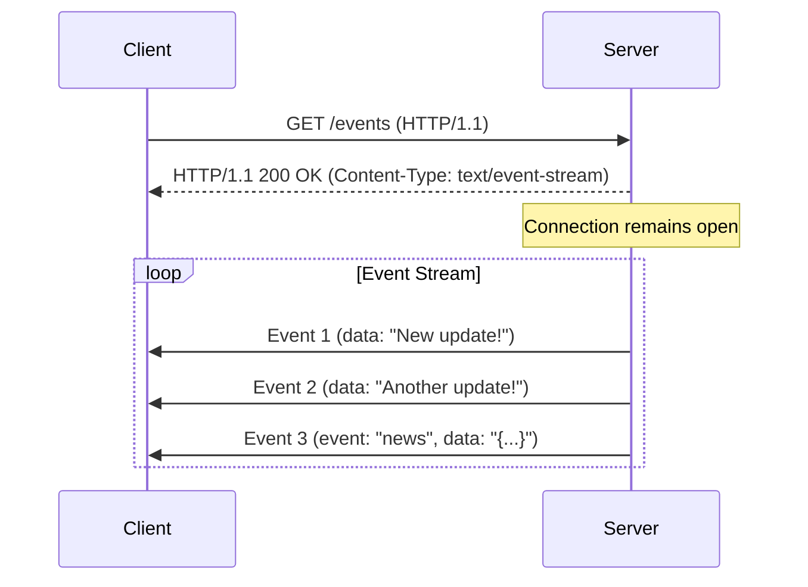
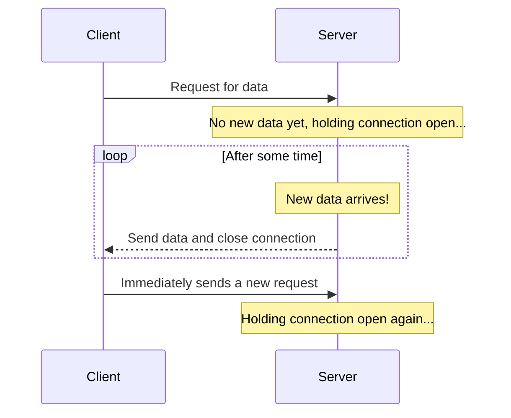

# Real-Time Communication Patterns

In modern application design, the need for immediate data access is crucial for a responsive user experience. While the traditional [[http|HTTP]] request-response model is the foundation of the web, it is inherently client-initiated. For applications requiring instant updates—such as live chats, financial trading platforms, or online games—relying on clients to periodically poll for new data is inefficient and slow.

Real-time communication patterns solve this by establishing a more persistent connection between a client and a server, allowing data to be pushed immediately as it becomes available. This document explores the primary patterns used to achieve this.

*Polling involves repeated client requests, whereas real-time patterns maintain an open connection for the server to push data.*

---

## WebSockets

WebSockets provide a **full-duplex, bidirectional** communication channel. This channel operates over a single, long-lived [[communication-protocols#Transmission Control Protocol (TCP)|TCP]] connection. The process begins with an initial [[http|HTTP-based]] handshake where the client requests to "upgrade" the connection. If the server agrees, the underlying TCP connection is then repurposed for WebSocket traffic. This allows both the client and server to send messages to each other independently at any time, making WebSockets extremely powerful and efficient for applications requiring true two-way interaction.

### How it Works
The process begins with a standard HTTP request from the client, which includes an `Upgrade: websocket` header. If the server supports WebSockets, it responds with a `101 Switching Protocols` status, and the underlying TCP connection is repurposed for WebSocket traffic.

*A WebSocket connection starts with an HTTP Upgrade request and then transitions to a persistent, bidirectional message channel.*

### Pros & Cons
-   **Pros**:
    -   **Low Latency**: After the initial handshake, there is no per-message overhead from HTTP headers.
    -   **Full-Duplex**: True bidirectional communication allows for highly interactive applications.
    -   **Efficiency**: Reduces network traffic compared to polling techniques.
-   **Cons**:
    -   **Complexity**: Managing connection state on the server can be complex, especially at scale.
    -   **Infrastructure**: May require specific support from proxies and load balancers to handle persistent connections.
    -   **Not HTTP**: Operates outside the standard HTTP request-response model, so it cannot leverage standard HTTP caching or semantics.

### Use Cases
-   **Live Chat Applications**: (e.g., Slack, Discord)
-   **Multiplayer Online Games**: Where players need to receive real-time updates from each other.
-   **Collaborative Editing Tools**: (e.g., Google Docs, Figma)

---

## Server-Sent Events (SSE)

Server-Sent Events provide a **unidirectional** channel where a server can push data to a client over a standard HTTP connection. Unlike WebSockets, the client cannot send messages to the server over the SSE connection; it is for server-to-client streaming only.

SSE is often simpler to implement than WebSockets and is a perfect fit for use cases where the client only needs to receive updates from the server without sending data back.

### How it Works
The client initiates a connection by creating an `EventSource` object in JavaScript. The server responds with a `Content-Type: text/event-stream` header and keeps the connection open, sending specially formatted text strings whenever new data is available. The browser API handles connection management, including automatic reconnection if the connection is dropped.

### Pros & Cons
-   **Pros**:
    -   **Simplicity**: Built on standard HTTP and is easier to implement and debug than WebSockets.
    -   **Automatic Reconnection**: The `EventSource` API handles dropped connections automatically.
    -   **HTTP-Friendly**: Works well with existing infrastructure like proxies and load balancers.
-   **Cons**:
    -   **Unidirectional**: Only supports server-to-client communication.
    -   **Connection Limits**: Browsers limit the number of concurrent HTTP connections per domain, which can include SSE connections.

### Use Cases
-   **Live News Feeds & Stock Tickers**
-   **Notifications**: Pushing alerts or status updates to a user dashboard.
-   **Live Sports Scores**

---

## Long Polling

Long Polling is a more efficient variation of traditional polling. In this pattern, the client makes an HTTP request to the server, but the server holds the connection open until it has new data to send. Once the server sends a response, the connection is closed, and the client immediately initiates a new request.

This pattern simulates a server-push mechanism within the constraints of the standard HTTP request-response model.

### How it Works

*In Long Polling, the server waits for data to be available before completing the response, minimizing empty responses.*

### Pros & Cons
-   **Pros**:
    -   **Universal Compatibility**: Works in any environment that supports standard HTTP, without requiring special protocols or client APIs (like `EventSource` for SSE) or firewall configurations that WebSockets might need.
    -   **Simpler than WebSockets**: The client- and server-side logic is generally less complex to implement than a full WebSocket solution.
    -   **More Flexible for Client-Initiated Data**: Unlike SSE, which is strictly unidirectional (server-to-client), Long Polling inherently allows the client to send data (the initial request) and receive a response, making it suitable for scenarios where client-initiated communication is also part of the "real-time" interaction.
    -   **More Efficient than Short Polling**: Avoids the overhead of frequent, empty requests.
-   **Cons**:
    -   **Latency**: There is still a delay between receiving data and re-establishing the connection.
    -   **Server Resources**: Holding many open connections can be resource-intensive on the server.
    -   **Overhead**: Each message still carries the full overhead of HTTP headers.

### Use Cases
-   Simple notification systems.
-   A fallback mechanism when WebSockets or SSE are not supported by the client or infrastructure.

---

## Comparison of Patterns

| Feature             | WebSockets                               | Server-Sent Events (SSE)          | Long Polling                               |
| ------------------- | ---------------------------------------- | --------------------------------- | ------------------------------------------ |
| **Directionality**  | Bidirectional (Full-Duplex)              | Unidirectional (Server-to-Client) | Unidirectional (Simulated Server-Push)     |
| **Protocol**        | WebSocket (ws:// or wss://)              | HTTP/HTTPS                        | HTTP/HTTPS                                 |
| **Connection**      | Single, persistent TCP connection        | Single, persistent HTTP connection| Series of sequential HTTP connections      |
| **Complexity**      | High                                     | Low                               | Medium                                     |
| **Best For**        | Interactive, two-way communication       | Server-to-client data streams     | Simple notifications, legacy compatibility |

---

## Relationship with APIs

While real-time patterns differ from the traditional request-response model, they are still APIs and share many of the same fundamental concerns. However, these concerns are often addressed differently.

-   **[[api-security|API Security]]**: Securing real-time APIs is critical. For WebSockets, authentication must be handled during the initial HTTP handshake (e.g., via cookies or a token in a query parameter) and the connection must be protected against malicious payloads.
-   **[[api-performance|API Performance]]**: The choice between WebSockets, SSE, and Long Polling is fundamentally a performance decision, trading complexity for lower latency. Managing a large number of persistent connections also has significant performance implications for the server.
-   **[[api-error-handling|API Error Handling]]**: Since WebSockets and SSE do not follow the standard HTTP status code model for each message, errors must be handled within the message protocol itself (e.g., sending a JSON payload with an `error` field).
-   **[[api-versioning|API Versioning]]**: Versioning real-time APIs can be complex. For WebSockets, the version might be included in the connection URL (e.g., `/v2/chat`) or negotiated as part of a sub-protocol.

---

## Related Concepts

-   **[[publish-subscribe|Publish-Subscribe]] (Pub/Sub)**: This is a common backend architectural pattern that powers real-time communication. A message broker (like Redis, RabbitMQ, or Kafka) can receive events from publishers and distribute them to backend services. These services then use WebSockets or SSE to forward the events to the appropriate clients.
-   **[[webhooks|Webhooks]]**: While also used for real-time updates, Webhooks are for **server-to-server** communication. A service registers a URL with another service, which then sends an HTTP POST request to that URL when an event occurs. This contrasts with the patterns above, which are primarily for server-to-client communication.

---

## Resources & Links

### Articles

1.  **[What is a Realtime API? - Ably](https://ably.com/topic/what-is-a-realtime-api)**
    This article provides a comprehensive overview of Realtime APIs, explaining their importance, underlying technologies, and various use cases in modern applications.
2.  **[Realtime APIs: A Guide to Technologies & Design Patterns - PubNub](https://www.pubnub.com/guides/realtime-api/)**
    A detailed guide exploring the different technologies and design patterns used to build Realtime APIs, including WebSockets, SSE, and long polling.
3.  **[WebSockets API - MDN](https://developer.mozilla.org/en-US/docs/Web/API/WebSockets_API)**
    The official Mozilla Developer Network documentation for the WebSockets API, covering its usage, features, and browser compatibility.
4.  **[Using server-sent events - MDN](https://developer.mozilla.org/en-US/docs/Web/API/Server-sent_events/Using_server-sent_events)**
    The official MDN guide to Server-Sent Events, explaining how to use the `EventSource` interface to receive event streams from a server over a standard HTTP connection.