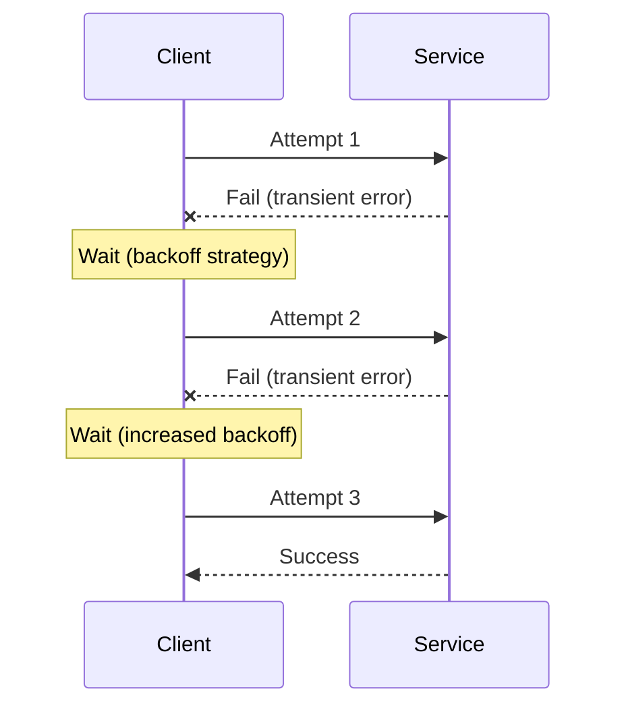

# Retry Pattern

The **Retry** pattern is a fundamental resiliency mechanism in distributed systems that enables an application to handle transient (temporary) failures by transparently re-issuing a failed operation. In any system where components communicate over a network, failures are inevitable. These can range from momentary network glitches to a service being briefly unavailable while it restarts. The Retry pattern improves application stability and reliability by attempting the same operation again, based on the assumption that the fault is temporary and may be resolved after a short delay.

## How it Works

The core idea is to wrap an operation that might fail in a loop. If the operation fails, instead of immediately propagating the error, the system waits for a configured delay and then tries again. This is repeated until the operation succeeds or a predefined number of attempts has been reached.

*Description: This diagram shows a client attempting to call a service. The first two attempts fail due to a transient error. The client waits for a progressively longer period (backoff) before each retry. The third attempt succeeds.*

## Key Characteristics & Strategies

A robust implementation of the Retry pattern involves more than just a simple loop. Several strategies and considerations are crucial.

### 1. Idempotency
The single most important prerequisite for using the Retry pattern is that the operation being retried must be **[[idempotent-operations|idempotent]]**. An idempotent operation is one that can be performed multiple times with the same result as if it were performed only once. Retrying a non-idempotent operation (e.g., "charge a credit card") can lead to duplicate actions and data corruption.

### 2. Backoff Strategies
Constantly retrying a struggling service can make the problem worse. A backoff strategy introduces a delay between retries, giving the service time to recover.

*   **Fixed Interval**: Wait for the same amount of time between each retry. Simple, but can lead to synchronized retries from multiple clients.
*   **Incremental Interval**: Increase the delay by a fixed amount after each failure (e.g., 1s, 2s, 3s).
*   **Exponential Backoff**: The most common and effective strategy. The wait time is doubled after each attempt (e.g., 1s, 2s, 4s, 8s). This dramatically reduces the load on the failing service.
*   **Exponential Backoff with Jitter**: To prevent a "thundering herd" problem where multiple clients using exponential backoff all retry at the same synchronized intervals, a small amount of randomness (jitter) is added to the delay. This spreads out the retry attempts from different clients.

### 3. Number of Retries
Retrying indefinitely is dangerous. A maximum number of attempts must be configured. After this limit is reached, the operation should be considered to have failed permanently, and an exception should be thrown. This is often combined with a [[circuit-breaker|Circuit Breaker]] to prevent further calls.

## Challenges and Considerations

*   **Non-Transient Failures**: The pattern is only suitable for transient faults. Retrying an operation that is failing due to a permanent issue (e.g., a bug in the service, invalid credentials) will only waste resources and add latency. The system should be able to distinguish between transient and non-transient errors.
*   **[[system-performance#8. Retry Storm|Retry Storms]]**: If many clients start retrying a service at the same time, it can create a "retry storm" that overwhelms the service and prevents it from recovering. Exponential backoff with jitter is the primary mitigation for this.
*   **Latency**: Retrying an operation inherently adds latency to the overall response time. The maximum number of retries and the backoff delays must be chosen carefully to avoid unacceptably long response times.
*   **Configuration**: The retry logic (number of attempts, backoff strategy) should be configurable and ideally tunable at runtime to adapt to different service characteristics and network conditions.

## Use Cases

*   **Remote Service Calls**: Any API call over a network that might experience temporary connectivity issues or brief service unavailability.
*   **Database Connections**: Handling transient issues when acquiring a connection from a database pool or during a brief database failover.
*   **Throttled Services**: When a service temporarily rejects requests due to [[rate-limiting|rate limiting]] or [[throttling|throttling]]. A retry after a delay can allow the operation to succeed once the rate limit window has passed.

## Related Patterns and Concepts

*   **[[circuit-breaker|Circuit Breaker]]**: The Retry pattern is often used as a precursor to the Circuit Breaker. After a few retries fail, the circuit breaker can trip to prevent any further calls to the failing service for a period of time.
*   **[[posa#Timeout|Timeout]]**: Every retry attempt should have a timeout to prevent it from waiting indefinitely for a response.
*   **[[idempotent-operations|Idempotency]]**: A fundamental prerequisite for safely using the Retry pattern.
*   **[[posa#Retry|POSA Retry]]**: This pattern is also introduced in the Pattern-Oriented Software Architecture (POSA) series.

## Resources & links

### Articles

1.  **[Retry pattern - Microsoft Azure](https://learn.microsoft.com/en-us/azure/architecture/patterns/retry)**

    The official documentation from Microsoft's Azure Architecture Center. It provides a detailed guide on implementing the pattern, including different backoff strategies and considerations for idempotency.

2.  **[Retry Pattern in Microservices - GeeksforGeeks](https://www.geeksforgeeks.org/system-design/retry-pattern-in-microservices/)**

    This article explains how the Retry pattern is applied in a microservices architecture to handle temporary failures in communication between services, improving overall system reliability.

3.  **[Retry Pattern: examples & recommendations - Apiumhub](https://apiumhub.com/tech-blog-barcelona/retry-pattern-examples-recommendations/)**

    A practical guide that provides implementation examples (e.g., in Kotlin and Spring Retry) and discusses important considerations like error types, criticality, and idempotency.
