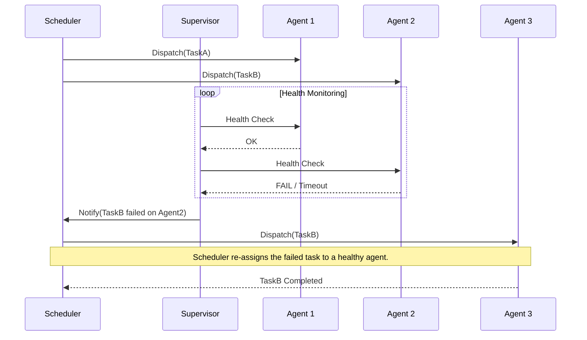

# Scheduler Agent Supervisor

The **Scheduler Agent Supervisor** pattern is a compound pattern for coordinating a set of distributed actions as a single, resilient operation. It ensures that a complex task, which may be composed of many sub-tasks running across multiple nodes, either completes successfully or is gracefully handled in the event of failure. Its primary goal is to add resiliency to a distributed system by enabling it to recover from transient exceptions, long-lasting faults, and process failures.

This pattern orchestrates the entire workflow, including retrying failed actions or undoing work that was already performed, so the entire operation succeeds or fails as a whole.

## How It Works

The pattern consists of three main components:

1.  **Scheduler**: The Scheduler is the brain of the operation. It understands the overall business workflow, breaks it down into a series of discrete sub-tasks, and orchestrates their execution. It is responsible for dispatching tasks to the Agents and tracking the overall progress of the workflow.

2.  **Agent**: An Agent is a remote service or process responsible for executing a single, specific sub-task. The system will typically have multiple Agents, often specialized for different types of tasks, running on different nodes in the distributed system.

3.  **Supervisor**: The Supervisor is the reliability component. It monitors the health and status of the Agents as they execute their tasks. If an Agent fails to complete a task (due to a crash, [[posa#Timeout|timeout]], or error), the Supervisor is responsible for initiating a recovery process. This could involve retrying the task, moving it to another Agent, or triggering a compensating action.

### Interaction Diagram

*Description: This sequence diagram illustrates the pattern's workflow. The **Scheduler** dispatches tasks to Agents. The **Supervisor** periodically monitors them. When it detects a failure (e.g., Agent 2 fails its health check), it notifies the Scheduler, which then re-schedules the failed task to a healthy agent (Agent 3), ensuring the overall operation can proceed.*

## Key Benefits

-   **Enhanced Resiliency**: The system can automatically recover from partial failures, improving the overall reliability of distributed operations.
-   **Centralized Coordination**: The Scheduler provides a single point of [[event-driven#Mediator Topology (Orchestration)|orchestration]] for complex workflows, making them easier to understand and manage.
-   **Improved Observability**: The Supervisor provides a centralized view of the health and status of the distributed tasks, which is invaluable for monitoring and debugging.

## Challenges and Considerations

-   **Supervisor High Availability**: The Supervisor itself is a critical component and a potential single point of failure. To mitigate this, the Supervisor must be designed for high availability, often by running multiple instances and using a [[posa#Leader Election|Leader Election]] pattern to ensure only one is active at any time.
-   **State Management**: The Scheduler and Supervisor must maintain persistent state about the workflow's progress. If they crash, they must be able to resume from where they left off.
-   **Agent Idempotency**: Agents must often be designed as [[idempotent-operations|idempotent]]. The Supervisor might request an Agent to retry a task that failed, and the Agent must be able to handle this repeated request without causing data corruption or inconsistencies.
-   **Complexity**: This is a complex pattern to implement from scratch. It requires careful design of the communication protocols, state management, and failure recovery logic.

## Common Use Cases

-   **Distributed Software Deployment**: Deploying a new version of an application across a cluster of web servers, where each server is an "Agent".
-   **ETL (Extract, Transform, Load) Pipelines**: Orchestrating a multi-step data processing workflow where each step is performed by a different service.
-   **Cloud Resource Provisioning**: Managing the creation and configuration of a set of cloud resources (e.g., virtual machines, databases, networks) as a single logical unit.

## Related Patterns and Concepts

-   **[[posa#Leader Election|Leader Election]]**: Often used to ensure the Supervisor is highly available.
-   **[[monitoring#Health Monitoring|Health Endpoint Monitoring]]**: A common mechanism for the Supervisor to check the status of Agents.
-   **[[saga|Saga Pattern]]**: The recovery process, especially if it involves undoing previous steps, is an implementation of a saga with compensating transactions.
-   **[[posa#Retry|Retry Pattern]]**: The most common recovery action for transient failures.
-   **[[posa#Circuit Breaker|Circuit Breaker]]**: Can be used by the Scheduler or Supervisor to prevent repeatedly sending tasks to an Agent that is known to be unhealthy.

---

## Resources & links

### Articles

1.  **[Scheduler-Agent-Supervisor pattern - Microsoft Azure](https://learn.microsoft.com/en-us/azure/architecture/patterns/scheduler-agent-supervisor)**
    The official Azure Architecture Center documentation, which provides a detailed breakdown of the pattern, its components, and implementation considerations.

2.  **[Scheduling Agent Supervisor Pattern - GeeksforGeeks](https://www.geeksforgeeks.org/system-design/scheduling-agent-supervisor-pattern-system-design/)**
    This article provides a clear, high-level overview of the pattern's components and workflow, emphasizing its role in creating resilient and fault-tolerant distributed systems.
